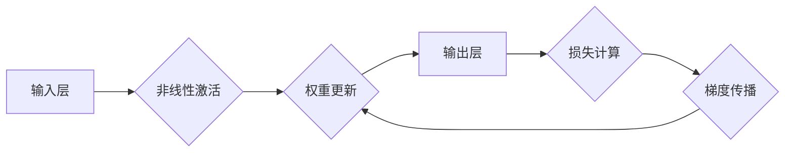

# 神经网络：开启智能新纪元

> 关键词：神经网络，深度学习，感知机，多层感知机，反向传播，卷积神经网络，递归神经网络，生成对抗网络，应用领域

## 1. 背景介绍

自20世纪50年代以来，人工智能领域经历了多个发展阶段。其中，神经网络（Neural Networks）作为模拟人脑神经元结构和功能的一种计算模型，在近年来迎来了前所未有的发展。得益于计算能力的提升和大数据的涌现，神经网络在图像识别、语音识别、自然语言处理等领域取得了突破性的成果，被誉为开启智能新纪元的基石。

## 2. 核心概念与联系

### 2.1 神经元模型

神经元是神经网络的基本单元，它由输入层、权重层、激活函数和输出层组成。神经元模型模拟了人脑神经元的工作原理，通过调整权重来学习和存储信息。


### 2.2 感知机

感知机（Perceptron）是最早的神经网络模型之一，由输入层和输出层组成。它通过学习输入向量与输出向量之间的线性关系来进行二分类。

### 2.3 多层感知机

多层感知机（Multilayer Perceptron，MLP）在感知机的基础上引入了隐藏层，能够处理更复杂的非线性问题。MLP的输入层和输出层与感知机相同，隐藏层由多个神经元组成。

### 2.4 反向传播

反向传播（Backpropagation）是一种用于训练神经网络的优化算法。它通过计算损失函数对网络权重的梯度，并反向传播梯度来更新权重，从而优化网络参数。



### 2.5 卷积神经网络

卷积神经网络（Convolutional Neural Network，CNN）是专门用于图像识别和图像处理的神经网络。它通过卷积层提取图像特征，并利用池化层降低特征维度。

### 2.6 递归神经网络

递归神经网络（Recurrent Neural Network，RNN）是一种处理序列数据的神经网络。它通过循环连接将当前神经元的状态与之前的状态关联起来，从而能够处理长序列数据。

### 2.7 生成对抗网络

生成对抗网络（Generative Adversarial Network，GAN）由生成器和判别器组成，通过对抗学习生成数据分布，从而能够生成高质量的数据样本。

## 3. 核心算法原理 & 具体操作步骤

### 3.1 算法原理概述

神经网络通过调整权重来学习和存储信息，其核心算法包括：

- **前向传播**：将输入数据传递到神经网络，计算输出。
- **反向传播**：计算损失函数对网络权重的梯度，并反向传播梯度来更新权重。
- **权重更新**：根据梯度更新网络权重，优化网络参数。

### 3.2 算法步骤详解

1. 初始化网络结构：确定网络层数、神经元数量、激活函数等。
2. 初始化权重：随机初始化网络权重。
3. 前向传播：将输入数据传递到神经网络，计算输出。
4. 损失计算：计算输出与真实标签之间的损失。
5. 反向传播：计算损失函数对网络权重的梯度。
6. 权重更新：根据梯度更新网络权重。
7. 重复步骤3-6，直至模型收敛。

### 3.3 算法优缺点

- **优点**：
  - 能够处理复杂的非线性问题。
  - 具有强大的特征提取和表示能力。
  - 适用于多种数据类型，如图像、文本、音频等。
- **缺点**：
  - 计算量较大，训练过程耗时较长。
  - 模型可解释性较差。
  - 对初始化敏感。

### 3.4 算法应用领域

神经网络在以下领域取得了显著的应用成果：

- **图像识别**：人脸识别、物体检测、图像分割等。
- **语音识别**：语音识别、语音合成等。
- **自然语言处理**：机器翻译、情感分析、问答系统等。
- **推荐系统**：商品推荐、电影推荐等。

## 4. 数学模型和公式 & 详细讲解 & 举例说明

### 4.1 数学模型构建

神经网络的核心是神经元模型，其数学模型可以表示为：

$$
y = f(W \cdot x + b)
$$

其中，$y$ 为输出，$x$ 为输入，$W$ 为权重矩阵，$b$ 为偏置向量，$f$ 为激活函数。

### 4.2 公式推导过程

以下以多层感知机为例，推导其损失函数和反向传播公式。

假设多层感知机的输出为：

$$
y = \sigma(W_2 \cdot \sigma(W_1 \cdot x + b_1) + b_2)
$$

其中，$\sigma$ 为Sigmoid激活函数。

损失函数为均方误差：

$$
L = \frac{1}{2} \sum_{i=1}^N (y_i - \hat{y}_i)^2
$$

其中，$N$ 为样本数量，$y_i$ 为真实标签，$\hat{y}_i$ 为预测值。

反向传播公式如下：

$$
\frac{\partial L}{\partial W_2} = (y - \hat{y}) \cdot \sigma'(W_2 \cdot \sigma(W_1 \cdot x + b_1) + b_2) \cdot x
$$

$$
\frac{\partial L}{\partial W_1} = (y - \hat{y}) \cdot \sigma'(W_2 \cdot \sigma(W_1 \cdot x + b_1) + b_2) \cdot \sigma'(W_1 \cdot x + b_1) \cdot x
$$

### 4.3 案例分析与讲解

以下以手写数字识别为例，演示如何使用神经网络进行图像识别。

1. 数据集：使用MNIST手写数字数据集。
2. 模型：使用一个包含一层输入层、一层隐藏层和一层输出层的多层感知机。
3. 激活函数：使用Sigmoid函数。
4. 损失函数：使用均方误差函数。
5. 优化器：使用Adam优化器。
6. 训练过程：使用训练数据对模型进行训练，并在验证数据上评估模型性能。

通过训练，模型可以学会识别手写数字，并在测试数据上取得较高的识别率。

## 5. 项目实践：代码实例和详细解释说明

### 5.1 开发环境搭建

使用Python和TensorFlow库进行神经网络开发。

```python
pip install tensorflow
```

### 5.2 源代码详细实现

以下是一个使用TensorFlow实现的多层感知机模型的示例代码：

```python
import tensorflow as tf

# 定义模型结构
model = tf.keras.Sequential([
    tf.keras.layers.Dense(64, activation='relu', input_shape=(784,)),
    tf.keras.layers.Dense(10, activation='softmax')
])

# 编译模型
model.compile(optimizer='adam',
              loss='sparse_categorical_crossentropy',
              metrics=['accuracy'])

# 训练模型
model.fit(train_images, train_labels, epochs=5)

# 评估模型
test_loss, test_acc = model.evaluate(test_images, test_labels, verbose=2)
```

### 5.3 代码解读与分析

- `tf.keras.Sequential`：创建一个序列模型，包含多个层。
- `tf.keras.layers.Dense`：创建一个全连接层。
- `model.compile`：编译模型，指定优化器、损失函数和评估指标。
- `model.fit`：训练模型，使用训练数据。
- `model.evaluate`：评估模型，使用测试数据。

### 5.4 运行结果展示

通过运行代码，可以在训练集和测试集上评估模型的性能，并打印出准确率等信息。

## 6. 实际应用场景

神经网络在以下领域取得了显著的应用成果：

### 6.1 图像识别

- 人脸识别
- 物体检测
- 图像分割

### 6.2 语音识别

- 语音识别
- 语音合成

### 6.3 自然语言处理

- 机器翻译
- 情感分析
- 问答系统

### 6.4 推荐系统

- 商品推荐
- 电影推荐

## 7. 工具和资源推荐

### 7.1 学习资源推荐

- 《深度学习》（Goodfellow et al.）
- 《神经网络与深度学习》（邱锡鹏）
- TensorFlow官网教程

### 7.2 开发工具推荐

- TensorFlow
- PyTorch

### 7.3 相关论文推荐

- “A Few Useful Things to Know about Machine Learning” (Goodfellow, Bengio, Courville)
- “Deep Learning” (Goodfellow et al.)
- “Convolutional Neural Networks for Visual Recognition” (Krizhevsky, Sutskever, Hinton)

## 8. 总结：未来发展趋势与挑战

### 8.1 研究成果总结

神经网络作为一种强大的计算模型，在图像识别、语音识别、自然语言处理等领域取得了突破性的成果。它为人工智能的发展提供了新的思路和方法。

### 8.2 未来发展趋势

- 模型结构更复杂：开发更复杂的神经网络结构，如Transformer等，以更好地处理复杂问题。
- 计算效率更高：优化神经网络算法，降低计算复杂度，提高计算效率。
- 模型可解释性更强：研究神经网络的可解释性，提高模型的可信度和可靠性。

### 8.3 面临的挑战

- 模型可解释性：神经网络模型的可解释性较差，难以理解其决策过程。
- 计算资源：神经网络模型需要大量的计算资源，限制了其应用范围。
- 数据隐私：神经网络模型需要大量数据来训练，可能涉及数据隐私问题。

### 8.4 研究展望

神经网络作为人工智能的重要基石，将继续在各个领域发挥重要作用。未来，随着计算能力的提升和算法的改进，神经网络将在更多领域取得突破性进展。

## 9. 附录：常见问题与解答

**Q1：神经网络与人工智能有什么关系？**

A：神经网络是人工智能的一种实现方式，通过模拟人脑神经元的工作原理，实现智能计算。

**Q2：如何选择合适的神经网络模型？**

A：选择合适的神经网络模型需要考虑任务类型、数据特点、计算资源等因素。

**Q3：如何提高神经网络的性能？**

A：提高神经网络性能的方法包括：优化模型结构、优化训练算法、增加训练数据等。

**Q4：神经网络模型的可解释性如何？**

A：神经网络模型的可解释性较差，难以理解其决策过程。

**Q5：神经网络模型的训练过程需要多少时间？**

A：神经网络模型的训练时间取决于模型结构、数据规模和计算资源等因素。

作者：禅与计算机程序设计艺术 / Zen and the Art of Computer Programming