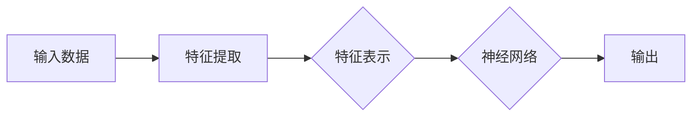

# 神经网络：自然语言处理的新突破

> 关键词：神经网络，自然语言处理，深度学习，NLP，深度神经网络，卷积神经网络，循环神经网络，长短时记忆网络，语言模型，机器翻译，情感分析

## 1. 背景介绍

自然语言处理（Natural Language Processing，NLP）作为人工智能领域的一个重要分支，旨在让计算机理解和处理人类语言。从最初的规则匹配、字符串匹配到后来的统计模型，再到如今基于深度学习的神经网络模型，NLP技术经历了长足的发展。特别是近年来，随着计算能力的提升和大数据的积累，神经网络在NLP领域的应用取得了突破性的进展。本文将深入探讨神经网络在自然语言处理中的原理、应用和实践，并展望其未来的发展趋势。

## 2. 核心概念与联系

### 2.1 核心概念

#### 2.1.1 深度学习

深度学习（Deep Learning）是一种利用神经网络模型进行数据驱动学习的机器学习技术。它通过模仿人脑神经元之间的连接和交互，学习输入数据中的复杂特征和模式，从而实现各种复杂的任务。

#### 2.1.2 自然语言处理（NLP）

自然语言处理（NLP）是人工智能领域的一个分支，旨在让计算机理解和处理人类语言。它包括语言理解、语言生成、语音识别、机器翻译等多个方面。

#### 2.1.3 神经网络

神经网络是一种模仿人脑神经元结构的计算模型，由大量的节点（神经元）通过非线性激活函数相互连接而成。神经网络通过学习输入数据中的特征和模式，实现各种复杂的任务。

### 2.2 Mermaid 流程图



### 2.3 核心概念联系

深度学习为自然语言处理提供了强大的工具，神经网络作为深度学习的基础模型，在NLP领域发挥着至关重要的作用。通过神经网络，我们可以从大量的文本数据中学习到丰富的语言特征和模式，从而实现各种复杂的NLP任务。

## 3. 核心算法原理 & 具体操作步骤

### 3.1 算法原理概述

神经网络在NLP领域的应用主要包括以下几个步骤：

1. 数据预处理：对原始文本数据进行清洗、分词、词性标注等预处理操作。
2. 特征提取：将预处理后的文本数据转换为神经网络可以理解的数字特征。
3. 模型训练：使用标注数据进行模型训练，调整模型参数以优化性能。
4. 模型评估：使用测试数据评估模型性能，并进行调优。

### 3.2 算法步骤详解

#### 3.2.1 数据预处理

数据预处理是NLP任务的基础，主要包括以下几个步骤：

1. 清洗：去除文本中的噪声，如HTML标签、特殊字符等。
2. 分词：将文本分割成单个词语。
3. 词性标注：标注每个词语的词性，如名词、动词、形容词等。
4. 去停用词：去除无意义的词语，如“的”、“是”、“和”等。

#### 3.2.2 特征提取

特征提取是将文本数据转换为神经网络可理解的数字特征的过程。常见的特征提取方法包括：

1. 词袋模型：将文本转换为词频或TF-IDF等统计特征。
2. 词嵌入：将词语映射到高维空间中的稠密向量。
3. 层次化特征提取：使用树形结构提取文本的层次化特征。

#### 3.2.3 模型训练

模型训练是神经网络在NLP领域应用的核心步骤。常见的神经网络模型包括：

1. 卷积神经网络（CNN）：擅长捕捉文本的局部特征。
2. 循环神经网络（RNN）：擅长处理序列数据，如文本序列。
3. 长短时记忆网络（LSTM）：改进的RNN，能够解决长序列依赖问题。
4. 递归神经网络（RNN）：与LSTM类似，能够处理长序列依赖问题。

#### 3.2.4 模型评估

模型评估是衡量模型性能的重要步骤。常见的评估指标包括：

1. 准确率（Accuracy）：正确预测的样本数占总样本数的比例。
2. 召回率（Recall）：正确预测的正样本数占所有正样本数的比例。
3. 精确率（Precision）：正确预测的正样本数占所有预测为正样本的样本数的比例。

### 3.3 算法优缺点

#### 3.3.1 优点

1. 能够学习到丰富的语言特征和模式。
2. 能够自动提取文本中的层次化特征。
3. 能够处理各种复杂的NLP任务。

#### 3.3.2 缺点

1. 训练数据量大，训练时间较长。
2. 模型参数较多，容易过拟合。
3. 模型的可解释性较差。

### 3.4 算法应用领域

神经网络在NLP领域的应用非常广泛，主要包括以下任务：

1. 文本分类：如情感分析、主题分类、垃圾邮件检测等。
2. 命名实体识别：如人名识别、地名识别、组织机构名识别等。
3. 机器翻译：将一种语言翻译成另一种语言。
4. 问答系统：对自然语言问题给出答案。
5. 语音识别：将语音信号转换为文本。

## 4. 数学模型和公式 & 详细讲解 & 举例说明

### 4.1 数学模型构建

神经网络在NLP领域的数学模型主要包括以下几个部分：

1. 输入层：接收原始文本数据的特征表示。
2. 隐藏层：包含多个神经元，通过非线性激活函数计算中间层的特征表示。
3. 输出层：输出最终的结果。

### 4.2 公式推导过程

以一个简单的全连接神经网络为例，其计算公式如下：

$$
y = \sigma(W \cdot x + b)
$$

其中，$W$ 为连接权重矩阵，$b$ 为偏置向量，$x$ 为输入向量，$y$ 为输出向量，$\sigma$ 为非线性激活函数。

### 4.3 案例分析与讲解

以下是一个使用PyTorch实现文本分类的简单示例：

```python
import torch
import torch.nn as nn

class TextClassifier(nn.Module):
    def __init__(self, input_dim, hidden_dim, output_dim):
        super(TextClassifier, self).__init__()
        self.fc1 = nn.Linear(input_dim, hidden_dim)
        self.relu = nn.ReLU()
        self.fc2 = nn.Linear(hidden_dim, output_dim)
    
    def forward(self, x):
        x = self.fc1(x)
        x = self.relu(x)
        x = self.fc2(x)
        return x

input_dim = 1000  # 词嵌入维度
hidden_dim = 64  # 隐藏层维度
output_dim = 2  # 输出维度（两个类别）

model = TextClassifier(input_dim, hidden_dim, output_dim)
```

## 5. 项目实践：代码实例和详细解释说明

### 5.1 开发环境搭建

在进行神经网络项目实践之前，我们需要准备好以下开发环境：

1. Python 3.x
2. PyTorch
3. NumPy
4. Sklearn

### 5.2 源代码详细实现

以下是一个使用PyTorch实现文本分类的简单示例：

```python
import torch
import torch.nn as nn
import torch.optim as optim
from torch.utils.data import DataLoader, TensorDataset

# 定义模型
class TextClassifier(nn.Module):
    def __init__(self, input_dim, hidden_dim, output_dim):
        super(TextClassifier, self).__init__()
        self.fc1 = nn.Linear(input_dim, hidden_dim)
        self.relu = nn.ReLU()
        self.fc2 = nn.Linear(hidden_dim, output_dim)
    
    def forward(self, x):
        x = self.fc1(x)
        x = self.relu(x)
        x = self.fc2(x)
        return x

# 加载数据
data = ...  # 假设已经加载了文本数据和标签
input_dim = 1000  # 词嵌入维度
hidden_dim = 64  # 隐藏层维度
output_dim = 2  # 输出维度（两个类别）

train_data = TensorDataset(data['text'], data['label'])
train_loader = DataLoader(train_data, batch_size=32, shuffle=True)

model = TextClassifier(input_dim, hidden_dim, output_dim).to(device)

# 定义损失函数和优化器
criterion = nn.CrossEntropyLoss()
optimizer = optim.Adam(model.parameters(), lr=0.001)

# 训练模型
num_epochs = 10
for epoch in range(num_epochs):
    for batch_idx, (texts, labels) in enumerate(train_loader):
        texts = texts.to(device)
        labels = labels.to(device)
        outputs = model(texts)
        loss = criterion(outputs, labels)
        optimizer.zero_grad()
        loss.backward()
        optimizer.step()
        if batch_idx % 100 == 0:
            print(f"Train Epoch: {epoch}, Loss: {loss.item():.4f}")

# 评估模型
test_data = TensorDataset(data['test_text'], data['test_label'])
test_loader = DataLoader(test_data, batch_size=32, shuffle=False)
model.eval()
correct = 0
total = 0
with torch.no_grad():
    for texts, labels in test_loader:
        texts = texts.to(device)
        labels = labels.to(device)
        outputs = model(texts)
        _, predicted = torch.max(outputs.data, 1)
        total += labels.size(0)
        correct += (predicted == labels).sum().item()

print(f"Accuracy: {100 * correct / total}%")
```

### 5.3 代码解读与分析

以上代码定义了一个简单的文本分类模型，并实现了模型的训练和评估。首先，我们定义了模型的结构，包括两个全连接层和ReLU激活函数。然后，我们加载数据，并创建了DataLoader对象用于批量加载数据。接着，我们定义了损失函数和优化器，开始模型的训练过程。最后，我们使用测试数据评估模型的性能。

### 5.4 运行结果展示

在训练过程中，模型的loss值会逐渐下降，表明模型的性能在不断提高。在测试过程中，模型会输出一个准确率，表示模型在测试数据上的表现。

## 6. 实际应用场景

神经网络在NLP领域的应用非常广泛，以下是一些典型的应用场景：

1. 情感分析：对文本进行情感倾向分析，判断文本是正面、中性还是负面。
2. 垃圾邮件检测：识别并过滤垃圾邮件。
3. 文本摘要：将长文本生成简洁的摘要。
4. 机器翻译：将一种语言翻译成另一种语言。
5. 问答系统：对自然语言问题给出答案。

## 7. 工具和资源推荐

### 7.1 学习资源推荐

1. 《深度学习》系列书籍：吴恩达教授所著，深入浅出地介绍了深度学习的理论基础和实际应用。
2. 《神经网络与深度学习》书籍：邱锡鹏教授所著，详细讲解了神经网络和深度学习的基本概念和算法。
3. fast.ai课程：Udacity提供的免费在线课程，涵盖深度学习的基础知识和应用。
4. TensorFlow和PyTorch官方文档：提供了丰富的API文档和示例代码。

### 7.2 开发工具推荐

1. PyTorch：一个开源的深度学习框架，易于使用和扩展。
2. TensorFlow：一个开源的深度学习框架，适用于工业级应用。
3. Jupyter Notebook：一个强大的交互式计算环境，方便进行数据分析和模型实验。
4. Google Colab：一个免费的云服务平台，提供GPU/TPU等算力，方便进行大规模模型训练。

### 7.3 相关论文推荐

1. "A Neural Probabilistic Language Model" by Christopher D. Manning and Hinrich Schütze
2. "Deep Learning for Natural Language Processing" by Christopher D. Manning and Prabhakar Raghavan
3. "Neural Network Methods for Natural Language Processing" by Yoshua Bengio, Déjane Chauvin, and Pascal Vincent

## 8. 总结：未来发展趋势与挑战

### 8.1 研究成果总结

神经网络在自然语言处理领域取得了显著的成果，为NLP技术的发展提供了强大的动力。随着深度学习技术的不断进步，神经网络在NLP领域的应用将会越来越广泛，并在更多领域取得突破。

### 8.2 未来发展趋势

1. 模型规模将继续扩大，以学习更丰富的语言特征。
2. 模型结构将更加多样化，以适应不同的任务需求。
3. 模型可解释性将得到提高，以增强用户对模型的信任。
4. 模型将与其他人工智能技术（如知识表示、因果推理等）进行融合，以实现更复杂的任务。

### 8.3 面临的挑战

1. 计算资源消耗：大规模神经网络的训练和推理需要大量的计算资源。
2. 数据隐私：NLP任务需要处理大量的用户数据，如何保护用户隐私是一个重要问题。
3. 模型可解释性：神经网络模型的决策过程难以解释，如何提高模型的可解释性是一个挑战。
4. 模型公平性：如何避免模型在训练过程中学习到不公平的知识是一个重要问题。

### 8.4 研究展望

神经网络在自然语言处理领域的应用前景广阔，未来将会有更多创新性的研究成果出现。同时，我们也需要关注模型的安全性和可解释性，确保NLP技术的发展能够造福人类社会。

## 9. 附录：常见问题与解答

**Q1：神经网络在NLP领域的应用有哪些优势？**

A：神经网络在NLP领域的应用具有以下优势：

1. 能够自动学习丰富的语言特征和模式。
2. 能够处理各种复杂的NLP任务。
3. 能够提高模型性能。

**Q2：如何处理文本数据中的噪声？**

A：文本数据中的噪声主要来自于HTML标签、特殊字符、无意义的词语等。可以通过以下方法处理：

1. 使用正则表达式去除HTML标签。
2. 使用字符串替换去除特殊字符。
3. 使用停用词表去除无意义的词语。

**Q3：如何选择合适的神经网络模型？**

A：选择合适的神经网络模型需要根据具体任务和数据特点进行。以下是一些常见的模型选择策略：

1. 对于文本分类任务，可以选择卷积神经网络（CNN）或循环神经网络（RNN）。
2. 对于机器翻译任务，可以选择编码器-解码器模型。
3. 对于问答系统任务，可以选择基于注意力机制的模型。

**Q4：如何提高模型的可解释性？**

A：提高模型的可解释性需要从以下几个方面入手：

1. 使用可解释的激活函数。
2. 使用可视化技术展示模型内部特征。
3. 使用因果分析技术分析模型的决策过程。

**Q5：如何防止模型过拟合？**

A：防止模型过拟合可以采取以下措施：

1. 使用正则化技术，如L1正则化、L2正则化等。
2. 使用数据增强技术，如数据扩充、数据变换等。
3. 使用Dropout技术，在训练过程中随机丢弃一部分神经元。

作者：禅与计算机程序设计艺术 / Zen and the Art of Computer Programming