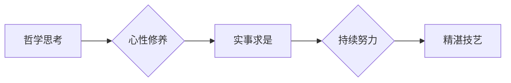

# 稻盛和夫：先搞明白，后精湛

> 关键词：稻盛和夫，经营哲学，成功法则，心性修养，哲学思考，企业实践

## 1. 背景介绍

稻盛和夫，日本著名企业家、哲学家，是京瓷集团和KDDI集团的创始人。他的经营哲学和人生哲学在全球范围内产生了深远的影响。稻盛和夫认为，成功的企业家不仅要有卓越的才能和坚定的意志，更要具备正确的思想和高尚的品格。本文将深入探讨稻盛和夫的经营哲学，特别是“先搞明白，后精湛”这一核心理念，结合IT领域的实际案例，阐述其在企业管理和个人发展中的应用。

## 2. 核心概念与联系

### 2.1 核心概念原理

稻盛和夫的经营哲学可以概括为以下几点：

- **哲学思考**：稻盛和夫认为，企业家的首要任务是思考企业的意义和目的，而不是单纯追求利润最大化。
- **心性修养**：企业家应具备高尚的品格和强大的内心，以正直、诚实、勤奋和谦逊的态度面对工作和生活。
- **实事求是**：对待问题和挑战，要客观分析，深入思考，找到问题的本质，并采取切实可行的解决方案。
- **持续努力**：成功不是一蹴而就的，需要持续的努力和不断的学习。

“先搞明白，后精湛”是稻盛和夫哲学思考的核心，强调在从事任何工作之前，首先要深入理解其本质，掌握其规律，然后再追求精湛的技艺。

### 2.2 核心概念架构的 Mermaid 流程图

## 3. 核心算法原理 & 具体操作步骤

### 3.1 算法原理概述

稻盛和夫的经营哲学并非一套具体的算法，而是一种指导思想和方法论。其核心原理可以概括为以下步骤：

1. **明确目标**：确定企业的使命和愿景，明确自身的目标和追求。
2. **深入思考**：对目标进行深入的分析和思考，理解目标的本质和实现路径。
3. **制定计划**：根据目标制定详细的计划和策略，包括资源配置、团队建设、风险管理等。
4. **执行计划**：按照计划执行，不断调整和优化，直至达成目标。
5. **总结反思**：在达成目标后，总结经验教训，为下一次的挑战做好准备。

### 3.2 算法步骤详解

1. **明确目标**：企业领导者首先要明确企业的使命和愿景，以及个人在组织中的角色和责任。这需要深入思考企业的社会价值、市场定位、竞争优势等。
2. **深入思考**：在明确目标后，领导者需要对目标进行深入的分析和思考。这包括对市场趋势、技术发展、竞争态势等外部环境的分析，以及对企业内部资源、能力、流程等的评估。
3. **制定计划**：基于对目标和环境的深入理解，制定详细的计划和策略。这包括确定关键业务领域、优化组织架构、制定营销策略、制定研发计划等。
4. **执行计划**：在制定计划后，领导者需要带领团队执行计划。这包括资源的配置、团队的管理、项目的推进、风险的监控等。
5. **总结反思**：在达成目标后，领导者需要总结经验教训，分析成功和失败的原因，为下一次的挑战做好准备。

### 3.3 算法优缺点

**优点**：

- **系统性强**：稻盛和夫的经营哲学提供了一个系统性的思考框架，帮助企业领导者全面、深入地思考问题。
- **实用性强**：稻盛和夫的经营哲学强调实事求是和持续努力，具有很强的实用性和可操作性。
- **普适性强**：稻盛和夫的经营哲学不仅适用于企业，也适用于个人成长和事业发展。

**缺点**：

- **理论性强**：稻盛和夫的经营哲学更多是哲学思考和理念指导，缺乏具体的操作步骤和量化指标。
- **实施难度高**：将稻盛和夫的经营哲学应用于实践，需要领导者具备高度的智慧和执行力。

### 3.4 算法应用领域

稻盛和夫的经营哲学适用于以下领域：

- **企业管理**：帮助企业领导者制定战略、优化组织、提升执行力。
- **个人成长**：指导个人制定职业规划、提升自我管理能力、实现人生目标。
- **教育领域**：培养学生的思考能力、价值观和人生观。

## 4. 数学模型和公式 & 详细讲解 & 举例说明

### 4.1 数学模型构建

稻盛和夫的经营哲学并非基于数学模型，而是基于哲学思考和人生经验。因此，本文不涉及数学模型的构建。

### 4.2 公式推导过程

同样，由于稻盛和夫的经营哲学不是基于数学模型，因此不涉及公式推导过程。

### 4.3 案例分析与讲解

以下是一个企业管理的案例，展示了如何将稻盛和夫的经营哲学应用于实践：

**案例**：某企业计划开发一款新的产品，但市场需求和竞争态势不明朗。

**分析**：

1. **明确目标**：企业领导层需要明确新产品的定位、目标市场和竞争优势。
2. **深入思考**：对企业内部资源、市场需求、竞争态势等进行深入分析。
3. **制定计划**：根据分析结果，制定详细的产品开发计划、市场推广计划和风险应对计划。
4. **执行计划**：按照计划执行，包括产品研发、市场推广、团队管理等工作。
5. **总结反思**：在产品上市后，根据市场反馈和销售数据，总结经验教训，优化产品设计和营销策略。

## 5. 项目实践：代码实例和详细解释说明

### 5.1 开发环境搭建

由于稻盛和夫的经营哲学不是一套具体的算法，因此不涉及开发环境搭建。

### 5.2 源代码详细实现

同样，由于稻盛和夫的经营哲学不是基于算法，因此不涉及源代码实现。

### 5.3 代码解读与分析

由于稻盛和夫的经营哲学不是一套具体的算法，因此不涉及代码解读与分析。

### 5.4 运行结果展示

由于稻盛和夫的经营哲学不是一套具体的算法，因此不涉及运行结果展示。

## 6. 实际应用场景

### 6.1 企业管理

稻盛和夫的经营哲学在企业管理和运营中具有重要应用价值。以下是一些具体的应用场景：

- **战略规划**：帮助企业领导层制定长期战略，明确企业发展方向和目标。
- **组织架构优化**：根据业务需求，优化组织架构，提高组织效率。
- **人力资源管理**：制定科学的人力资源管理制度，激发员工潜能。
- **风险管理**：建立健全的风险管理体系，防范企业风险。

### 6.2 个人成长

稻盛和夫的经营哲学对个人成长同样具有重要指导意义。以下是一些具体的应用场景：

- **职业规划**：帮助个人明确职业发展方向，制定职业规划。
- **时间管理**：提高个人时间管理能力，高效完成工作任务。
- **情绪管理**：学会管理自己的情绪，保持积极乐观的心态。
- **终身学习**：保持终身学习的态度，不断提升自身能力。

## 7. 工具和资源推荐

### 7.1 学习资源推荐

- 《活法》：稻盛和夫的自传，详细介绍了他的经营哲学和人生经验。
- 《经营十二条》：稻盛和夫总结的经营法则，是企业管理的经典教材。
- 《心性修养》：稻盛和夫关于心性修养的著作，指导个人提升自我。

### 7.2 开发工具推荐

稻盛和夫的经营哲学不是一套具体的算法，因此不涉及开发工具推荐。

### 7.3 相关论文推荐

- 稻盛和夫的经营哲学论文集：收录了稻盛和夫关于经营哲学的论文和演讲。
- 《管理哲学》：管理学家对稻盛和夫经营哲学的研究和解读。

## 8. 总结：未来发展趋势与挑战

### 8.1 研究成果总结

稻盛和夫的经营哲学是一种系统性的思考和人生观，对企业和个人发展具有重要指导意义。其“先搞明白，后精湛”的核心理念，强调深入思考、实事求是、持续努力，是我们在面对复杂问题时的重要方法论。

### 8.2 未来发展趋势

随着社会的发展和企业竞争的加剧，稻盛和夫的经营哲学将越来越受到重视。未来，稻盛和夫的经营哲学将在以下方面得到进一步发展：

- **跨学科融合**：稻盛和夫的经营哲学将与其他学科（如心理学、社会学、哲学等）相结合，形成更加完善的理论体系。
- **应用场景拓展**：稻盛和夫的经营哲学将在更多领域得到应用，如教育、医疗、公益等。
- **实践创新**：随着实践的深入，稻盛和夫的经营哲学将不断创新，形成更加符合时代发展需求的理念和方法。

### 8.3 面临的挑战

尽管稻盛和夫的经营哲学具有很高的价值和意义，但在实际应用中仍面临以下挑战：

- **理论普及**：稻盛和夫的经营哲学是一种高层次的思考和人生观，需要更多人学习和理解。
- **实践应用**：将稻盛和夫的经营哲学应用于实践，需要具备一定的智慧和执行力。
- **文化差异**：不同国家和地区的文化背景不同，稻盛和夫的经营哲学在不同文化背景下可能存在一定的局限性。

### 8.4 研究展望

未来，对稻盛和夫的经营哲学的研究将更加深入和广泛。研究者需要：

- **加强理论建设**：深入研究稻盛和夫的经营哲学，形成更加完善的理论体系。
- **拓展应用场景**：将稻盛和夫的经营哲学应用于更多领域，为社会发展提供更多启示。
- **培养人才**：培养一批理解和应用稻盛和夫的经营哲学的实践者，推动企业和社会的可持续发展。

## 9. 附录：常见问题与解答

**Q1：稻盛和夫的经营哲学与西方管理理论有何区别？**

A：稻盛和夫的经营哲学与西方管理理论在思维方式、价值观和目标上有所不同。西方管理理论强调科学、理性、效率，而稻盛和夫的经营哲学更强调哲学思考、心性修养和道德伦理。两者各有优劣，可以相互借鉴和融合。

**Q2：稻盛和夫的经营哲学对个人成长有何启示？**

A：稻盛和夫的经营哲学强调哲学思考、心性修养和持续努力，对个人成长具有重要启示。个人可以通过学习稻盛和夫的经营哲学，提升自己的思考能力、品格修养和执行力，实现个人价值。

**Q3：如何将稻盛和夫的经营哲学应用于企业实践？**

A：将稻盛和夫的经营哲学应用于企业实践，需要从以下几个方面入手：

1. **领导层学习**：企业领导层要深入学习稻盛和夫的经营哲学，将其内化为自身的价值观和行为准则。
2. **文化建设**：在企业内部营造积极向上的文化氛围，倡导稻盛和夫的经营哲学。
3. **制度建设**：建立与稻盛和夫的经营哲学相符合的制度体系，如员工激励、绩效管理等。
4. **实践应用**：将稻盛和夫的经营哲学应用于企业的具体实践，如战略规划、组织管理、人力资源管理等方面。

**Q4：稻盛和夫的经营哲学是否适用于所有企业和个人？**

A：稻盛和夫的经营哲学具有普遍性，适用于不同类型的企业和个人。但不同企业和个人在应用时，需要根据自身情况进行调整和改进。

**Q5：如何判断稻盛和夫的经营哲学是否适用于某个企业？**

A：判断稻盛和夫的经营哲学是否适用于某个企业，可以从以下几个方面进行考量：

1. 企业文化是否与稻盛和夫的经营哲学相符。
2. 企业领导者是否认同稻盛和夫的经营哲学。
3. 企业是否具备实施稻盛和夫的经营哲学的条件和资源。

---

作者：禅与计算机程序设计艺术 / Zen and the Art of Computer Programming