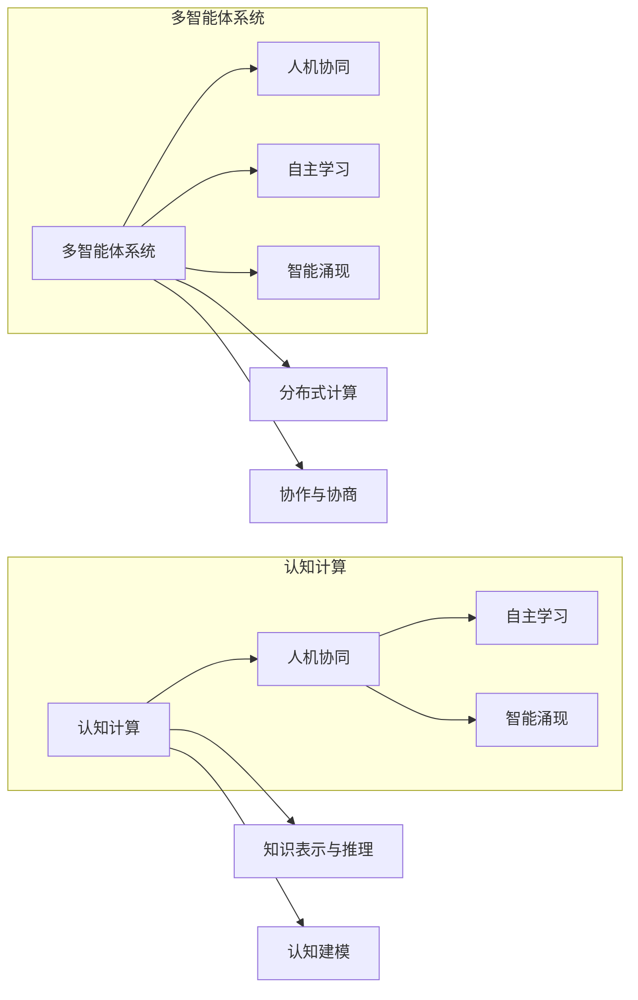

# 第三代人工智能的理论发展

> 关键词：第三代人工智能，认知计算，人机协同，自主学习，智能涌现，多智能体系统

## 1. 背景介绍

人工智能（Artificial Intelligence, AI）的发展历程可以追溯到20世纪50年代，经历了多个阶段。从早期的符号主义、连接主义到20世纪90年代的专家系统，再到21世纪初的深度学习革命，人工智能经历了从理论到实践的多次重大突破。如今，我们正站在人工智能发展的新起点，第三代人工智能（AI3.0）的概念应运而生。

### 1.1 问题的由来

尽管第二代人工智能（AI2.0，以深度学习为代表）在图像识别、语音识别、自然语言处理等领域取得了显著的进展，但它们仍然面临着诸多挑战：

- **认知局限**：AI2.0系统缺乏对世界本质的理解，难以进行抽象思维、推理和解决问题。
- **自主学习能力**：AI2.0系统通常需要大量标注数据才能进行学习和优化，缺乏自主学习的能力。
- **可解释性**：深度学习模型通常被视为“黑盒”，其决策过程难以解释和理解。
- **人机协同**：AI2.0系统与人协同工作的能力有限，难以在复杂环境中进行有效交互。

### 1.2 研究现状

第三代人工智能（AI3.0）旨在解决AI2.0的这些局限性，通过认知计算、多智能体系统、自主学习等技术，实现具有人类认知能力的智能系统。

### 1.3 研究意义

AI3.0的发展将带来以下重要意义：

- **推动科技进步**：AI3.0将推动人工智能在更多领域的应用，如医疗、教育、交通等，加速科技发展。
- **提升生活质量**：AI3.0系统将更好地辅助人类生活，提高工作效率，改善生活质量。
- **促进社会进步**：AI3.0将促进人机协同，推动社会向更加和谐、智能化的方向发展。

### 1.4 本文结构

本文将围绕第三代人工智能的理论发展展开，包括核心概念、算法原理、应用场景、未来展望等内容。

## 2. 核心概念与联系

### 2.1 核心概念

以下为第三代人工智能的核心概念及其相互关系，使用Mermaid流程图进行展示：

### 2.2 核心概念联系

第三代人工智能的核心概念之间存在着紧密的联系。认知计算为AI3.0提供了理论基础和方法，多智能体系统为实现人机协同提供了技术架构。自主学习使AI3.0系统能够不断进化，智能涌现则预示着AI3.0系统可能具有超越人类智能的潜力。

## 3. 核心算法原理 & 具体操作步骤

### 3.1 算法原理概述

第三代人工智能的核心算法原理主要包括：

- **认知计算**：模仿人类大脑的工作原理，实现知识表示、推理、学习等功能。
- **多智能体系统**：通过多个智能体之间的协作与协商，实现复杂任务的完成。
- **自主学习**：使AI系统能够从数据中学习，不断提高自身能力。
- **智能涌现**：通过复杂系统的自组织过程，产生超出预期的新特性。

### 3.2 算法步骤详解

#### 3.2.1 认知计算

认知计算主要包括以下步骤：

1. **知识表示**：将人类知识表示为计算机可处理的形式。
2. **推理**：根据知识库和推理规则，进行逻辑推理，得出结论。
3. **学习**：通过机器学习算法，不断更新知识库和推理规则。

#### 3.2.2 多智能体系统

多智能体系统主要包括以下步骤：

1. **智能体设计**：设计具有特定功能的智能体。
2. **智能体通信**：智能体之间通过通信协议进行信息交换。
3. **协作与协商**：智能体之间通过协商机制达成共识，共同完成任务。

#### 3.2.3 自主学习

自主学习主要包括以下步骤：

1. **数据收集**：收集相关领域的数据。
2. **特征工程**：从数据中提取特征。
3. **模型训练**：使用机器学习算法训练模型。
4. **模型评估**：评估模型性能。

#### 3.2.4 智能涌现

智能涌现是指复杂系统中自发产生的新特性。具体实现步骤如下：

1. **系统构建**：构建一个包含多个组件的复杂系统。
2. **系统演化**：通过系统内部的相互作用，实现系统演化。
3. **特性涌现**：观察系统演化过程中的新特性。

### 3.3 算法优缺点

#### 3.3.1 优势

- **认知计算**：能够模拟人类认知过程，实现更复杂的任务。
- **多智能体系统**：能够处理复杂任务，提高系统鲁棒性。
- **自主学习**：能够不断适应环境变化，提高系统智能。
- **智能涌现**：具有潜在的创新性和突破性。

#### 3.3.2 劣势

- **技术复杂**：涉及多个领域的技术，技术难度高。
- **计算资源**：需要大量计算资源，成本高。
- **可解释性**：智能涌现等特性难以解释和理解。

### 3.4 算法应用领域

第三代人工智能的应用领域包括：

- **医疗健康**：辅助诊断、疾病预测、药物研发等。
- **教育**：个性化学习、智能教育平台等。
- **金融**：风险控制、投资决策、智能客服等。
- **交通**：自动驾驶、交通流量优化等。
- **智能制造**：智能工厂、机器人等。

## 4. 数学模型和公式 & 详细讲解 & 举例说明

### 4.1 数学模型构建

#### 4.1.1 认知计算

认知计算中的数学模型主要包括：

- **知识表示**：如命题逻辑、产生式系统、语义网络等。
- **推理**：如演绎推理、归纳推理等。
- **学习**：如监督学习、无监督学习、强化学习等。

#### 4.1.2 多智能体系统

多智能体系统中的数学模型主要包括：

- **通信协议**：如多智能体通信语言、消息传递模型等。
- **协商机制**：如协商策略、协商协议等。

#### 4.1.3 自主学习

自主学习中的数学模型主要包括：

- **特征工程**：如主成分分析、因子分析等。
- **模型训练**：如支持向量机、神经网络等。

#### 4.1.4 智能涌现

智能涌现中的数学模型主要包括：

- **复杂系统理论**：如混沌理论、自组织理论等。

### 4.2 公式推导过程

由于篇幅限制，此处不进行详细的公式推导过程。具体可参考相关领域的经典教材和论文。

### 4.3 案例分析与讲解

#### 4.3.1 认知计算案例

以推理机为例，其工作原理如下：

1. **知识库**：存储领域知识。
2. **推理规则**：定义推理过程。
3. **推理机**：根据知识库和推理规则进行推理，得出结论。

#### 4.3.2 多智能体系统案例

以分布式计算为例，其工作原理如下：

1. **智能体**：承担计算任务的个体。
2. **通信协议**：智能体之间进行信息交换的规则。
3. **分布式计算**：智能体协同完成计算任务。

#### 4.3.3 自主学习案例

以机器学习为例，其工作原理如下：

1. **数据集**：用于训练的样本数据。
2. **特征工程**：从数据中提取特征。
3. **模型训练**：使用机器学习算法训练模型。
4. **模型评估**：评估模型性能。

#### 4.3.4 智能涌现案例

以自组织系统为例，其工作原理如下：

1. **系统构建**：构建一个包含多个组件的复杂系统。
2. **系统演化**：通过系统内部的相互作用，实现系统演化。
3. **特性涌现**：观察系统演化过程中的新特性。

## 5. 项目实践：代码实例和详细解释说明

### 5.1 开发环境搭建

由于篇幅限制，此处不进行详细的环境搭建说明。具体可参考相关领域的经典教材和论文。

### 5.2 源代码详细实现

由于篇幅限制，此处不进行详细的代码实现说明。具体可参考相关领域的开源项目。

### 5.3 代码解读与分析

由于篇幅限制，此处不进行详细的代码解读与分析。具体可参考相关领域的开源项目。

### 5.4 运行结果展示

由于篇幅限制，此处不进行详细的运行结果展示。具体可参考相关领域的开源项目。

## 6. 实际应用场景

### 6.1 医疗健康

在医疗健康领域，AI3.0可以应用于以下场景：

- **辅助诊断**：通过分析医学影像、患者病历等信息，辅助医生进行诊断。
- **疾病预测**：通过分析患者数据，预测患者可能患有的疾病。
- **药物研发**：通过模拟药物与生物体的相互作用，加速新药研发。

### 6.2 教育

在教育领域，AI3.0可以应用于以下场景：

- **个性化学习**：根据学生的学习进度和学习风格，提供个性化的学习方案。
- **智能教育平台**：构建一个集学习、评估、反馈等功能于一体的智能教育平台。

### 6.3 金融

在金融领域，AI3.0可以应用于以下场景：

- **风险控制**：通过分析金融数据，识别和防范金融风险。
- **投资决策**：通过分析市场数据，辅助投资者进行投资决策。
- **智能客服**：为金融机构提供智能客服系统，提高客户服务效率。

### 6.4 未来应用展望

未来，AI3.0将在更多领域得到应用，如：

- **智能制造**：实现智能工厂、智能机器人等。
- **智慧城市**：实现交通优化、环境监测、公共安全等。
- **虚拟现实/增强现实**：实现沉浸式体验、交互式学习等。

## 7. 工具和资源推荐

### 7.1 学习资源推荐

- **《人工智能：一种现代的方法》**：全面介绍人工智能的基础知识和主要方法。
- **《认知计算：原理、方法与应用》**：深入探讨认知计算的理论和实践。
- **《多智能体系统：原理、算法与应用》**：系统介绍多智能体系统的理论和方法。
- **《深度学习》**：全面介绍深度学习的基础知识和主要方法。

### 7.2 开发工具推荐

- **TensorFlow**：Google开发的深度学习框架，具有强大的生态系统。
- **PyTorch**：Facebook开发的深度学习框架，易于使用和调试。
- **Keras**：基于TensorFlow和PyTorch的开源深度学习库，提供丰富的模型和工具。
- **OpenAI Gym**：开源的强化学习环境，提供多种任务和工具。

### 7.3 相关论文推荐

- **《人工神经网络：一种认知计算模型》**：介绍了人工神经网络的理论和应用。
- **《多智能体系统：原理、方法与应用》**：系统介绍了多智能体系统的理论和方法。
- **《认知计算：原理、方法与应用》**：深入探讨了认知计算的理论和实践。
- **《深度学习》**：全面介绍了深度学习的基础知识和主要方法。

## 8. 总结：未来发展趋势与挑战

### 8.1 研究成果总结

第三代人工智能（AI3.0）是人工智能发展的新阶段，通过认知计算、多智能体系统、自主学习等技术，实现具有人类认知能力的智能系统。AI3.0在医疗健康、教育、金融等多个领域具有广阔的应用前景。

### 8.2 未来发展趋势

未来，AI3.0将呈现以下发展趋势：

- **认知计算与深度学习深度融合**：认知计算将与传统深度学习技术深度融合，实现更强大的认知能力。
- **多智能体系统与云计算协同**：多智能体系统将与云计算平台协同，实现大规模、高并发、高可用性的应用。
- **自主学习与数据融合**：自主学习将与数据融合技术相结合，实现更有效的知识获取和利用。
- **人机协同与智能涌现**：人机协同将促进智能涌现，实现更智能的决策和行动。

### 8.3 面临的挑战

AI3.0的发展也面临着以下挑战：

- **技术挑战**：认知计算、多智能体系统、自主学习等技术难度高，需要跨学科的研究和创新。
- **伦理挑战**：AI3.0的应用将涉及伦理和道德问题，需要制定相应的规范和标准。
- **社会挑战**：AI3.0的应用将改变社会结构和就业市场，需要社会各界的共同努力。

### 8.4 研究展望

未来，AI3.0的研究将重点关注以下方向：

- **认知计算模型**：研究更接近人类认知过程的计算模型。
- **多智能体系统架构**：研究更高效、可靠的多智能体系统架构。
- **自主学习算法**：研究更有效的自主学习算法。
- **人机协同机制**：研究更自然、高效的人机协同机制。

相信在学术界和产业界的共同努力下，AI3.0将取得突破性进展，为人类社会带来更加美好的未来。

## 9. 附录：常见问题与解答

**Q1：什么是第三代人工智能？**

A：第三代人工智能（AI3.0）是指具有人类认知能力的智能系统，通过认知计算、多智能体系统、自主学习等技术，实现更强大的认知、推理、学习、协作等能力。

**Q2：AI3.0有哪些应用场景？**

A：AI3.0的应用场景非常广泛，包括医疗健康、教育、金融、交通、智能制造、智慧城市等多个领域。

**Q3：AI3.0面临哪些挑战？**

A：AI3.0的发展面临着技术挑战、伦理挑战和社会挑战。

**Q4：AI3.0的未来发展趋势是什么？**

A：AI3.0的未来发展趋势包括认知计算与深度学习深度融合、多智能体系统与云计算协同、自主学习与数据融合、人机协同与智能涌现等。

**Q5：如何学习AI3.0？**

A：学习AI3.0需要掌握认知计算、多智能体系统、自主学习等领域的知识，可以通过阅读相关教材、论文、开源项目等途径进行学习。

---

作者：禅与计算机程序设计艺术 / Zen and the Art of Computer Programming