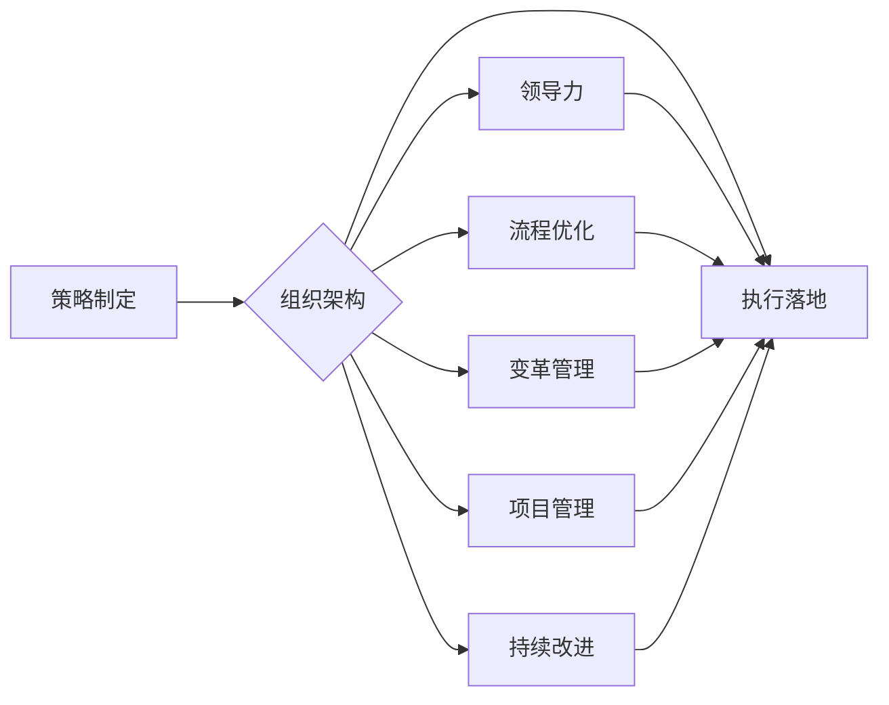

# 管理的智慧：从策略到执行

> 关键词：管理智慧，策略制定，执行落地，领导力，组织架构，流程优化，变革管理，项目管理，持续改进

## 1. 背景介绍

在快速变化的企业环境中，成功的企业不仅需要有清晰的战略目标，更需要将战略转化为具体的执行行动。管理的智慧，就在于如何制定有效的策略，并确保这些策略能够得到有效的执行。本文将探讨管理的智慧，从策略制定到执行落地的全过程，旨在为企业管理者提供一套系统化的思考框架。

### 1.1 管理的智慧的重要性

管理的智慧是企业成功的关键因素之一。它不仅仅是解决具体问题的能力，更是一种系统性的思维模式，它涵盖了战略规划、组织设计、领导力、流程优化、变革管理等多个方面。

### 1.2 管理智慧面临的挑战

随着全球化的深入发展，企业面临着日益激烈的市场竞争、技术变革和人才竞争。这些挑战要求管理者不仅要具备传统的管理技能，更需要拥有前瞻性的战略思维和高效执行的能力。

### 1.3 本文结构

本文将分为以下几个部分：

- 核心概念与联系
- 核心算法原理 & 具体操作步骤
- 数学模型和公式 & 详细讲解 & 举例说明
- 项目实践：代码实例和详细解释说明
- 实际应用场景
- 工具和资源推荐
- 总结：未来发展趋势与挑战
- 附录：常见问题与解答

## 2. 核心概念与联系

为了更好地理解管理的智慧，我们需要先了解以下几个核心概念：

- **策略制定**：企业为了实现其目标而制定的长期规划。
- **组织架构**：企业内部的组织结构，包括职能结构、层级结构和跨职能团队。
- **领导力**：领导者激励和引导团队实现目标的能力。
- **流程优化**：优化企业内部流程，提高效率和效果。
- **变革管理**：管理企业变革的过程，确保变革的顺利进行。
- **项目管理**：规划、执行和监控项目，确保项目目标的实现。
- **持续改进**：不断改进企业流程、产品和服务，以提升企业竞争力。

以下是这些概念之间的Mermaid流程图：



## 3. 核心算法原理 & 具体操作步骤

### 3.1 算法原理概述

管理的智慧的核心算法原理可以概括为以下几个方面：

- **SWOT分析**：分析企业的优势(Strengths)、劣势(Weaknesses)、机会(Opportunities)和威胁(Threats)，以制定相应的策略。
- **五力模型**：分析行业竞争态势，包括现有竞争者、潜在进入者、替代品、供应商和买方。
- **价值链分析**：分析企业内部流程，识别价值创造环节，以优化流程和提高效率。
- **平衡计分卡**：将战略目标转化为可衡量的指标，以评估企业绩效。

### 3.2 算法步骤详解

#### 策略制定

1. **明确目标**：确定企业的愿景、使命和战略目标。
2. **环境分析**：进行SWOT分析和五力模型分析，了解内外部环境。
3. **策略选择**：根据分析结果，选择合适的策略。
4. **策略实施**：制定详细的实施计划，包括资源分配、时间表和责任人。

#### 组织架构

1. **确定组织结构**：根据企业战略和业务需求，设计合理的组织结构。
2. **岗位设计**：明确各岗位职责和工作内容。
3. **人员配置**：招聘和选拔合适的人才。
4. **组织文化**：塑造积极向上的组织文化。

#### 领导力

1. **领导风格**：根据团队和情境选择合适的领导风格。
2. **激励与沟通**：激励员工，建立有效的沟通机制。
3. **冲突管理**：处理团队内部的冲突。
4. **团队建设**：培养团队的协作精神和凝聚力。

#### 流程优化

1. **流程识别**：识别企业内部的关键流程。
2. **流程分析**：分析流程的效率和效果。
3. **流程改进**：优化流程，提高效率和效果。
4. **流程监控**：监控流程执行情况，确保流程持续改进。

#### 变革管理

1. **变革诊断**：识别企业需要变革的领域。
2. **变革规划**：制定变革计划，包括变革目标、范围、时间表和资源。
3. **变革实施**：实施变革计划，包括沟通、培训、支持等。
4. **变革评估**：评估变革效果，并进行持续改进。

#### 项目管理

1. **项目规划**：制定项目计划，包括目标、范围、时间表和资源。
2. **项目执行**：执行项目计划，包括监控、控制和调整。
3. **项目监控**：监控项目进度和预算。
4. **项目收尾**：完成项目，并进行评估和总结。

#### 持续改进

1. **建立改进机制**：建立持续改进的机制，包括反馈机制、评估机制和改进机制。
2. **数据收集与分析**：收集相关数据，进行分析和评估。
3. **改进实施**：实施改进措施，提高效率和效果。
4. **持续监控**：持续监控改进效果，确保持续改进。

### 3.3 算法优缺点

#### 优缺点

| 算法 | 优点 | 缺点 |
| --- | --- | --- |
| SWOT分析 | 简单易用，能够帮助企业全面了解自身情况 | 可能过于简化，难以深入分析 |
| 五力模型 | 全面分析行业竞争态势，有助于制定竞争策略 | 可能过于理想化，难以反映实际情况 |
| 价值链分析 | 识别价值创造环节，有助于优化流程和提高效率 | 可能过于复杂，难以实施 |
| 平衡计分卡 | 将战略目标转化为可衡量的指标，有助于评估企业绩效 | 可能过于依赖数据，难以反映实际情况 |

### 3.4 算法应用领域

上述算法广泛应用于企业管理的各个方面，包括战略规划、组织设计、领导力、流程优化、变革管理、项目管理和持续改进等。

## 4. 数学模型和公式 & 详细讲解 & 举例说明

### 4.1 数学模型构建

管理的智慧涉及多个数学模型，以下是一些常见的模型：

- **线性规划**：用于优化线性目标函数，在满足线性约束条件的情况下找到最优解。
- **决策树**：用于分类和回归问题，通过树形结构对数据进行划分和预测。
- **神经网络**：用于复杂模式识别和学习，能够从数据中自动学习特征和模式。

### 4.2 公式推导过程

以下是一个线性规划的例子：

$$
\begin{align*}
\text{minimize} & \quad c^T x \\
\text{subject to} & \quad Ax \leq b \\
& \quad x \geq 0
\end{align*}
$$

其中，$c$ 是目标函数系数向量，$x$ 是决策变量向量，$A$ 是约束条件系数矩阵，$b$ 是约束条件向量。

### 4.3 案例分析与讲解

假设一个企业有两个生产部门，分别生产产品A和产品B。每个部门的单位生产成本、单位利润和单位生产时间如下表所示：

| 部门 | 单位生产成本 | 单位利润 | 单位生产时间 |
| --- | --- | --- | --- |
| A | 10 | 15 | 2 |
| B | 5 | 10 | 1 |

企业的目标是最大化总利润，同时满足以下约束条件：

- 每天生产的产品A和产品B的总时间不超过12小时。
- 每天生产的产品A和产品B的总数量不超过100个。

我们可以将这个问题建模为一个线性规划问题：

$$
\begin{align*}
\text{maximize} & \quad z = 15x_1 + 10x_2 \\
\text{subject to} & \quad 2x_1 + x_2 \leq 12 \\
& \quad x_1 + x_2 \leq 100 \\
& \quad x_1, x_2 \geq 0
\end{align*}
$$

其中，$x_1$ 和 $x_2$ 分别表示每天生产的产品A和产品B的数量。

使用线性规划求解器，我们可以得到最优解 $x_1 = 4, x_2 = 96$，最大利润为 $z = 1440$。

## 5. 项目实践：代码实例和详细解释说明

### 5.1 开发环境搭建

为了演示项目管理的过程，我们将使用Python编写一个简单的项目管理系统。以下是开发环境的搭建步骤：

1. 安装Python 3.8或更高版本。
2. 安装pip，Python的包管理工具。
3. 使用pip安装以下Python库：requests, json, datetime。

### 5.2 源代码详细实现

以下是项目管理系统的主要代码实现：

```python
import requests
import json
from datetime import datetime

class ProjectManagementSystem:
    def __init__(self, base_url):
        self.base_url = base_url

    def get_projects(self):
        response = requests.get(f"{self.base_url}/projects")
        return json.loads(response.text)

    def create_project(self, name, description, start_date, end_date):
        project = {
            "name": name,
            "description": description,
            "start_date": start_date,
            "end_date": end_date,
            "status": "active"
        }
        response = requests.post(f"{self.base_url}/projects", json=project)
        return json.loads(response.text)

    def update_project(self, project_id, name=None, description=None, start_date=None, end_date=None, status=None):
        project = {}
        if name:
            project["name"] = name
        if description:
            project["description"] = description
        if start_date:
            project["start_date"] = start_date
        if end_date:
            project["end_date"] = end_date
        if status:
            project["status"] = status
        response = requests.put(f"{self.base_url}/projects/{project_id}", json=project)
        return json.loads(response.text)

    def delete_project(self, project_id):
        response = requests.delete(f"{self.base_url}/projects/{project_id}")
        return response.status_code
```

### 5.3 代码解读与分析

上述代码实现了一个简单的项目管理系统，包括以下功能：

- 获取所有项目
- 创建新项目
- 更新项目信息
- 删除项目

代码使用了requests库来发送HTTP请求，使用json库来处理JSON数据。

### 5.4 运行结果展示

以下是一个简单的示例，演示如何使用上述代码创建和管理项目：

```python
# 创建项目管理系统实例
pms = ProjectManagementSystem("http://localhost:8000")

# 获取所有项目
projects = pms.get_projects()
print(projects)

# 创建新项目
project_id = pms.create_project("新项目", "这是一个新项目", "2023-01-01", "2023-01-31")
print(project_id)

# 更新项目信息
pms.update_project(project_id, status="completed")

# 删除项目
pms.delete_project(project_id)
```

## 6. 实际应用场景

### 6.1 企业项目管理

在企业管理中，项目管理系统可以帮助企业更好地管理项目，包括项目规划、执行、监控和收尾等环节。

### 6.2 产品开发

在产品开发过程中，项目管理系统可以帮助产品团队更好地管理产品迭代周期，包括需求收集、设计、开发和测试等环节。

### 6.3 IT运维

在IT运维领域，项目管理系统可以帮助IT团队更好地管理运维项目，包括系统升级、故障修复、性能优化等环节。

### 6.4 未来应用展望

随着人工智能、大数据等技术的不断发展，项目管理系统将更加智能化、自动化。例如，通过机器学习预测项目风险，通过自动化工具优化项目执行过程等。

## 7. 工具和资源推荐

### 7.1 学习资源推荐

- 《管理的智慧》
- 《执行》
- 《敏捷开发：从规划到交付》
- 《精益创业》

### 7.2 开发工具推荐

- JIRA
- Asana
- Trello

### 7.3 相关论文推荐

- 《敏捷项目管理：原理、实践与工具》
- 《项目管理知识体系指南》
- 《敏捷开发：拥抱变化，持续交付》

## 8. 总结：未来发展趋势与挑战

### 8.1 研究成果总结

本文从管理的智慧的角度，探讨了从策略制定到执行落地的全过程，并介绍了相关的核心概念、算法原理、数学模型和项目实践。通过分析实际应用场景，展示了管理的智慧在企业中的应用价值。

### 8.2 未来发展趋势

- 管理的智慧将更加智能化、自动化。
- 项目管理系统将更加灵活、高效。
- 企业将更加注重人才管理和团队建设。

### 8.3 面临的挑战

- 管理者需要不断提升自身能力，适应快速变化的环境。
- 企业需要建立有效的管理体系，确保管理的智慧得到有效执行。
- 技术变革对管理者提出了新的要求。

### 8.4 研究展望

管理的智慧是一个不断发展的领域，未来的研究将更加关注以下几个方面：

- 如何利用人工智能、大数据等技术提升管理的智慧。
- 如何建立有效的管理体系，确保管理的智慧得到有效执行。
- 如何培养具有管理智慧的人才。

## 9. 附录：常见问题与解答

**Q1：管理的智慧是什么？**

A：管理的智慧是指管理者运用系统化的思维模式，通过策略制定、组织设计、领导力、流程优化、变革管理、项目管理、持续改进等方法，实现企业目标的能力。

**Q2：如何提升管理的智慧？**

A：提升管理的智慧需要不断学习和实践，以下是一些建议：

- 阅读相关书籍和论文，了解管理的理论基础。
- 参加相关培训和实践，提升管理技能。
- 反思自己的管理实践，不断改进。

**Q3：项目管理在企业管理中有什么作用？**

A：项目管理可以帮助企业更好地管理项目，确保项目目标的实现，提高效率和效果。

**Q4：如何进行有效的变革管理？**

A：进行有效的变革管理需要以下步骤：

- 诊断变革需求
- 制定变革计划
- 实施变革计划
- 评估变革效果
- 持续改进

**Q5：如何培养具有管理智慧的人才？**

A：培养具有管理智慧的人才需要以下措施：

- 建立有效的管理体系
- 提供学习和成长机会
- 鼓励创新和思考

---

作者：禅与计算机程序设计艺术 / Zen and the Art of Computer Programming