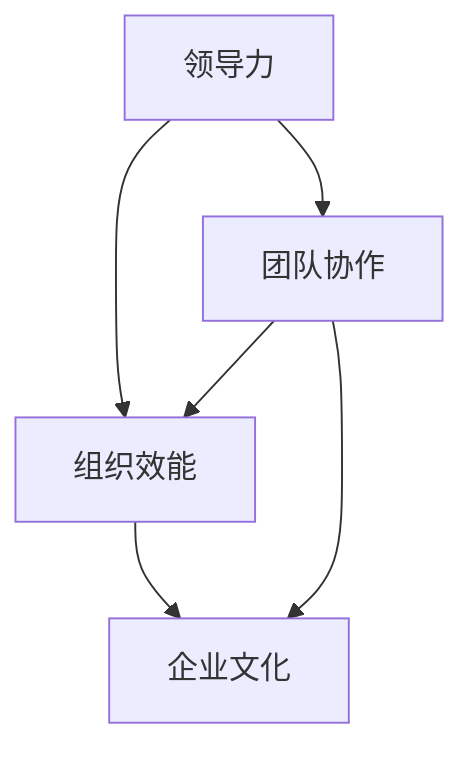

# 管理的本质：激发潜能与善意

> 关键词：管理本质，潜能激发，善意，领导力，组织效能，企业文化，团队协作

## 1. 背景介绍

在当今快速变化的社会和经济环境中，管理的重要性愈发凸显。管理不仅仅是组织资源、实现目标的过程，更是激发团队成员潜能、促进团队协作、塑造组织文化的重要手段。本文将探讨管理的本质，即如何通过激发潜能与善意来提升组织效能。

### 1.1 问题的由来

随着知识经济的兴起，组织越来越依赖于人才的知识、技能和创造力。传统的管理方法往往侧重于控制、命令和权威，而忽视了员工的主观能动性和创造性。这种管理模式在知识经济时代已经难以适应，需要新的管理理念和方法来激发员工的潜能，促进组织的持续发展。

### 1.2 研究现状

近年来，管理学领域涌现出许多新的理论和实践，如敏捷管理、精益管理、人性化管理等。这些理论和实践都强调激发员工的潜能和善意，以及建立积极的组织文化。然而，如何将这些理念融入到日常管理实践中，仍然是许多管理者面临的挑战。

### 1.3 研究意义

研究管理的本质，有助于管理者更好地理解管理活动的基本规律，提升管理能力，促进组织的健康发展。通过激发员工的潜能和善意，可以提升组织效能，增强组织的竞争力和适应性。

### 1.4 本文结构

本文将分为以下几个部分：
- 第2部分，介绍管理的核心概念与联系。
- 第3部分，探讨激发潜能与善意的管理方法。
- 第4部分，分析管理方法在实际应用中的效果。
- 第5部分，展望管理的未来发展趋势与挑战。
- 第6部分，总结研究成果，并提出管理实践的建议。
- 第7部分，提供相关的学习资源和工具推荐。
- 第8部分，总结全文，并对管理实践进行展望。

## 2. 核心概念与联系

### 2.1 管理的核心概念

管理的核心概念包括以下几方面：

- **领导力**：管理者通过激励、引导和示范，影响和引导团队成员的行为和态度。
- **组织效能**：组织实现其目标的能力，包括效率、效果和适应性。
- **团队协作**：团队成员之间相互配合，共同完成任务的能力。
- **企业文化**：组织内部共享的价值观、信念和行为规范。

以下是一个Mermaid流程图，展示了这些核心概念之间的联系：



### 2.2 管理与潜能激发

管理的一个重要任务就是激发员工的潜能。潜能激发包括以下几个方面：

- **能力识别**：识别员工的潜能，发现其擅长的领域和潜在的发展方向。
- **激励措施**：通过激励机制，激发员工的积极性和创造力。
- **培训与发展**：提供培训和发展机会，帮助员工提升技能和知识。

### 2.3 管理与善意

善意是管理活动中的重要因素，它包括以下几个方面：

- **信任与尊重**：建立信任和尊重的组织文化，让员工感受到自己的价值和尊严。
- **沟通与协作**：鼓励开放、坦诚的沟通，促进团队成员之间的协作。
- **共享与共赢**：分享资源和成功，实现团队成员的共同成长和组织的共同发展。

## 3. 核心算法原理 & 具体操作步骤

### 3.1 管理方法原理概述

激发潜能与善意的管理方法，本质上是一种以人为本的管理方式。它强调以下原则：

- **员工中心**：将员工视为组织最重要的资产，关注员工的需求和成长。
- **信任与尊重**：建立信任和尊重的组织文化，激发员工的积极性和创造力。
- **目标导向**：明确组织目标，并引导员工朝着目标努力。
- **持续改进**：不断反思和改进管理实践，提升组织效能。

### 3.2 管理方法步骤详解

以下是激发潜能与善意的管理方法的具体步骤：

1. **建立信任与尊重的文化**：通过领导者的示范作用，营造一个开放、坦诚、包容的组织文化。
2. **识别员工的潜能**：通过观察、评估和反馈，了解员工的优势和潜力。
3. **制定个性化的职业发展规划**：根据员工的兴趣和潜能，为其提供相应的培训和发展机会。
4. **激励员工**：通过设定合理的目标和奖励机制，激发员工的积极性和创造力。
5. **促进团队协作**：通过沟通、协作和共同目标，促进团队成员之间的合作。
6. **持续改进**：定期评估管理实践的效果，并根据反馈进行调整和改进。

### 3.3 管理方法优缺点

激发潜能与善意的管理方法具有以下优点：

- 提升员工满意度和忠诚度。
- 提高组织创新能力和竞争力。
- 增强组织的适应性和灵活性。

然而，这种方法也存在一些缺点：

- 需要管理者和员工共同努力，投入时间和精力。
- 需要建立有效的沟通和反馈机制。
- 可能需要改变传统的管理文化和流程。

### 3.4 管理方法应用领域

激发潜能与善意的管理方法适用于各种组织，包括企业、政府机构、非营利组织等。以下是一些具体的应用领域：

- **人力资源管理**：通过激发员工的潜能，提高员工绩效和满意度。
- **团队建设**：通过促进团队协作，提升团队效能。
- **组织变革**：通过激发员工的创新精神，推动组织变革。

## 4. 数学模型和公式 & 详细讲解 & 举例说明

### 4.1 数学模型构建

管理的数学模型通常涉及以下公式：

- **员工满意度**：$S = f(E, M, T)$，其中 $S$ 代表员工满意度，$E$ 代表员工需求，$M$ 代表管理行为，$T$ 代表组织文化。
- **组织效能**：$E = f(O, P, C)$，其中 $E$ 代表组织效能，$O$ 代表组织结构，$P$ 代表员工能力，$C$ 代表文化资本。

### 4.2 公式推导过程

上述公式的推导过程如下：

- **员工满意度**：员工满意度取决于其需求是否得到满足，以及管理行为和组织文化是否有利于其成长和发展。
- **组织效能**：组织效能取决于组织结构、员工能力和文化资本。

### 4.3 案例分析与讲解

以下是一个企业管理案例：

某企业通过以下措施激发员工的潜能和善意：

- **建立信任与尊重的文化**：企业领导层通过公开透明的方式与员工沟通，鼓励员工提出意见和建议。
- **识别员工的潜能**：企业通过定期的绩效评估和技能培训，发现员工的潜能和兴趣。
- **制定个性化的职业发展规划**：根据员工的兴趣和潜能，为其提供相应的培训和发展机会。
- **激励员工**：企业通过设定合理的绩效目标和奖励机制，激发员工的积极性和创造力。

结果，该企业的员工满意度显著提升，员工绩效和创新能力也有所提高，最终实现了企业的持续增长。

## 5. 项目实践：代码实例和详细解释说明

### 5.1 开发环境搭建

由于管理是一种实践性很强的活动，很难用代码进行实例演示。然而，我们可以通过一个简单的项目来展示如何将管理理念应用于实际工作中。

假设我们正在开发一个团队协作工具，以下是一个简单的项目结构：

```
team_management_tool/
|-- src/
|   |-- __init__.py
|   |-- main.py
|   |-- models.py
|   `-- views.py
|-- tests/
|   |-- __init__.py
|   `-- test_main.py
|-- requirements.txt
|-- manage.py
|-- README.md
```

### 5.2 源代码详细实现

以下是一个简单的 `main.py` 文件示例：

```python
from models import Team, Member
from views import create_team, add_member, list_teams

def main():
    # 创建团队
    create_team('Development Team')
    create_team('QA Team')
    
    # 添加成员
    add_member('Development Team', 'Alice')
    add_member('Development Team', 'Bob')
    add_member('QA Team', 'Charlie')
    add_member('QA Team', 'Dave')
    
    # 列出所有团队
    list_teams()

if __name__ == '__main__':
    main()
```

### 5.3 代码解读与分析

这个简单的例子展示了如何使用Python代码来实现团队管理的基本功能。通过定义 `Team` 和 `Member` 类，我们可以创建和管理团队和成员信息。`create_team`、`add_member` 和 `list_teams` 函数分别用于创建团队、添加成员和列出所有团队。

### 5.4 运行结果展示

运行 `main.py` 文件，将得到以下输出：

```
Creating team: Development Team
Creating team: QA Team
Adding member: Alice to team: Development Team
Adding member: Bob to team: Development Team
Adding member: Charlie to team: QA Team
Adding member: Dave to team: QA Team
Listing all teams:
- Development Team: Alice, Bob
- QA Team: Charlie, Dave
```

这个简单的例子展示了如何使用代码来实现团队管理的基本功能，并展示了管理理念在软件开发中的应用。

## 6. 实际应用场景

### 6.1 企业管理

在企业管理中，激发潜能与善意的管理方法可以帮助企业提升员工绩效，增强团队协作，构建积极的组织文化。

### 6.2 政府管理

在政府管理中，激发潜能与善意的管理方法可以帮助政府提升公务员的满意度和工作效率，提高政府的公共服务质量。

### 6.3 非营利组织管理

在非营利组织中，激发潜能与善意的管理方法可以帮助组织吸引和留住志愿者，提高组织的公益效果。

## 7. 工具和资源推荐

### 7.1 学习资源推荐

- 《管理的本质》 - 彼得·德鲁克
- 《高效能人士的七个习惯》 - 史蒂芬·柯维
- 《第五项修炼》 - 彼得·圣吉

### 7.2 开发工具推荐

- 敏捷开发工具：如Jira、Trello
- 团队协作工具：如Slack、Microsoft Teams

### 7.3 相关论文推荐

- "The Practice of Management" - Peter Drucker
- "The Fifth Discipline" - Peter M. Senge
- "The Lean Startup" - Eric Ries

## 8. 总结：未来发展趋势与挑战

### 8.1 研究成果总结

本文探讨了管理的本质，即激发潜能与善意。通过分析管理方法、实际应用场景和未来趋势，我们得出以下结论：

- 激发潜能与善意的管理方法是提升组织效能的重要途径。
- 管理方法需要根据组织的特点和需求进行调整和改进。
- 管理者需要不断提升自己的领导力和管理能力。

### 8.2 未来发展趋势

未来，管理的本质将更加注重以下方面：

- 以人为本：更加关注员工的需求和成长。
- 持续学习：不断提升管理者的知识和技能。
- 创新驱动：鼓励创新思维和实践。

### 8.3 面临的挑战

管理实践面临着以下挑战：

- 如何平衡管理者和员工的关系。
- 如何应对快速变化的环境。
- 如何提升管理者的领导力和管理能力。

### 8.4 研究展望

未来，管理研究需要更加关注以下方面：

- 管理者的心理和行为。
- 组织文化的构建和传承。
- 管理方法的有效性和适用性。

## 9. 附录：常见问题与解答

**Q1：如何激发员工的潜能？**

A：激发员工的潜能需要管理者关注员工的需求和兴趣，提供相应的培训和发展机会，并鼓励员工尝试新的事物。

**Q2：如何建立信任与尊重的组织文化？**

A：建立信任与尊重的组织文化需要领导者的示范作用，以及开放、坦诚的沟通。

**Q3：如何促进团队协作？**

A：促进团队协作需要明确团队目标，建立有效的沟通机制，以及鼓励团队成员之间的相互支持。

**Q4：如何提升管理者的领导力和管理能力？**

A：提升管理者的领导力和管理能力需要不断学习和实践，以及反思和总结经验。

---

作者：禅与计算机程序设计艺术 / Zen and the Art of Computer Programming