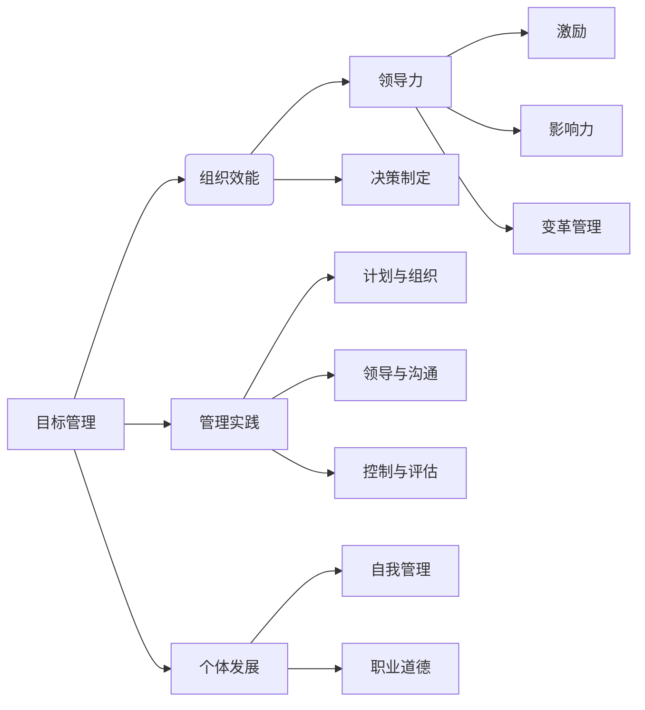

# 管理的艺术：德鲁克的洞见

> 关键词：彼得·德鲁克，管理哲学，目标管理，管理实践，组织效能，领导力

## 1. 背景介绍

在信息技术飞速发展的时代，管理已经成为推动组织成功的关键因素。彼得·德鲁克（Peter Drucker）作为现代管理学之父，其管理理念和实践对当今世界产生了深远的影响。本文将深入探讨德鲁克的管理哲学，分析其核心概念，并探讨其在IT领域的应用。

### 1.1 彼得·德鲁克的背景

彼得·德鲁克（1909-2005）是一位奥地利的裔美籍管理学家、作家和思想家。他的著作涵盖了商业管理、社会创新、经济发展等多个领域，其思想对全球的企业家、管理者产生了巨大影响。

### 1.2 研究意义

德鲁克的管理理念强调以目标为导向，关注组织效能和个体发展，这对于IT行业尤为重要。在快速变化的IT领域，如何有效管理团队、提升组织效能，是每个管理者都需要面对的挑战。德鲁克的管理哲学为此提供了宝贵的指导。

## 2. 核心概念与联系

德鲁克的管理哲学包含了一系列核心概念，它们相互联系，共同构成了其管理思想体系。以下是一个Mermaid流程图，展示了这些核心概念之间的逻辑关系：



### 2.1 核心概念

#### 2.1.1 目标管理

目标管理（Management by Objectives, MBO）是德鲁克管理哲学的核心。它强调以目标为导向，通过设定明确的目标来指导组织的行为。

#### 2.1.2 组织效能

组织效能是指组织实现其目标的效率和质量。德鲁克认为，提高组织效能是管理的终极目标。

#### 2.1.3 管理实践

管理实践包括计划与组织、领导与沟通、控制与评估等方面，是德鲁克管理哲学的具体应用。

#### 2.1.4 个体发展

个体发展是指员工在职业和生活方面的成长。德鲁克认为，组织应该关注员工的个人发展，以提高整体效能。

#### 2.1.5 领导力

领导力是德鲁克管理哲学的重要组成部分。领导者应该具备激励、影响和变革管理的能力。

## 3. 核心算法原理 & 具体操作步骤

### 3.1 算法原理概述

德鲁克的管理方法不是基于特定的算法，而是基于对管理实践的深刻洞察和哲学思考。以下是一些关键的管理步骤：

#### 3.1.1 设定目标

组织和个人都应该设定明确、可衡量的目标。

#### 3.1.2 计划与组织

根据目标制定详细的计划，并组织资源以实现这些计划。

#### 3.1.3 领导与沟通

领导者应该激励和沟通，以推动组织目标的实现。

#### 3.1.4 控制与评估

定期评估组织的绩效，并根据评估结果进行调整。

### 3.2 算法步骤详解

#### 3.2.1 设定目标

- 明确组织愿景和使命。
- 确定长期和短期目标。
- 将目标分解为具体的行动计划。

#### 3.2.2 计划与组织

- 分析组织结构，确保其与目标一致。
- 分配资源，包括人力、财务和物质资源。
- 制定详细的行动计划。

#### 3.2.3 领导与沟通

- 建立积极的工作环境，激励员工。
- 保持开放的沟通渠道。
- 传递愿景和目标。

#### 3.2.4 控制与评估

- 设定关键绩效指标（KPIs）。
- 定期监控绩效。
- 根据绩效评估结果进行调整。

### 3.3 算法优缺点

#### 3.3.1 优点

- 灵活性和适应性：德鲁克的管理方法强调灵活性，能够适应不断变化的环境。
- 以目标为导向：目标管理确保组织始终朝着正确的方向前进。
- 关注个体发展：通过关注个体发展，提高整体效能。

#### 3.3.2 缺点

- 目标设定可能过于理想化。
- 需要持续监控和评估。
- 可能忽视非正式的组织结构。

### 3.4 算法应用领域

德鲁克的管理哲学适用于所有类型和规模的组织，包括IT行业。

## 4. 数学模型和公式 & 详细讲解 & 举例说明

德鲁克的管理哲学不依赖于数学模型和公式，但我们可以通过一些简单的数学工具来帮助理解其管理思想。

#### 4.1 数学模型构建

德鲁克的管理哲学可以视为一个目标导向的决策树。每个节点代表一个决策点，每个分支代表一个可能的行动方案。

#### 4.2 公式推导过程

由于德鲁克的管理哲学不依赖于数学模型，因此没有具体的公式推导过程。

#### 4.3 案例分析与讲解

以下是一个简单的例子，展示了如何将德鲁克的管理哲学应用于IT项目：

- **目标**：完成一个软件开发项目。
- **计划与组织**：确定项目团队，分配任务，制定项目时间表。
- **领导与沟通**：保持与团队成员的沟通，确保项目进度。
- **控制与评估**：定期评估项目进度，根据评估结果进行调整。

## 5. 项目实践：代码实例和详细解释说明

德鲁克的管理哲学不涉及具体的代码实现，但我们可以通过一个简单的Python代码示例来模拟目标管理的过程。

#### 5.1 开发环境搭建

确保安装了Python和必要的库。

#### 5.2 源代码详细实现

```python
# 目标管理示例

# 定义目标
def set_objective(objective):
    return objective

# 设定目标
objective = set_objective("完成软件开发项目")

# 打印目标
print(f"目标：{objective}")

# 计划与组织
def plan_and Organize():
    print("确定项目团队，分配任务，制定项目时间表")

# 领导与沟通
def lead_and_communicate():
    print("保持与团队成员的沟通，确保项目进度")

# 控制与评估
def control_and_evaluate():
    print("定期评估项目进度，根据评估结果进行调整")

# 执行管理实践
plan_and_Organize()
lead_and_communicate()
control_and_evaluate()
```

#### 5.3 代码解读与分析

这段代码演示了如何使用Python代码来模拟德鲁克的管理哲学。我们定义了几个函数来代表不同的管理步骤，并通过调用这些函数来执行整个管理过程。

## 6. 实际应用场景

德鲁克的管理哲学在IT行业中有着广泛的应用，以下是一些例子：

- **敏捷开发**：敏捷开发团队使用德鲁克的管理理念来设定迭代目标，并根据目标调整计划。
- **项目管理**：项目经理使用德鲁克的方法来制定项目计划，监控进度，并确保项目目标的实现。
- **团队管理**：团队领导者使用德鲁克的理念来激励团队成员，提高团队效能。

### 6.4 未来应用展望

随着人工智能和大数据技术的发展，德鲁克的管理哲学将得到进一步的应用和发展。以下是一些可能的未来应用场景：

- **智能管理**：使用人工智能技术来辅助管理者进行决策和规划。
- **数据驱动的管理**：利用大数据分析来评估组织绩效，并据此调整管理策略。
- **个性化管理**：根据员工的个人发展需求，提供个性化的管理方案。

## 7. 工具和资源推荐

### 7.1 学习资源推荐

- 《管理的实践》（Peter Drucker）
- 《卓有成效的管理者》（Peter Drucker）
- 《管理的艺术》（Peter Drucker）

### 7.2 开发工具推荐

- 项目管理工具（如Jira、Trello）
- 团队协作工具（如Slack、Microsoft Teams）

### 7.3 相关论文推荐

- 《目标管理：理论与实践》（Robert S. Kaplan & David P. Norton）
- 《敏捷项目管理》（Jim Highsmith）

## 8. 总结：未来发展趋势与挑战

### 8.1 研究成果总结

德鲁克的管理哲学为IT行业提供了宝贵的指导。其强调目标管理、组织效能和个体发展的理念，有助于组织在快速变化的IT环境中取得成功。

### 8.2 未来发展趋势

德鲁克的管理哲学将继续在IT行业中发挥重要作用，并与新兴技术相结合，推动组织管理的发展。

### 8.3 面临的挑战

- 如何将德鲁克的管理理念与新技术相结合。
- 如何应对快速变化的环境，保持组织灵活性。
- 如何平衡个体发展与组织目标。

### 8.4 研究展望

德鲁克的管理哲学将继续发展，以适应未来组织的需要。未来研究将重点关注以下领域：

- 智能管理
- 数据驱动的管理
- 个性化管理

## 9. 附录：常见问题与解答

**Q1：德鲁克的管理哲学适用于所有行业吗？**

A1：是的，德鲁克的管理哲学适用于所有行业。其核心概念和原则具有普遍性，可以应用于各种组织。

**Q2：如何将德鲁克的管理理念应用于敏捷开发？**

A2：在敏捷开发中，德鲁克的目标管理和计划与组织原则可以帮助团队设定迭代目标，并根据目标调整计划。

**Q3：德鲁克的管理哲学与人工智能技术相结合会有什么影响？**

A3：德鲁克的管理理念可以帮助人工智能技术在组织管理中发挥作用，例如通过智能管理工具提高管理效率。

**Q4：德鲁克的管理哲学与领导力有什么关系？**

A4：德鲁克的管理哲学强调领导力的重要性。领导者应该具备激励、影响和变革管理的能力。

**Q5：如何将德鲁克的管理理念应用于个人发展？**

A5：个人可以通过设定目标、制定计划、培养自我管理能力等方式，将德鲁克的管理理念应用于个人发展。

---

作者：禅与计算机程序设计艺术 / Zen and the Art of Computer Programming