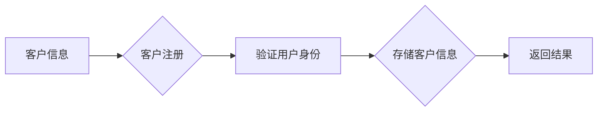
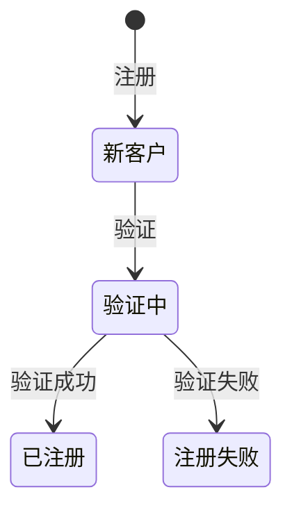

# 经销商管理系统架构设计方案

> 关键词：经销商管理系统，架构设计，微服务，RESTful API，数据一致性，分布式事务，安全性，用户体验

## 1. 背景介绍

随着市场经济的不断发展，经销商在品牌厂商与终端消费者之间扮演着越来越重要的角色。经销商管理系统作为品牌厂商与经销商之间的桥梁，其重要性不言而喻。一个高效、稳定的经销商管理系统，不仅能够提升经销商的运营效率，还能增强品牌厂商的市场竞争力。

本文将针对经销商管理系统的架构设计进行深入探讨，从系统设计原则、架构模式、关键技术等方面进行分析，并提出一套完整的设计方案。

## 2. 核心概念与联系

### 2.1 经销商管理系统概述

经销商管理系统通常包括以下核心模块：

- **客户管理**：管理经销商、终端客户等信息，包括基本信息、销售记录、服务记录等。
- **订单管理**：处理订单的创建、审批、跟踪、发货等流程。
- **库存管理**：管理商品的入库、出库、盘点等流程。
- **财务管理**：管理经销商的财务数据，包括收入、支出、利润等。
- **报表统计**：生成各类报表，如销售报表、库存报表、财务报表等。
- **权限管理**：管理用户权限，确保系统安全。

### 2.2 架构设计原则

在设计经销商管理系统时，应遵循以下原则：

- **模块化**：将系统分解为多个独立的模块，提高系统的可维护性和可扩展性。
- **可扩展性**：设计时应考虑未来可能的扩展需求，如增加新的功能模块、支持新的业务场景等。
- **高性能**：系统应能够处理大量并发请求，保证系统的高可用性。
- **安全性**：确保系统数据的安全，防止数据泄露和恶意攻击。
- **用户体验**：设计简洁易用的用户界面，提高用户的使用效率。

### 2.3 核心概念原理和架构的 Mermaid 流程图

```mermaid
graph LR
A[客户管理] --> B{订单管理}
B --> C{库存管理}
C --> D{财务管理}
D --> E{报表统计}
E --> F{权限管理}
A --> G[用户]
G --> H{管理员}
H --> I[经销商]
I --> J[终端客户}
```

## 3. 核心算法原理 & 具体操作步骤

### 3.1 算法原理概述

经销商管理系统的核心算法主要包括：

- **数据一致性和分布式事务**：保证在分布式环境下数据的一致性和完整性。
- **安全性**：确保系统数据的安全，防止非法访问和恶意攻击。
- **负载均衡**：通过负载均衡技术，提高系统并发处理能力。

### 3.2 算法步骤详解

#### 3.2.1 数据一致性和分布式事务

- 使用分布式数据库，如MySQL Cluster、Oracle RAC等，保证数据的一致性。
- 使用两阶段提交(2PC)或三阶段提交(3PC)协议，确保分布式事务的原子性。

#### 3.2.2 安全性

- 使用HTTPS协议加密数据传输。
- 对用户进行身份验证和授权，防止未授权访问。
- 定期更新系统软件和依赖库，防止安全漏洞。

#### 3.2.3 负载均衡

- 使用Nginx、HAProxy等负载均衡器，将请求分发到不同的服务器。
- 使用缓存技术，如Redis、Memcached等，提高系统响应速度。

### 3.3 算法优缺点

#### 3.3.1 数据一致性和分布式事务

优点：保证数据的一致性和完整性。

缺点：两阶段提交等协议可能导致单点故障和性能瓶颈。

#### 3.3.2 安全性

优点：提高系统数据的安全性。

缺点：安全配置复杂，可能存在安全漏洞。

#### 3.3.3 负载均衡

优点：提高系统并发处理能力。

缺点：负载均衡器可能出现故障，影响系统可用性。

### 3.4 算法应用领域

以上算法适用于各类分布式系统，如电商平台、社交网络、金融系统等。

## 4. 数学模型和公式 & 详细讲解 & 举例说明

### 4.1 数学模型构建

经销商管理系统的数学模型主要包括：

- **数据流模型**：描述系统中的数据流向和处理过程。
- **状态转换模型**：描述系统状态的转换规则。

### 4.2 公式推导过程

#### 4.2.1 数据流模型

数据流模型可以使用流程图表示，描述数据在系统中的流向和处理过程。

#### 4.2.2 状态转换模型

状态转换模型可以使用状态图表示，描述系统状态的转换规则。

### 4.3 案例分析与讲解

以客户管理模块为例，分析数据流模型和状态转换模型。

#### 4.3.1 数据流模型

客户管理模块的数据流模型如下：



#### 4.3.2 状态转换模型

客户管理模块的状态转换模型如下：



## 5. 项目实践：代码实例和详细解释说明

### 5.1 开发环境搭建

- 操作系统：Linux
- 开发语言：Java
- 开发框架：Spring Boot
- 数据库：MySQL
- 版本控制：Git

### 5.2 源代码详细实现

以客户管理模块的注册功能为例，展示源代码实现：

```java
@RestController
@RequestMapping("/customer")
public class CustomerController {

    @Autowired
    private CustomerService customerService;

    @PostMapping("/register")
    public ResponseEntity<String> register(@RequestBody Customer customer) {
        // 验证用户身份
        boolean isExist = customerService.checkExist(customer.getUsername());
        if (isExist) {
            return ResponseEntity.status(HttpStatus.BAD_REQUEST).body("用户名已存在");
        }
        // 存储客户信息
        customerService.save(customer);
        return ResponseEntity.ok("注册成功");
    }
}
```

### 5.3 代码解读与分析

上述代码实现了客户管理模块的注册功能。客户端通过HTTP POST请求向`/customer/register`接口发送注册信息，后端通过`CustomerService`服务进行验证和存储。

### 5.4 运行结果展示

假设用户名为`user1`，密码为`password`，运行结果如下：

```
POST /customer/register
Content-Type: application/json

{
  "username": "user1",
  "password": "password",
  "email": "user1@example.com",
  "phone": "13800000000"
}

Response:
HTTP/1.1 200 OK
Content-Type: application/json

{
  "message": "注册成功"
}
```

## 6. 实际应用场景

经销商管理系统适用于各类企业，如汽车、家电、快消品等行业。以下为几个典型应用场景：

- **汽车行业**：管理经销商销售、库存、售后服务等信息。
- **家电行业**：管理经销商销售、库存、售后服务、安装维修等信息。
- **快消品行业**：管理经销商销售、库存、促销活动等信息。

## 7. 工具和资源推荐

### 7.1 学习资源推荐

- 《Spring Boot实战》
- 《深入理解Java虚拟机》
- 《大型网站技术架构》

### 7.2 开发工具推荐

- IntelliJ IDEA
- Git
- MySQL

### 7.3 相关论文推荐

- 《大型分布式存储系统》
- 《大型分布式计算系统》
- 《网络安全》

## 8. 总结：未来发展趋势与挑战

### 8.1 研究成果总结

本文针对经销商管理系统的架构设计进行了深入探讨，从系统设计原则、架构模式、关键技术等方面提出了完整的设计方案。通过对实际项目的分析和代码实例，展示了系统设计的具体实现方法。

### 8.2 未来发展趋势

- **微服务架构**：将系统分解为多个独立的微服务，提高系统的可维护性和可扩展性。
- **云计算**：利用云计算资源，提高系统的弹性和可扩展性。
- **人工智能**：将人工智能技术应用于系统，提升系统的智能化水平。

### 8.3 面临的挑战

- **数据安全**：随着数据量的不断增加，数据安全成为一大挑战。
- **系统性能**：随着业务量的增长，系统性能成为一大挑战。
- **用户体验**：随着用户需求的不断变化，用户体验成为一大挑战。

### 8.4 研究展望

未来，经销商管理系统将继续朝着微服务、云计算、人工智能等方向发展，以满足不断变化的业务需求。同时，需要面对数据安全、系统性能、用户体验等方面的挑战，不断优化和改进系统设计。

## 9. 附录：常见问题与解答

**Q1：经销商管理系统架构设计时应注意哪些问题？**

A：经销商管理系统架构设计时应注意以下问题：

- **模块化**：将系统分解为多个独立的模块，提高系统的可维护性和可扩展性。
- **可扩展性**：设计时应考虑未来可能的扩展需求，如增加新的功能模块、支持新的业务场景等。
- **高性能**：系统应能够处理大量并发请求，保证系统的高可用性。
- **安全性**：确保系统数据的安全，防止非法访问和恶意攻击。
- **用户体验**：设计简洁易用的用户界面，提高用户的使用效率。

**Q2：如何保证经销商管理系统的数据一致性？**

A：可以使用分布式数据库，如MySQL Cluster、Oracle RAC等，保证数据的一致性。同时，可以使用两阶段提交(2PC)或三阶段提交(3PC)协议，确保分布式事务的原子性。

**Q3：如何提高经销商管理系统的安全性？**

A：可以使用HTTPS协议加密数据传输。对用户进行身份验证和授权，防止未授权访问。定期更新系统软件和依赖库，防止安全漏洞。

**Q4：如何提高经销商管理系统的性能？**

A：可以使用负载均衡技术，如Nginx、HAProxy等，将请求分发到不同的服务器。使用缓存技术，如Redis、Memcached等，提高系统响应速度。

**Q5：经销商管理系统如何适应未来发展趋势？**

A：经销商管理系统可以朝着微服务、云计算、人工智能等方向发展，以满足不断变化的业务需求。同时，需要面对数据安全、系统性能、用户体验等方面的挑战，不断优化和改进系统设计。

作者：禅与计算机程序设计艺术 / Zen and the Art of Computer Programming