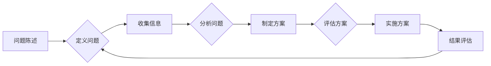

# 结构化思维的力量：从思维到行动

> 关键词：结构化思维，思维模式，逻辑框架，解决问题，决策制定，项目管理和个人成长

## 1. 背景介绍

在信息爆炸和快速变化的现代社会，结构化思维成为了一种不可或缺的技能。它不仅有助于我们更好地理解复杂问题，还能提高我们的决策效率，增强团队协作，以及推动项目成功。本文将深入探讨结构化思维的原理、应用和实践，帮助读者掌握这一强大的思维工具。

### 1.1 问题的由来

随着全球化和数字化的发展，信息和知识以惊人的速度增长。我们每天都要处理大量复杂的信息和问题。如果没有有效的思维框架，我们很容易陷入混乱，难以做出明智的决策。因此，结构化思维作为一种系统化的思考方式，成为了提升个人和团队效率的关键。

### 1.2 研究现状

结构化思维已经成为管理学、心理学和认知科学等领域的研究热点。许多研究机构和专家都致力于探索和推广结构化思维的应用。例如，麦肯锡咨询公司的“麦肯锡方法”和“金字塔原理”都是结构化思维的经典应用。

### 1.3 研究意义

掌握结构化思维可以帮助我们：

- 提高问题解决能力
- 优化决策过程
- 增强沟通和表达能力
- 提升团队协作效率
- 促进个人和职业成长

### 1.4 本文结构

本文将分为以下几个部分：

- 介绍结构化思维的核心概念和原理
- 阐述结构化思维的逻辑框架和操作步骤
- 分析结构化思维在各个领域的应用
- 探讨结构化思维的未来发展趋势和挑战
- 提供相关学习资源和工具

## 2. 核心概念与联系

### 2.1 核心概念

#### 2.1.1 问题陈述

问题陈述是结构化思维的起点。一个清晰、明确的问题陈述可以帮助我们聚焦注意力，确定解决问题的关键。

#### 2.1.2 思维框架

思维框架是结构化思维的核心，它提供了组织和分析信息的结构。

#### 2.1.3 逻辑流程

逻辑流程是解决问题的步骤，包括收集信息、分析问题、制定方案、评估方案和实施方案。

#### 2.1.4 模型与范式

模型与范式是结构化思维的工具，如SWOT分析、PEST分析、5W2H等。

### 2.2 Mermaid 流程图

以下是一个结构化思维的Mermaid流程图示例：

### 2.3 核心概念之间的联系

问题陈述是结构化思维的基础，思维框架和逻辑流程是解决问题的核心，而模型与范式则是具体的工具和方法。

## 3. 核心算法原理 & 具体操作步骤

### 3.1 算法原理概述

结构化思维是一种基于逻辑和系统的思考方式。它遵循以下原则：

- 确定性：问题解决的过程应该是有序的、可预测的。
- 一致性：思维框架和逻辑流程应该是一致的，以避免混淆和误解。
- 完整性：问题解决的过程应该全面覆盖所有相关因素。
- 明确性：信息应该清晰、简洁，避免模糊和歧义。

### 3.2 算法步骤详解

#### 3.2.1 收集信息

收集与问题相关的所有信息，包括数据、事实、案例等。

#### 3.2.2 分析问题

使用思维框架和逻辑流程对信息进行组织和分析，找出问题的根本原因。

#### 3.2.3 制定方案

根据分析结果，制定多个解决方案，并评估它们的可行性。

#### 3.2.4 评估方案

评估每个方案的优缺点，选择最佳方案。

#### 3.2.5 实施方案

执行最佳方案，并根据实际情况进行调整。

### 3.3 算法优缺点

#### 3.3.1 优点

- 提高问题解决效率
- 增强决策质量
- 提升团队协作
- 促进个人成长

#### 3.3.2 缺点

- 需要时间和精力
- 可能过于僵化
- 难以应对突发情况

### 3.4 算法应用领域

结构化思维适用于以下领域：

- 项目管理
- 决策制定
- 人力资源管理
- 市场营销
- 技术开发

## 4. 数学模型和公式 & 详细讲解 & 举例说明

### 4.1 数学模型构建

结构化思维没有特定的数学模型，但它可以与数学模型结合，如决策树、贝叶斯网络等，以增强分析能力。

### 4.2 公式推导过程

结构化思维不涉及复杂的数学推导，而是依赖于逻辑和经验。

### 4.3 案例分析与讲解

#### 4.3.1 案例一：项目管理

假设一个项目需要在两个不同的方案之间进行选择。使用SWOT分析来评估每个方案的优缺点：

- 方案A：优点是成本低、时间短，缺点是风险高、质量难以保证。
- 方案B：优点是质量高、风险低，缺点是成本高、时间长。

通过比较两个方案的SWOT分析，可以得出结论：如果项目风险承受能力强，可以选择方案B；如果项目预算有限，可以选择方案A。

#### 4.3.2 案例二：决策制定

假设一家公司需要决定是否投资一个新的市场。使用PEST分析来评估市场环境的可行性：

- 政治因素：政府政策支持新市场的发展。
- 经济因素：新市场经济增长迅速。
- 社会因素：目标客户对新产品的接受度高。
- 技术因素：新市场的技术基础设施完善。

通过比较PEST分析的结果，可以得出结论：投资新市场是一个可行的决策。

## 5. 项目实践：代码实例和详细解释说明

### 5.1 开发环境搭建

本文不涉及具体的编程代码实现，因此不需要开发环境搭建。

### 5.2 源代码详细实现

本文不涉及具体的编程代码实现，因此不需要源代码实现。

### 5.3 代码解读与分析

本文不涉及具体的编程代码实现，因此不需要代码解读与分析。

### 5.4 运行结果展示

本文不涉及具体的编程代码实现，因此不需要运行结果展示。

## 6. 实际应用场景

### 6.1 项目管理

在项目管理中，结构化思维可以帮助项目经理：

- 清晰地定义项目目标
- 识别项目风险和机会
- 制定项目计划
- 优化资源分配
- 监控项目进度
- 评估项目结果

### 6.2 决策制定

在决策制定中，结构化思维可以帮助决策者：

- 理解决策背景和目标
- 收集和分析相关信息
- 制定决策方案
- 评估决策方案的风险和收益
- 选择最佳决策方案
- 监控决策结果

### 6.3 人力资源管理

在人力资源管理中，结构化思维可以帮助管理者：

- 识别员工需求和期望
- 制定员工发展计划
- 评估员工绩效
- 解决员工冲突
- 提升团队协作效率
- 促进员工成长

### 6.4 市场营销

在市场营销中，结构化思维可以帮助营销人员：

- 分析市场环境和竞争态势
- 确定目标市场和客户群体
- 制定营销策略
- 设计营销活动
- 评估营销效果
- 优化营销方案

## 7. 工具和资源推荐

### 7.1 学习资源推荐

- 《麦肯锡教我的思考武器》
- 《金字塔原理》
- 《结构化思维》
- 《批判性思维》

### 7.2 开发工具推荐

- Miro
- Lucidchart
- XMind

### 7.3 相关论文推荐

- 《结构化思维：一种新的思维模式》
- 《结构化思维在项目管理中的应用》
- 《结构化思维在决策制定中的价值》

## 8. 总结：未来发展趋势与挑战

### 8.1 研究成果总结

结构化思维作为一种有效的思维工具，已经在各个领域得到了广泛的应用。它不仅有助于提高个人和团队的效率，还能推动组织的发展。

### 8.2 未来发展趋势

随着人工智能和大数据技术的发展，结构化思维将与这些技术深度融合，形成更加智能化的思维模式。

### 8.3 面临的挑战

结构化思维在应用过程中也面临着一些挑战，如：

- 适应性：如何让结构化思维适应不同的环境和需求。
- 可持续性：如何确保结构化思维的长期有效性。
- 可行性：如何将结构化思维应用于实际操作。

### 8.4 研究展望

未来，结构化思维的研究将更加注重以下方面：

- 跨学科融合
- 人工智能辅助
- 实践应用探索

## 9. 附录：常见问题与解答

### 9.1 常见问题

**Q1：什么是结构化思维？**

A1：结构化思维是一种基于逻辑和系统的思考方式，它通过定义问题、分析问题、制定方案、评估方案和实施方案等步骤，帮助我们更好地理解复杂问题，提高决策效率。

**Q2：结构化思维有什么好处？**

A2：结构化思维可以帮助我们提高问题解决能力、优化决策过程、增强沟通和表达能力、提升团队协作效率以及促进个人和职业成长。

**Q3：如何掌握结构化思维？**

A3：掌握结构化思维需要不断学习和实践。可以通过阅读相关书籍、参加培训课程、实际应用等方式来提升。

**Q4：结构化思维适用于哪些领域？**

A4：结构化思维适用于项目管理、决策制定、人力资源管理、市场营销、技术开发等多个领域。

### 9.2 解答

本文对结构化思维进行了全面的介绍，包括其核心概念、原理、应用和实践。通过学习和实践，相信读者可以掌握这一强大的思维工具，并在工作和生活中取得更好的成果。

---

作者：禅与计算机程序设计艺术 / Zen and the Art of Computer Programming