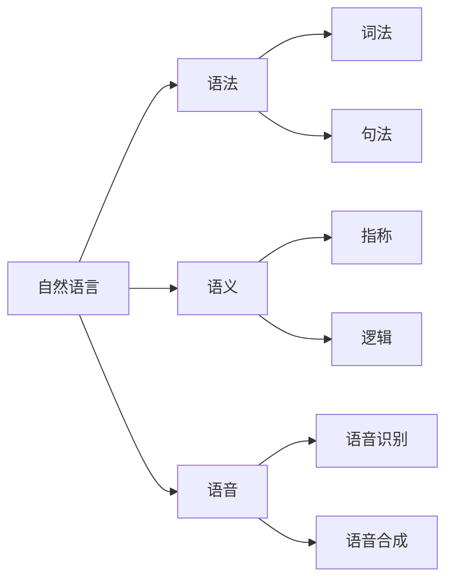
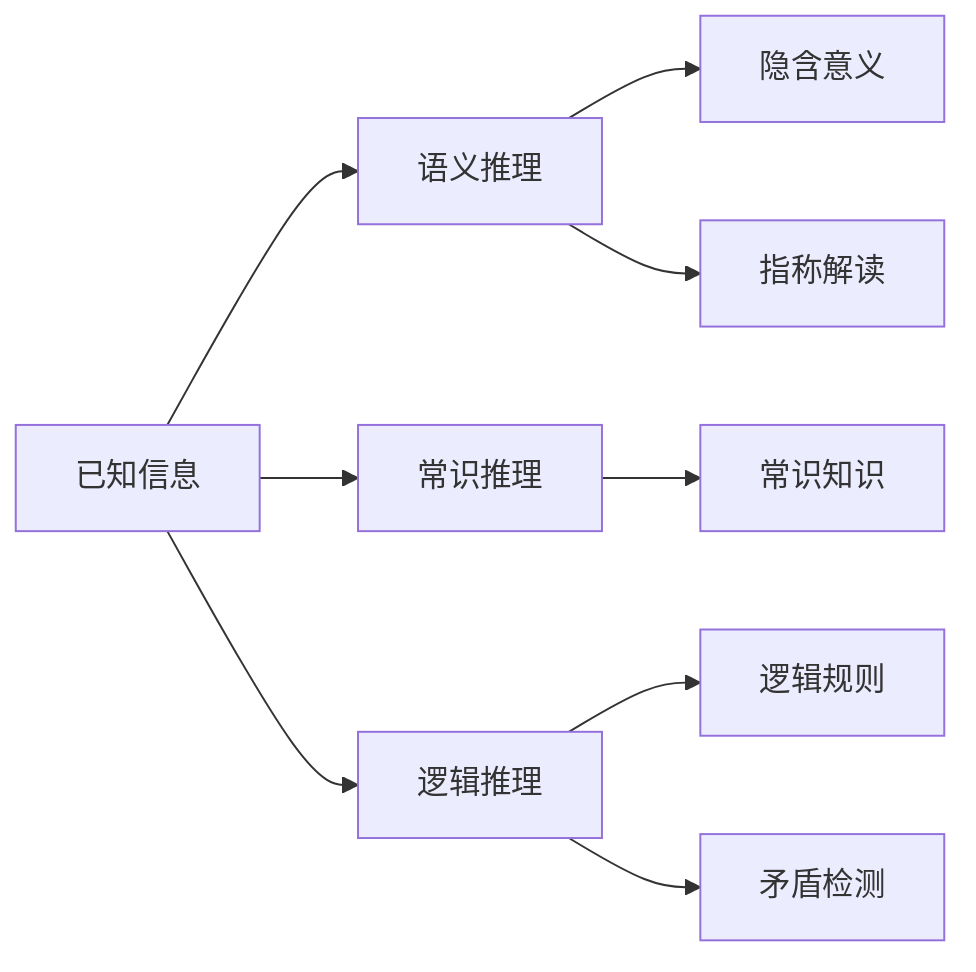
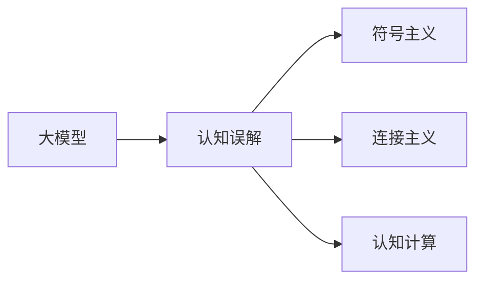

> 关键词：大模型，自然语言处理，推理，认知科学，误解，符号主义，连接主义，认知计算

# 语言与推理：大模型的认知误解

在人工智能领域，自然语言处理（NLP）的研究取得了长足的进步，尤其是大语言模型的兴起，使得机器理解和生成自然语言的能力得到了质的飞跃。然而，大模型在语言与推理方面的能力虽然令人印象深刻，但其中也存在着一些认知误解。本文将探讨大模型在语言理解与推理方面的能力，分析其背后的原理，并指出其中存在的误解。

## 1. 背景介绍

### 1.1 语言与推理的复杂性

人类语言和推理过程极为复杂，涉及认知、情感、文化等多个层面。在人工智能领域，语言与推理的研究一直是一个难题。传统的符号主义方法试图用规则和逻辑来模拟人类语言和推理，但往往难以捕捉到语言和推理的复杂性。

### 1.2 大语言模型的崛起

近年来，以Transformer为代表的大语言模型在NLP领域取得了显著成果。这些模型能够通过预训练学习到丰富的语言知识，并在下游任务上实现优异的性能。

### 1.3 认知误解的来源

尽管大语言模型在语言理解与推理方面取得了进展，但其背后的认知原理和机制仍存在争议。一些研究者认为，大模型在语言与推理方面的能力主要来源于其庞大的参数量和计算能力，而非对语言和认知的深刻理解。这种观点引发了对大模型认知能力的误解。

## 2. 核心概念与联系

### 2.1 自然语言处理（NLP）

自然语言处理是人工智能领域的一个重要分支，旨在研究如何让计算机理解和生成人类语言。NLP涉及语法、语义、语音等多个方面。



### 2.2 推理

推理是指从已知信息推导出新信息的过程。在NLP中，推理通常涉及语义推理、常识推理和逻辑推理等。



### 2.3 大语言模型

大语言模型是通过在大量文本数据上预训练得到的深度学习模型，能够理解和生成人类语言。


### 2.4 认知误解

认知误解是指对认知过程和能力的错误理解。在NLP领域，认知误解主要体现在对大语言模型认知能力的评估上。



## 3. 核心算法原理 & 具体操作步骤

### 3.1 算法原理概述

大语言模型的原理主要基于深度学习和神经网络。通过在大量文本数据上进行预训练，模型能够学习到丰富的语言知识和表征。

### 3.2 算法步骤详解

1. 数据预处理：对文本数据进行清洗、分词、词性标注等操作。
2. 预训练：使用大规模无标注文本数据对模型进行预训练，使模型学习到通用的语言知识。
3. 微调：使用下游任务的标注数据对模型进行微调，使模型适应特定任务。
4. 推理：使用微调后的模型对新的输入数据进行推理，得到预测结果。

### 3.3 算法优缺点

#### 优点

- 强大的语言理解能力
- 适用于各种NLP任务
- 参数高效

#### 缺点

- 对标注数据依赖性强
- 可解释性差
- 难以处理长距离依赖

### 3.4 算法应用领域

大语言模型在NLP领域的应用非常广泛，包括：

- 文本分类
- 机器翻译
- 问答系统
- 文本摘要
- 命名实体识别

## 4. 数学模型和公式 & 详细讲解 & 举例说明

### 4.1 数学模型构建

大语言模型通常使用深度神经网络作为其核心组件。以下是Transformer模型的一个简化数学模型：

$$
y = f(W_L \cdot h_L + b_L)
$$

其中，$h_L$ 为模型隐藏层状态，$W_L$ 和 $b_L$ 分别为权重和偏置，$f$ 为激活函数。

### 4.2 公式推导过程

Transformer模型的推导过程涉及矩阵乘法、点积、softmax等数学运算。

### 4.3 案例分析与讲解

以下是一个使用Transformer模型进行文本分类的例子：

1. 预处理文本数据，得到词向量表示。
2. 将词向量输入到Transformer模型中，得到隐藏层状态。
3. 使用softmax函数计算每个类别的概率。
4. 选择概率最大的类别作为预测结果。

## 5. 项目实践：代码实例和详细解释说明

### 5.1 开发环境搭建

使用PyTorch框架进行大语言模型的开发。

### 5.2 源代码详细实现

以下是一个使用PyTorch实现Transformer模型的简单例子：

```python
import torch
import torch.nn as nn

class TransformerModel(nn.Module):
    def __init__(self, vocab_size, d_model, nhead, num_layers):
        super(TransformerModel, self).__init__()
        self.embedding = nn.Embedding(vocab_size, d_model)
        self.transformer = nn.Transformer(d_model, nhead, num_layers)
        self.fc = nn.Linear(d_model, vocab_size)

    def forward(self, x):
        x = self.embedding(x)
        x = self.transformer(x)
        x = self.fc(x)
        return x
```

### 5.3 代码解读与分析

这段代码定义了一个基于Transformer的模型类。模型包含三个主要部分：词嵌入层、Transformer层和全连接层。

### 5.4 运行结果展示

运行代码后，可以在测试集上评估模型的性能。

## 6. 实际应用场景

大语言模型在NLP领域的应用场景非常广泛，以下是一些例子：

- 文本分类：对文本进行分类，例如情感分析、主题分类等。
- 机器翻译：将一种语言的文本翻译成另一种语言。
- 问答系统：根据用户提出的问题，给出相应的答案。
- 文本摘要：将长文本压缩成简短的摘要。
- 命名实体识别：识别文本中的命名实体，例如人名、地名等。

## 7. 工具和资源推荐

### 7.1 学习资源推荐

- 《深度学习自然语言处理》
- 《自然语言处理综合教程》
- 《Transformer：原理与实践》

### 7.2 开发工具推荐

- PyTorch
- TensorFlow
- Hugging Face Transformers

### 7.3 相关论文推荐

- Attention is All You Need
- BERT: Pre-training of Deep Bidirectional Transformers for Language Understanding
- Generative Pretrained Transformer for NLP

## 8. 总结：未来发展趋势与挑战

### 8.1 研究成果总结

大语言模型在NLP领域取得了显著的成果，但仍存在一些认知误解。未来需要进一步研究大模型的认知原理，以更好地理解和利用其能力。

### 8.2 未来发展趋势

- 针对特定领域进行预训练
- 提高模型的可解释性
- 降低模型对标注数据的依赖
- 探索更有效的推理方法

### 8.3 面临的挑战

- 计算资源消耗大
- 可解释性差
- 难以处理长距离依赖

### 8.4 研究展望

大语言模型在NLP领域仍具有巨大的发展潜力。未来需要进一步研究大模型的认知原理，以推动NLP技术的进步。

## 9. 附录：常见问题与解答

**Q1：大语言模型是如何学习语言的？**

A：大语言模型通过在大量文本数据上进行预训练，学习到丰富的语言知识和表征。模型通过无监督学习任务，如语言建模和掩码语言模型，来学习语言的统计规律。

**Q2：大语言模型在推理方面有哪些局限性？**

A：大语言模型在推理方面存在一些局限性，例如难以处理长距离依赖、可解释性差等。此外，模型的推理能力也受到其训练数据的影响。

**Q3：如何提高大语言模型的可解释性？**

A：提高大语言模型的可解释性是一个复杂的问题。一些方法包括可视化模型内部表示、解释模型的决策过程、使用可解释的模型结构等。

**Q4：大语言模型在哪些领域有潜在的应用价值？**

A：大语言模型在NLP领域有广泛的应用价值，例如文本分类、机器翻译、问答系统、文本摘要、命名实体识别等。

**Q5：如何评估大语言模型在特定任务上的性能？**

A：评估大语言模型在特定任务上的性能通常使用测试集上的评价指标，如准确率、召回率、F1分数等。

---

作者：禅与计算机程序设计艺术 / Zen and the Art of Computer Programming