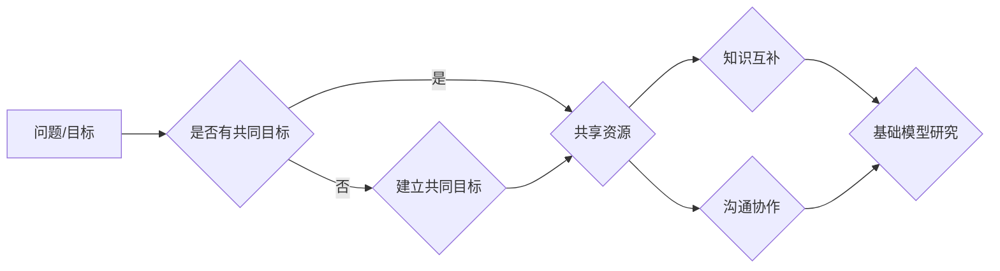

> - 跨学科合作
> - 基础模型
> - 人工智能
> - 计算机科学
> - 机器学习
> - 自然语言处理
> - 计算机视觉

# 跨学科合作与基础模型研究

在当今这个数据驱动的时代，人工智能（AI）技术正在以前所未有的速度发展。基础模型作为AI研究的关键基础设施，正变得越来越重要。然而，基础模型的研究和应用需要跨学科的合作，结合不同领域的知识和技能。本文将探讨跨学科合作在基础模型研究中的重要性，并分析其原理、操作步骤、实际应用和未来发展趋势。

## 1. 背景介绍

### 1.1 问题的由来

随着大数据和计算能力的提升，人工智能技术逐渐从实验室走向实际应用。基础模型作为AI技术发展的基石，其性能直接影响着AI系统的质量和效率。然而，基础模型的研究涉及到多个学科领域，如计算机科学、统计学、数学、物理学、神经科学等，单靠某一学科的知识和技能很难取得突破性进展。

### 1.2 研究现状

近年来，跨学科合作在基础模型研究中逐渐成为趋势。例如，谷歌的Transformer模型结合了计算机科学、统计学和数学的知识，在自然语言处理（NLP）领域取得了巨大成功。此外，计算机视觉、语音识别等领域的基础模型研究也越来越多地需要跨学科的合作。

### 1.3 研究意义

跨学科合作在基础模型研究中的意义主要体现在以下几个方面：

- **整合多学科知识**：跨学科合作可以整合不同领域的知识，推动基础模型的理论创新和技术突破。
- **提高研究效率**：不同学科的研究者可以共享资源、交流想法，提高研究效率。
- **促进创新应用**：跨学科合作可以推动基础模型在更多领域的应用，为社会发展创造更多价值。

### 1.4 本文结构

本文将按照以下结构展开：

- 第2部分，介绍基础模型和跨学科合作的相关概念。
- 第3部分，详细阐述跨学科合作在基础模型研究中的原理和操作步骤。
- 第4部分，分析跨学科合作的优势和挑战。
- 第5部分，探讨跨学科合作在基础模型研究中的应用案例。
- 第6部分，展望基础模型研究的未来发展趋势和挑战。
- 第7部分，推荐相关学习资源和开发工具。
- 第8部分，总结全文，并展望未来研究方向。

## 2. 核心概念与联系

### 2.1 基础模型

基础模型是一种用于学习通用特征表示的模型，可以应用于多个领域。常见的基础模型包括：

- 自然语言处理（NLP）领域的语言模型，如BERT、GPT、XLNet等。
- 计算机视觉领域的卷积神经网络（CNN）和自注意力模型。
- 语音识别领域的循环神经网络（RNN）和Transformer模型。

### 2.2 跨学科合作

跨学科合作是指不同学科领域的研究者共同合作，以解决某一问题或实现某一目标的过程。跨学科合作通常需要以下要素：

- **明确目标**：明确合作的目标和任务，确保各方合作方向一致。
- **资源共享**：共享研究资源，如数据、计算资源、实验设备等。
- **知识互补**：利用不同学科领域的知识，互补研究团队的能力。
- **沟通协作**：建立有效的沟通机制，确保团队成员之间的信息流通。

### 2.3 Mermaid 流程图

以下是一个简单的Mermaid流程图，展示了跨学科合作在基础模型研究中的应用：

## 3. 核心算法原理 & 具体操作步骤

### 3.1 算法原理概述

跨学科合作在基础模型研究中的核心原理是整合多学科知识和技能，通过以下步骤实现：

1. **问题定义**：明确研究问题，确定研究目标和范围。
2. **团队组建**：根据研究问题，组建由不同学科背景的研究者组成的团队。
3. **资源整合**：共享数据、计算资源、实验设备等。
4. **知识互补**：利用不同学科领域的知识，互补研究团队的能力。
5. **模型设计**：结合不同学科的理论和方法，设计基础模型架构。
6. **模型训练**：利用多学科知识和技能，训练和优化基础模型。
7. **模型评估**：评估基础模型的性能，并进行改进。

### 3.2 算法步骤详解

以下是一个基于跨学科合作的基