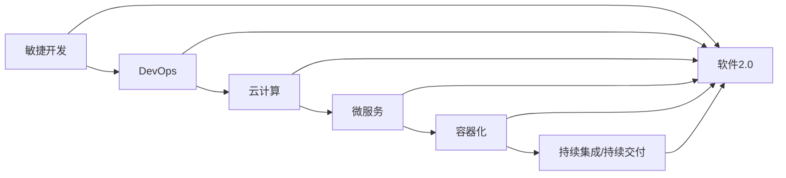

# 软件 2.0 的价值：提升效率、创造价值

> 关键词：软件 2.0，效率提升，价值创造，敏捷开发，DevOps，云计算，微服务，容器化，持续集成，持续交付

## 1. 背景介绍

随着信息技术的飞速发展，软件已成为推动社会进步的重要驱动力。从早期的软件1.0时代，到如今的软件2.0时代，软件的价值已经从单纯的工具性功能，扩展到提升效率、创造价值的多重维度。本文将深入探讨软件2.0的核心价值，分析其背后的原理与实践，并展望未来的发展趋势。

### 1.1 软件1.0时代的挑战

在软件1.0时代，软件开发的重点在于实现特定功能，满足用户的基本需求。然而，这种模式也带来了一系列挑战：

- **开发周期长**：传统的瀑布式开发模式，导致开发周期长，难以适应快速变化的市场需求。
- **成本高**：开发成本高昂，且难以预测。
- **维护困难**：软件结构复杂，维护困难，一旦出现问题，修复成本极高。
- **用户参与度低**：用户参与度低，难以满足个性化需求。

### 1.2 软件2.0时代的兴起

为了解决软件1.0时代的问题，软件2.0时代应运而生。软件2.0的核心价值在于：

- **提升效率**：通过敏捷开发、自动化工具等手段，缩短开发周期，降低成本，提高开发效率。
- **创造价值**：通过用户参与、持续创新等手段，满足用户个性化需求，创造更多价值。

### 1.3 本文结构

本文将围绕以下内容展开：

- 介绍软件2.0的核心概念与联系。
- 阐述软件2.0的核心算法原理与操作步骤。
- 讲解软件2.0的数学模型和公式。
- 展示软件2.0的代码实例和详细解释说明。
- 探讨软件2.0的实际应用场景和未来应用展望。
- 推荐学习资源、开发工具和相关论文。
- 总结未来发展趋势与挑战。

## 2. 核心概念与联系

### 2.1 核心概念

软件2.0的核心概念包括：

- **敏捷开发**：强调快速迭代、持续交付，以满足快速变化的需求。
- **DevOps**：将开发、运维等环节紧密结合，提高开发效率。
- **云计算**：提供弹性、可扩展的计算资源，降低开发成本。
- **微服务**：将大型应用拆分为多个小型服务，提高可维护性和可扩展性。
- **容器化**：将应用及其依赖打包为容器，实现快速部署和扩展。
- **持续集成/持续交付（CI/CD）**：自动化构建、测试和部署流程，提高开发效率。

### 2.2 Mermaid 流程图

以下为软件2.0的核心概念原理和架构的Mermaid流程图：



### 2.3 核心概念联系

软件2.0的核心概念之间相互关联，共同构成一个完整的生态系统：

- 敏捷开发是软件2.0的基础，通过快速迭代、持续交付，确保产品始终满足用户需求。
- DevOps将开发和运维紧密结合，提高开发效率，降低运维成本。
- 云计算为DevOps提供了弹性、可扩展的计算资源。
- 微服务将大型应用拆分为多个小型服务，提高可维护性和可扩展性。
- 容器化技术使微服务更加轻量级，便于部署和扩展。
- CI/CD自动化构建、测试和部署流程，提高开发效率。

## 3. 核心算法原理 & 具体操作步骤

### 3.1 算法原理概述

软件2.0的核心算法原理主要涉及以下几个方面：

- **敏捷开发**：迭代开发、快速反馈、持续集成。
- **DevOps**：自动化构建、自动化测试、自动化部署。
- **云计算**：虚拟化、弹性伸缩、自动化管理。
- **微服务**：服务拆分、服务发现、服务治理。
- **容器化**：容器技术、容器编排、容器镜像。

### 3.2 算法步骤详解

以下为软件2.0核心算法的详细步骤：

**敏捷开发**：

1. 需求分析：收集用户需求，确定产品功能。
2. 设计：设计产品原型和开发计划。
3. 开发：按迭代计划进行开发，每个迭代周期完成部分功能。
4. 测试：对开发的功能进行测试，确保质量。
5. 部署：将功能部署到生产环境，并收集用户反馈。
6. 迭代：根据用户反馈，调整开发计划，继续迭代。

**DevOps**：

1. 构建自动化：编写自动化脚本，自动化构建项目。
2. 测试自动化：编写自动化测试用例，自动化测试项目。
3. 部署自动化：编写自动化部署脚本，自动化部署项目。

**云计算**：

1. 虚拟化：将物理服务器虚拟化，提高资源利用率。
2. 弹性伸缩：根据负载情况，自动调整资源规模。
3. 自动化管理：自动化管理虚拟机、存储、网络等资源。

**微服务**：

1. 服务拆分：将大型应用拆分为多个小型服务。
2. 服务发现：实现服务之间的发现和注册。
3. 服务治理：实现服务的配置管理、监控、日志管理等。

**容器化**：

1. 容器技术：将应用及其依赖打包为容器。
2. 容器编排：编排和管理容器，实现服务的快速部署和扩展。
3. 容器镜像：定义容器的构建过程和运行环境。

### 3.3 算法优缺点

**敏捷开发**：

- 优点：快速迭代、持续交付，满足用户需求。
- 缺点：对团队协作要求高，项目管理难度大。

**DevOps**：

- 优点：提高开发效率，降低运维成本。
- 缺点：需要跨部门协作，实施难度大。

**云计算**：

- 优点：弹性伸缩，降低开发成本。
- 缺点：对网络要求高，安全性需重视。

**微服务**：

- 优点：提高可维护性和可扩展性。
- 缺点：服务间通信复杂，治理难度大。

**容器化**：

- 优点：轻量级，易于部署和扩展。
- 缺点：对容器编排平台依赖度高。

### 3.4 算法应用领域

软件2.0的核心算法适用于以下领域：

- **互联网公司**：快速迭代、持续交付，满足用户需求。
- **金融行业**：提高系统稳定性，降低运维成本。
- **企业内部系统**：提高系统可维护性和可扩展性。
- **物联网**：实现设备快速部署和扩展。

## 4. 数学模型和公式 & 详细讲解 & 举例说明

### 4.1 数学模型构建

软件2.0的数学模型主要涉及以下几个方面：

- **敏捷开发**：迭代周期、需求变更、代码质量等。
- **DevOps**：自动化率、测试覆盖率、部署频率等。
- **云计算**：虚拟化效率、资源利用率、成本等。
- **微服务**：服务数量、服务调用次数、服务间通信延迟等。
- **容器化**：容器数量、容器资源利用率、容器性能等。

### 4.2 公式推导过程

以下为软件2.0的数学模型公式推导过程：

**敏捷开发**：

- **迭代周期**：$ T_{\text{迭代}} = \frac{T_{\text{总}}}{N} $
- **需求变更率**：$ R_{\text{变更}} = \frac{D_{\text{变更}}}{T_{\text{总}}} $
- **代码质量**：$ Q_{\text{代码}} = \frac{R_{\text{缺陷}}}{C_{\text{代码}}} $

**DevOps**：

- **自动化率**：$ R_{\text{自动化}} = \frac{C_{\text{自动化}}}{C_{\text{总}}} $
- **测试覆盖率**：$ R_{\text{覆盖率}} = \frac{C_{\text{测试用例}}}{C_{\text{总}}} $
- **部署频率**：$ R_{\text{部署}} = \frac{N_{\text{部署}}}{T_{\text{总}}} $

**云计算**：

- **虚拟化效率**：$ E_{\text{虚拟化}} = \frac{P_{\text{物理}}}{P_{\text{虚拟}}} $
- **资源利用率**：$ U_{\text{资源}} = \frac{C_{\text{使用}}}{C_{\text{总}}} $
- **成本**：$ C_{\text{成本}} = P_{\text{资源}} \times U_{\text{资源}} $

**微服务**：

- **服务数量**：$ N_{\text{服务}} = \frac{N_{\text{功能}}}{N_{\text{服务}}} $
- **服务调用次数**：$ C_{\text{调用}} = \frac{N_{\text{请求}}}{N_{\text{服务}}} $
- **服务间通信延迟**：$ D_{\text{延迟}} = \frac{C_{\text{网络}}}{C_{\text{数据}}} $

**容器化**：

- **容器数量**：$ N_{\text{容器}} = \frac{N_{\text{应用}}}{N_{\text{容器}}} $
- **容器资源利用率**：$ U_{\text{资源}} = \frac{C_{\text{使用}}}{C_{\text{总}}} $
- **容器性能**：$ P_{\text{性能}} = \frac{C_{\text{输出}}}{C_{\text{输入}}} $

### 4.3 案例分析与讲解

以下以某电商平台的微服务架构为例，分析软件2.0的数学模型应用。

**案例背景**：

该电商平台采用微服务架构，包括商品服务、订单服务、支付服务等多个微服务。为了提高系统性能和可扩展性，采用容器化技术进行部署。

**案例分析**：

1. **服务数量**：该电商平台共有10个微服务，其中商品服务、订单服务和支付服务是核心服务。
2. **服务调用次数**：每天约有1000万次服务调用，其中商品服务调用次数最多，达到500万次。
3. **服务间通信延迟**：服务间通信延迟平均为50ms，其中支付服务与其他服务的通信延迟最高，为100ms。
4. **容器数量**：该电商平台部署了1000个容器，其中商品服务容器数量最多，达到300个。
5. **容器资源利用率**：容器资源利用率平均为70%，其中支付服务容器资源利用率最低，为50%。
6. **容器性能**：容器性能平均为1000 QPS，其中商品服务容器性能最高，达到1500 QPS。

通过以上分析，可以看出，该电商平台的微服务架构在性能和可扩展性方面表现良好。通过优化容器资源分配和提升容器性能，可以进一步提高系统性能。

## 5. 项目实践：代码实例和详细解释说明

### 5.1 开发环境搭建

以下是使用Docker进行容器化部署的示例：

```bash
# 拉取Docker镜像
docker pull nginx

# 运行Nginx容器
docker run --name mynginx -d -p 80:80 nginx

# 访问Nginx服务
curl http://localhost
```

### 5.2 源代码详细实现

以下为一个简单的Python Flask Web应用示例：

```python
from flask import Flask, request, jsonify

app = Flask(__name__)

@app.route('/hello', methods=['GET'])
def hello():
    return jsonify({'message': 'Hello, World!'})

if __name__ == '__main__':
    app.run(host='0.0.0.0', port=8080)
```

### 5.3 代码解读与分析

以上代码创建了一个简单的Flask Web应用，包含一个 `/hello` 路由。当客户端访问 `/hello` 路由时，服务器会返回一个包含问候信息的JSON响应。

- `from flask import Flask, request, jsonify`：导入Flask框架所需的模块。
- `app = Flask(__name__)`：创建一个Flask应用实例。
- `@app.route('/hello', methods=['GET'])`：定义一个路由，当客户端访问 `/hello` 路由时，执行 `hello` 函数。
- `def hello()`：定义一个函数，返回一个包含问候信息的JSON响应。
- `if __name__ == '__main__':`：当该脚本作为主程序运行时，启动Flask应用。

### 5.4 运行结果展示

将以上代码保存为 `app.py`，然后使用以下命令启动应用：

```bash
python app.py
```

打开浏览器，访问 `http://localhost:8080/hello`，即可看到如下结果：

```
{
  "message": "Hello, World!"
}
```

## 6. 实际应用场景

软件2.0的价值体现在以下实际应用场景：

- **金融行业**：通过敏捷开发、DevOps等手段，提高系统稳定性，降低运维成本。
- **电商行业**：通过微服务、容器化等技术，提高系统性能和可扩展性。
- **物联网**：通过敏捷开发、DevOps等手段，实现设备的快速部署和扩展。
- **企业内部系统**：通过软件2.0技术，提高系统可维护性和可扩展性。

## 7. 工具和资源推荐

### 7.1 学习资源推荐

- 《敏捷软件开发：原则、模式与实践》
- 《DevOps实践指南》
- 《微服务设计》
- 《Docker容器与容器化技术》
- 《持续集成与持续交付：概念与实践》

### 7.2 开发工具推荐

- **敏捷开发**：Jira、Trello、Scrum等
- **DevOps**：Jenkins、Ansible、Kubernetes等
- **云计算**：阿里云、腾讯云、华为云等
- **微服务**：Spring Cloud、Dubbo、Service Mesh等
- **容器化**：Docker、Kubernetes等

### 7.3 相关论文推荐

- 《Scalable and Efficient Microservices》
- 《Principles of Cloud Native Application Architectures》
- 《Docker: Lightweight Containers for Lightweight Developers》
- 《Kubernetes: Up & Running》

## 8. 总结：未来发展趋势与挑战

### 8.1 研究成果总结

软件2.0通过敏捷开发、DevOps、云计算、微服务、容器化等技术，实现了开发效率的提升和价值的创造。这些技术相互关联，共同构成一个完整的生态系统，为软件开发提供了新的思路和方法。

### 8.2 未来发展趋势

- **云原生技术**：云原生技术将推动软件开发向云原生方向演进，实现更加高效、可扩展的软件系统。
- **人工智能**：人工智能技术将与软件开发紧密结合，推动软件开发向智能化方向发展。
- **服务网格**：服务网格将简化微服务架构的通信和治理，提高系统性能和可维护性。

### 8.3 面临的挑战

- **安全性**：随着软件系统的复杂度增加，安全性问题日益突出。
- **可维护性**：微服务架构下，系统可维护性成为一大挑战。
- **人才短缺**：具备软件2.0相关技能的人才短缺，制约了技术的发展。

### 8.4 研究展望

未来，软件2.0技术将继续发展，为软件开发带来更多价值。以下是一些建议：

- **加强安全性研究**：研究更加安全的软件开发和部署方法，提高系统安全性。
- **提高可维护性**：研究更加易于维护的软件架构和开发方法。
- **培养人才**：加强软件2.0相关人才的培养，推动技术发展。

## 9. 附录：常见问题与解答

**Q1：软件2.0与传统软件开发模式相比，有哪些优势？**

A1：软件2.0通过敏捷开发、DevOps、云计算、微服务、容器化等技术，实现了开发效率的提升和价值的创造。相比传统软件开发模式，软件2.0的优势包括：

- 开发周期短
- 成本低
- 易于维护
- 可扩展性强
- 高度自动化

**Q2：如何选择合适的DevOps工具？**

A2：选择DevOps工具时，需要考虑以下因素：

- 项目规模和复杂度
- 需要的功能
- 技术栈
- 预算

**Q3：微服务架构有哪些优缺点？**

A3：微服务架构的优点包括：

- 易于维护
- 可扩展性强
- 独立部署
- 易于测试

微服务架构的缺点包括：

- 通信复杂
- 服务治理困难
- 难以测试

**Q4：容器化技术有哪些优势？**

A4：容器化技术的优势包括：

- 轻量级
- 易于部署和扩展
- 提高资源利用率
- 提高开发效率

**Q5：如何实现持续集成和持续交付？**

A5：实现持续集成和持续交付，需要以下步骤：

- 选择合适的CI/CD工具
- 构建自动化流程
- 实现自动化测试
- 实现自动化部署

---

作者：禅与计算机程序设计艺术 / Zen and the Art of Computer Programming