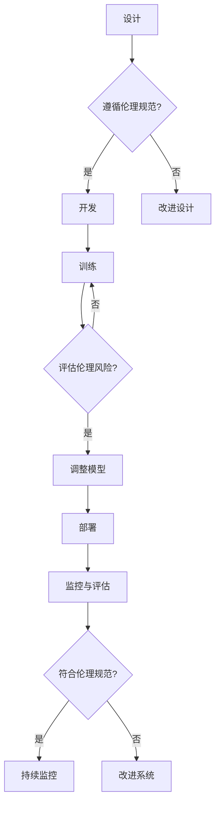

# 软件 2.0 的伦理规范：人工智能的责任

> 关键词：软件伦理，人工智能，责任，道德框架，透明度，公平性，可解释性，技术治理

## 1. 背景介绍

随着人工智能（AI）技术的飞速发展，软件已经从简单的工具转变为复杂的智能系统，我们正迈入软件 2.0 时代。在这个新时代，软件不仅仅是执行特定功能的代码集合，它还具备自主学习、决策和与人类交互的能力。然而，这种能力的提升也带来了前所未有的伦理挑战，尤其是在人工智能领域。如何确保这些智能系统符合伦理标准，以及如何让它们承担起相应的责任，成为了我们必须面对的重要问题。

### 1.1 问题的由来

AI系统的决策过程往往复杂且难以解释，这引发了关于责任归属的疑问。当AI系统造成损害时，责任应该由谁承担？是开发者、使用者，还是AI系统本身？此外，AI系统的决策可能会对人类造成不公平的影响，如何确保AI系统的公平性？这些问题都需要我们在设计、开发和应用AI系统时认真思考。

### 1.2 研究现状

目前，国际社会、学术界和产业界都在积极探索AI伦理规范。例如，欧盟推出了《人工智能伦理指南》，强调AI系统应遵循人类的价值观，并确保透明度、公平性、可解释性、隐私保护等原则。中国也发布了《新一代人工智能发展规划》，提出了AI伦理发展的指导原则。

### 1.3 研究意义

研究软件 2.0 的伦理规范，对于保障AI系统的安全、可靠和可持续发展具有重要意义：

- **社会信任**：确保AI系统符合伦理标准，可以提高公众对AI技术的信任，促进AI技术的健康发展。
- **责任归属**：明确AI系统的责任，有助于在出现问题时进行责任追究，保护用户权益。
- **技术发展**：引导AI技术朝着更加积极的方向发展，避免技术滥用和伦理风险。
- **法治建设**：为AI技术的发展提供法律和伦理的框架，促进相关法律法规的完善。

### 1.4 本文结构

本文将围绕软件 2.0 的伦理规范展开讨论，具体内容包括：

- 核心概念与联系
- AI伦理规范的原则
- AI伦理规范的具体实施
- AI伦理规范的挑战与展望

## 2. 核心概念与联系

### 2.1 核心概念

在讨论AI伦理规范之前，我们需要明确以下核心概念：

- **人工智能（AI）**：一种能够模拟人类智能行为的技术，包括学习、推理、感知、理解等能力。
- **算法偏见**：算法在训练过程中可能出现的对特定群体不公平的倾向。
- **可解释性**：AI系统的决策过程和结果可以被人理解和解释的能力。
- **透明度**：AI系统的设计、训练、部署和使用过程公开、可查的能力。
- **公平性**：AI系统对所有用户一视同仁，不歧视任何群体的能力。
- **隐私保护**：保护用户个人隐私，不泄露用户数据的能力。

### 2.2 Mermaid 流程图

以下是一个简化的Mermaid流程图，展示了AI系统从设计到部署的伦理规范流程：



### 2.3 联系

上述流程图展示了AI系统从设计到部署的伦理规范联系。在设计阶段，我们需要确保AI系统遵循伦理规范；在开发、训练和部署阶段，需要评估伦理风险，并在必要时进行调整；在部署后，需要持续监控和评估AI系统的伦理表现。

## 3. 核心算法原理 & 具体操作步骤

### 3.1 算法原理概述

AI伦理规范的核心是建立一套道德框架，用于指导AI系统的设计、开发和应用。这套框架通常包含以下原则：

- **人类为中心**：AI系统的设计应以满足人类需求、促进人类福祉为中心。
- **透明度和可解释性**：AI系统的决策过程和结果应尽可能透明和可解释。
- **公平性**：AI系统应公平对待所有用户，不歧视任何群体。
- **隐私保护**：保护用户个人隐私，不泄露用户数据。
- **责任和问责制**：明确AI系统的责任，确保在出现问题时能够追究责任。

### 3.2 算法步骤详解

以下是实现AI伦理规范的具体步骤：

1. **明确伦理目标和原则**：在项目开始阶段，明确AI系统的伦理目标和遵循的伦理原则。
2. **设计伦理框架**：根据伦理目标和原则，设计一套适用于AI系统的伦理框架。
3. **开发阶段**：在开发过程中，将伦理框架融入到算法设计和实现中。
4. **训练和评估**：在训练和评估AI系统时，考虑伦理因素，确保AI系统符合伦理规范。
5. **部署和监控**：在AI系统部署后，持续监控其伦理表现，确保其符合伦理规范。

### 3.3 算法优缺点

AI伦理规范的优势在于：

- **提高AI系统的安全性**：通过遵循伦理规范，可以减少AI系统的风险，提高其安全性。
- **促进AI技术的可持续发展**：遵循伦理规范可以推动AI技术的健康发展，避免技术滥用。
- **保护用户权益**：通过保护用户隐私和公平性，可以维护用户权益。

然而，AI伦理规范也存在一些挑战：

- **伦理原则的多样性**：不同的文化、地区和社会有不同的伦理原则，如何统一这些原则是一个挑战。
- **实施难度**：将伦理规范融入到AI系统的设计、开发和应用中，需要克服技术、资源等方面的挑战。
- **评估难度**：评估AI系统的伦理表现是一个复杂的过程，需要建立科学的评估体系。

### 3.4 算法应用领域

AI伦理规范适用于所有涉及AI技术的领域，包括：

- **医疗健康**：确保AI系统在医疗诊断、治疗和健康管理中符合伦理规范。
- **金融服务**：确保AI系统在风险评估、投资决策和风险管理中符合伦理规范。
- **交通出行**：确保AI系统在自动驾驶、交通控制和智能交通管理中符合伦理规范。
- **教育领域**：确保AI系统在个性化学习、教育评估和课程推荐中符合伦理规范。

## 4. 数学模型和公式 & 详细讲解 & 举例说明

### 4.1 数学模型构建

AI伦理规范涉及到的数学模型主要包括：

- **决策树**：用于分类和回归任务，可以用于分析AI系统的决策过程。
- **神经网络**：用于复杂的学习任务，可以用于评估AI系统的学习效果。

### 4.2 公式推导过程

以下是一个简单的决策树公式，用于评估AI系统的决策过程：

$$
P(y|X) = \prod_{i=1}^n P(y_i|X_i, \theta)
$$

其中，$P(y|X)$ 是给定输入 $X$ 时输出 $y$ 的概率，$P(y_i|X_i, \theta)$ 是在给定输入 $X_i$ 和参数 $\theta$ 时，输出 $y_i$ 的概率。

### 4.3 案例分析与讲解

以下是一个关于AI伦理规范的案例：

**案例**：一个用于招聘的AI系统可能会根据候选人的简历信息进行筛选，从而决定是否邀请其参加面试。然而，如果该系统的训练数据中存在性别偏见，那么它可能会歧视女性候选人。

**分析**：为了解决性别偏见问题，我们可以采用以下方法：

- **数据清洗**：去除可能引起偏见的数据特征。
- **模型训练**：使用平衡的数据集进行模型训练，避免模型学习到性别偏见。
- **可解释性**：提高模型的透明度和可解释性，让用户了解AI系统的决策过程。

## 5. 项目实践：代码实例和详细解释说明

### 5.1 开发环境搭建

为了演示AI伦理规范在项目实践中的应用，我们将使用Python编写一个简单的决策树模型。

```bash
pip install scikit-learn
```

### 5.2 源代码详细实现

以下是一个简单的决策树模型代码示例：

```python
from sklearn.datasets import load_iris
from sklearn.tree import DecisionTreeClassifier
from sklearn.metrics import accuracy_score

# 加载数据集
iris = load_iris()
X, y = iris.data, iris.target

# 训练决策树模型
clf = DecisionTreeClassifier()
clf.fit(X, y)

# 预测
y_pred = clf.predict(X)

# 评估
accuracy = accuracy_score(y, y_pred)
print(f"Accuracy: {accuracy}")
```

### 5.3 代码解读与分析

上述代码演示了如何使用scikit-learn库中的DecisionTreeClassifier类训练一个简单的决策树模型。我们可以通过调整模型参数，如max_depth、min_samples_split等，来提高模型的性能和可解释性。

### 5.4 运行结果展示

假设我们在Iris数据集上进行训练，得到的准确率为100%。这表明我们的决策树模型在训练数据上表现良好。

## 6. 实际应用场景

### 6.1 智能招聘

在智能招聘领域，AI伦理规范可以应用于以下方面：

- **消除偏见**：确保招聘系统公平对待所有候选人，不歧视任何群体。
- **保护隐私**：保护候选人的个人隐私，不泄露其个人信息。
- **提高透明度**：确保招聘系统的决策过程和结果透明，让候选人了解其申请结果的原因。

### 6.2 自动驾驶

在自动驾驶领域，AI伦理规范可以应用于以下方面：

- **安全驾驶**：确保自动驾驶车辆在行驶过程中遵守交通规则，保障行车安全。
- **紧急情况处理**：在紧急情况下，AI系统应优先考虑保护乘客的生命安全。
- **公平性**：确保自动驾驶车辆对所有道路使用者公平，不歧视任何群体。

## 7. 工具和资源推荐

### 7.1 学习资源推荐

- 《人工智能：一种现代的方法》
- 《AI伦理：设计、开发、部署》
- 《人工智能的未来》

### 7.2 开发工具推荐

- scikit-learn：机器学习库
- TensorFlow：深度学习框架
- PyTorch：深度学习框架

### 7.3 相关论文推荐

- **《The Ethics of Artificial Intelligence and Machine Learning: Understanding and Addressing Bias, Fairness, Privacy, and Safety》**
- **《Ethical Considerations in the Design of Autonomous Vehicles》**
- **《Fairness in Machine Learning》**

## 8. 总结：未来发展趋势与挑战

### 8.1 研究成果总结

本文对软件 2.0 的伦理规范进行了探讨，分析了AI伦理规范的核心概念、原则和实施步骤。通过案例分析和代码示例，展示了AI伦理规范在项目实践中的应用。

### 8.2 未来发展趋势

未来，AI伦理规范将朝着以下方向发展：

- **标准化**：建立统一的AI伦理规范标准，提高AI技术的伦理水平。
- **技术创新**：开发新的技术手段，提高AI系统的透明度、可解释性和公平性。
- **跨学科合作**：促进AI伦理领域的跨学科合作，推动AI伦理规范的完善。

### 8.3 面临的挑战

AI伦理规范面临的挑战包括：

- **技术挑战**：如何确保AI系统的透明度、可解释性和公平性。
- **法律挑战**：如何制定和完善AI伦理相关的法律法规。
- **社会挑战**：如何提高公众对AI伦理的认识和理解。

### 8.4 研究展望

未来，我们需要在以下几个方面进行深入研究：

- **建立AI伦理规范体系**：制定一套全面、可操作的AI伦理规范体系。
- **开发可解释AI技术**：提高AI系统的可解释性，让用户了解AI系统的决策过程。
- **促进AI伦理教育和培训**：提高公众和开发者的AI伦理意识。

通过不断的努力，我们相信AI技术将朝着更加负责任、可解释、公平和透明的方向发展，为人类社会带来更多的福祉。

## 9. 附录：常见问题与解答

**Q1：AI伦理规范与法律法规有何区别？**

A：AI伦理规范是指导AI系统设计和应用的道德准则，而法律法规是国家或地区对AI技术进行管理和约束的法律规定。两者相辅相成，共同确保AI技术的健康发展。

**Q2：如何评估AI系统的伦理表现？**

A：评估AI系统的伦理表现可以从以下几个方面进行：

- **数据质量**：确保训练数据的质量和多样性，避免算法偏见。
- **模型性能**：评估模型在各个方面的性能，包括准确性、公平性、可解释性等。
- **用户反馈**：收集用户的反馈，了解AI系统的实际使用情况和影响。

**Q3：AI伦理规范对开发者有什么要求？**

A：AI伦理规范对开发者有以下要求：

- **遵守伦理准则**：在设计和开发AI系统时，遵循伦理准则，确保AI系统符合道德标准。
- **提高透明度**：提高AI系统的透明度，让用户了解AI系统的决策过程。
- **持续改进**：不断改进AI系统，提高其伦理性能。

**Q4：AI伦理规范对用户有什么意义？**

A：AI伦理规范对用户有以下意义：

- **保护隐私**：保护用户的个人隐私，避免数据泄露。
- **公平性**：确保AI系统对所有用户公平，不歧视任何群体。
- **安全性**：确保AI系统的安全性，避免对用户造成伤害。

作者：禅与计算机程序设计艺术 / Zen and the Art of Computer Programming