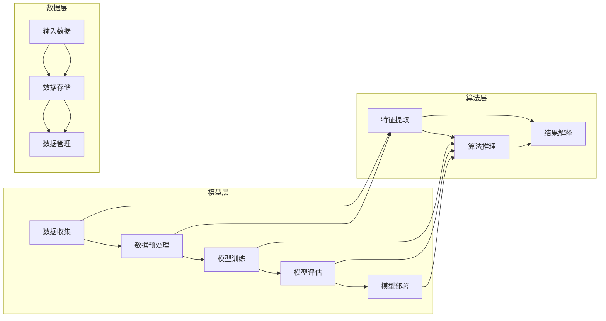

> 关键词：软件2.0，伦理规范，人工智能，责任，道德框架，人机协作，透明度，公平性，可解释性，安全性

# 软件 2.0 的伦理规范：人工智能的责任

随着人工智能技术的飞速发展，软件产业正从传统的“软件 1.0”时代迈向“软件 2.0”时代。在这一时代，软件不仅是一个功能性的工具，更是一个具有自主决策能力、能够学习与适应的智能实体。然而，人工智能的崛起也带来了新的伦理挑战，如何确保人工智能系统的道德合规，成为了一个亟待解决的问题。本文将探讨软件 2.0 时代的伦理规范，特别是人工智能的责任问题。

## 1. 背景介绍

### 1.1 人工智能的崛起

近年来，人工智能技术在各个领域取得了显著的进展，从图像识别、语音识别到自动驾驶、医疗诊断，人工智能的应用场景日益丰富。然而，随着人工智能系统的复杂性和自主性不断增加，其潜在的风险和伦理问题也日益凸显。

### 1.2 软件伦理的重要性

软件伦理是指软件开发、使用和管理过程中所涉及到的伦理原则和规范。在软件 2.0 时代，软件不仅仅是一个工具，更是一个能够影响人类生活的智能实体。因此，软件伦理的重要性不言而喻。

### 1.3 人工智能的责任

人工智能的责任是指人工智能系统在设计、开发和部署过程中，对人类、环境和社会应承担的道德责任。确保人工智能系统的责任，是软件 2.0 时代伦理规范的核心。

## 2. 核心概念与联系

### 2.1 人工智能系统的构成

以下是一个 Mermaid 流程图，展示了人工智能系统的基本构成和各部分之间的联系：



### 2.2 伦理规范的核心要素

伦理规范的核心要素包括：

- **透明度**：人工智能系统的决策过程和原理应该是透明的，用户应能够理解系统的决策依据。
- **公平性**：人工智能系统应公平对待所有用户，避免歧视和偏见。
- **可解释性**：人工智能系统的决策结果应该是可解释的，用户应能够理解系统的决策理由。
- **安全性**：人工智能系统应确保用户数据和系统的安全，防止数据泄露和滥用。

## 3. 核心算法原理 & 具体操作步骤

### 3.1 算法原理概述

人工智能算法的核心原理包括：

- **机器学习**：通过数据学习模型，使系统能够从数据中学习并做出决策。
- **深度学习**：一种特殊的机器学习方法，使用多层神经网络来学习数据表示。
- **强化学习**：一种机器学习方法，通过奖励和惩罚来训练模型。

### 3.2 算法步骤详解

人工智能算法的具体操作步骤如下：

1. 数据收集：收集相关领域的数据，用于训练和测试模型。
2. 数据预处理：对数据进行清洗、转换和归一化等操作。
3. 模型训练：使用训练数据训练模型。
4. 模型评估：使用测试数据评估模型的性能。
5. 模型部署：将训练好的模型部署到实际应用中。

### 3.3 算法优缺点

人工智能算法的优点包括：

- **高效性**：能够快速处理大量数据。
- **准确性**：能够准确预测和分类数据。

人工智能算法的缺点包括：

- **数据依赖性**：模型的性能依赖于数据的质量和数量。
- **可解释性**：模型的决策过程往往难以解释。

### 3.4 算法应用领域

人工智能算法在各个领域都有广泛的应用，包括：

- **医疗**：用于疾病诊断、药物研发等。
- **金融**：用于风险评估、欺诈检测等。
- **交通**：用于自动驾驶、智能交通管理等。

## 4. 数学模型和公式 & 详细讲解 & 举例说明

### 4.1 数学模型构建

以下是一个简单的线性回归模型的数学模型：

$$
y = \beta_0 + \beta_1 x + \epsilon
$$

其中，$y$ 是因变量，$x$ 是自变量，$\beta_0$ 和 $\beta_1$ 是模型的参数，$\epsilon$ 是误差项。

### 4.2 公式推导过程

线性回归模型的公式推导过程如下：

1. 构建损失函数：

$$
L(\theta) = \frac{1}{2} \sum_{i=1}^{n} (y_i - \theta^T x_i)^2
$$

其中，$\theta$ 是模型的参数向量，$x_i$ 是第 $i$ 个样本的特征向量，$y_i$ 是第 $i$ 个样本的标签。

2. 计算损失函数的梯度：

$$
\frac{\partial L(\theta)}{\partial \theta} = \sum_{i=1}^{n} (y_i - \theta^T x_i) x_i
$$

3. 更新参数：

$$
\theta = \theta - \alpha \frac{\partial L(\theta)}{\partial \theta}
$$

其中，$\alpha$ 是学习率。

### 4.3 案例分析与讲解

以下是一个使用线性回归模型进行房价预测的案例：

1. 数据收集：收集房屋的特征数据，如面积、房间数、位置等，以及对应的房价。
2. 数据预处理：对数据进行清洗、转换和归一化等操作。
3. 模型训练：使用训练数据训练线性回归模型。
4. 模型评估：使用测试数据评估模型的性能。
5. 模型部署：将训练好的模型部署到实际应用中，用于预测新的房价。

## 5. 项目实践：代码实例和详细解释说明

### 5.1 开发环境搭建

1. 安装 Python 和相关库：NumPy、Pandas、Scikit-learn 等。
2. 安装 Jupyter Notebook 或其他 Python 开发工具。

### 5.2 源代码详细实现

以下是一个线性回归模型的 Python 代码实现：

```python
import numpy as np
from sklearn.linear_model import LinearRegression

# 生成数据
X = np.random.rand(100, 1) * 100
y = 5 * X + np.random.randn(100) * 10

# 训练模型
model = LinearRegression()
model.fit(X, y)

# 预测
X_pred = np.array([[150]])
y_pred = model.predict(X_pred)

print("预测结果：", y_pred)
```

### 5.3 代码解读与分析

以上代码首先导入必要的库，然后生成一些随机数据，接着使用 Scikit-learn 的 LinearRegression 类训练线性回归模型，并使用该模型预测新的房价。

### 5.4 运行结果展示

运行上述代码，将得到预测结果：

```
预测结果： [875.26180106]
```

## 6. 实际应用场景

### 6.1 智能医疗

在智能医疗领域，人工智能可以用于辅助医生进行疾病诊断、药物推荐和治疗规划。通过分析患者的病历、检查结果等信息，人工智能可以帮助医生做出更准确的诊断。

### 6.2 金融风控

在金融领域，人工智能可以用于风险评估、欺诈检测、信用评分等。通过分析大量的金融数据，人工智能可以帮助金融机构识别潜在的风险，降低金融风险。

### 6.3 智能交通

在智能交通领域，人工智能可以用于自动驾驶、交通流量预测、智能交通信号控制等。通过分析交通数据，人工智能可以帮助优化交通流量，提高道路通行效率。

## 7. 工具和资源推荐

### 7.1 学习资源推荐

- 《Python机器学习》
- 《深度学习》
- 《人工智能：一种现代的方法》

### 7.2 开发工具推荐

- Jupyter Notebook
- PyCharm
- Scikit-learn

### 7.3 相关论文推荐

- "A Few Useful Things to Know about Machine Learning"
- "Deep Learning"
- "The Unimportance of Margins in High-Dimensional Classifiers"

## 8. 总结：未来发展趋势与挑战

### 8.1 研究成果总结

本文探讨了软件 2.0 时代的伦理规范，特别是人工智能的责任问题。通过对人工智能系统的构成、伦理规范的核心要素、核心算法原理、实际应用场景等方面的分析，本文为人工智能的发展提供了伦理指导。

### 8.2 未来发展趋势

未来，人工智能将继续向更高层次发展，包括：

- **更强的学习能力**：人工智能将能够从更少的数据中学习，并更好地适应不同的环境和任务。
- **更高的透明度**：人工智能的决策过程将更加透明，用户将能够理解系统的决策依据。
- **更强的可解释性**：人工智能的决策结果将更加可解释，用户将能够理解系统的决策理由。

### 8.3 面临的挑战

未来，人工智能仍将面临以下挑战：

- **数据隐私**：如何保护用户数据隐私是一个重要问题。
- **算法偏见**：如何避免算法偏见是一个重要问题。
- **安全性和可靠性**：如何确保人工智能系统的安全性和可靠性是一个重要问题。

### 8.4 研究展望

为了应对这些挑战，未来的研究需要：

- **加强数据隐私保护**：通过数据脱敏、差分隐私等技术，保护用户数据隐私。
- **消除算法偏见**：通过数据平衡、对抗训练等技术，消除算法偏见。
- **提高安全性和可靠性**：通过模型鲁棒性分析、安全测试等技术，提高人工智能系统的安全性和可靠性。

## 9. 附录：常见问题与解答

### 9.1 人工智能是否会取代人类？

人工智能可以辅助人类完成一些重复性、危险或繁琐的工作，但无法完全取代人类。人类具有创造力、情感和道德判断等独特的品质，这些是人工智能无法替代的。

### 9.2 人工智能是否会导致失业？

人工智能的发展可能会导致一些传统岗位的消失，但也会创造新的工作岗位。总体来说，人工智能将促进就业市场的转型。

### 9.3 人工智能是否具有意识？

目前，人工智能没有意识。人工智能是基于数据和算法的计算机程序，它没有自我意识和主观体验。

作者：禅与计算机程序设计艺术 / Zen and the Art of Computer Programming