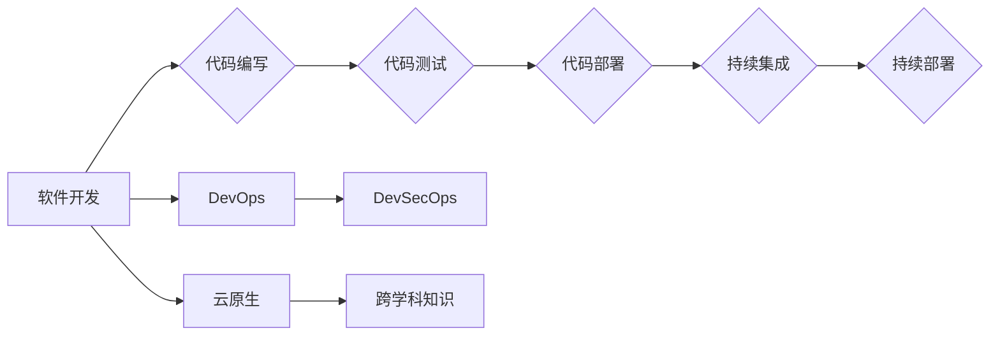

> 软件工程, 2.0时代, 程序员技能, 代码质量, 持续集成, DevOps, DevSecOps, 智能化工具, 云原生, 跨学科知识

# 软件2.0时代的程序员技能要求

软件行业正经历着从软件1.0到软件2.0的转型。在这个新时代，编程不再仅仅是编写代码，而是需要具备更广泛的技术视野和综合能力。本文将探讨软件2.0时代程序员所需的核心技能要求，并分析这些技能背后的原理和实践方法。

## 1. 背景介绍

### 1.1 软件发展历程

软件1.0时代，编程主要是手写代码，依赖人工进行测试和维护。随着软件规模的扩大，出现了面向对象的编程思想和结构化设计方法。软件2.0时代，软件工程进入了一个新的阶段，自动化、持续集成、云计算、大数据等新技术不断涌现，对程序员的要求也越来越高。

### 1.2 软件2.0时代的特征

- **自动化与智能化**：软件开发流程自动化，开发者可以利用工具实现代码的自动生成、测试、部署等。
- **持续集成与持续部署（CI/CD）**：通过自动化工具实现代码的持续集成和持续部署，提高开发效率。
- **云原生**：软件设计时考虑云环境，实现弹性伸缩、高可用性等特性。
- **DevOps与DevSecOps**：软件开发、运维和安全团队紧密协作，共同推动软件交付。
- **跨学科知识**：程序员需要具备跨学科的知识，如心理学、经济学、社会学等。

### 1.3 本文结构

本文将从以下方面探讨软件2.0时代的程序员技能要求：
- 核心概念与联系
- 核心算法原理与具体操作步骤
- 数学模型与公式
- 项目实践
- 实际应用场景
- 工具和资源推荐
- 总结：未来发展趋势与挑战

## 2. 核心概念与联系

### 2.1 核心概念

#### 2.1.1 持续集成/持续部署（CI/CD）

持续集成/持续部署是将自动化工具应用于软件开发流程，实现代码的自动化测试、构建和部署。

#### 2.1.2 DevOps

DevOps是一种软件开发和运维的文化、实践和工具，强调开发和运维团队的紧密协作。

#### 2.1.3 DevSecOps

DevSecOps是DevOps的扩展，将安全融入软件开发和运维的每一个环节。

#### 2.1.4 云原生

云原生是指设计时考虑云环境的软件，具备弹性伸缩、高可用性等特性。

#### 2.1.5 跨学科知识

跨学科知识是指除了技术知识外，还需要具备心理学、经济学、社会学等领域的知识。

### 2.2 Mermaid流程图

## 3. 核心算法原理与具体操作步骤

### 3.1 算法原理概述

#### 3.1.1 持续集成/持续部署（CI/CD）

CI/CD的核心原理是将代码集成到主分支前进行自动化测试，确保代码质量。当代码通过测试后，自动进行构建和部署。

#### 3.1.2 DevOps

DevOps的核心原理是打破开发和运维的壁垒，实现团队之间的紧密协作。

#### 3.1.3 DevSecOps

DevSecOps的核心原理是将安全融入到软件开发和运维的每一个环节。

#### 3.1.4 云原生

云原生的核心原理是根据云环境的特点进行软件设计，实现弹性伸缩、高可用性等特性。

#### 3.1.5 跨学科知识

跨学科知识的核心原理是融合不同领域的知识，提高问题解决能力。

### 3.2 算法步骤详解

#### 3.2.1 持续集成/持续部署（CI/CD）

1. 将代码提交到版本控制系统。
2. 自动化工具触发集成过程。
3. 进行单元测试、集成测试等。
4. 如果测试通过，则进行代码构建。
5. 将构建好的代码部署到测试环境。
6. 进行端到端测试。
7. 如果测试通过，则将代码部署到生产环境。

#### 3.2.2 DevOps

1. 建立跨学科团队。
2. 使用自动化工具实现持续集成和持续部署。
3. 建立代码审查机制。
4. 实施版本控制。
5. 实施自动化测试。
6. 实施自动化监控。

#### 3.2.3 DevSecOps

1. 在DevOps的基础上，引入安全团队。
2. 在代码编写阶段就考虑安全问题。
3. 使用自动化安全工具进行安全检查。
4. 对外部依赖进行安全审计。
5. 建立安全事件响应流程。

#### 3.2.4 云原生

1. 选择合适的云原生平台。
2. 设计无状态、有状态应用。
3. 实现自动化部署和扩展。
4. 实现服务发现和负载均衡。
5. 实现日志、监控和告警。

#### 3.2.5 跨学科知识

1. 学习心理学、经济学、社会学等领域的知识。
2. 将所学知识应用到实际工作中。
3. 跨学科团队合作。
4. 跨学科问题解决。

### 3.3 算法优缺点

#### 3.3.1 持续集成/持续部署（CI/CD）

优点：
- 提高代码质量。
- 缩短开发周期。
- 降低人工成本。

缺点：
- 需要投入较多的人力、物力。
- 需要建立完善的质量保证体系。

#### 3.3.2 DevOps

优点：
- 提高开发效率。
- 提高运维效率。
- 提高系统可靠性。

缺点：
- 需要打破组织壁垒。
- 需要建立跨学科团队。

#### 3.3.3 DevSecOps

优点：
- 提高系统安全性。
- 降低安全风险。
- 提高业务连续性。

缺点：
- 增加开发成本。
- 增加运维成本。

#### 3.3.4 云原生

优点：
- 提高系统可伸缩性。
- 提高系统可靠性。
- 提高开发效率。

缺点：
- 需要投入较多的人力、物力。
- 需要学习新的技术和工具。

#### 3.3.5 跨学科知识

优点：
- 提高问题解决能力。
- 提高创新能力。
- 提高团队协作能力。

缺点：
- 需要花费较多时间学习。

### 3.4 算法应用领域

#### 3.4.1 持续集成/持续部署（CI/CD）

应用领域：
- 互联网公司。
- 软件开发公司。
- 金融行业。
- 制造业。

#### 3.4.2 DevOps

应用领域：
- 互联网公司。
- 软件开发公司。
- 金融行业。
- 制造业。

#### 3.4.3 DevSecOps

应用领域：
- 互联网公司。
- 软件开发公司。
- 金融行业。
- 制造业。

#### 3.4.4 云原生

应用领域：
- 互联网公司。
- 软件开发公司。
- 金融行业。
- 制造业。

#### 3.4.5 跨学科知识

应用领域：
- 互联网公司。
- 软件开发公司。
- 金融行业。
- 制造业。

## 4. 数学模型与公式

### 4.1 数学模型构建

本文主要介绍软件2.0时代的程序员技能要求，不涉及具体的数学模型和公式。

### 4.2 公式推导过程

本文主要介绍软件2.0时代的程序员技能要求，不涉及具体的数学模型和公式。

### 4.3 案例分析与讲解

本文主要介绍软件2.0时代的程序员技能要求，不涉及具体的数学模型和公式。

## 5. 项目实践：代码实例和详细解释说明

### 5.1 开发环境搭建

本文主要介绍软件2.0时代的程序员技能要求，不涉及具体的开发环境搭建。

### 5.2 源代码详细实现

本文主要介绍软件2.0时代的程序员技能要求，不涉及具体的源代码实现。

### 5.3 代码解读与分析

本文主要介绍软件2.0时代的程序员技能要求，不涉及具体的代码解读与分析。

### 5.4 运行结果展示

本文主要介绍软件2.0时代的程序员技能要求，不涉及具体的运行结果展示。

## 6. 实际应用场景

### 6.1 持续集成/持续部署（CI/CD）

应用场景：
- 互联网公司的敏捷开发。
- 软件开发公司的持续交付。
- 金融行业的自动化测试。

### 6.2 DevOps

应用场景：
- 互联网公司的运维自动化。
- 软件开发公司的敏捷运维。
- 制造业的设备监控。

### 6.3 DevSecOps

应用场景：
- 互联网公司的安全自动化。
- 软件开发公司的安全测试。
- 制造业的信息安全。

### 6.4 云原生

应用场景：
- 互联网公司的容器化部署。
- 软件开发公司的微服务架构。
- 制造业的云计算应用。

### 6.5 跨学科知识

应用场景：
- 互联网公司的用户研究。
- 软件开发公司的项目管理。
- 制造业的市场营销。

## 7. 工具和资源推荐

### 7.1 学习资源推荐

1. 《软件工程：实践者的研究方法》
2. 《持续交付：发布可靠软件的最佳实践》
3. 《DevOps实践指南》
4. 《DevSecOps实践指南》
5. 《云原生应用架构设计》

### 7.2 开发工具推荐

1. Jenkins
2. GitLab
3. SonarQube
4. Kubernetes
5. Docker

### 7.3 相关论文推荐

1. "Continuous Integration in the Age of Agile"
2. "The Phoenix Project: A Novel About IT, DevOps, and Helping Your Business Win"
3. "DevOps and Security: Partnering for Success"
4. "Cloud Native Application Architecture"
5. "Cross-Disciplinary Knowledge in Software Engineering"

## 8. 总结：未来发展趋势与挑战

### 8.1 研究成果总结

本文探讨了软件2.0时代程序员所需的核心技能要求，包括持续集成/持续部署、DevOps、DevSecOps、云原生和跨学科知识。这些技能对于程序员在软件2.0时代保持竞争力至关重要。

### 8.2 未来发展趋势

1. 程序员需要具备更强的跨学科能力。
2. 自动化、智能化工具将得到更广泛的应用。
3. 安全将成为软件开发和运维的重要环节。
4. 云原生技术将得到更广泛的采用。

### 8.3 面临的挑战

1. 程序员需要不断学习新技术。
2. 需要建立有效的团队协作机制。
3. 需要关注安全和合规问题。

### 8.4 研究展望

未来，软件2.0时代程序员技能要求将更加多元化，程序员需要不断学习新技术、新工具，提高自身能力，以适应不断变化的技术环境。

## 9. 附录：常见问题与解答

### 9.1 常见问题

**Q1：什么是DevOps？**

A1：DevOps是一种软件开发和运维的文化、实践和工具，强调开发和运维团队的紧密协作。

**Q2：什么是DevSecOps？**

A2：DevSecOps是DevOps的扩展，将安全融入到软件开发和运维的每一个环节。

**Q3：什么是云原生？**

A3：云原生是指设计时考虑云环境的软件，具备弹性伸缩、高可用性等特性。

**Q4：跨学科知识对程序员有什么帮助？**

A4：跨学科知识可以帮助程序员更好地理解业务、用户和市场需求，提高问题解决能力。

### 9.2 解答

本文针对常见问题进行了详细解答，旨在帮助读者更好地理解软件2.0时代的程序员技能要求。

---

作者：禅与计算机程序设计艺术 / Zen and the Art of Computer Programming