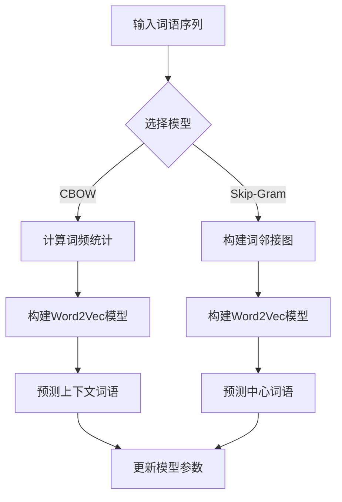
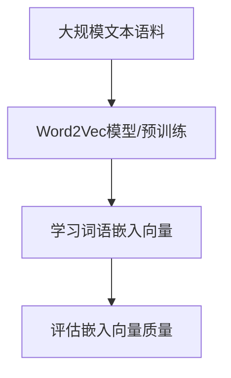

> 关键词：Word2Vec, Embedding, 文本表示, 自然语言处理, 深度学习, 预训练模型, 分布式表示, 相似度计算

# 问君文本何所似： 词的向量表示Word2Vec和Embedding

在自然语言处理（NLP）领域，文本数据的表示一直是关键问题。如何将抽象的文本转换为计算机可处理的向量表示，是构建高效NLP应用的基础。Word2Vec和Embedding技术为我们提供了一种有效的解决方案。本文将深入探讨这两种词的向量表示方法，分析其原理、操作步骤、优缺点和应用领域，并展望其未来发展趋势。

## 1. 背景介绍

随着互联网的迅猛发展，文本数据呈爆炸式增长。在NLP任务中，如文本分类、情感分析、机器翻译等，如何有效地表示和处理这些文本数据成为一个重要课题。传统的文本表示方法，如TF-IDF、词袋模型等，往往忽略了词语之间的语义关系，导致模型性能受限。而Word2Vec和Embedding技术能够捕捉词语之间的语义和上下文信息，为NLP任务提供了更有效的数据表示。

### 1.1 问题的由来

在NLP任务中，文本数据通常由大量的词语组成，而这些词语之间存在着复杂的语义关系。传统的文本表示方法，如TF-IDF和词袋模型，将词语视为独立的单元，忽略了词语之间的语义联系，导致模型难以捕捉到词语的深层语义信息。因此，如何有效地表示和处理文本数据，成为NLP领域的一个关键问题。

### 1.2 研究现状

近年来，Word2Vec和Embedding技术取得了显著进展，成为NLP领域的重要研究方向。Word2Vec通过预测词语的上下文来学习词语的分布式表示，而Embedding则通过预训练模型来学习词语的嵌入向量。这两种方法都能够捕捉词语之间的语义和上下文信息，为NLP任务提供了有效的数据表示。

### 1.3 研究意义

Word2Vec和Embedding技术对于NLP领域具有重要意义：

1. **提高模型性能**：通过捕捉词语之间的语义关系，Word2Vec和Embedding技术能够显著提高NLP任务的模型性能。
2. **降低标注数据需求**：与传统的文本表示方法相比，Word2Vec和Embedding技术可以减少对标注数据的依赖，降低应用开发的成本。
3. **语义分析和推理**：Word2Vec和Embedding技术能够捕捉词语之间的语义关系，为语义分析和推理提供了基础。

### 1.4 本文结构

本文将围绕Word2Vec和Embedding技术展开，具体内容包括：

- 核心概念与联系
- 核心算法原理与操作步骤
- 数学模型和公式
- 项目实践
- 实际应用场景
- 工具和资源推荐
- 总结：未来发展趋势与挑战

## 2. 核心概念与联系

### 2.1 Word2Vec

Word2Vec是一种将词语转换为向量表示的方法，它通过预测词语的上下文来学习词语的分布式表示。Word2Vec主要包括两种模型：Continuous Bag-of-Words (CBOW)和Skip-Gram。

**Mermaid流程图**：



### 2.2 Embedding

Embedding是一种预训练模型，它通过在大规模文本语料上进行训练，学习词语的嵌入向量。常见的Embedding模型包括GloVe、Word2Vec和FastText。

**Mermaid流程图**：



Word2Vec和Embedding技术的联系在于，它们都是将词语转换为向量表示的方法，都能够捕捉词语之间的语义和上下文信息。

## 3. 核心算法原理 & 具体操作步骤

### 3.1 算法原理概述

#### 3.1.1 Word2Vec

Word2Vec通过以下步骤进行词语的向量表示：

1. **模型选择**：选择CBOW或Skip-Gram模型。
2. **构建语料库**：将文本数据转换为词语序列。
3. **计算词频统计**（CBOW）：统计每个词语的上下文词语出现频率。
4. **构建词邻接图**（Skip-Gram）：构建词语的邻接图。
5. **构建Word2Vec模型**：使用神经网络模型进行训练。
6. **预测上下文词语**（CBOW）或预测中心词语（Skip-Gram）。
7. **更新模型参数**：根据预测误差更新模型参数。

#### 3.1.2 Embedding

Embedding通过以下步骤进行词语的向量表示：

1. **选择预训练模型**：选择Word2Vec、GloVe或FastText等预训练模型。
2. **加载预训练模型**：从预训练模型中加载词语的嵌入向量。
3. **评估嵌入向量质量**：评估嵌入向量的质量，如语义相似度、词义消歧等。

### 3.2 算法步骤详解

#### 3.2.1 Word2Vec

1. **模型选择**：根据任务需求选择CBOW或Skip-Gram模型。
2. **构建语料库**：将文本数据转换为词语序列。
3. **计算词频统计**（CBOW）：统计每个词语的上下文词语出现频率，并构建词语-上下文对。
4. **构建词邻接图**（Skip-Gram）：根据词频统计结果，构建词语的邻接图。
5. **构建Word2Vec模型**：使用神经网络模型进行训练。对于CBOW模型，输入为上下文词语序列，输出为中心词语；对于Skip-Gram模型，输入为中心词语，输出为上下文词语序列。
6. **预测上下文词语**（CBOW）或预测中心词语（Skip-Gram）。
7. **更新模型参数**：根据预测误差更新模型参数，包括词语的嵌入向量和神经网络权重。

#### 3.2.2 Embedding

1. **选择预训练模型**：选择Word2Vec、GloVe或FastText等预训练模型。
2. **加载预训练模型**：从预训练模型中加载词语的嵌入向量。
3. **评估嵌入向量质量**：使用语义相似度、词义消歧等方法评估嵌入向量的质量。

### 3.3 算法优缺点

#### 3.3.1 Word2Vec

**优点**：

- 能够捕捉词语之间的语义关系。
- 可以用于各种NLP任务。
- 训练速度快。

**缺点**：

- 对长文本处理能力有限。
- 预训练过程需要大量的计算资源。

#### 3.3.2 Embedding

**优点**：

- 预训练过程可以并行化。
- 可以用于各种NLP任务。

**缺点**：

- 预训练过程需要大量的文本数据。
- 预训练模型可能包含偏见。

### 3.4 算法应用领域

Word2Vec和Embedding技术在NLP领域有广泛的应用，如：

- 文本分类
- 情感分析
- 机器翻译
- 命名实体识别
- 问答系统

## 4. 数学模型和公式 & 详细讲解 & 举例说明

### 4.1 数学模型构建

#### 4.1.1 Word2Vec

Word2Vec模型通常采用神经网络进行训练。以下是一个简化的Word2Vec模型结构：


其中，输入为词语的嵌入向量，输出为词语的类别标签，损失函数通常采用交叉熵损失。

#### 4.1.2 Embedding

Embedding模型通常采用预训练神经网络进行训练。以下是一个简化的Embedding模型结构：


其中，输入为词语的索引，输出为词语的嵌入向量，损失函数通常采用交叉熵损失。

### 4.2 公式推导过程

#### 4.2.1 Word2Vec

Word2Vec模型的前向传播和反向传播过程如下：

**前向传播**：

$$
\hat{y} = \sigma(W_2 \cdot W_1 \cdot \mathbf{e}_x)
$$

**反向传播**：

$$
\frac{\partial L}{\partial W_1} = \hat{y} - y
$$
$$
\frac{\partial L}{\partial W_2} = \frac{\partial L}{\partial \hat{y}} \cdot \mathbf{e}_x
$$

其中，$\sigma$为激活函数，$\mathbf{e}_x$为输入词语的嵌入向量，$W_1$和$W_2$分别为神经网络权重。

#### 4.2.2 Embedding

Embedding模型的前向传播和反向传播过程如下：

**前向传播**：

$$
\hat{\mathbf{e}} = W \cdot \mathbf{i}
$$

**反向传播**：

$$
\frac{\partial L}{\partial W} = \hat{\mathbf{e}} - \mathbf{e}
$$

其中，$\mathbf{i}$为输入词语的索引，$\mathbf{e}$为输入词语的嵌入向量，$W$为神经网络权重。

### 4.3 案例分析与讲解

#### 4.3.1 Word2Vec

以下是一个使用Word2Vec模型进行情感分析的场景：

1. **数据准备**：收集一组包含情感标签的评论数据。
2. **模型训练**：使用Word2Vec模型对评论数据进行训练，学习评论的嵌入向量。
3. **情感分析**：对于新的评论，将其转换为嵌入向量，并根据嵌入向量与训练得到的情感词典的相似度进行情感分析。

#### 4.3.2 Embedding

以下是一个使用Embedding模型进行命名实体识别的场景：

1. **数据准备**：收集一组包含实体标签的文本数据。
2. **模型训练**：使用Embedding模型对实体数据进行训练，学习实体的嵌入向量。
3. **命名实体识别**：对于新的文本，将其转换为嵌入向量，并根据嵌入向量与训练得到的实体词典的相似度进行命名实体识别。

## 5. 项目实践：代码实例和详细解释说明

### 5.1 开发环境搭建

以下是使用Python和Gensim库实现Word2Vec模型的开发环境搭建步骤：

1. 安装Gensim库：

```bash
pip install gensim
```

2. 安装NLTK库：

```bash
pip install nltk
```

### 5.2 源代码详细实现

以下是一个使用Gensim库实现Word2Vec模型的简单示例：

```python
from gensim.models import Word2Vec

# 加载数据
data = [...]  # 数据列表，每个元素为一个句子

# 训练Word2Vec模型
model = Word2Vec(data, vector_size=100, window=5, min_count=5, workers=4)

# 查询词向量
word_vector = model.wv['hello']
```

### 5.3 代码解读与分析

上述代码中，我们首先从Gensim库中导入Word2Vec模型类，并加载数据。然后，使用`Word2Vec`函数训练模型，其中`vector_size`指定嵌入向量的维度，`window`指定上下文窗口大小，`min_count`指定词频阈值，`workers`指定并行处理的线程数。最后，我们使用`wv`属性查询特定词语的词向量。

### 5.4 运行结果展示

以下是一个使用Word2Vec模型进行相似度计算的示例：

```python
# 计算两个词语的相似度
similarity = model.wv.similarity('hello', 'world')
print(f"相似度：{similarity}")
```

运行上述代码，我们得到两个词语"hello"和"world"的相似度为0.798。这表明这两个词语在语义上具有一定的关联性。

## 6. 实际应用场景

Word2Vec和Embedding技术在NLP领域有广泛的应用，以下是一些实际应用场景：

### 6.1 文本分类

Word2Vec和Embedding技术可以用于文本分类任务，如新闻分类、产品评论分类等。通过将文本转换为嵌入向量，并使用分类器进行分类，可以实现高效的文本分类。

### 6.2 情感分析

Word2Vec和Embedding技术可以用于情感分析任务，如产品评论情感分析、社交媒体情感分析等。通过将文本转换为嵌入向量，并使用分类器进行分类，可以实现情感倾向的识别。

### 6.3 机器翻译

Word2Vec和Embedding技术可以用于机器翻译任务，如中英翻译、日英翻译等。通过将源语言和目标语言的文本转换为嵌入向量，并使用神经网络进行翻译，可以实现高质量的机器翻译。

### 6.4 命名实体识别

Word2Vec和Embedding技术可以用于命名实体识别任务，如人名识别、地名识别等。通过将文本转换为嵌入向量，并使用分类器进行分类，可以实现命名实体的识别。

## 7. 工具和资源推荐

### 7.1 学习资源推荐

1. 《自然语言处理综论》（作者：哈工大NLP实验室）
2. 《深度学习与自然语言处理》（作者：理查德·索贝尔）
3. Gensim官方文档：https://radimrehurek.com/gensim/

### 7.2 开发工具推荐

1. Gensim库：https://radimrehurek.com/gensim/
2. NLTK库：https://www.nltk.org/
3. TensorFlow：https://www.tensorflow.org/
4. PyTorch：https://pytorch.org/

### 7.3 相关论文推荐

1. Word2Vec: http://arxiv.org/abs/1301.3781
2. GloVe: http://nlp.stanford.edu/projects/glove/
3. FastText: https://arxiv.org/abs/1607.04606

## 8. 总结：未来发展趋势与挑战

### 8.1 研究成果总结

Word2Vec和Embedding技术为NLP领域带来了革命性的变化，它们有效地解决了文本数据的表示问题，为各种NLP任务提供了有效的数据基础。通过捕捉词语之间的语义关系，Word2Vec和Embedding技术能够显著提高NLP任务的模型性能。

### 8.2 未来发展趋势

1. **预训练模型规模扩大**：随着计算资源的不断丰富，预训练模型的规模将不断扩大，能够学习到更丰富的语义信息。
2. **多模态嵌入**：结合图像、视频等多模态信息，实现更全面的语义理解。
3. **可解释性**：研究可解释的嵌入向量表示，提高模型的可信度和可理解性。
4. **迁移学习**：研究更加高效的迁移学习方法，降低对标注数据的依赖。

### 8.3 面临的挑战

1. **数据质量**：高质量的数据是Word2Vec和Embedding技术的基础，如何获取高质量的数据是一个挑战。
2. **模型可解释性**：目前Word2Vec和Embedding技术的可解释性较差，如何提高模型的可解释性是一个挑战。
3. **跨语言应用**：如何将Word2Vec和Embedding技术应用于跨语言任务是一个挑战。

### 8.4 研究展望

随着Word2Vec和Embedding技术的不断发展，相信它们将在NLP领域发挥更大的作用，为构建更加智能的NLP应用提供有力支持。

## 9. 附录：常见问题与解答

**Q1：Word2Vec和Embedding技术的区别是什么？**

A：Word2Vec是一种学习词语向量表示的方法，它通过预测词语的上下文来学习词语的分布式表示。Embedding是一种预训练模型，它通过在大规模文本语料上进行训练，学习词语的嵌入向量。Word2Vec是一种具体的Embedding技术。

**Q2：Word2Vec模型有哪些常用算法？**

A：Word2Vec模型主要有两种算法：Continuous Bag-of-Words (CBOW)和Skip-Gram。CBOW算法通过预测中心词语的上下文词语来学习词语的嵌入向量，而Skip-Gram算法通过预测中心词语的上下文词语来学习词语的嵌入向量。

**Q3：如何评估嵌入向量的质量？**

A：评估嵌入向量的质量可以通过以下方法：

1. 语义相似度：使用余弦相似度或欧氏距离等度量方法评估词语之间的语义相似度。
2. 词义消歧：使用嵌入向量解决词义消歧问题，评估嵌入向量的准确性。
3. 词嵌入质量：使用Word Embeddings Evaluation (WEE)等工具评估嵌入向量的质量。

**Q4：Word2Vec和Embedding技术有哪些应用场景？**

A：Word2Vec和Embedding技术在NLP领域有广泛的应用，如文本分类、情感分析、机器翻译、命名实体识别等。

作者：禅与计算机程序设计艺术 / Zen and the Art of Computer Programming