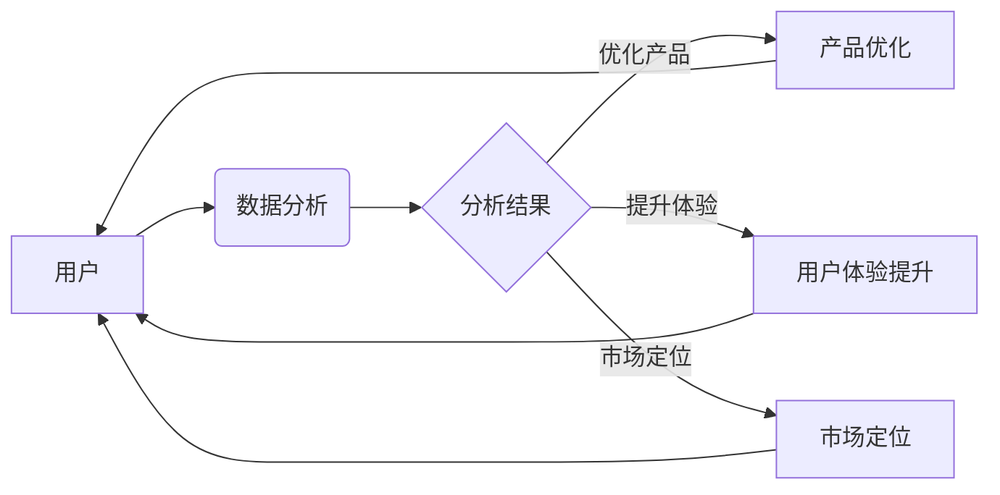

# Agentic Workflow的用户群体分析

> 关键词：Agentic Workflow，用户群体，用户行为，数据分析，个性化，工作流优化

## 1. 背景介绍

随着信息技术的飞速发展，工作流（Workflow）已经成为现代企业提高效率、降低成本的关键手段。Agentic Workflow作为一种先进的工作流管理解决方案，通过集成人工智能（AI）技术，实现了智能化、自动化和个性化的工作流管理。然而，Agentic Workflow的用户群体及其行为特征却鲜有系统性的研究。本文旨在深入分析Agentic Workflow的用户群体，揭示其行为规律，为工作流优化和用户体验提升提供数据支持。

### 1.1 工作流的兴起

工作流是一种将业务流程中的任务、信息和人员通过逻辑关系组织起来的技术。它可以帮助企业实现以下目标：

- **提高效率**：通过自动化任务执行，减少人工操作，缩短流程周期。
- **降低成本**：减少重复劳动，降低人力成本和运营成本。
- **提升质量**：通过标准化流程，确保工作的一致性和质量。

### 1.2 Agentic Workflow的特点

Agentic Workflow结合了人工智能技术，具有以下特点：

- **智能化**：利用AI技术自动识别和执行任务，提高工作效率。
- **自动化**：通过规则和流程引擎实现自动化工作流，减少人工干预。
- **个性化**：根据用户偏好和需求，提供个性化的工作流体验。

### 1.3 用户群体分析的重要性

了解Agentic Workflow的用户群体和行为特征，对于以下方面具有重要意义：

- **产品优化**：根据用户需求调整产品功能和设计。
- **用户体验提升**：优化用户界面和交互方式，提升用户满意度。
- **市场定位**：明确目标用户群体，制定有效的市场策略。

## 2. 核心概念与联系

### 2.1 核心概念

- **用户群体**：指使用Agentic Workflow的用户集合。
- **用户行为**：指用户在使用Agentic Workflow时的操作和交互。
- **数据分析**：通过收集和分析用户数据，了解用户行为特征和需求。
- **个性化**：根据用户行为和需求，提供定制化的服务。

### 2.2 Mermaid 流程图



### 2.3 核心概念联系

用户在使用Agentic Workflow的过程中，会留下大量的行为数据。通过数据分析，我们可以了解用户行为特征和需求，进而优化产品、提升用户体验和进行市场定位。

## 3. 核心算法原理 & 具体操作步骤

### 3.1 算法原理概述

Agentic Workflow的用户群体分析主要依赖于以下算法：

- **用户画像**：根据用户的基本信息、行为数据等，构建用户画像。
- **用户行为分析**：分析用户在使用Agentic Workflow时的操作和交互，识别用户行为模式。
- **聚类分析**：将用户按照行为特征进行分类，形成不同的用户群体。
- **预测分析**：预测用户未来的行为和需求。

### 3.2 算法步骤详解

1. **数据收集**：收集用户的基本信息、行为数据等。
2. **数据清洗**：对收集到的数据进行清洗和预处理。
3. **用户画像构建**：根据用户信息构建用户画像。
4. **用户行为分析**：分析用户行为模式，识别关键行为特征。
5. **聚类分析**：将用户按照行为特征进行分类。
6. **预测分析**：根据用户行为和画像，预测用户未来的行为和需求。
7. **结果应用**：根据分析结果，优化产品、提升用户体验和进行市场定位。

### 3.3 算法优缺点

#### 优点：

- **全面性**：从多个维度分析用户群体，提供全面的用户画像。
- **准确性**：利用机器学习算法，提高用户行为预测的准确性。
- **实时性**：实时分析用户行为，快速响应市场变化。

#### 缺点：

- **数据依赖**：需要大量用户数据进行分析。
- **算法复杂**：涉及多个复杂算法，对技术要求较高。
- **解释性不足**：算法结果难以解释，可能影响用户信任。

### 3.4 算法应用领域

Agentic Workflow的用户群体分析算法可以应用于以下领域：

- **产品开发**：根据用户需求，优化产品功能和设计。
- **用户体验**：提升用户体验，增加用户满意度。
- **市场营销**：精准定位目标用户，制定有效的市场策略。
- **客户服务**：提供个性化服务，提高客户满意度。

## 4. 数学模型和公式 & 详细讲解 & 举例说明

### 4.1 数学模型构建

用户群体分析中常用的数学模型包括：

- **用户画像**：基于特征向量构建用户画像模型。
- **用户行为分析**：基于序列模型或图模型分析用户行为。
- **聚类分析**：基于k-means或层次聚类算法进行用户分类。
- **预测分析**：基于时间序列模型或回归模型预测用户行为。

### 4.2 公式推导过程

以下以k-means聚类算法为例，介绍公式推导过程：

- **距离度量**：衡量两个数据点之间的相似度，常用的距离度量方法有欧氏距离、曼哈顿距离等。
- **聚类中心**：每个簇的中心点，用于衡量簇内数据点的相似度。
- **聚类算法**：通过迭代优化聚类中心，将数据点划分为不同的簇。

### 4.3 案例分析与讲解

假设我们有一组用户数据，包含年龄、性别、收入三个特征。我们使用k-means算法将用户划分为两个群体。

1. **数据预处理**：将年龄、性别、收入数据进行标准化处理。
2. **距离度量**：选择合适的距离度量方法，如欧氏距离。
3. **初始化聚类中心**：随机选择两个数据点作为聚类中心。
4. **迭代优化**：将每个数据点分配到最近的聚类中心，并更新聚类中心的位置。
5. **判断收敛**：判断聚类中心的变化是否满足收敛条件，若满足则停止迭代。

通过以上步骤，我们可以将用户划分为两个群体。群体A的用户年龄较小、收入较低，群体B的用户年龄较大、收入较高。

## 5. 项目实践：代码实例和详细解释说明

### 5.1 开发环境搭建

1. 安装Python环境。
2. 安装必要的库，如pandas、numpy、scikit-learn等。

### 5.2 源代码详细实现

以下是一个使用Python和scikit-learn库进行用户画像构建和聚类分析的示例代码：

```python
import pandas as pd
from sklearn.cluster import KMeans
from sklearn.preprocessing import StandardScaler

# 加载数据
data = pd.read_csv('user_data.csv')

# 数据预处理
scaler = StandardScaler()
data_scaled = scaler.fit_transform(data)

# k-means聚类
kmeans = KMeans(n_clusters=2)
kmeans.fit(data_scaled)

# 获取聚类结果
labels = kmeans.labels_

# 将聚类结果添加到数据中
data['cluster'] = labels
```

### 5.3 代码解读与分析

- `pandas`：用于数据加载和处理。
- `numpy`：用于数据计算。
- `scikit-learn`：用于聚类分析。
- `StandardScaler`：用于数据标准化处理。
- `KMeans`：k-means聚类算法。

通过以上代码，我们可以将用户数据按照年龄、性别、收入等特征进行聚类，形成不同的用户群体。

### 5.4 运行结果展示

运行结果将显示每个用户所属的聚类标签，我们可以根据聚类结果分析不同用户群体的特征和需求。

## 6. 实际应用场景

### 6.1 产品开发

通过分析用户群体，我们可以了解不同用户群体的需求，从而优化产品功能和设计。

### 6.2 用户体验

通过分析用户行为，我们可以改进用户界面和交互方式，提升用户体验。

### 6.3 市场营销

通过分析用户群体，我们可以精准定位目标用户，制定有效的市场策略。

### 6.4 客户服务

通过分析用户行为，我们可以提供个性化服务，提高客户满意度。

## 7. 工具和资源推荐

### 7.1 学习资源推荐

- 《机器学习实战》
- 《Python数据科学手册》
- 《统计学习方法》

### 7.2 开发工具推荐

- Jupyter Notebook
- PyCharm
- scikit-learn

### 7.3 相关论文推荐

-《User Modeling and User-Adapted Interaction》
-《Understanding User Behavior in Personalized Search》
-《User Modeling for Adaptive Systems》

## 8. 总结：未来发展趋势与挑战

### 8.1 研究成果总结

本文对Agentic Workflow的用户群体分析进行了深入探讨，从核心概念、算法原理、应用场景等方面进行了全面介绍。通过分析用户行为和需求，我们可以优化产品、提升用户体验和进行市场定位。

### 8.2 未来发展趋势

- **智能化**：结合人工智能技术，实现更加智能化的用户群体分析。
- **个性化**：根据用户行为和需求，提供更加个性化的服务。
- **实时性**：实现实时用户群体分析，快速响应市场变化。

### 8.3 面临的挑战

- **数据隐私**：如何保护用户隐私，是用户群体分析面临的一大挑战。
- **算法偏见**：算法模型可能存在偏见，需要采取措施消除偏见。
- **技术门槛**：用户群体分析需要较高的技术门槛，需要培养更多相关人才。

### 8.4 研究展望

未来，Agentic Workflow的用户群体分析将在以下方面取得突破：

- **跨领域应用**：将用户群体分析方法应用于更多领域。
- **多模态数据融合**：结合文本、图像、音频等多模态数据，进行更全面的分析。
- **人机协同**：实现人机协同的智能分析，提高分析效率和准确性。

## 9. 附录：常见问题与解答

**Q1：Agentic Workflow的用户群体分析有哪些应用场景？**

A1：Agentic Workflow的用户群体分析可以应用于产品开发、用户体验、市场营销、客户服务等多个场景。

**Q2：如何保护用户隐私？**

A2：可以通过数据脱敏、差分隐私等技术保护用户隐私。

**Q3：如何消除算法偏见？**

A3：可以通过数据清洗、算法改进、模型解释等方法消除算法偏见。

**Q4：如何降低技术门槛？**

A4：可以通过开源工具、在线课程、培训等方式降低技术门槛。

---

作者：禅与计算机程序设计艺术 / Zen and the Art of Computer Programming