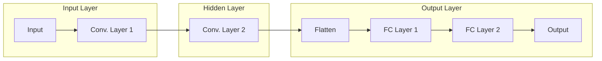

# Andrej Karpathy：人工智能的未来发展挑战

> 关键词：人工智能，机器学习，深度学习，Andrej Karpathy，神经网络，计算机视觉，自然语言处理，伦理问题，未来发展

## 1. 背景介绍

随着深度学习的飞速发展，人工智能（AI）已经渗透到我们生活的方方面面。Andrej Karpathy，作为一位在计算机视觉和自然语言处理（NLP）领域享有盛誉的专家，他的工作不仅推动了AI技术的进步，也为AI的未来发展提出了诸多挑战。本文将深入探讨Andrej Karpathy所关注的人工智能领域的关键挑战，并分析其背后的原理和潜在解决方案。

## 2. 核心概念与联系

### 2.1 核心概念

- **深度学习**：一种利用多层神经网络进行数据学习的技术，能够从大规模数据中自动提取特征。
- **神经网络**：由大量简单单元（神经元）组成的计算模型，通过调整神经元之间的连接权重来进行学习。
- **计算机视觉**：使机器能够通过图像和视频理解环境的技术。
- **自然语言处理（NLP）**：使机器能够理解、解释和生成人类语言的技术。
- **伦理问题**：AI系统在决策过程中可能产生的道德和伦理问题。

### 2.2 Mermaid 流程图

```mermaid
graph LR
    A[深度学习] --> B{神经网络}
    B --> C{计算机视觉}
    B --> D{自然语言处理(NLP)}
    C & D --> E[AI系统]
    E --> F{伦理问题}
```

## 3. 核心算法原理 & 具体操作步骤

### 3.1 算法原理概述

人工智能的核心是深度学习，它通过神经网络模拟人脑的工作原理，从数据中学习模式和特征。神经网络由输入层、隐藏层和输出层组成，通过前向传播和反向传播算法进行训练。

### 3.2 算法步骤详解

1. **数据收集**：从各种来源收集大量数据，用于训练神经网络。
2. **数据预处理**：对数据进行清洗、标注和转换，以便神经网络学习。
3. **模型设计**：选择合适的神经网络架构，如卷积神经网络（CNN）用于计算机视觉，循环神经网络（RNN）用于NLP。
4. **训练**：使用收集到的数据对神经网络进行训练，调整连接权重。
5. **评估**：在验证集上评估模型性能，调整模型参数以提高性能。
6. **部署**：将训练好的模型部署到实际应用中。

### 3.3 算法优缺点

#### 优点

- **强大的学习能力**：能够从大量数据中自动提取复杂特征。
- **泛化能力**：在新的数据集上也能保持良好的性能。
- **自动化**：减少了人工干预，提高了效率。

#### 缺点

- **数据依赖性**：需要大量标注数据。
- **计算资源要求高**：训练过程需要大量计算资源。
- **可解释性差**：难以解释模型的决策过程。

### 3.4 算法应用领域

- **计算机视觉**：图像识别、视频分析、自动驾驶。
- **自然语言处理**：机器翻译、语音识别、问答系统。
- **推荐系统**：个性化推荐、广告投放。
- **医疗诊断**：疾病检测、药物发现。

## 4. 数学模型和公式 & 详细讲解 & 举例说明

### 4.1 数学模型构建

神经网络的核心是权重矩阵 $\mathbf{W}$ 和偏置向量 $\mathbf{b}$。对于输入向量 $\mathbf{x}$，神经网络的输出为：

$$
\mathbf{y} = \sigma(\mathbf{W}\mathbf{x} + \mathbf{b})
$$

其中 $\sigma$ 是激活函数，如Sigmoid、ReLU或ReLU6。

### 4.2 公式推导过程

神经网络的损失函数通常采用均方误差（MSE）或交叉熵损失。对于输出层，损失函数为：

$$
\mathcal{L}(\mathbf{y}, \mathbf{y}^{\prime}) = \frac{1}{2}(\mathbf{y} - \mathbf{y}^{\prime})^{\top}(\mathbf{y} - \mathbf{y}^{\prime})
$$

其中 $\mathbf{y}$ 是模型预测的输出，$\mathbf{y}^{\prime}$ 是真实标签。

### 4.3 案例分析与讲解

以下是一个简单的神经网络结构，用于图像分类：



输入层接收图像数据，经过卷积层提取特征，然后通过全连接层进行分类。

## 5. 项目实践：代码实例和详细解释说明

### 5.1 开发环境搭建

为了进行深度学习项目，您需要安装以下软件：

- Python
- NumPy
- TensorFlow或PyTorch
- Matplotlib

### 5.2 源代码详细实现

以下是一个使用PyTorch实现的简单神经网络：

```python
import torch
import torch.nn as nn

class SimpleNN(nn.Module):
    def __init__(self):
        super(SimpleNN, self).__init__()
        self.conv1 = nn.Conv2d(1, 20, 5)
        self.conv2 = nn.Conv2d(20, 50, 5)
        self.fc1 = nn.Linear(50 * 4 * 4, 500)
        self.fc2 = nn.Linear(500, 10)
    
    def forward(self, x):
        x = nn.functional.relu(self.conv1(x))
        x = nn.functional.max_pool2d(x, 2, 2)
        x = nn.functional.relu(self.conv2(x))
        x = nn.functional.max_pool2d(x, 2, 2)
        x = x.view(-1, 50 * 4 * 4)
        x = nn.functional.relu(self.fc1(x))
        x = self.fc2(x)
        return x

model = SimpleNN()
```

### 5.3 代码解读与分析

这是一个简单的卷积神经网络，用于图像分类。它由两个卷积层、两个池化层和两个全连接层组成。通过梯度下降算法训练模型，使其能够从图像中学习特征并进行分类。

### 5.4 运行结果展示

运行上述代码后，您将获得一个训练好的神经网络模型。您可以使用该模型对新的图像进行分类，并评估其性能。

## 6. 实际应用场景

### 6.4 未来应用展望

AI技术在未来将应用于更多领域，包括：

- **医疗**：疾病诊断、药物发现、个性化治疗。
- **金融**：风险评估、欺诈检测、个性化投资。
- **教育**：智能教育、个性化学习。
- **交通**：自动驾驶、智能交通系统。

## 7. 工具和资源推荐

### 7.1 学习资源推荐

- 《深度学习》（Goodfellow、Bengio和Courville著）
- 《神经网络与深度学习》（邱锡鹏著）
- Coursera上的《深度学习》课程

### 7.2 开发工具推荐

- TensorFlow
- PyTorch
- Keras

### 7.3 相关论文推荐

- “Deep Learning for Computer Vision: A Review” by Richard S.zeliski
- “A Few Useful Things to Know about Machine Learning” by Pedro Domingos
- “The Unreasonable Effectiveness of Deep Learning” by Ian J. Goodfellow, Yoshua Bengio, Aaron Courville

## 8. 总结：未来发展趋势与挑战

### 8.1 研究成果总结

人工智能领域取得了巨大的进步，深度学习技术推动了AI的快速发展。然而，AI技术仍面临诸多挑战。

### 8.2 未来发展趋势

- **更强大的模型**：更复杂的神经网络结构，更有效的训练方法。
- **更广泛的应用**：AI技术在更多领域的应用，如医疗、金融、教育等。
- **更高效的训练**：更快的训练速度，更低的计算资源需求。

### 8.3 面临的挑战

- **数据隐私**：如何保护用户数据隐私。
- **伦理问题**：AI系统的决策过程是否公平、公正。
- **可解释性**：如何解释AI系统的决策过程。

### 8.4 研究展望

未来，人工智能领域的研究需要关注以下几个方面：

- **提高模型可解释性**：使AI系统的决策过程更加透明和可理解。
- **增强模型鲁棒性**：使AI系统更加健壮，能够应对各种异常情况。
- **促进AI伦理发展**：制定AI伦理规范，确保AI技术造福人类社会。

## 9. 附录：常见问题与解答

**Q1：人工智能是否会取代人类？**

A：人工智能可以协助人类完成各种任务，但不可能完全取代人类。人类拥有创造力、情感和道德判断等AI无法替代的能力。

**Q2：AI技术是否会导致失业？**

A：AI技术可能会改变某些行业的就业结构，但也会创造新的就业机会。关键在于如何适应这种变化，提升自身技能。

**Q3：AI技术是否安全？**

A：AI技术本身是中性的，关键在于如何使用它。通过制定相关法规和伦理规范，可以确保AI技术的安全性。

**Q4：AI技术是否具有道德性？**

A：AI技术是否具有道德性取决于其应用方式。需要制定相应的道德规范，确保AI技术造福人类社会。

**Q5：如何成为人工智能专家？**

A：学习Python、数学、机器学习、深度学习等相关知识，并不断实践和探索。

---

作者：禅与计算机程序设计艺术 / Zen and the Art of Computer Programming