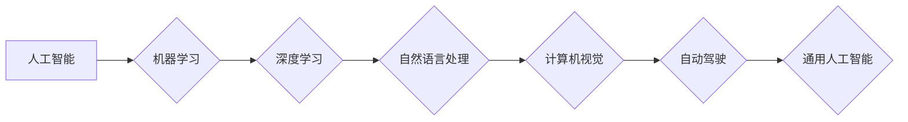

# Andrej Karpathy：人工智能的未来发展目标

> 关键词：人工智能，机器学习，深度学习，自然语言处理，自动驾驶，通用人工智能，人机协作

## 1. 背景介绍

在人工智能（AI）领域，Andrej Karpathy 是一位备受尊敬的专家和思想家。他在自然语言处理（NLP）和深度学习领域取得了显著的成就，尤其在自动驾驶、图像识别和机器翻译等方面有着深入的研究。本文将探讨Andrej Karpathy对人工智能未来发展的看法，分析其核心观点，并展望AI技术可能面临的挑战和机遇。

## 2. 核心概念与联系

### 2.1 核心概念原理和架构的 Mermaid 流程图



### 2.2 核心概念联系

人工智能是一门涵盖多个子领域的广泛学科。机器学习是AI的核心技术，它使计算机能够从数据中学习并做出决策。深度学习作为机器学习的一种，通过神经网络模拟人脑处理信息的方式，实现了图像识别、语音识别等复杂任务。自然语言处理和计算机视觉是深度学习的两个重要应用领域，分别处理文本和图像数据。自动驾驶和通用人工智能则是AI的终极目标，旨在实现更广泛的应用和更高的智能水平。

## 3. 核心算法原理 & 具体操作步骤

### 3.1 算法原理概述

人工智能的发展依赖于一系列算法和模型。以下是几个关键算法的概述：

- **神经网络**：模拟人脑神经元连接，通过学习数据模式来提取特征。
- **卷积神经网络（CNN）**：特别适用于图像识别，通过卷积层提取图像特征。
- **递归神经网络（RNN）**：适合处理序列数据，如时间序列分析、文本生成。
- **Transformer**：基于自注意力机制，在NLP领域取得了突破性进展。

### 3.2 算法步骤详解

- 数据收集：收集大量相关数据，用于模型训练和验证。
- 数据预处理：对数据进行清洗、标注和转换，以便于模型处理。
- 模型设计：选择合适的模型架构，如CNN、RNN或Transformer。
- 训练模型：使用标注数据训练模型，调整模型参数以最小化损失函数。
- 模型评估：使用验证数据评估模型性能，调整模型参数以优化性能。
- 模型部署：将模型部署到实际应用场景中。

### 3.3 算法优缺点

- **优点**：深度学习模型在许多任务上取得了优异的性能，具有强大的特征提取和模式识别能力。
- **缺点**：需要大量标注数据、计算资源和时间进行训练；模型的可解释性较差。

### 3.4 算法应用领域

- **自然语言处理**：机器翻译、文本分类、情感分析、问答系统等。
- **计算机视觉**：图像识别、目标检测、图像分割等。
- **语音识别**：语音转文本、语音合成等。
- **自动驾驶**：车辆定位、障碍物检测、路径规划等。

## 4. 数学模型和公式 & 详细讲解 & 举例说明

### 4.1 数学模型构建

以下是一个简单的神经网络数学模型：

$$
y = \sigma(W_1 \cdot x + b_1) 
$$

其中，$y$ 为输出，$x$ 为输入，$W_1$ 和 $b_1$ 分别为权重和偏置。

### 4.2 公式推导过程

神经网络模型的推导过程涉及微积分、线性代数和概率论等数学知识。

### 4.3 案例分析与讲解

以卷积神经网络为例，其核心思想是通过卷积层提取图像特征：

$$
h^{(l)} = f(W^{(l)} \cdot h^{(l-1)} + b^{(l)}) 
$$

其中，$h^{(l)}$ 为第 $l$ 层的输出，$W^{(l)}$ 和 $b^{(l)}$ 分别为权重和偏置。

## 5. 项目实践：代码实例和详细解释说明

### 5.1 开发环境搭建

以下是使用Python和TensorFlow搭建开发环境的基本步骤：

```python
pip install tensorflow
```

### 5.2 源代码详细实现

以下是一个简单的神经网络代码示例：

```python
import tensorflow as tf

# 定义模型
model = tf.keras.Sequential([
    tf.keras.layers.Dense(128, activation='relu', input_shape=(784,)),
    tf.keras.layers.Dense(10, activation='softmax')
])

# 编译模型
model.compile(optimizer='adam', loss='sparse_categorical_crossentropy', metrics=['accuracy'])

# 训练模型
model.fit(train_images, train_labels, epochs=5)

# 评估模型
test_loss, test_acc = model.evaluate(test_images, test_labels)

# 预测
predictions = model.predict(test_images)
```

### 5.3 代码解读与分析

以上代码展示了使用TensorFlow构建和训练一个简单的神经网络模型的过程。首先定义模型架构，然后编译模型并设置优化器和损失函数。接下来，使用训练数据训练模型，并使用验证数据评估模型性能。最后，使用测试数据预测结果。

## 6. 实际应用场景

### 6.4 未来应用展望

人工智能技术的发展将推动各个领域的变革，以下是几个未来应用场景的展望：

- **医疗健康**：通过AI辅助诊断、个性化治疗和药物研发，提高医疗水平。
- **教育**：智能教育平台、个性化学习推荐、虚拟教师等。
- **交通**：自动驾驶、智能交通系统、智能停车场等。
- **金融**：智能投顾、风险评估、欺诈检测等。

## 7. 工具和资源推荐

### 7.1 学习资源推荐

- 《深度学习》 - Ian Goodfellow、Yoshua Bengio和Aaron Courville
- 《Python深度学习》 - François Chollet
- 《自然语言处理综合教程》 - Yoav Goldberg

### 7.2 开发工具推荐

- TensorFlow
- PyTorch
- Keras

### 7.3 相关论文推荐

- "ImageNet Classification with Deep Convolutional Neural Networks" - Krizhevsky et al.
- "Sequence to Sequence Learning with Neural Networks" - Sutskever et al.
- "Attention is All You Need" - Vaswani et al.

## 8. 总结：未来发展趋势与挑战

### 8.1 研究成果总结

人工智能技术在近年来取得了显著的进展，从语音识别、图像识别到自然语言处理，AI已经逐渐渗透到各个领域。Andrej Karpathy对AI未来发展的看法为我们提供了宝贵的洞察。

### 8.2 未来发展趋势

- **多模态学习**：融合文本、图像、声音等多模态数据，实现更全面的信息理解。
- **强化学习**：通过与环境交互，使AI系统能够自主学习和优化行为。
- **可解释性AI**：提高AI系统的透明度和可信度，使其决策过程更容易被理解。

### 8.3 面临的挑战

- **数据隐私**：如何保护个人隐私，防止数据泄露。
- **伦理问题**：AI系统可能产生偏见和歧视，需要制定相应的伦理规范。
- **就业影响**：AI技术可能取代某些工作岗位，需要重新思考就业结构。

### 8.4 研究展望

AI技术将继续快速发展，未来将实现更多令人惊叹的应用。同时，我们需要关注AI技术的发展带来的挑战，并采取措施确保其对社会产生积极的影响。

## 9. 附录：常见问题与解答

**Q1：人工智能是否会取代人类？**

A：人工智能可以辅助人类完成许多工作，但它不太可能完全取代人类。人类具有创造力、情感和道德判断等AI难以模仿的能力。

**Q2：AI技术是否会造成失业？**

A：AI技术可能会取代一些重复性工作，但也会创造新的就业机会。我们需要适应技术变革，学习新的技能。

**Q3：如何确保AI系统的安全性？**

A：通过制定相应的法律法规和伦理规范，确保AI系统的安全性和可信度。

**Q4：AI技术是否会失控？**

A：目前AI技术还处于初级阶段，距离实现通用人工智能还有很长的路要走。我们需要密切关注AI技术的发展，防止潜在的风险。

**Q5：AI技术是否会导致社会不平等？**

A：AI技术本身是中性的，其应用方式可能带来社会不平等。我们需要制定相应的政策，确保AI技术造福所有人。

---

作者：禅与计算机程序设计艺术 / Zen and the Art of Computer Programming