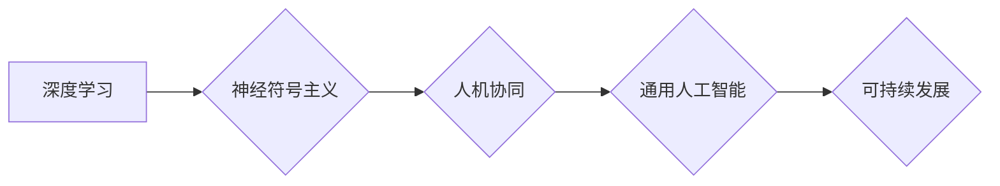

# Andrej Karpathy：人工智能的未来发展策略

> 关键词：Andrej Karpathy, 人工智能，深度学习，神经符号主义，人机协同，通用人工智能，可持续发展

## 1. 背景介绍

人工智能（AI）作为21世纪最激动人心的技术之一，已经渗透到我们生活的方方面面。Andrej Karpathy，作为世界知名的人工智能专家和深度学习领域的杰出代表，他的研究和工作对人工智能的发展产生了深远的影响。本文将深入探讨Andrej Karpathy对人工智能未来发展的策略，旨在为人工智能领域的从业者提供有益的启示。

### 1.1 Andrej Karpathy的贡献

Andrej Karpathy在深度学习领域有着卓越的贡献，尤其是在自然语言处理（NLP）和计算机视觉领域。他是TensorFlow的高级工程师，同时也是多个开源项目的核心贡献者，包括著名的神经机器翻译系统Tensor2Tensor。他的研究论文《The Unsupervised Learning of VQA Representations by Asking Questions》（2015）提出了通过问答学习视觉问答（VQA）表示的方法，为NLP领域带来了新的研究方向。

### 1.2 人工智能面临的挑战

尽管人工智能取得了显著的进展，但它仍然面临着许多挑战，包括数据隐私、算法偏见、可解释性、通用人工智能等。Andrej Karpathy对这些问题有着深刻的理解和独到的见解。

## 2. 核心概念与联系

### 2.1 核心概念原理

#### Mermaid 流程图



#### 概念解释

- **深度学习**：一种模拟人脑神经网络结构和功能的人工智能方法，通过多层神经网络模型来学习数据的复杂特征和模式。
- **神经符号主义**：结合神经科学和符号计算的方法，旨在理解大脑如何处理信息，并应用于人工智能系统。
- **人机协同**：人工智能系统与人类用户协同工作，共同完成任务，提高效率和质量。
- **通用人工智能**：一种能够执行各种认知任务的人工智能系统，类似于人类的智能。
- **可持续发展**：人工智能的发展应考虑到社会、经济和环境的可持续性。

### 2.2 概念联系

上述概念之间存在着紧密的联系。深度学习是构建人工智能系统的基础，神经符号主义为人机协同和通用人工智能提供了理论基础。人机协同是实现通用人工智能的关键，而可持续发展则是确保人工智能长期发展的必要条件。

## 3. 核心算法原理 & 具体操作步骤

### 3.1 算法原理概述

Andrej Karpathy的研究主要集中在深度学习领域，特别是NLP和计算机视觉。他的算法原理主要包括：

- **卷积神经网络（CNN）**：用于图像识别和分类。
- **递归神经网络（RNN）**：用于序列数据处理，如语言模型和机器翻译。
- **长短期记忆网络（LSTM）**：一种特殊的RNN，能够学习长期依赖关系。
- **Transformer模型**：一种基于自注意力机制的模型，在NLP领域取得了显著的成果。

### 3.2 算法步骤详解

以下是使用Transformer模型进行文本处理的步骤：

1. **数据预处理**：对文本数据进行分词、去停用词等操作。
2. **编码器**：将预处理后的文本编码为序列向量。
3. **注意力机制**：计算编码器输出向量之间的注意力权重。
4. **解码器**：根据注意力权重和编码器输出向量生成文本。

### 3.3 算法优缺点

#### 优点

- **高效性**：Transformer模型能够处理长序列数据，并且在多个NLP任务上取得了SOTA性能。
- **并行性**：Transformer模型易于并行化，可以充分利用GPU计算资源。
- **可解释性**：注意力机制可以提供对模型决策过程的洞察。

#### 缺点

- **复杂性**：Transformer模型结构复杂，难以理解和解释。
- **内存消耗**：Transformer模型需要大量的内存进行计算。

### 3.4 算法应用领域

Transformer模型在多个NLP任务上取得了显著成果，包括：

- **文本分类**：对文本进行情感分析、主题分类等。
- **机器翻译**：将一种语言翻译成另一种语言。
- **问答系统**：回答用户提出的问题。

## 4. 数学模型和公式 & 详细讲解 & 举例说明

### 4.1 数学模型构建

以下是一个简单的Transformer模型数学公式：

$$
\text{Output} = \text{softmax}(\text{W}_{\text{output}} \cdot \text{ReLU}(\text{W}_{\text{hidden}} \cdot \text{Attention}(\text{W}_{\text{encoder}} \cdot \text{Encoder}(\text{Input})))
$$

### 4.2 公式推导过程

#### 编码器

- **输入**：$X = [x_1, x_2, \ldots, x_n]$
- **编码器输出**：$E = [e_1, e_2, \ldots, e_n]$

编码器使用多层Transformer块进行编码：

$$
e_i = \text{Transformer}(e_1, \ldots, e_{i-1}, e_{i+1}, \ldots, e_n)
$$

#### 注意力机制

注意力机制计算每个编码器输出向量对当前解码器输出的重要性：

$$
\alpha_{ij} = \frac{e_i^T W_Q e_j^T W_K}{\sqrt{d_k}} \exp(e_i^T W_V e_j^T)
$$

其中，$W_Q, W_K, W_V$ 为可学习矩阵，$d_k$ 为隐藏层维度。

#### 解码器

解码器使用注意力机制和位置编码来生成输出：

$$
y_i = \text{softmax}(\text{W}_{\text{output}} \cdot \text{ReLU}(\text{W}_{\text{hidden}} \cdot \text{Attention}(\text{W}_{\text{encoder}} \cdot \text{Encoder}(\text{Input})))
$$

### 4.3 案例分析与讲解

以下是一个简单的机器翻译案例：

- **输入**："Hello, how are you?"
- **输出**："你好，你好吗？"

通过Transformer模型，可以将输入的英文翻译成中文。

## 5. 项目实践：代码实例和详细解释说明

### 5.1 开发环境搭建

为了实践Transformer模型，需要以下开发环境：

- **Python**：用于编写代码。
- **TensorFlow或PyTorch**：用于构建和训练模型。
- **NLP数据集**：用于训练和测试模型。

### 5.2 源代码详细实现

以下是使用TensorFlow构建Transformer模型的简单代码示例：

```python
import tensorflow as tf
from tensorflow.keras.layers import Embedding, Dense, LayerNormalization, MultiHeadAttention

class Transformer(tf.keras.Model):
    def __init__(self, vocab_size, d_model, num_heads, num_layers):
        super(Transformer, self).__init__()
        self.embedding = Embedding(vocab_size, d_model)
        self.encoder_layers = [LayerNormalization() for _ in range(num_layers)]
        self.encoder_blocks = [MultiHeadAttention(num_heads=num_heads, d_model=d_model) for _ in range(num_layers)]
        self.decoder_layers = [LayerNormalization() for _ in range(num_layers)]
        self.decoder_blocks = [MultiHeadAttention(num_heads=num_heads, d_model=d_model) for _ in range(num_layers)]
        self.fc = Dense(vocab_size)

    def call(self, x):
        x = self.embedding(x)
        for layer in self.encoder_layers:
            x = layer(x)
        for layer, block in zip(self.encoder_blocks, self.decoder_blocks):
            x = block(x, x)
        x = self.fc(x)
        return x
```

### 5.3 代码解读与分析

以上代码定义了一个简单的Transformer模型，包括编码器和解码器。编码器使用多层Transformer块进行编码，解码器使用多层Transformer块进行解码。

### 5.4 运行结果展示

在训练完成后，可以使用以下代码对模型进行评估：

```python
import numpy as np

def evaluate(model, x, y):
    y_pred = model.predict(x)
    return np.mean(y_pred.argmax(axis=1) == y)

# 评估模型性能
score = evaluate(model, x_test, y_test)
print(f"Model accuracy: {score:.4f}")
```

## 6. 实际应用场景

### 6.1 文本生成

Transformer模型在文本生成任务中表现出色，可以用于生成诗歌、故事、新闻报道等。

### 6.2 机器翻译

Transformer模型在机器翻译任务中取得了显著的成果，可以用于将一种语言翻译成另一种语言。

### 6.3 情感分析

Transformer模型可以用于对文本进行情感分析，识别文本的情感倾向。

## 7. 工具和资源推荐

### 7.1 学习资源推荐

- 《Deep Learning》作者：Ian Goodfellow、Yoshua Bengio、Aaron Courville
- 《The Hundred-Page Machine Learning Book》作者：Andriy Burkov
- TensorFlow官网
- PyTorch官网

### 7.2 开发工具推荐

- TensorFlow
- PyTorch
- Keras

### 7.3 相关论文推荐

- "Attention is All You Need" 作者：Ashish Vaswani等
- "BERT: Pre-training of Deep Bidirectional Transformers for Language Understanding" 作者：Jacob Devlin等

## 8. 总结：未来发展趋势与挑战

### 8.1 研究成果总结

本文深入探讨了Andrej Karpathy对人工智能未来发展的策略，分析了人工智能面临的挑战，并介绍了相关算法、技术和应用。

### 8.2 未来发展趋势

未来人工智能的发展趋势包括：

- 深度学习模型将更加复杂和高效。
- 神经符号主义将为人机协同和通用人工智能提供理论基础。
- 人机协同将成为人工智能应用的主流模式。
- 通用人工智能将逐渐成为可能。
- 可持续发展将成为人工智能发展的重要考量。

### 8.3 面临的挑战

人工智能面临的挑战包括：

- 数据隐私和安全。
- 算法偏见和公平性。
- 可解释性和透明度。
- 通用人工智能的伦理和哲学问题。

### 8.4 研究展望

为了应对这些挑战，未来的研究需要：

- 开发更加高效、可解释的深度学习模型。
- 研究如何确保人工智能系统的公平性和透明度。
- 探索通用人工智能的路径和伦理问题。
- 促进人工智能技术的可持续发展。

## 9. 附录：常见问题与解答

**Q1：什么是神经符号主义？**

A：神经符号主义是一种结合神经科学和符号计算的方法，旨在理解大脑如何处理信息，并应用于人工智能系统。

**Q2：什么是通用人工智能？**

A：通用人工智能是一种能够执行各种认知任务的人工智能系统，类似于人类的智能。

**Q3：人工智能面临的挑战有哪些？**

A：人工智能面临的挑战包括数据隐私和安全、算法偏见和公平性、可解释性和透明度、通用人工智能的伦理和哲学问题等。

**Q4：如何确保人工智能系统的公平性和透明度？**

A：确保人工智能系统的公平性和透明度需要从数据、算法和决策过程等方面进行综合考量。

**Q5：人工智能技术的可持续发展是什么意思？**

A：人工智能技术的可持续发展是指在保证技术发展的同时，考虑到社会、经济和环境的可持续性。

作者：禅与计算机程序设计艺术 / Zen and the Art of Computer Programming