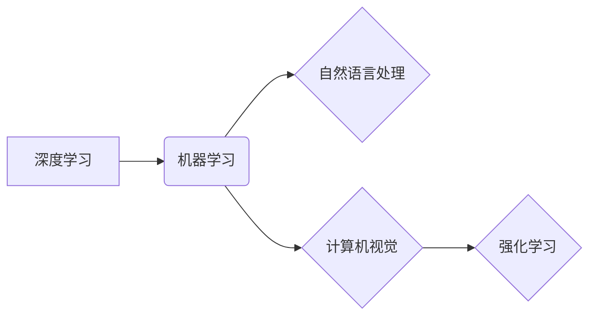

# Andrej Karpathy：人工智能的未来发展趋势

> 关键词：安德烈·卡帕西，人工智能，深度学习，机器学习，自然语言处理，计算机视觉，未来趋势

## 1. 背景介绍

人工智能（AI）领域的发展日新月异，而Andrej Karpathy作为一位杰出的计算机科学家和工程师，以其在自然语言处理（NLP）和机器学习领域的贡献而闻名。本文将探讨Andrej Karpathy对人工智能未来发展趋势的看法，并分析这些趋势可能对技术和社会产生的影响。

## 2. 核心概念与联系

### 2.1 核心概念

- **深度学习（Deep Learning）**：一种机器学习方法，通过模拟人脑中的神经网络来处理数据和学习复杂模式。
- **机器学习（Machine Learning）**：使计算机系统能够从数据中学习并做出决策或预测的技术。
- **自然语言处理（NLP）**：使计算机能够理解、解释和生成人类语言的技术。
- **计算机视觉（Computer Vision）**：使计算机能够从图像和视频中理解内容的技术。
- **强化学习（Reinforcement Learning）**：一种机器学习方法，通过奖励和惩罚来指导算法的学习。

### 2.2 Mermaid 流程图



## 3. 核心算法原理 & 具体操作步骤

### 3.1 算法原理概述

Andrej Karpathy认为，深度学习是推动AI发展的重要力量。它通过多层神经网络来模拟人脑处理信息的方式，从而能够从大量数据中学习复杂的模式。

### 3.2 算法步骤详解

- 数据收集：从各种来源收集大量数据，包括文本、图像、声音等。
- 数据预处理：清洗和整理数据，以便于模型训练。
- 模型选择：选择合适的深度学习模型，如卷积神经网络（CNN）、循环神经网络（RNN）或Transformer。
- 模型训练：使用训练数据来训练模型，调整模型的参数。
- 模型评估：使用验证数据来评估模型的性能。
- 模型部署：将训练好的模型部署到实际应用中。

### 3.3 算法优缺点

**优点**：
- 能够处理大量数据，发现复杂模式。
- 自动学习，不需要手动编写规则。
- 在许多领域取得了显著的成果。

**缺点**：
- 训练数据量大，计算资源要求高。
- 模型难以解释，可能导致不可预测的决策。
- 隐含偏见，可能导致不公平的决策。

### 3.4 算法应用领域

深度学习在自然语言处理、计算机视觉、游戏、自动驾驶等领域都有广泛应用。

## 4. 数学模型和公式 & 详细讲解 & 举例说明

### 4.1 数学模型构建

深度学习中的数学模型通常包括神经网络、激活函数、损失函数等。

### 4.2 公式推导过程

例如，卷积神经网络的损失函数可以表示为：

$$
\mathcal{L}(\theta) = \frac{1}{m} \sum_{i=1}^{m} \sum_{k=1}^{K} \ell(y_{ik}, \hat{y}_{ik}) 
$$

其中，$\theta$ 是模型参数，$y_{ik}$ 是真实标签，$\hat{y}_{ik}$ 是预测结果，$\ell$ 是损失函数。

### 4.3 案例分析与讲解

以图像识别任务为例，使用卷积神经网络进行图像分类。首先，收集大量的图像数据，并进行预处理。然后，选择合适的卷积神经网络模型，如VGG或ResNet。接着，使用训练数据来训练模型，调整模型的参数。最后，使用测试数据来评估模型的性能。

## 5. 项目实践：代码实例和详细解释说明

### 5.1 开发环境搭建

安装Python、PyTorch或TensorFlow等深度学习框架。

### 5.2 源代码详细实现

以下是一个简单的卷积神经网络模型示例，用于图像分类：

```python
import torch
import torch.nn as nn

class CNN(nn.Module):
    def __init__(self):
        super(CNN, self).__init__()
        self.conv1 = nn.Conv2d(3, 32, kernel_size=3, stride=1, padding=1)
        self.relu = nn.ReLU()
        self.pool = nn.MaxPool2d(kernel_size=2, stride=2)
        self.fc = nn.Linear(32 * 32 * 32, 10)

    def forward(self, x):
        x = self.pool(self.relu(self.conv1(x)))
        x = x.view(-1, 32 * 32 * 32)
        x = self.fc(x)
        return x
```

### 5.3 代码解读与分析

这是一个简单的卷积神经网络模型，包含一个卷积层、一个ReLU激活函数、一个最大池化层和一个全连接层。

### 5.4 运行结果展示

使用训练数据和测试数据对模型进行训练和评估，观察模型的性能。

## 6. 实际应用场景

深度学习在以下领域有广泛的应用：

- **自然语言处理**：文本分类、机器翻译、情感分析、问答系统。
- **计算机视觉**：图像识别、目标检测、图像生成。
- **语音识别**：语音到文本转换、语音合成。
- **游戏**：游戏AI、自动驾驶。

## 6.4 未来应用展望

未来，深度学习将在以下方面取得更多进展：

- **更强大的模型**：更复杂的模型结构，如Transformer和图神经网络。
- **更高效的训练方法**：更快的训练速度和更小的计算资源需求。
- **可解释性**：提高模型的可解释性，使其决策过程更加透明。
- **泛化能力**：提高模型的泛化能力，使其能够适应不同的数据分布。

## 7. 工具和资源推荐

### 7.1 学习资源推荐

- 《深度学习》 - Ian Goodfellow、Yoshua Bengio和Aaron Courville
- 《Python深度学习》 - Francois Chollet

### 7.2 开发工具推荐

- PyTorch
- TensorFlow

### 7.3 相关论文推荐

- "A Guide to Convolutional Neural Networks" - Aaron Courville等
- "The Unsupervised Approach to Learning a Probabilistic Latent Space Model of Images" - Alex Kendall等

## 8. 总结：未来发展趋势与挑战

### 8.1 研究成果总结

深度学习是推动AI发展的重要力量，它已经在多个领域取得了显著的成果。

### 8.2 未来发展趋势

未来，深度学习将在模型、算法、可解释性和泛化能力等方面取得更多进展。

### 8.3 面临的挑战

深度学习面临着计算资源需求高、可解释性差、泛化能力不足等挑战。

### 8.4 研究展望

未来，深度学习将继续发展，并将为人类社会带来更多创新和进步。

## 9. 附录：常见问题与解答

**Q1：什么是深度学习？**

A：深度学习是一种机器学习方法，通过多层神经网络来模拟人脑处理信息的方式，从而能够从大量数据中学习复杂的模式。

**Q2：深度学习有哪些应用？**

A：深度学习在自然语言处理、计算机视觉、游戏、自动驾驶等领域都有广泛应用。

**Q3：深度学习有哪些挑战？**

A：深度学习面临着计算资源需求高、可解释性差、泛化能力不足等挑战。

**Q4：未来深度学习会走向何方？**

A：未来，深度学习将继续发展，并将为人类社会带来更多创新和进步。

---

作者：禅与计算机程序设计艺术 / Zen and the Art of Computer Programming