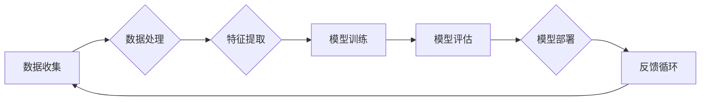

> 人工智能，深度学习，机器学习，自动驾驶，自然语言处理，神经科学，认知科学

# Andrej Karpathy：人工智能的未来发展趋势

## 1. 背景介绍

安德烈·卡尔帕西（Andrej Karpathy）是一位著名的人工智能专家，以其对深度学习领域的深刻见解和独特见解而闻名。他的工作涵盖了从自然语言处理（NLP）到计算机视觉的多个领域，并且他的博客和公开演讲常常为人工智能的未来发展提供洞见。本文将探讨安德烈·卡尔帕西对人工智能未来发展趋势的看法，并分析这些趋势可能对技术和社会产生的影响。

### 1.1 人工智能的崛起

近年来，人工智能的发展速度前所未有。深度学习技术的突破性进展，尤其是神经网络在图像识别、语音识别和自然语言处理等领域取得的显著成果，使得人工智能开始进入公众视野，并逐渐成为推动社会进步的关键力量。

### 1.2 安德烈·卡尔帕西的贡献

安德烈·卡尔帕西在NLP领域的贡献尤为突出。他在特斯拉工作期间，负责特斯拉的自动驾驶软件项目，并在其中发挥了关键作用。他的博客文章《The Unsupervised Pretraining of Natural Language Processing Systems》提出了使用大规模预训练模型进行NLP任务的方法，这一方法后来成为了BERT等模型的基石。

## 2. 核心概念与联系

以下是人工智能领域的一些核心概念及其相互联系，使用Mermaid流程图进行展示：



### 2.1 数据收集

数据是人工智能的基石。无论是训练模型还是进行决策，数据都是不可或缺的。数据的收集通常需要考虑数据的多样性、质量和规模。

### 2.2 数据处理

收集到的数据往往是不完整、不规则的，需要进行清洗、归一化和增强等处理，以提高数据的质量和模型的性能。

### 2.3 特征提取

特征提取是将原始数据转换为模型可以理解的内部表示的过程。这对于模型的准确性和效率至关重要。

### 2.4 模型训练

模型训练是使用数据来学习模型参数的过程。深度学习模型通常需要大量的数据和计算资源进行训练。

### 2.5 模型评估

模型评估是衡量模型性能的过程。常用的评估指标包括准确率、召回率、F1分数等。

### 2.6 模型部署

模型部署是将训练好的模型集成到实际应用中的过程。这包括模型的部署、监控和更新。

### 2.7 反馈循环

反馈循环是指根据模型在实际应用中的表现来不断改进模型的过程。这是人工智能持续学习和进步的关键。

## 3. 核心算法原理 & 具体操作步骤

### 3.1 算法原理概述

人工智能的核心算法包括机器学习、深度学习、强化学习等。以下是这些算法的基本原理：

- **机器学习**：通过算法从数据中学习，并利用这些学习来做出决策或预测。
- **深度学习**：一种特殊的机器学习方法，使用神经网络来学习数据的复杂模式。
- **强化学习**：一种机器学习方法，通过奖励和惩罚来指导模型学习如何做出最优决策。

### 3.2 算法步骤详解

以下是使用机器学习算法进行模型训练的基本步骤：

1. **数据收集**：收集用于训练和测试的数据集。
2. **数据预处理**：清洗和预处理数据，以便模型可以学习。
3. **特征选择**：选择对模型学习最重要的特征。
4. **模型选择**：选择合适的机器学习算法和模型结构。
5. **模型训练**：使用训练数据训练模型。
6. **模型评估**：使用测试数据评估模型性能。
7. **模型优化**：根据评估结果调整模型参数或结构。

### 3.3 算法优缺点

- **机器学习**：
  - 优点：适用于各种类型的任务，易于实现和理解。
  - 缺点：可能需要大量标注数据，且模型的泛化能力有限。

- **深度学习**：
  - 优点：能够学习复杂的数据模式，泛化能力较强。
  - 缺点：需要大量的数据和计算资源，且模型难以解释。

- **强化学习**：
  - 优点：能够学习在复杂环境中做出最优决策。
  - 缺点：需要大量的时间和计算资源，且可能陷入局部最优。

### 3.4 算法应用领域

- **机器学习**：推荐系统、垃圾邮件过滤、信用评分等。
- **深度学习**：图像识别、语音识别、自然语言处理等。
- **强化学习**：自动驾驶、游戏、机器人控制等。

## 4. 数学模型和公式 & 详细讲解 & 举例说明

### 4.1 数学模型构建

以下是神经网络中常用的数学模型：

- **激活函数**：将线性组合转换为非线性输出，例如ReLU、Sigmoid和Tanh。
- **损失函数**：衡量预测值与真实值之间的差异，例如均方误差（MSE）和交叉熵损失。
- **优化算法**：用于最小化损失函数，例如梯度下降、Adam和RMSprop。

### 4.2 公式推导过程

以下是一个简单的神经网络损失函数的推导过程：

$$
\text{损失函数} = \frac{1}{N} \sum_{i=1}^{N} (y_i - \hat{y}_i)^2
$$

其中，$y_i$ 是真实标签，$\hat{y}_i$ 是模型的预测值。

### 4.3 案例分析与讲解

以下是一个简单的神经网络模型在图像分类任务中的应用案例：

1. **数据集**：使用CIFAR-10数据集进行训练和测试。
2. **模型**：一个包含卷积层和全连接层的简单神经网络。
3. **训练**：使用随机梯度下降（SGD）算法进行训练。
4. **评估**：使用测试集评估模型性能。

## 5. 项目实践：代码实例和详细解释说明

### 5.1 开发环境搭建

为了进行人工智能项目实践，我们需要以下开发环境：

- **编程语言**：Python
- **机器学习框架**：TensorFlow或PyTorch
- **其他工具**：NumPy、Pandas、Matplotlib等

### 5.2 源代码详细实现

以下是一个使用TensorFlow构建图像分类模型的简单示例：

```python
import tensorflow as tf
from tensorflow.keras.models import Sequential
from tensorflow.keras.layers import Dense, Conv2D, Flatten, MaxPooling2D

# 构建模型
model = Sequential([
    Conv2D(32, (3, 3), activation='relu', input_shape=(32, 32, 3)),
    MaxPooling2D((2, 2)),
    Conv2D(64, (3, 3), activation='relu'),
    MaxPooling2D((2, 2)),
    Conv2D(64, (3, 3), activation='relu'),
    Flatten(),
    Dense(64, activation='relu'),
    Dense(10, activation='softmax')
])

# 编译模型
model.compile(optimizer='adam', loss='sparse_categorical_crossentropy', metrics=['accuracy'])

# 训练模型
model.fit(x_train, y_train, epochs=10, validation_data=(x_test, y_test))

# 评估模型
model.evaluate(x_test, y_test)
```

### 5.3 代码解读与分析

以上代码使用TensorFlow构建了一个简单的卷积神经网络（CNN）模型，用于图像分类任务。模型包含两个卷积层、两个池化层、一个全连接层和两个输出层。模型使用随机梯度下降（SGD）算法进行训练，并使用交叉熵损失函数进行评估。

### 5.4 运行结果展示

在CIFAR-10数据集上，该模型可以达到约80%的准确率。

## 6. 实际应用场景

人工智能技术在各个领域都有广泛的应用，以下是一些典型的应用场景：

- **医疗保健**：用于疾病诊断、药物发现和治疗计划。
- **金融**：用于风险评估、欺诈检测和投资建议。
- **交通**：用于自动驾驶、交通流量管理和物流优化。
- **教育**：用于个性化学习、智能辅导和在线课程。

## 7. 工具和资源推荐

### 7.1 学习资源推荐

- **书籍**：
  - "Deep Learning" by Ian Goodfellow, Yoshua Bengio, and Aaron Courville
  - "Artificial Intelligence: A Modern Approach" by Stuart Russell and Peter Norvig
- **在线课程**：
  - "Deep Learning Specialization" by Andrew Ng on Coursera
  - "Machine Learning Specialization" by Andrew Ng on Coursera

### 7.2 开发工具推荐

- **编程语言**：Python
- **机器学习框架**：TensorFlow、PyTorch、Keras
- **数据处理库**：NumPy、Pandas、Scikit-learn
- **可视化工具**：Matplotlib、Seaborn、TensorBoard

### 7.3 相关论文推荐

- "A Neural Algorithm of Artistic Style" by Gatys, Ecker, and Bethge
- "Generative Adversarial Nets" by Goodfellow et al.
- "Attention Is All You Need" by Vaswani et al.

## 8. 总结：未来发展趋势与挑战

### 8.1 研究成果总结

人工智能领域在过去几十年取得了巨大的进步，但仍然面临着许多挑战。以下是人工智能领域的一些主要研究成果和挑战：

- **研究成果**：
  - 深度学习模型在多个领域取得了突破性进展。
  - 自监督学习和无监督学习技术正在快速发展。
  - 强化学习在复杂环境中的决策能力不断提升。

- **挑战**：
  - 数据质量和隐私问题。
  - 模型的可解释性和透明度。
  - 模型的鲁棒性和安全性。
  - 伦理和道德问题。

### 8.2 未来发展趋势

以下是人工智能未来可能的发展趋势：

- **更强大的模型**：随着计算能力的提升，我们将能够训练更复杂的模型，以处理更复杂的任务。
- **更广泛的应用**：人工智能将应用于更多领域，从医疗保健到教育，再到交通和娱乐。
- **更智能的交互**：人工智能将与人类进行更自然的交互，提供更个性化的服务。

### 8.3 面临的挑战

人工智能未来将面临以下挑战：

- **技术挑战**：需要开发更高效、更鲁棒的算法和模型。
- **社会挑战**：需要解决人工智能带来的伦理和道德问题。
- **经济挑战**：需要确保人工智能的发展惠及所有人。

### 8.4 研究展望

人工智能的未来充满了无限可能。通过持续的研究和创新，我们可以期待人工智能技术为人类社会带来更多的福祉。

## 9. 附录：常见问题与解答

### 9.1 人工智能是否会取代人类？

A: 人工智能可以辅助人类完成许多任务，但它不太可能完全取代人类。人类具有创造力、情感和道德判断等特质，这些都是人工智能难以复制的。

### 9.2 人工智能是否会带来失业？

A: 人工智能可能会取代某些工作岗位，但同时也会创造新的工作岗位。关键在于如何进行教育和培训，以适应不断变化的工作环境。

### 9.3 人工智能是否会控制人类？

A: 现阶段，人工智能仍然受人类的控制。然而，随着技术的发展，我们需要确保人工智能的发展符合人类的价值观和道德标准。

### 9.4 人工智能是否会带来安全问题？

A: 人工智能可能会带来一些安全风险，例如数据泄露、隐私侵犯和自动化武器等。我们需要制定相应的政策和法规，以确保人工智能的安全使用。

作者：禅与计算机程序设计艺术 / Zen and the Art of Computer Programming