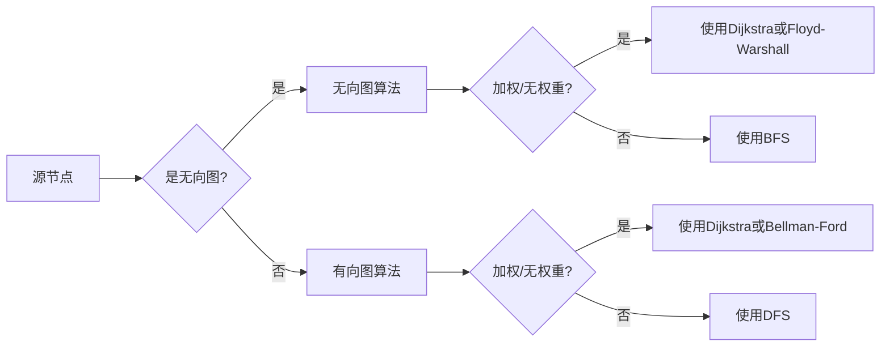

# Graph Shortest Path算法原理与代码实例讲解

> 关键词：图论，最短路径算法，Dijkstra算法，Floyd-Warshall算法，Bellman-Ford算法，A*算法，代码实例

## 1. 背景介绍

在计算机科学和网络领域中，图是最常见的数据结构之一。图可以用来表示网络结构、交通系统、社会关系等多种现实世界的问题。图中的节点（也称为顶点）和边可以代表不同的实体及其之间的关系。在许多应用中，我们都需要找到图中节点之间的最短路径，例如，在导航系统中找到两点之间的最优路线，在网络中找到数据传输的最快路径等。图最短路径算法是解决这类问题的重要工具。

## 2. 核心概念与联系

### 2.1 核心概念

- **图（Graph）**：由节点（顶点）和连接这些节点的边组成的结构。图可以是无向的或有向的，可以是加权或无权重的。
- **路径（Path）**：图中的一个序列，其中每个节点都直接连接到下一个节点。
- **最短路径（Shortest Path）**：在所有可能的路径中，权重和最小的路径。
- **权重（Weight）**：图中的边可以有不同的权重，表示连接两个节点的成本或距离。

### 2.2 Mermaid 流程图



### 2.3 联系

图最短路径算法根据图的不同类型（无向图或有向图）和边的权重（加权或无权重）来选择合适的算法。

## 3. 核心算法原理 & 具体操作步骤

### 3.1 算法原理概述

本节将介绍几种常用的图最短路径算法，包括Dijkstra算法、Floyd-Warshall算法、Bellman-Ford算法和A*算法。

### 3.2 算法步骤详解

#### 3.2.1 Dijkstra算法

Dijkstra算法用于计算单源最短路径，即从一个源节点到所有其他节点的最短路径。

- 初始化：将所有节点的距离设为无穷大，除了源节点，其距离设为0。
- 选择未访问的节点中距离最小的节点，标记为已访问。
- 更新：对于所有与该节点相邻的未访问节点，计算其到源节点的距离，如果比之前的距离小，则更新距离和前驱节点。
- 重复以上步骤，直到所有节点都被访问过。

#### 3.2.2 Floyd-Warshall算法

Floyd-Warshall算法用于计算所有节点对之间的最短路径。

- 初始化：将所有节点的距离设为无穷大，除了自身节点，其距离设为0。
- 对于所有可能的中间节点k，更新所有节点对之间的距离。
- 重复以上步骤，直到所有节点都考虑过。

#### 3.2.3 Bellman-Ford算法

Bellman-Ford算法同样用于计算单源最短路径，但可以处理带有负权边的图。

- 初始化：将所有节点的距离设为无穷大，除了源节点，其距离设为0。
- 重复执行以下步骤V-1次，其中V是节点的数量：对于所有边(u, v)和权重w，如果d[u] + w < d[v]，则更新d[v]。
- 检查图中是否存在负权环。

#### 3.2.4 A*算法

A*算法是一种启发式搜索算法，用于在图中找到最短路径。

- 初始化：将所有节点的g(n)设为无穷大，除了源节点，其g(n)设为0；h(n)设为启发式估计的距离；f(n) = g(n) + h(n)。
- 选择f值最小的节点u。
- 对于u的所有相邻节点v，计算g(v)和f(v)。
- 更新：如果g(v) > g(u) + w(u,v)，则更新g(v)和f(v)。
- 重复以上步骤，直到找到目标节点。

### 3.3 算法优缺点

#### Dijkstra算法

优点：
- 算法简单易实现。
- 时间复杂度为O(V^2)或O((V+E)logV)，其中V是节点数，E是边数。

缺点：
- 只适用于无负权边图。
- 无法处理带负权环的图。

#### Floyd-Warshall算法

优点：
- 可以处理带负权边和负权环的图。

缺点：
- 时间复杂度为O(V^3)，对于大规模图效率低下。

#### Bellman-Ford算法

优点：
- 可以处理带负权边和负权环的图。
- 算法简单易实现。

缺点：
- 时间复杂度为O(VE)，其中V是节点数，E是边数，对于大规模图效率较低。

#### A*算法

优点：
- 启发式搜索可以加速搜索过程。
- 可以处理无负权边图。

缺点：
- 启发式的选择可能影响搜索效率。
- 需要设计合适的启发式函数。

### 3.4 算法应用领域

这些算法在许多领域都有广泛的应用，包括：

- 路径规划
- 网络路由
- 交通流量分析
- 图论中的距离问题
- 数据挖掘中的聚类和关联规则学习

## 4. 数学模型和公式 & 详细讲解 & 举例说明

### 4.1 数学模型构建

#### 4.1.1 Dijkstra算法

定义距离函数d：V → R，表示从源节点s到所有节点的最短距离。初始时，d(v) = ∞，除了源节点，d(s) = 0。

#### 4.1.2 Floyd-Warshall算法

定义距离矩阵D：V × V → R，表示从节点u到节点v的最短路径的长度。

#### 4.1.3 Bellman-Ford算法

定义距离函数d：V → R，表示从源节点s到所有节点的最短距离。初始时，d(v) = ∞，除了源节点，d(s) = 0。

#### 4.1.4 A*算法

定义启发式函数h：V → R，表示从节点u到目标节点的估计距离。

### 4.2 公式推导过程

#### 4.2.1 Dijkstra算法

更新距离函数的公式：

d(v) = min(d(u) + w(u, v))

其中u是源节点，v是相邻节点，w(u, v)是边(u, v)的权重。

#### 4.2.2 Floyd-Warshall算法

更新距离矩阵的公式：

D[v][w] = min(D[v][w], D[v][u] + D[u][w])

其中u和w是任意节点。

#### 4.2.3 Bellman-Ford算法

更新距离函数的公式：

d[v] = min(d[v], d[u] + w(u, v))

其中u是前驱节点，v是当前节点，w(u, v)是边(u, v)的权重。

#### 4.2.4 A*算法

更新函数f(v)的公式：

f(v) = g(v) + h(v)

其中g(v)是从源节点到节点v的实际距离，h(v)是从节点v到目标节点的估计距离。

### 4.3 案例分析与讲解

以Dijkstra算法为例，假设有一个包含5个节点的图G，节点之间的边和权重如下：

```
A --2--> B --3--> C
|      |
1<----->2
|      |
D --4--> E
```

源节点为A，目标节点为E。使用Dijkstra算法找到A到E的最短路径。

初始化距离函数：

d(A) = 0, d(B) = ∞, d(C) = ∞, d(D) = ∞, d(E) = ∞

更新过程如下：

1. 选择d(B)最小的节点B，更新d(C)和d(D)：
   d(B) = 2, d(C) = 2, d(D) = 3
2. 选择d(D)最小的节点D，更新d(E)：
   d(D) = 3, d(E) = 7
3. 选择d(E)最小的节点E，完成：
   d(E) = 7

最终，A到E的最短路径是A -> B -> C -> E，总权重为7。

## 5. 项目实践：代码实例和详细解释说明

### 5.1 开发环境搭建

使用Python进行代码实现，需要安装以下库：

```bash
pip install networkx
pip install matplotlib
```

### 5.2 源代码详细实现

以下是一个使用NetworkX库实现的Dijkstra算法的示例：

```python
import networkx as nx
import matplotlib.pyplot as plt

# 创建一个图
G = nx.Graph()
G.add_edge('A', 'B', weight=2)
G.add_edge('A', 'D', weight=1)
G.add_edge('B', 'C', weight=3)
G.add_edge('B', 'D', weight=1)
G.add_edge('C', 'D', weight=1)
G.add_edge('C', 'E', weight=2)
G.add_edge('D', 'E', weight=4)

# 使用Dijkstra算法计算最短路径
source, target = 'A', 'E'
path, length = nx.dijkstra_path(G, source, target)

# 绘制图
pos = nx.spring_layout(G)
nx.draw(G, pos, with_labels=True)
plt.show()

# 打印最短路径和长度
print("最短路径:", path)
print("最短路径长度:", length)
```

### 5.3 代码解读与分析

- 首先，使用NetworkX库创建一个图G，并添加节点和边。
- 使用`nx.dijkstra_path`函数计算从源节点A到目标节点E的最短路径。
- 使用NetworkX的绘图功能绘制图，并显示节点和边。
- 最后，打印出最短路径和长度。

### 5.4 运行结果展示

运行上述代码，会显示一个图形化的图，其中节点用圆形表示，边用线段表示。图中会高亮显示最短路径，并打印出最短路径的长度。

## 6. 实际应用场景

### 6.1 路径规划

在地理信息系统（GIS）中，图最短路径算法用于计算车辆、行人等在不同道路网络中的最优路径。例如，在Google Maps中，用户可以通过输入起点和终点，快速找到最短路径。

### 6.2 网络路由

在网络通信中，图最短路径算法用于计算数据包在网络中的最优传输路径。例如，路由器可以使用这些算法来决定如何将数据包从源节点传输到目标节点。

### 6.3 交通流量分析

在交通管理中，图最短路径算法可以用于分析道路网络的交通流量，并为驾驶员提供最优路线推荐。

### 6.4 未来应用展望

随着人工智能和大数据技术的发展，图最短路径算法将在更多领域得到应用，例如：

- 机器人路径规划
- 供应链优化
- 生物学中的网络分析
- 金融中的风险评估

## 7. 工具和资源推荐

### 7.1 学习资源推荐

- 《图论及其应用》
- 《算法导论》
- NetworkX官方文档

### 7.2 开发工具推荐

- Python
- NetworkX
- Matplotlib

### 7.3 相关论文推荐

- "A* Search Algorithm - Theory and Applications"
- "The Design of an Algorithm for Finding All Shortest Paths between All Pairs of Vertices"
- "The Floyd-Warshall Algorithm"

## 8. 总结：未来发展趋势与挑战

### 8.1 研究成果总结

图最短路径算法是计算机科学和数学中的重要工具，被广泛应用于各种领域。随着算法的不断完善和优化，它们在解决现实世界问题方面的作用将更加重要。

### 8.2 未来发展趋势

- 算法的并行化：为了处理大规模图，需要开发更加高效的并行算法。
- 算法的分布式计算：在分布式计算环境中，需要设计能够有效利用集群资源的算法。
- 算法与人工智能的结合：将图最短路径算法与机器学习、深度学习等技术结合，以解决更复杂的问题。

### 8.3 面临的挑战

- 随着图规模的增大，算法的效率成为一个挑战。
- 对于复杂图结构，如何设计高效的算法是一个难题。
- 在实际应用中，如何处理噪声和不确定性也是一个挑战。

### 8.4 研究展望

图最短路径算法的研究将继续深入，以解决更大规模、更复杂的问题。同时，随着新技术的发展，这些算法将在更多领域得到应用。

## 9. 附录：常见问题与解答

**Q1：为什么Dijkstra算法不能处理带负权边图？**

A1：Dijkstra算法依赖于贪心策略，它假设在搜索过程中不会遇到负权环。如果图中存在负权环，则Dijkstra算法可能会陷入循环，无法找到最短路径。

**Q2：Floyd-Warshall算法和Bellman-Ford算法哪个更优？**

A2：Floyd-Warshall算法可以处理带负权环的图，而Bellman-Ford算法可以处理负权边和负权环。对于所有节点对之间的最短路径，Floyd-Warshall算法在时间复杂度上优于Bellman-Ford算法，但空间复杂度更高。

**Q3：A*算法的启发式函数如何设计？**

A3：启发式函数的设计取决于具体问题。一种常用的启发式函数是曼哈顿距离或欧几里得距离，用于估计节点到目标节点的直线距离。

**Q4：如何在Python中实现图最短路径算法？**

A4：Python中有多个库可以用于实现图最短路径算法，例如NetworkX、PyGraphviz等。这些库提供了方便的API来创建图、添加节点和边、计算最短路径等。

**Q5：图最短路径算法在哪些应用中很重要？**

A5：图最短路径算法在许多领域都很重要，包括路径规划、网络路由、交通流量分析、机器人路径规划、供应链优化等。

作者：禅与计算机程序设计艺术 / Zen and the Art of Computer Programming