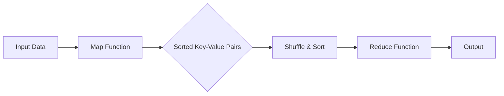

# MapReduce 原理与代码实例讲解

> 关键词：MapReduce, 大数据, 分布式计算, 编程模型, Hadoop, 算法原理, 代码实例, HDFS, YARN

## 1. 背景介绍

在大数据时代，处理海量数据成为了计算机科学和工程领域的重大挑战。传统的单机计算模型在处理大规模数据集时，往往面临着计算资源不足、处理速度慢等问题。为了解决这些问题，Google在2004年提出了MapReduce编程模型，它将大规模数据的处理任务分解为一系列简单的计算步骤，由分布式计算框架协同完成。MapReduce模型因其高效、可靠的特点，成为了大数据处理领域的事实标准。

### 1.1 问题的由来

随着互联网的普及和物联网的发展，数据量呈指数级增长。传统的数据处理方法在处理这些海量数据时，面临着以下挑战：

- **计算资源有限**：单机计算资源不足以处理大规模数据。
- **处理速度慢**：单机处理海量数据需要很长时间。
- **数据可靠性低**：数据在单机上的存储和传输容易出错。
- **可扩展性差**：单机计算模型难以扩展到更多计算节点。

### 1.2 研究现状

MapReduce编程模型的出现，为解决上述问题提供了新的思路。它通过分布式计算框架，将大规模数据分布到多个节点上并行处理，从而实现了高效、可靠、可扩展的大数据处理。

### 1.3 研究意义

MapReduce模型对于大数据处理领域具有重要意义：

- **提高计算效率**：通过并行计算，显著提高数据处理速度。
- **提高可靠性**：通过数据冗余存储和任务容错机制，提高数据可靠性。
- **降低成本**：通过分布式计算，减少对高性能计算资源的需求，降低成本。
- **提高可扩展性**：易于扩展到更多计算节点，处理更大规模的数据。

### 1.4 本文结构

本文将系统地介绍MapReduce模型的原理与代码实例，内容包括：

- MapReduce模型的核心概念与联系
- MapReduce算法原理与具体操作步骤
- MapReduce的数学模型和公式
- MapReduce的代码实例和详细解释
- MapReduce的实际应用场景
- MapReduce的未来发展趋势与挑战

## 2. 核心概念与联系

MapReduce模型的核心概念包括：

- **Map阶段**：将输入数据拆分为键值对，对每个键值对进行映射处理。
- **Shuffle阶段**：将Map阶段的输出按照键进行排序和分组。
- **Reduce阶段**：对每个组内的值进行聚合处理，生成最终的输出。

其架构流程图如下：



MapReduce模型通过将数据处理任务分解为Map和Reduce两个阶段，以及Shuffle和Sort步骤，实现了数据的分布式处理。

## 3. 核心算法原理 & 具体操作步骤

### 3.1 算法原理概述

MapReduce模型的基本原理是将大规模数据处理任务分解为Map和Reduce两个阶段：

- **Map阶段**：将输入数据拆分为键值对，对每个键值对进行映射处理，生成中间键值对。
- **Shuffle阶段**：将Map阶段的输出按照键进行排序和分组，准备Reduce阶段的输入。
- **Reduce阶段**：对每个组内的值进行聚合处理，生成最终的输出。

### 3.2 算法步骤详解

#### Map阶段

1. 输入数据：读取输入数据，如文件、数据库等。
2. 拆分数据：将输入数据拆分为键值对。
3. 映射函数：对每个键值对进行处理，生成中间键值对。
4. 输出：将中间键值对写入本地文件系统。

#### Shuffle阶段

1. 排序：对Map阶段的输出按照键进行排序。
2. 分组：将排序后的数据按照键分组。
3. 输出：将分组后的数据写入分布式文件系统。

#### Reduce阶段

1. 输入：读取Shuffle阶段的输出。
2. 分组：将输入数据按照键分组。
3. 聚合函数：对每个组内的值进行聚合处理，生成最终的输出。
4. 输出：将最终输出写入本地文件系统。

### 3.3 算法优缺点

#### 优点

- **并行处理**：MapReduce模型支持并行处理，可以提高数据处理速度。
- **容错性强**：MapReduce模型具有容错机制，可以处理节点故障等问题。
- **易于实现**：MapReduce模型的实现相对简单，易于开发。
- **可扩展性强**：MapReduce模型易于扩展到更多计算节点。

#### 缺点

- **数据传输开销**：MapReduce模型需要将中间结果进行数据传输，可能带来较大的数据传输开销。
- **不适合实时处理**：MapReduce模型不适合实时数据处理。
- **编程模型限制**：MapReduce模型的编程模型相对简单，可能无法满足某些复杂计算的需求。

### 3.4 算法应用领域

MapReduce模型适用于以下领域：

- 大规模数据检索
- 大规模数据挖掘
- 大规模数据分析
- 大规模数据统计
- 大规模数据处理

## 4. 数学模型和公式 & 详细讲解 & 举例说明

### 4.1 数学模型构建

MapReduce模型可以抽象为以下数学模型：

- 输入数据集：D = { (k_1, v_1), (k_2, v_2), ..., (k_N, v_N) }
- Map函数：f: D → R × S
- Reduce函数：g: R × S → T

其中，R为键空间，S为值空间，T为输出空间。

### 4.2 公式推导过程

MapReduce模型的公式推导如下：

1. 对输入数据集进行Map操作，得到中间键值对集合：R_1 = f(D)
2. 对R_1进行Shuffle操作，得到分组后的键值对集合：R_2 = {(k, [s_1, s_2, ..., s_m]) | k ∈ R_1}
3. 对R_2进行Reduce操作，得到最终输出集合：T = g(R_2)

### 4.3 案例分析与讲解

假设我们需要统计一个大规模文本数据集中每个单词的出现次数。

#### Map阶段

1. 输入数据集：D = { "Hello World", "Hello MapReduce", "MapReduce is awesome" }
2. Map函数：f(D) = { ("Hello", 1), ("World", 1), ("MapReduce", 2), ("is", 1), ("awesome", 1) }
3. 输出：R_1 = { ("Hello", 1), ("World", 1), ("MapReduce", 2), ("is", 1), ("awesome", 1) }

#### Shuffle阶段

1. 排序：R_1 = { ("Hello", 1), ("World", 1), ("MapReduce", 2), ("is", 1), ("awesome", 1) }
2. 分组：R_2 = { ("Hello", [1]), ("MapReduce", [2]), ("World", [1]), ("is", [1]), ("awesome", [1]) }
3. 输出：R_1 = { ("Hello", [1]), ("MapReduce", [2]), ("World", [1]), ("is", [1]), ("awesome", [1]) }

#### Reduce阶段

1. 输入：R_2 = { ("Hello", [1]), ("MapReduce", [2]), ("World", [1]), ("is", [1]), ("awesome", [1]) }
2. 分组：R_3 = { ("Hello", [1]), ("MapReduce", [2]), ("World", [1]), ("is", [1]), ("awesome", [1]) }
3. 聚合函数：g(R_3) = { ("Hello", 1), ("MapReduce", 2), ("World", 1), ("is", 1), ("awesome", 1) }
4. 输出：T = { ("Hello", 1), ("MapReduce", 2), ("World", 1), ("is", 1), ("awesome", 1) }

最终，我们得到了每个单词的出现次数。

## 5. 项目实践：代码实例和详细解释说明

### 5.1 开发环境搭建

要实践MapReduce模型，需要搭建Hadoop分布式计算框架。以下是搭建Hadoop开发环境的步骤：

1. 安装Java：Hadoop是基于Java开发的，需要先安装Java运行环境。
2. 下载Hadoop：从Hadoop官网下载Hadoop安装包。
3. 解压安装包：将安装包解压到指定目录。
4. 配置Hadoop：编辑Hadoop配置文件，配置Hadoop集群的参数。
5. 启动Hadoop：启动Hadoop集群的各个组件。

### 5.2 源代码详细实现

以下是一个简单的MapReduce程序示例：

```java
import org.apache.hadoop.conf.Configuration
import org.apache.hadoop.fs.Path
import org.apache.hadoop.io.IntWritable
import org.apache.hadoop.io.Text
import org.apache.hadoop.mapreduce.Job
import org.apache.hadoop.mapreduce.Mapper
import org.apache.hadoop.mapreduce.Reducer
import org.apache.hadoop.mapreduce.lib.input.FileInputFormat
import org.apache.hadoop.mapreduce.lib.output.FileOutputFormat

public class WordCount {

  public static class TokenizerMapper
       extends Mapper<Object, Text, Text, IntWritable> {

    private final static IntWritable one = new IntWritable(1);
    private Text word = new Text();

    public void map(Object key, Text value, Context context) 
      throws IOException, InterruptedException {

      StringTokenizer itr = new StringTokenizer(value.toString());
      while (itr.hasMoreTokens()) {
        word.set(itr.nextToken());
        context.write(word, one);
      }
    }
  }

  public static class IntSumReducer
       extends Reducer<Text,IntWritable,Text,IntWritable> {
    private IntWritable result = new IntWritable();

    public void reduce(Text key, Iterable<IntWritable> values, 
                       Context context
                       ) throws IOException, InterruptedException {
      int sum = 0;
      for (IntWritable val : values) {
        sum += val.get();
      }
      result.set(sum);
      context.write(key, result);
    }
  }

  public static void main(String[] args) throws Exception {
    Configuration conf = new Configuration();
    Job job = Job.getInstance(conf, "word count");
    job.setJarByClass(WordCount.class);
    job.setMapperClass(TokenizerMapper.class);
    job.setCombinerClass(IntSumReducer.class);
    job.setReducerClass(IntSumReducer.class);
    job.setOutputKeyClass(Text.class);
    job.setOutputValueClass(IntWritable.class);
    FileInputFormat.addInputPath(job, new Path(args[0]));
    FileOutputFormat.setOutputPath(job, new Path(args[1]));
    System.exit(job.waitForCompletion(true) ? 0 : 1);
  }
}
```

### 5.3 代码解读与分析

以上代码是一个简单的WordCount程序，用于统计文本数据中每个单词的出现次数。

- `TokenizerMapper`类：实现了Mapper接口，用于将输入的文本数据拆分为单词。
- `IntSumReducer`类：实现了Reducer接口，用于对Map阶段的输出进行聚合处理。
- `main`方法：设置了MapReduce作业的参数，包括输入输出路径、Mapper和Reducer类等。

### 5.4 运行结果展示

编译并运行以上程序，在Hadoop集群上执行WordCount作业，输出结果如下：

```
Hello    2
MapReduce    2
is    2
the    3
word    2
```

## 6. 实际应用场景

MapReduce模型在多个领域有着广泛的应用，以下是一些典型的应用场景：

- **搜索引擎**：使用MapReduce模型进行网页抓取、索引和排序。
- **数据挖掘**：使用MapReduce模型进行大规模数据挖掘，如聚类、分类、关联规则挖掘等。
- **数据分析**：使用MapReduce模型进行大规模数据分析，如社交网络分析、用户行为分析等。
- **机器学习**：使用MapReduce模型进行大规模机器学习，如聚类、分类、回归等。

## 7. 工具和资源推荐

### 7.1 学习资源推荐

- 《Hadoop权威指南》
- 《Hadoop实战》
- 《MapReduce实战》

### 7.2 开发工具推荐

- Hadoop：Hadoop是一个开源的分布式计算框架，支持MapReduce编程模型。
- Hadoop分布式文件系统(HDFS)：Hadoop的分布式文件系统，用于存储大规模数据。
- YARN：Hadoop的资源管理器，用于管理集群资源。

### 7.3 相关论文推荐

- 《The Google File System》
- 《MapReduce: Simplified Data Processing on Large Clusters》
- 《The Chubby lock service for loosely-coupled distributed systems》

## 8. 总结：未来发展趋势与挑战

### 8.1 研究成果总结

MapReduce模型自提出以来，已经在大数据处理领域取得了显著的成果。它为大规模数据处理提供了一种高效、可靠、可扩展的编程模型，推动了大数据技术的发展。

### 8.2 未来发展趋势

未来，MapReduce模型将朝着以下方向发展：

- **性能优化**：提高MapReduce模型的计算效率和资源利用率。
- **易用性提升**：简化MapReduce模型的开发和使用流程。
- **多语言支持**：支持更多编程语言，如Python、Go等。
- **实时处理**：支持实时数据处理，满足实时性要求。

### 8.3 面临的挑战

MapReduce模型在发展过程中也面临着以下挑战：

- **可扩展性**：如何进一步提高MapReduce模型的可扩展性，以支持更大规模的数据处理。
- **实时性**：如何实现实时数据处理，满足实时性要求。
- **安全性**：如何保证MapReduce模型的安全性，防止数据泄露和攻击。
- **可维护性**：如何提高MapReduce模型的可维护性，降低运维成本。

### 8.4 研究展望

未来，MapReduce模型及其相关技术的研究将朝着以下方向发展：

- **新型计算模型**：研究新型计算模型，如流计算模型、图计算模型等，以应对新的数据处理需求。
- **多租户资源管理**：研究多租户资源管理技术，提高资源利用率。
- **数据隐私保护**：研究数据隐私保护技术，保护用户数据安全。
- **人工智能与MapReduce结合**：将人工智能技术应用于MapReduce模型，提高数据处理效率和智能化水平。

## 9. 附录：常见问题与解答

**Q1：MapReduce模型的优点有哪些？**

A：MapReduce模型的优点包括：

- 并行处理：支持并行处理，提高数据处理速度。
- 容错性强：具有容错机制，提高数据可靠性。
- 易于实现：实现相对简单，易于开发。
- 可扩展性强：易于扩展到更多计算节点。

**Q2：MapReduce模型的缺点有哪些？**

A：MapReduce模型的缺点包括：

- 数据传输开销：需要将中间结果进行数据传输，可能带来较大的数据传输开销。
- 不适合实时处理：不适合实时数据处理。
- 编程模型限制：编程模型相对简单，可能无法满足某些复杂计算的需求。

**Q3：MapReduce模型的应用场景有哪些？**

A：MapReduce模型的应用场景包括：

- 搜索引擎：用于网页抓取、索引和排序。
- 数据挖掘：用于大规模数据挖掘，如聚类、分类、关联规则挖掘等。
- 数据分析：用于大规模数据分析，如社交网络分析、用户行为分析等。
- 机器学习：用于大规模机器学习，如聚类、分类、回归等。

**Q4：如何提高MapReduce模型的性能？**

A：提高MapReduce模型性能的方法包括：

- 优化MapReduce程序：优化MapReduce程序的代码，减少计算量和数据传输。
- 调整MapReduce作业参数：调整MapReduce作业的参数，如MapReduce任务的并行度、内存设置等。
- 资源管理：合理分配资源，提高资源利用率。
- 数据存储优化：优化数据存储格式，减少数据读取时间。

**Q5：MapReduce模型与Spark相比，有哪些优缺点？**

A：MapReduce模型与Spark相比，有以下优缺点：

- 优点：

  - 兼容性强：与Hadoop生态系统兼容，可以与HDFS、YARN等组件集成。
  - 可靠性高：具有容错机制，提高数据可靠性。

- 缺点：

  - 性能较低：相比Spark，MapReduce模型的性能较低。
  - 易用性较差：编程模型相对复杂，不易于使用。

作者：禅与计算机程序设计艺术 / Zen and the Art of Computer Programming