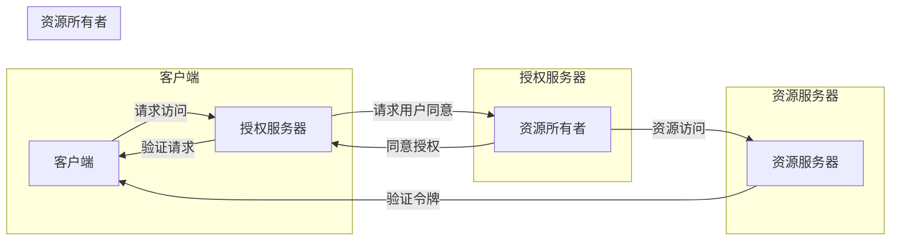

# OAuth 2.0 的实现细节

> 关键词：OAuth 2.0, 认证授权, 安全性, API, 第三方应用, 令牌, 授权码流程, 密码凭证流程, 客户端认证

## 1. 背景介绍

随着互联网应用的普及，用户数据的安全和隐私保护变得尤为重要。OAuth 2.0 是一种开放标准，用于授权第三方应用访问服务器资源，而不需要将用户名和密码提供给第三方应用。它提供了一种安全的方式来访问受保护的网络资源，保护用户的隐私和安全性。

### 1.1 问题的由来

在传统的客户端-服务器模型中，客户端（如手机应用或网页）需要向服务器请求访问用户数据。为了安全起见，客户端通常会存储用户的用户名和密码，并在每次请求时发送这些凭证。这种方法存在以下问题：

- 用户密码泄露风险：如果客户端存储的密码被窃取，用户的账户安全将受到威胁。
- 服务器安全风险：服务器需要存储和管理大量用户的敏感信息，增加了安全风险。
- 不支持第三方应用：用户无法信任第三方应用，因为这些应用可能不安全或恶意。

### 1.2 研究现状

OAuth 2.0 通过引入令牌（tokens）机制，解决了上述问题。它允许用户授权第三方应用访问他们的资源，而不需要直接提供用户凭证。OAuth 2.0 定义了多种授权流程，适用于不同的场景。

### 1.3 研究意义

OAuth 2.0 的出现对于构建安全的互联网应用具有重要意义：

- 保护用户隐私和安全：用户不需要将密码提供给第三方应用，从而降低了密码泄露的风险。
- 支持第三方应用：用户可以信任第三方应用，因为这些应用无法访问用户的凭据。
- 简化开发过程：开发者可以轻松集成OAuth 2.0，提高应用的安全性。

## 2. 核心概念与联系

OAuth 2.0 定义了一系列核心概念和术语，以下是其中一些关键概念：

- **客户端**：请求访问资源的应用程序。
- **资源所有者**：拥有资源并授予第三方应用访问权限的用户。
- **授权服务器**：负责处理客户端授权请求的服务器。
- **资源服务器**：存储受保护资源的服务器。
- **访问令牌**：由授权服务器颁发的令牌，允许客户端访问资源。

以下是一个Mermaid流程图，展示了OAuth 2.0中的核心流程：



## 3. 核心算法原理 & 具体操作步骤

### 3.1 算法原理概述

OAuth 2.0 的核心原理是使用令牌代替用户凭证。以下是OAuth 2.0中常见的授权流程：

- **授权码流程**：适用于客户端和用户之间存在安全连接的情况。
- **隐式流程**：适用于资源服务器和用户代理之间没有安全连接的情况。
- **密码凭证流程**：适用于客户端可以安全地存储用户凭证的情况。
- **客户端凭证流程**：适用于客户端和资源服务器之间有信任关系的情况。

### 3.2 算法步骤详解

以下以授权码流程为例，详细说明OAuth 2.0的操作步骤：

1. 客户端请求用户同意访问授权服务器。
2. 用户同意访问，授权服务器颁发授权码。
3. 客户端使用授权码向资源服务器请求访问令牌。
4. 资源服务器验证授权码，并向客户端颁发访问令牌。
5. 客户端使用访问令牌访问资源服务器。

### 3.3 算法优缺点

OAuth 2.0 优点：

- 安全：通过令牌机制，避免了用户凭证的直接传输。
- 灵活：支持多种授权流程，适用于不同场景。
- 简便：实现简单，易于集成。

OAuth 2.0 缺点：

- 复杂性：对于新手来说，理解和使用OAuth 2.0可能较为困难。
- 安全风险：如果授权码泄露，可能导致用户资源被非法访问。

### 3.4 算法应用领域

OAuth 2.0 已被广泛应用于以下领域：

- 社交登录：用户可以使用第三方账号登录到其他网站或应用程序。
- API访问控制：第三方应用程序可以访问受保护的API，而不需要直接访问用户凭证。
- 跨域请求：允许客户端跨域访问资源服务器。

## 4. 数学模型和公式 & 详细讲解 & 举例说明

OAuth 2.0 主要涉及身份验证和授权过程，不涉及复杂的数学模型和公式。以下是OAuth 2.0中一些关键术语的解释：

- **令牌（Token）**：由授权服务器颁发的字符串，用于访问资源。
- **密钥（Secret）**：客户端用于验证其身份的密钥。
- **签名（Signature）**：使用密钥对请求进行签名，以确保请求的完整性。

以下是一个示例，展示了OAuth 2.0授权码流程中令牌的生成：

```python
import jwt
import datetime

def generate_token(client_id, client_secret, scope):
    # 创建JWT令牌
    payload = {
        'iss': client_id,  # 发行者
        'sub': client_id,  # 主题
        'aud': 'resource_server',  # 受众
        'exp': datetime.datetime.utcnow() + datetime.timedelta(hours=1),  # 过期时间
        'scope': scope,  # 权限范围
    }
    secret = client_secret
    encoded_token = jwt.encode(payload, secret, algorithm='HS256')
    return encoded_token
```

在这个例子中，我们使用JWT（JSON Web Tokens）格式生成令牌。JWT是一种紧凑且安全的格式，用于在网络上安全地传输信息。

## 5. 项目实践：代码实例和详细解释说明

### 5.1 开发环境搭建

以下是使用Python和Flask框架实现OAuth 2.0授权服务器的步骤：

1. 安装Flask：
```bash
pip install flask
```

2. 创建Flask应用：
```python
from flask import Flask, request, jsonify, make_response

app = Flask(__name__)

# 配置客户端ID和密钥
CLIENT_ID = 'your_client_id'
CLIENT_SECRET = 'your_client_secret'

@app.route('/authorize', methods=['GET'])
def authorize():
    # 获取客户端ID和回调URL
    client_id = request.args.get('client_id')
    redirect_uri = request.args.get('redirect_uri')

    # 验证客户端ID
    if client_id != CLIENT_ID:
        return make_response('Unauthorized', 401)

    # 提示用户同意授权
    return '''
        <html>
        <body>
            <h1>Authorize</h1>
            <p>Are you sure you want to grant access to the client ID: {}?</p>
            <form action="/approve" method="post">
                <input type="hidden" name="client_id" value="{}">
                <input type="hidden" name="redirect_uri" value="{}">
                <input type="submit" value="Approve">
            </form>
        </body>
        </html>
    '''.format(client_id, client_id, redirect_uri)

@app.route('/approve', methods=['POST'])
def approve():
    # 获取客户端ID、回调URL和作用域
    client_id = request.form.get('client_id')
    redirect_uri = request.form.get('redirect_uri')
    scope = request.form.get('scope', 'default')

    # 颁发授权码
    authorization_code = generate_token(client_id, CLIENT_SECRET, scope)
    return jsonify({'authorization_code': authorization_code})

if __name__ == '__main__':
    app.run(debug=True)
```

### 5.2 源代码详细实现

以上代码实现了一个简单的OAuth 2.0授权服务器。客户端可以通过访问`/authorize`接口请求用户同意，用户同意后，授权服务器将生成授权码并返回给客户端。客户端可以使用授权码请求访问令牌。

### 5.3 代码解读与分析

- `authorize`函数处理客户端的授权请求，并返回一个HTML表单，让用户确认是否授权。
- `approve`函数处理用户的授权请求，并颁发授权码。
- `generate_token`函数使用JWT生成授权码。

### 5.4 运行结果展示

运行上述代码后，访问`http://localhost:5000/authorize?client_id=your_client_id&redirect_uri=http://localhost:5000/callback`，将看到一个HTML表单，提示用户是否同意授权。

## 6. 实际应用场景

OAuth 2.0 在实际应用场景中非常广泛，以下是一些常见的应用：

- 社交登录：用户可以使用Facebook、Google等社交平台账号登录到其他网站或应用程序。
- API访问控制：第三方应用程序可以访问受保护的API，而不需要直接访问用户凭证。
- 跨域请求：允许客户端跨域访问资源服务器。

## 7. 工具和资源推荐

### 7.1 学习资源推荐

- OAuth 2.0官方文档：[https://tools.ietf.org/html/rfc6749](https://tools.ietf.org/html/rfc6749)
- OAuth 2.0认证服务器实现示例：[https://oauth2-client-server-python.readthedocs.io/en/latest/](https://oauth2-client-server-python.readthedocs.io/en/latest/)

### 7.2 开发工具推荐

- Flask：[https://flask.palletsprojects.com/](https://flask.palletsprojects.com/)
- JWT：[https://pyjwt.readthedocs.io/en/latest/](https://pyjwt.readthedocs.io/en/latest/)

### 7.3 相关论文推荐

- RFC 6749：[https://tools.ietf.org/html/rfc6749](https://tools.ietf.org/html/rfc6749)
- OAuth 2.0 Authorization Server Implementation: [https://tools.ietf.org/html/draft-ietf-oauth-introduce-authorization-server-14](https://tools.ietf.org/html/draft-ietf-oauth-introduce-authorization-server-14)

## 8. 总结：未来发展趋势与挑战

### 8.1 研究成果总结

OAuth 2.0 作为一种开放标准，已经广泛应用于互联网应用中。它提供了一种安全的方式来访问受保护的网络资源，保护用户的隐私和安全性。

### 8.2 未来发展趋势

OAuth 2.0 的未来发展趋势：

- 支持更多场景：OAuth 2.0 将支持更多场景，如物联网、移动应用等。
- 安全性提升：OAuth 2.0 将引入更多安全机制，如令牌绑定、攻击防御等。
- 标准化：OAuth 2.0 将进一步标准化，提高互操作性。

### 8.3 面临的挑战

OAuth 2.0 面临的挑战：

- 安全风险：OAuth 2.0 如果实现不当，可能导致安全风险。
- 复杂性：OAuth 2.0 的实现较为复杂，对于新手来说可能难以理解。

### 8.4 研究展望

OAuth 2.0 的研究展望：

- 简化实现：开发更简单的OAuth 2.0 实现工具，降低实现难度。
- 安全性增强：研究新的安全机制，提高OAuth 2.0 的安全性。
- 标准化：推动OAuth 2.0 的标准化工作，提高互操作性。

## 9. 附录：常见问题与解答

**Q1：OAuth 2.0 与OAuth 1.0有什么区别？**

A: OAuth 1.0 和OAuth 2.0 都是用于授权的协议，但它们之间存在一些关键区别。OAuth 1.0 主要用于Web应用程序，而OAuth 2.0 支持更广泛的场景，包括移动应用程序。OAuth 2.0 还引入了令牌机制，简化了授权流程。

**Q2：OAuth 2.0 是否支持用户取消授权？**

A: 是的，OAuth 2.0 支持用户取消授权。用户可以通过访问授权服务器上的特定URL来取消授权。

**Q3：OAuth 2.0 是否支持刷新令牌？**

A: 是的，OAuth 2.0 支持刷新令牌。刷新令牌可以在访问令牌过期后，用于获取新的访问令牌，而无需用户重新授权。

**Q4：OAuth 2.0 是否支持多因素认证？**

A: OAuth 2.0 本身不提供多因素认证机制，但可以与其他安全机制（如Two-Factor Authentication, 2FA）结合使用，实现多因素认证。

**Q5：OAuth 2.0 的安全性如何保证？**

A: OAuth 2.0 的安全性主要通过以下方式保证：

- 使用安全的通信协议（如HTTPS）
- 使用强密码和密钥
- 使用令牌机制，避免用户凭证泄露
- 使用刷新令牌，防止令牌被滥用

---

作者：禅与计算机程序设计艺术 / Zen and the Art of Computer Programming