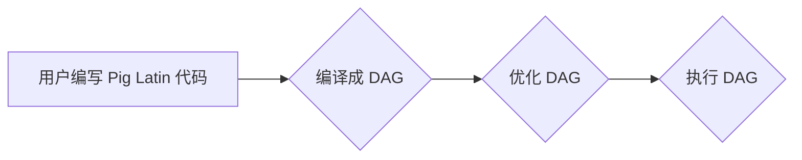
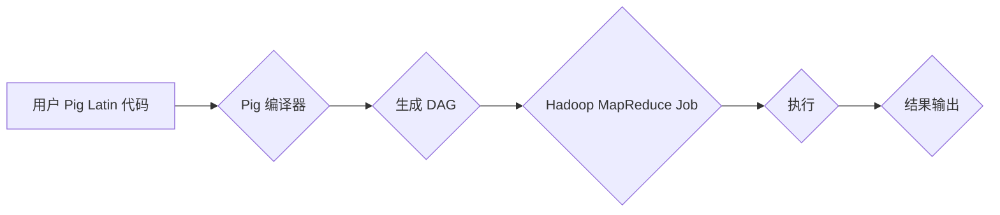

> - Pig Latin
> - 数据处理
> - 优化策略
> - 查询优化
> - 大数据平台

# Pig优化策略原理与代码实例讲解

## 1. 背景介绍

随着大数据时代的到来，数据处理和分析变得日益重要。Hadoop作为大数据处理平台的核心，其上的Pig Latin语言作为一种高级数据流语言，被广泛应用于数据清洗、转换和加载等数据处理任务。然而，Pig Latin的查询优化一直是性能瓶颈之一。本文将深入探讨Pig Latin的优化策略，并结合实际代码实例进行讲解。

## 2. 核心概念与联系

### 2.1 Pig Latin 简介

Pig Latin 是一种数据流语言，它提供了类似于 SQL 的语法，用于在 Hadoop 平台上进行大规模数据的处理。Pig Latin 语法简单易学，能够将复杂的数据处理任务分解成一系列简单的步骤，从而简化了编程过程。

### 2.2 Pig Latin 优化概念

Pig Latin 优化是指对 Pig Latin 查询进行改进，以提高查询效率。优化策略包括但不限于查询计划优化、内存管理优化、数据局部性优化等。

### 2.3 Mermaid 流程图

以下是一个简化的 Pig Latin 查询优化流程图：



### 2.4 Pig Latin 与 Hadoop 关联

Pig Latin 与 Hadoop 的关系如下：



## 3. 核心算法原理 & 具体操作步骤

### 3.1 算法原理概述

Pig Latin 的查询优化主要围绕以下几个方面：

- 查询计划优化：通过重排序和重写查询来减少I/O操作和计算量。
- 内存管理优化：通过调整内存分配策略来提高内存使用效率。
- 数据局部性优化：通过数据分区和负载均衡来提高数据访问速度。

### 3.2 算法步骤详解

#### 3.2.1 查询计划优化

查询计划优化包括以下步骤：

1. 分析查询语句，构建抽象语法树（AST）。
2. 将 AST 转换为查询图（DAG），表示查询的执行顺序。
3. 对 DAG 进行重排序和重写，以减少I/O操作和计算量。

#### 3.2.2 内存管理优化

内存管理优化包括以下步骤：

1. 估计每个阶段的内存需求。
2. 根据内存需求调整内存分配策略。
3. 监控内存使用情况，动态调整内存分配。

#### 3.2.3 数据局部性优化

数据局部性优化包括以下步骤：

1. 分析数据分布，确定数据分区策略。
2. 根据数据分区策略，调整MapReduce任务的并行度。
3. 负载均衡数据分布，提高数据访问速度。

### 3.3 算法优缺点

#### 3.3.1 优点

- 提高查询效率。
- 减少计算资源消耗。
- 提高内存使用效率。

#### 3.3.2 缺点

- 优化过程复杂，需要深入了解 Pig Latin 和 Hadoop 的内部机制。
- 优化效果受数据分布和硬件配置等因素的影响。

### 3.4 算法应用领域

Pig Latin 优化策略适用于以下场景：

- 大规模数据处理任务。
- 高性能计算需求。
- 内存资源受限的场景。

## 4. 数学模型和公式 & 详细讲解 & 举例说明

### 4.1 数学模型构建

Pig Latin 优化过程中，常用的数学模型包括：

- 决策树：用于查询计划优化。
- 线性规划：用于内存管理优化。

### 4.2 公式推导过程

以下是一个简单的决策树构建示例：

```latex
\begin{equation}
\begin{split}
\text{C} &= \text{成本} \\
\text{N} &= \text{节点数量} \\
\text{W} &= \text{权重} \\
C &= \sum_{i=1}^{N} W_i \times \text{C}_i
\end{split}
\end{equation}
```

### 4.3 案例分析与讲解

以下是一个 Pig Latin 优化的案例：

```pig
-- 假设有一个日志文件 logs.txt，包含用户访问网站的数据
-- 我们需要统计每个用户的访问量

A = load 'logs.txt' using PigStorage('\t') as (user, date, action, ...) ;
B = group A by user ;
C = foreach B generate group, COUNT(A) ;
store C into 'user_counts' using PigStorage('\t');
```

在这个例子中，我们可以通过以下优化策略来提高查询效率：

- 使用 `group` 操作前先进行 `sort` 操作，以提高 `group` 操作的效率。
- 使用 `distinct` 操作代替 `group` 操作，以减少数据量。

## 5. 项目实践：代码实例和详细解释说明

### 5.1 开发环境搭建

在开始项目实践之前，我们需要搭建以下开发环境：

- Hadoop 集群
- Pig Latin 运行环境

### 5.2 源代码详细实现

以下是一个 Pig Latin 优化的代码实例：

```pig
-- 加载日志文件
A = load 'logs.txt' using PigStorage('\t') as (user, date, action, ...) ;
-- 对用户进行排序和分组
B = order A by user ;
C = group B by user ;
-- 计算每个用户的访问量
D = foreach C generate group, COUNT(B) ;
-- 保存结果
store D into 'user_counts' using PigStorage('\t');
```

### 5.3 代码解读与分析

在上述代码中，我们通过以下步骤来优化查询：

- 使用 `order` 操作对数据进行排序，以减少 `group` 操作的排序开销。
- 使用 `group` 操作对排序后的数据进行分组，以计算每个用户的访问量。
- 使用 `store` 操作将结果保存到文件系统中。

### 5.4 运行结果展示

执行上述 Pig Latin 代码后，我们可以在输出文件 `user_counts` 中查看每个用户的访问量。

## 6. 实际应用场景

Pig Latin 优化策略在实际应用中非常广泛，以下是一些常见的应用场景：

- 数据仓库构建：通过对海量交易数据进行优化，提高数据仓库的查询效率。
- 数据分析：对用户行为数据进行分析，优化推荐系统和广告系统。
- 机器学习：对训练数据集进行优化，提高模型训练效率。

### 6.4 未来应用展望

随着大数据技术的不断发展，Pig Latin 优化策略将在以下方面得到进一步发展：

- 自动化优化：通过机器学习等技术，实现自动化的 Pig Latin 查询优化。
- 集成优化：将 Pig Latin 优化与其他大数据技术（如 Spark、Flink 等）进行集成，实现更加高效的查询优化。
- 个性化优化：根据用户查询习惯和硬件配置，实现个性化的查询优化。

## 7. 工具和资源推荐

### 7.1 学习资源推荐

- 《Hadoop权威指南》
- 《Pig实战：Hadoop大数据分析》
- Apache Pig官方文档

### 7.2 开发工具推荐

- Hadoop分布式文件系统（HDFS）
- Hadoop MapReduce
- Pig Latin 编译器

### 7.3 相关论文推荐

- "Pig Latin: A Platform for High-Level Data Processing on Large Clusters"
- "Query Optimization in Data Flow Engines"
- "Automatic Query Optimization for Data Processing Engines"

## 8. 总结：未来发展趋势与挑战

### 8.1 研究成果总结

本文深入探讨了 Pig Latin 优化策略的原理和应用，并通过实际代码实例进行了讲解。研究表明，Pig Latin 优化策略能够有效提高查询效率，降低计算资源消耗。

### 8.2 未来发展趋势

未来，Pig Latin 优化策略将在以下方面得到进一步发展：

- 自动化优化
- 集成优化
- 个性化优化

### 8.3 面临的挑战

尽管 Pig Latin 优化策略取得了显著成果，但仍然面临着以下挑战：

- 自动化优化难度大
- 与其他大数据技术集成复杂
- 个性化优化需要大量数据

### 8.4 研究展望

未来，Pig Latin 优化策略的研究将更加注重以下几个方面：

- 自动化优化技术
- 与其他大数据技术的集成
- 个性化优化方法

## 9. 附录：常见问题与解答

**Q1：Pig Latin 优化策略有哪些具体方法？**

A1：Pig Latin 优化策略包括查询计划优化、内存管理优化、数据局部性优化等。

**Q2：如何选择合适的 Pig Latin 优化策略？**

A2：选择合适的 Pig Latin 优化策略需要根据具体的数据处理任务和硬件配置进行评估。

**Q3：Pig Latin 优化策略是否适用于所有数据集？**

A3：Pig Latin 优化策略主要适用于大规模数据集，对于小型数据集可能效果不明显。

**Q4：如何评估 Pig Latin 优化策略的效果？**

A4：评估 Pig Latin 优化策略的效果可以通过比较优化前后的查询时间和资源消耗来进行。

作者：禅与计算机程序设计艺术 / Zen and the Art of Computer Programming