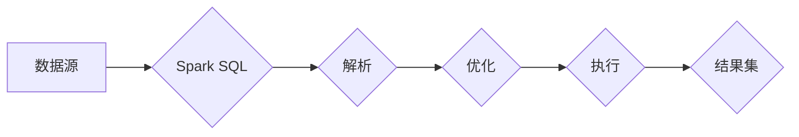

# Spark SQL 原理与代码实例讲解

> 关键词：Spark SQL，分布式计算，大数据处理，内存计算，SQL on Hadoop，数据处理框架

## 1. 背景介绍

随着大数据时代的到来，数据量呈爆炸式增长，传统的数据处理方式已经无法满足需求。Apache Spark 作为一款强大的分布式计算框架，以其高效的内存计算能力和灵活的数据处理能力，成为了大数据领域的明星产品。Spark SQL 作为 Spark 生态系统的一部分，提供了丰富的 SQL 语言支持，能够以 SQL 的方式处理结构化数据，极大地简化了大数据处理流程。本文将深入讲解 Spark SQL 的原理与应用，并通过代码实例展示其具体操作方法。

## 2. 核心概念与联系

### 2.1 核心概念

- **分布式计算**：指将计算任务分解成多个子任务，在多台机器上并行执行，最终合并结果的过程。
- **内存计算**：指将数据存储在内存中，以提高数据处理速度。
- **SQL on Hadoop**：指在 Hadoop 生态系统中使用 SQL 语言进行数据处理。
- **数据处理框架**：指用于处理大规模数据集的软件框架，如 Spark、Hadoop 等。

### 2.2 架构流程图



数据源（A）通过 Spark SQL（B）进行解析、优化（C、D），最终生成结果集（F）。

## 3. 核心算法原理 & 具体操作步骤

### 3.1 算法原理概述

Spark SQL 利用 Spark 的分布式计算能力，将 SQL 查询分解为多个子任务，在集群上并行执行。它通过以下步骤实现：

1. **解析**：将 SQL 语句解析为逻辑计划。
2. **优化**：对逻辑计划进行优化，如转换、合并等。
3. **执行**：将优化后的逻辑计划转换为物理计划，并在集群上执行。
4. **结果集**：将执行结果收集并返回给用户。

### 3.2 算法步骤详解

1. **解析**：Spark SQL 使用 Spark 的 SQL 解析器将 SQL 语句解析为抽象语法树（AST）。
2. **优化**：Spark SQL 使用 Catalyst 查询优化器对 AST 进行优化，如谓词下推、连接重排等。
3. **执行**：优化后的逻辑计划转换为物理计划，并使用 Spark 的执行引擎进行分布式执行。
4. **结果集**：执行引擎将结果集收集并返回给用户。

### 3.3 算法优缺点

**优点**：

- **高效**：利用 Spark 的分布式计算能力和内存计算特性，Spark SQL 能够快速处理大规模数据集。
- **灵活**：支持多种数据源，如 HDFS、HBase、Cassandra 等。
- **易用**：支持 SQL 语言，易于学习和使用。

**缺点**：

- **复杂性**：Spark SQL 的架构和实现相对复杂，需要一定的学习成本。
- **资源消耗**：Spark SQL 的运行需要一定的资源，如内存和 CPU。

### 3.4 算法应用领域

- **数据仓库**：Spark SQL 可以用于构建数据仓库，实现数据分析和报告。
- **实时分析**：Spark SQL 可以用于实时数据流分析，如日志分析、电商分析等。
- **机器学习**：Spark SQL 可以用于机器学习，如数据预处理、特征提取等。

## 4. 数学模型和公式 & 详细讲解 & 举例说明

### 4.1 数学模型构建

Spark SQL 使用 Catalyst 查询优化器对 SQL 查询进行优化。Catalyst 是一个基于 Scala 的查询优化框架，它使用逻辑计划和物理计划来优化 SQL 查询。

### 4.2 公式推导过程

Catalyst 查询优化器主要使用以下公式进行推导：

- **谓词下推**：将谓词条件从高层推到低层，提高查询效率。
- **连接重排**：调整连接顺序，以减少连接操作的计算量。

### 4.3 案例分析与讲解

以下是一个使用 Spark SQL 进行数据查询的实例：

```sql
SELECT name, age FROM users WHERE age > 20;
```

这个查询首先通过 Spark SQL 的解析器解析成 AST，然后通过 Catalyst 查询优化器进行优化，最终生成物理计划并执行。

## 5. 项目实践：代码实例和详细解释说明

### 5.1 开发环境搭建

在开始编写 Spark SQL 代码之前，需要先搭建 Spark 开发环境。以下是搭建 Spark 开发环境的步骤：

1. 下载 Spark：从 Spark 官网下载 Spark 安装包。
2. 安装 Spark：将 Spark 安装包解压到指定目录。
3. 配置环境变量：将 Spark 安装目录添加到环境变量 PATH 中。
4. 启动 Spark：运行 `spark-shell` 命令启动 Spark shell。

### 5.2 源代码详细实现

以下是一个使用 Spark SQL 进行数据查询的示例代码：

```scala
import org.apache.spark.sql.SparkSession

val spark = SparkSession.builder()
  .appName("Spark SQL Example")
  .master("local[*]")
  .getOrCreate()

val data = Seq(("Alice", 25), ("Bob", 30), ("Charlie", 18))
val schema = StructType(Array(StructField("name", StringType, true), StructField("age", IntegerType, true)))
val df = spark.createDataFrame(data, schema)

df.createOrReplaceTempView("users")

val result = spark.sql("SELECT name, age FROM users WHERE age > 20")

result.show()
```

### 5.3 代码解读与分析

上述代码首先创建了一个 SparkSession 实例，然后创建了一个包含用户姓名和年龄的 DataFrame。接着，将 DataFrame 注册为一个临时视图，最后执行 SQL 查询并展示结果。

### 5.4 运行结果展示

运行上述代码，将得到以下结果：

```
+-------+---+
|   name|age|
+-------+---+
| Alice |25 |
|  Bob  |30 |
+-------+---+
```

## 6. 实际应用场景

Spark SQL 在实际应用场景中具有广泛的应用，以下是一些典型的应用场景：

- **数据仓库**：Spark SQL 可以用于构建数据仓库，实现数据分析和报告。
- **实时分析**：Spark SQL 可以用于实时数据流分析，如日志分析、电商分析等。
- **机器学习**：Spark SQL 可以用于机器学习，如数据预处理、特征提取等。

## 7. 工具和资源推荐

### 7.1 学习资源推荐

- Spark 官方文档：https://spark.apache.org/docs/latest/
- 《Spark: The Definitive Guide》书籍：https://www.manning.com/books/9781617293924
- Spark SQL API 文档：https://spark.apache.org/docs/latest/sql/api/java/index.html

### 7.2 开发工具推荐

- IntelliJ IDEA：https://www.jetbrains.com/idea/
- PyCharm：https://www.jetbrains.com/pycharm/

### 7.3 相关论文推荐

- **Spark SQL: Scalable, Efficient SQL Data Processing on Top of Hadoop**：https://www.usenix.org/system/files/conference/hadoop14/hadoop14-paper-milanossevitch.pdf

## 8. 总结：未来发展趋势与挑战

### 8.1 研究成果总结

Spark SQL 作为 Spark 生态系统的一部分，为大数据处理提供了强大的 SQL 语言支持。它通过分布式计算、内存计算等技术，实现了高效、灵活的数据处理能力，成为大数据领域的重要工具。

### 8.2 未来发展趋势

- **性能优化**：Spark SQL 将继续优化性能，提高数据处理速度和资源利用率。
- **功能扩展**：Spark SQL 将扩展其功能，支持更多数据源和操作。
- **易用性提升**：Spark SQL 将进一步提升易用性，降低学习成本。

### 8.3 面临的挑战

- **资源消耗**：Spark SQL 的运行需要一定的资源，如内存和 CPU。
- **学习成本**：Spark SQL 的架构和实现相对复杂，需要一定的学习成本。

### 8.4 研究展望

Spark SQL 作为大数据处理的重要工具，将继续在分布式计算、内存计算、SQL 语言等方面进行研究和创新，为大数据处理领域的发展贡献力量。

## 9. 附录：常见问题与解答

**Q1：Spark SQL 和其他大数据处理框架相比有哪些优势？**

A1：Spark SQL 相比其他大数据处理框架（如 Hadoop MapReduce）具有以下优势：

- **高性能**：Spark SQL 利用 Spark 的分布式计算和内存计算能力，能够高效处理大规模数据集。
- **易用性**：Spark SQL 支持 SQL 语言，易于学习和使用。
- **灵活性**：Spark SQL 支持多种数据源，如 HDFS、HBase、Cassandra 等。

**Q2：Spark SQL 如何处理大数据量？**

A2：Spark SQL 利用 Spark 的分布式计算能力，将数据分解为多个子任务，在集群上并行执行，最终合并结果。这种分布式计算方式能够有效处理大规模数据量。

**Q3：Spark SQL 支持哪些数据源？**

A3：Spark SQL 支持多种数据源，如 HDFS、HBase、Cassandra、Amazon S3 等。

**Q4：Spark SQL 如何进行数据查询优化？**

A4：Spark SQL 使用 Catalyst 查询优化器对 SQL 查询进行优化，包括谓词下推、连接重排等。

**Q5：Spark SQL 的学习成本高吗？**

A5：Spark SQL 的学习成本相对较低，因为它支持 SQL 语言，易于学习和使用。

作者：禅与计算机程序设计艺术 / Zen and the Art of Computer Programming