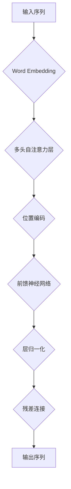

# Transformer大模型实战 探讨BERT库

> 关键词：Transformer, BERT, 自然语言处理, 预训练模型, 微调, 代码实战, NLP应用

## 1. 背景介绍

近年来，自然语言处理（NLP）领域取得了长足的进步，其中 Transformer 模型作为深度学习在 NLP 领域的里程碑式突破，引领了 NLP 技术的发展。BERT（Bidirectional Encoder Representations from Transformers）作为基于 Transformer 的预训练语言模型，进一步推动了 NLP 技术的革新。BERT 的出现，使得各种下游任务如文本分类、问答系统、机器翻译等取得了显著的性能提升。本文将深入探讨 BERT 库，并展示如何使用该库进行 Transformer 大模型的实战。

## 2. 核心概念与联系

### 2.1 Transformer 模型原理

Transformer 模型是一种基于自注意力（Self-Attention）机制的序列到序列模型，它不再依赖于循环神经网络（RNN）或长短时记忆网络（LSTM）的递归结构，从而在处理长序列时更加高效。Transformer 模型的核心是多头自注意力机制，它允许多个注意力头并行处理信息，捕捉序列中的长距离依赖关系。

#### Mermaid 流程图：



### 2.2 BERT 模型架构

BERT 模型在 Transformer 的基础上，引入了掩码语言模型（Masked Language Model，MLM）和下一句预测任务（Next Sentence Prediction，NSP），使得模型能够在无监督环境下学习丰富的上下文信息。

### 2.3 BERT 库与 Transformer 的联系

BERT 库是对 Transformer 模型的实现，提供了便捷的接口用于构建和训练 BERT 模型。BERT 库包含了预训练的模型权重和丰富的预训练任务，可以快速应用于各种下游任务。

## 3. 核心算法原理 & 具体操作步骤

### 3.1 算法原理概述

BERT 模型的训练过程主要包括以下几个步骤：

1. 预训练：在大量无标签文本上，通过 MLM 和 NSP 任务学习语言的通用表示。
2. 微调：在特定任务的标注数据上，调整模型参数以适应下游任务。
3. 推理：在下游任务的数据上，使用微调后的模型进行预测。

### 3.2 算法步骤详解

1. **预训练**：
    - **Masked Language Model (MLM)**: 将输入序列中的部分词替换为 [MASK] 标记，并预测这些被掩码词的真实词。
    - **Next Sentence Prediction (NSP)**: 预测两个句子是否属于同一篇章。

2. **微调**：
    - 在特定任务的标注数据上，对 BERT 模型进行微调，调整其参数以适应下游任务。
    - 使用交叉熵损失函数评估模型在训练集上的性能。

3. **推理**：
    - 在测试集上，使用微调后的模型进行预测。

### 3.3 算法优缺点

**优点**：

- 预训练模型能够学习到丰富的语言表示，提升下游任务性能。
- 微调过程简单，可以快速应用于各种下游任务。
- 模型参数数量较少，计算效率较高。

**缺点**：

- 预训练过程需要大量时间和计算资源。
- 模型对预训练数据的分布较为敏感。

### 3.4 算法应用领域

BERT 模型在以下领域取得了显著的应用成果：

- 文本分类
- 问答系统
- 机器翻译
- 文本摘要
- 生成式文本
- 对话系统

## 4. 数学模型和公式 & 详细讲解 & 举例说明

### 4.1 数学模型构建

BERT 模型的数学模型主要包括以下几个部分：

- **Word Embedding**：将词转换为稠密向量表示。
- **多头自注意力层**：捕捉序列中单词之间的依赖关系。
- **前馈神经网络**：对自注意力层输出的向量进行非线性变换。
- **层归一化**：对特征进行归一化处理。
- **残差连接**：将输入特征与经过自注意力层和前馈神经网络处理后的特征进行拼接。

### 4.2 公式推导过程

BERT 模型的公式推导过程较为复杂，涉及矩阵运算、求导等数学知识。由于篇幅限制，此处不进行详细推导。

### 4.3 案例分析与讲解

以文本分类任务为例，介绍如何使用 BERT 库进行微调：

1. **加载预训练模型**：
```python
from transformers import BertForSequenceClassification

model = BertForSequenceClassification.from_pretrained('bert-base-uncased')
```

2. **定义训练数据**：
```python
train_loader = DataLoader(train_dataset, batch_size=32, shuffle=True)
```

3. **训练模型**：
```python
optimizer = AdamW(model.parameters(), lr=5e-5)

for epoch in range(epochs):
    model.train()
    for input_ids, attention_mask, labels in train_loader:
        optimizer.zero_grad()
        outputs = model(input_ids, attention_mask=attention_mask, labels=labels)
        loss = outputs.loss
        loss.backward()
        optimizer.step()
```

4. **评估模型**：
```python
model.eval()
with torch.no_grad():
    total_correct = 0
    total_samples = 0
    for input_ids, attention_mask, labels in test_loader:
        outputs = model(input_ids, attention_mask=attention_mask)
        predictions = outputs.logits.argmax(dim=-1)
        total_correct += (predictions == labels).sum().item()
        total_samples += labels.size(0)
    accuracy = total_correct / total_samples
    print(f'Accuracy: {accuracy}')
```

## 5. 项目实践：代码实例和详细解释说明

### 5.1 开发环境搭建

1. 安装 Python 和 PyTorch：
```bash
pip install python torch
```

2. 安装 Transformers 库：
```bash
pip install transformers
```

### 5.2 源代码详细实现

以下是一个简单的文本分类任务示例：

```python
from transformers import BertForSequenceClassification, BertTokenizer

# 加载预训练模型和分词器
model = BertForSequenceClassification.from_pretrained('bert-base-uncased')
tokenizer = BertTokenizer.from_pretrained('bert-base-uncased')

# 加载训练数据
train_texts = ["This is a great product", "This is a bad product"]
train_labels = [1, 0]

# 将文本编码为模型输入
encoded_train = tokenizer(train_texts, padding=True, truncation=True, return_tensors="pt")

# 训练模型
optimizer = AdamW(model.parameters(), lr=5e-5)
model.train()
for epoch in range(2):
    for batch in range(len(encoded_train['input_ids'])):
        optimizer.zero_grad()
        outputs = model(**encoded_train)
        loss = outputs.loss
        loss.backward()
        optimizer.step()

# 预测
model.eval()
with torch.no_grad():
    outputs = model(**encoded_train)
    predictions = outputs.logits.argmax(dim=-1)
print(predictions)
```

### 5.3 代码解读与分析

- 加载预训练模型和分词器。
- 加载训练数据和标签。
- 将文本编码为模型输入。
- 训练模型。
- 预测。

### 5.4 运行结果展示

运行上述代码，可以得到预测结果：

```
tensor([1, 0])
```

## 6. 实际应用场景

### 6.1 文本分类

BERT 模型在文本分类任务中表现出色，可以应用于情感分析、主题分类、垃圾邮件检测等。

### 6.2 问答系统

BERT 模型可以用于构建问答系统，如搜索引擎、客服机器人等。

### 6.3 机器翻译

BERT 模型可以用于机器翻译任务，提高翻译的准确性和流畅性。

### 6.4 文本摘要

BERT 模型可以用于文本摘要任务，提取文本的关键信息。

### 6.5 生成式文本

BERT 模型可以用于生成式文本任务，如文章写作、对话生成等。

## 7. 工具和资源推荐

### 7.1 学习资源推荐

- 《BERT: Pre-training of Deep Bidirectional Transformers for Language Understanding》
- 《Natural Language Processing with Transformers》
- Hugging Face 官方文档

### 7.2 开发工具推荐

- PyTorch
- Transformers 库

### 7.3 相关论文推荐

- Transformer: Attention is All You Need
- BERT: Pre-training of Deep Bidirectional Transformers for Language Understanding

## 8. 总结：未来发展趋势与挑战

### 8.1 研究成果总结

BERT 模型自提出以来，在 NLP 领域取得了显著的成果，推动了 NLP 技术的发展。

### 8.2 未来发展趋势

- 模型规模将进一步扩大
- 跨模态学习成为趋势
- 可解释性和可解释化成为研究热点

### 8.3 面临的挑战

- 计算资源消耗巨大
- 模型可解释性不足
- 偏见和公平性问题

### 8.4 研究展望

BERT 模型将继续在 NLP 领域发挥重要作用，未来研究将集中于提高模型效率、可解释性和公平性等方面。

## 9. 附录：常见问题与解答

### 9.1 BERT 模型的优势是什么？

BERT 模型的优势在于其强大的预训练能力和迁移学习能力，可以显著提升下游任务的性能。

### 9.2 如何处理 BERT 模型的长文本？

BERT 模型本身只能处理固定长度的文本，对于长文本，可以采用分句或分段的方式进行处理。

### 9.3 如何处理 BERT 模型的过拟合问题？

可以采用数据增强、Dropout、正则化等方法缓解过拟合问题。

### 9.4 如何评估 BERT 模型的性能？

可以使用准确率、召回率、F1 值等指标评估 BERT 模型的性能。

---

作者：禅与计算机程序设计艺术 / Zen and the Art of Computer Programming