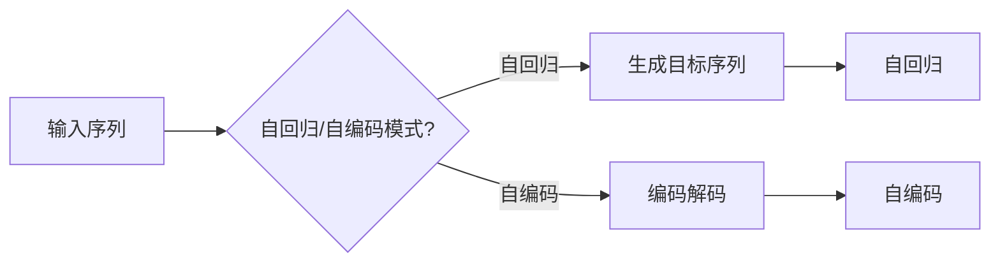

# Transformer大模型实战 预训练策略

> 关键词：Transformer, 预训练, 语言模型, 自回归, 自编码, 任务适配, 超参数调优, 迁移学习, 优化算法

## 1. 背景介绍

随着深度学习在自然语言处理（NLP）领域的广泛应用，Transformer模型因其强大的并行计算能力和卓越的语言理解能力，成为了NLP领域的明星模型。Transformer大模型通过在庞大的无标签语料上进行预训练，学习到丰富的语言知识，并将其迁移到下游任务中，实现了在多种NLP任务上的突破性进展。本文将深入探讨Transformer大模型的预训练策略，从核心概念到实战应用，为您提供全面的指导和 insights。

## 2. 核心概念与联系

### 2.1 核心概念原理

Transformer模型是一种基于自注意力机制的深度神经网络模型，它由自回归和自编码两种模式构成：

**自回归模式**：
- 输入序列：\$x_1, x_2, \ldots, x_n\$
- 目标序列：\$y_1, y_2, \ldots, y_n\$
- 模型在生成下一个词 \$y_{i+1}\$ 时，仅关注前面的 \$y_1, y_2, \ldots, y_i\$，即 \$y_{i+1} = f(y_1, y_2, \ldots, y_i, x_1, x_2, \ldots, x_i)\$

**自编码模式**：
- 输入序列：\$x_1, x_2, \ldots, x_n\$
- 目标序列：\$x_1, x_2, \ldots, x_n\$
- 模型学习将输入序列编码成一个固定长度的向量，然后再将这个向量解码回原始序列，即 \$x_{i+1} = f(x_1, x_2, \ldots, x_i, \text{encoded } x_1, x_2, \ldots, x_i)\$

### 2.2 架构的 Mermaid 流程图



### 2.3 核心概念联系

自回归和自编码模式是Transformer模型的基础，它们通过不同的方式学习语言结构。自回归模式关注序列的顺序，而自编码模式关注序列的整体表示。这两种模式在预训练过程中相互补充，共同提升模型的语言理解能力。

## 3. 核心算法原理 & 具体操作步骤

### 3.1 算法原理概述

Transformer大模型的预训练策略主要包括以下步骤：

1. **数据准备**：收集大规模无标签语料，进行预处理和分词。
2. **预训练任务**：在无标签语料上进行自回归和自编码任务，学习语言结构。
3. **任务适配**：针对下游任务，设计相应的任务适配层。
4. **微调**：在下游任务的数据集上，对预训练模型进行微调，提升模型在特定任务上的性能。

### 3.2 算法步骤详解

**1. 数据准备**

- **语料收集**：从互联网、书籍、新闻等来源收集大量无标签文本数据。
- **预处理**：对语料进行清洗、去重、分词等处理，将文本转换为模型可处理的格式。
- **分词**：使用预训练的分词器对文本进行分词，将文本切分成一个个token。

**2. 预训练任务**

- **自回归任务**：随机选择一个token作为遮蔽词，模型需要预测这个token。
- **自编码任务**：将整个序列编码成一个固定长度的向量，再解码回原始序列。

**3. 任务适配**

- **设计任务适配层**：根据下游任务类型，设计相应的任务适配层，如分类器、序列生成器等。
- **调整模型结构**：根据任务适配层的需求，调整模型的输出层和激活函数。

**4. 微调**

- **数据集划分**：将下游任务的数据集划分为训练集、验证集和测试集。
- **模型初始化**：使用预训练模型作为初始化参数。
- **优化算法**：选择合适的优化算法，如AdamW、SGD等。
- **训练过程**：在训练集上训练模型，并在验证集上评估模型性能，调整超参数。
- **测试**：在测试集上评估模型性能，评估指标包括准确率、召回率、F1值等。

### 3.3 算法优缺点

**优点**：

- **强大的语言理解能力**：预训练模型能够学习到丰富的语言知识，在下游任务上表现出色。
- **迁移能力强**：预训练模型可以将学习到的知识迁移到下游任务中，降低模型训练成本。
- **高效**：Transformer模型的并行计算能力强，能够快速进行模型训练和推理。

**缺点**：

- **计算量大**：预训练模型需要大量的计算资源，训练成本较高。
- **数据依赖**：预训练模型的性能依赖于训练数据的质量和数量，对数据有较强的依赖性。
- **泛化能力有限**：预训练模型在某些特定领域或任务上可能存在泛化能力不足的问题。

### 3.4 算法应用领域

Transformer大模型的预训练策略在NLP领域有着广泛的应用，包括：

- **文本分类**：如情感分析、主题分类、意图识别等。
- **序列标注**：如命名实体识别、关系抽取等。
- **机器翻译**：如英中翻译、中日翻译等。
- **文本生成**：如摘要生成、对话生成等。

## 4. 数学模型和公式 & 详细讲解 & 举例说明

### 4.1 数学模型构建

Transformer模型的核心是自注意力机制，其数学公式如下：

\$$ \text{Attention}(Q, K, V) = \frac{softmax(\frac{QK^T}{\sqrt{d_k}})V \$$

其中，\$Q, K, V\$ 分别是查询（Query）、键（Key）和值（Value）向量，\$d_k\$ 是键的维度，\$\text{softmax}\$ 是softmax函数。

### 4.2 公式推导过程

自注意力机制的推导过程如下：

1. **计算注意力分数**：
\$$ \text{Attention}(Q, K, V) = \frac{QK^T}{\sqrt{d_k}}V \$$

2. **应用softmax函数**：
\$$ \text{Attention}(Q, K, V) = \text{softmax}(\frac{QK^T}{\sqrt{d_k}})V \$$

3. **加权求和**：
\$$ \text{Attention}(Q, K, V) = \sum_{i=1}^{N} \frac{\exp(\frac{QK^T}{\sqrt{d_k}})}{\sum_{j=1}^{N} \exp(\frac{QK^T}{\sqrt{d_k}})}V_i \$$

### 4.3 案例分析与讲解

以下是一个简单的例子，演示了自注意力机制的运算过程：

假设 \$Q, K, V\$ 分别是三维向量，\$d_k = 3\$，则有：

\$$ Q = [1, 2, 3], \quad K = [4, 5, 6], \quad V = [7, 8, 9] \$$

1. **计算注意力分数**：

\$$ \frac{QK^T}{\sqrt{d_k}} = \frac{1 \cdot 4 + 2 \cdot 5 + 3 \cdot 6}{\sqrt{3}} = \frac{32}{\sqrt{3}} \approx 18.26 \$$

2. **应用softmax函数**：

\$$ \text{softmax}(18.26) \approx 1 \$$

3. **加权求和**：

\$$ \text{Attention}(Q, K, V) = 1 \cdot [7, 8, 9] = [7, 8, 9] \$$

通过这个例子，我们可以看到，自注意力机制可以自动为每个键分配一个权重，权重越高，对应的值对查询的贡献越大。

## 5. 项目实践：代码实例和详细解释说明

### 5.1 开发环境搭建

为了进行Transformer大模型的预训练实践，我们需要以下环境：

- Python 3.6+
- PyTorch 1.5+
- Transformers库

以下是安装 Transformers 库的命令：

```bash
pip install transformers
```

### 5.2 源代码详细实现

以下是一个简单的Transformer模型预训练示例：

```python
from transformers import BertTokenizer, BertForMaskedLM, AdamW, get_linear_schedule_with_warmup
from torch.utils.data import DataLoader, RandomSampler, SequentialSampler
from transformers import DataCollatorForLanguageModel

# 加载预训练分词器和模型
tokenizer = BertTokenizer.from_pretrained('bert-base-uncased')
model = BertForMaskedLM.from_pretrained('bert-base-uncased')

# 加载无标签语料
corpus = "The quick brown fox jumps over the lazy dog."

# 将语料转换为模型可处理的格式
inputs = tokenizer(corpus, return_tensors="pt", padding=True, truncation=True)

# 定义数据加载器
train_loader = DataLoader(inputs, batch_size=1, shuffle=True)

# 定义优化器和学习率调度器
optimizer = AdamW(model.parameters(), lr=5e-5)
scheduler = get_linear_schedule_with_warmup(optimizer, num_warmup_steps=0, num_training_steps=len(train_loader) * num_epochs)

# 训练模型
for epoch in range(num_epochs):
    for batch in train_loader:
        outputs = model(**batch)
        loss = outputs.loss
        loss.backward()
        optimizer.step()
        scheduler.step()
        model.zero_grad()
```

### 5.3 代码解读与分析

以上代码展示了如何使用PyTorch和Transformers库进行Transformer模型的预训练。

- **加载预训练分词器和模型**：使用`BertTokenizer`和`BertForMaskedLM`分别加载预训练的分词器和模型。
- **加载无标签语料**：将语料加载到变量`corpus`中。
- **转换为模型可处理的格式**：使用`tokenizer`将语料转换为模型可处理的格式，包括输入序列和注意力掩码。
- **定义数据加载器**：使用`DataLoader`将语料划分为批次，并进行打乱。
- **定义优化器和学习率调度器**：使用`AdamW`和`get_linear_schedule_with_warmup`定义优化器和学习率调度器。
- **训练模型**：使用for循环遍历数据加载器，对模型进行训练。

### 5.4 运行结果展示

运行以上代码后，模型将在无标签语料上进行预训练。预训练过程中，模型的损失值会逐渐下降，表明模型正在学习语言知识。

## 6. 实际应用场景

### 6.1 文本分类

Transformer大模型的预训练策略在文本分类任务上表现出色，以下是一些应用场景：

- **情感分析**：分析用户评论、社交媒体帖子等文本的情感倾向。
- **主题分类**：对新闻、文章等文本进行主题分类，如科技、体育、娱乐等。
- **意图识别**：识别用户在对话中的意图，如查询信息、请求服务、进行交易等。

### 6.2 机器翻译

Transformer大模型的预训练策略在机器翻译任务上取得了显著的成果，以下是一些应用场景：

- **英中翻译**：将英文文本翻译成中文。
- **中日翻译**：将日文文本翻译成中文。
- **多语言翻译**：支持多种语言之间的翻译。

### 6.3 文本生成

Transformer大模型的预训练策略在文本生成任务上展现出强大的能力，以下是一些应用场景：

- **摘要生成**：自动生成文本摘要。
- **对话生成**：生成自然流畅的对话。
- **诗歌创作**：创作诗歌、故事等文本内容。

## 7. 工具和资源推荐

### 7.1 学习资源推荐

- 《Transformers: State-of-the-Art Natural Language Processing》
- 《The Annotated Transformer》
- 《Neural Machine Translation with Transformer》
- 《Natural Language Processing with Python》

### 7.2 开发工具推荐

- PyTorch
- Transformers库
- Hugging Face
- Colab

### 7.3 相关论文推荐

- **Attention is All You Need**
- **BERT: Pre-training of Deep Bidirectional Transformers for Language Understanding**
- **Generative Pre-trained Transformers for Natural Language Understanding and Generation**
- **T5: Transformer-based Text-to-Text Neural Machine Translation System**

## 8. 总结：未来发展趋势与挑战

### 8.1 研究成果总结

Transformer大模型的预训练策略为NLP领域带来了革命性的进步，推动了NLP技术的快速发展。预训练模型在多种NLP任务上取得了优异的性能，为NLP技术的应用提供了强大的基础。

### 8.2 未来发展趋势

- **模型规模进一步扩大**：随着计算能力的提升，预训练模型的规模将进一步扩大，学习到更丰富的语言知识。
- **预训练任务多样化**：除了自回归和自编码任务，未来将出现更多针对特定任务的预训练任务。
- **多模态预训练**：结合图像、视频等多模态信息，实现更全面的语言理解能力。
- **可解释性和安全性**：提高模型的可解释性和安全性，使其在更多领域得到应用。

### 8.3 面临的挑战

- **计算资源需求**：预训练模型需要大量的计算资源，对硬件设备提出了更高的要求。
- **数据依赖**：预训练模型的性能依赖于训练数据的质量和数量，对数据有较强的依赖性。
- **模型泛化能力**：预训练模型在某些特定领域或任务上可能存在泛化能力不足的问题。
- **伦理问题**：如何确保预训练模型的输出符合伦理道德，避免歧视和偏见。

### 8.4 研究展望

未来，Transformer大模型的预训练策略将继续发展，为NLP领域带来更多突破。同时，研究者需要关注计算资源、数据依赖、模型泛化能力和伦理问题等挑战，推动NLP技术的健康发展。

## 9. 附录：常见问题与解答

**Q1：什么是预训练？**

A：预训练是指在大规模无标签语料上进行模型训练，学习语言结构、词义和语法规则等知识，为下游任务提供通用的基础。

**Q2：什么是自回归和自编码任务？**

A：自回归任务是预测下一个词，自编码任务是预测原始序列。这两种任务可以帮助模型学习语言结构和表示。

**Q3：预训练模型如何迁移到下游任务？**

A：通过在下游任务的数据集上进行微调，可以迁移预训练模型学习到的知识，提升模型在特定任务上的性能。

**Q4：如何选择预训练模型？**

A：选择预训练模型时，需要考虑任务类型、数据规模、模型规模等因素，选择合适的预训练模型。

**Q5：如何评估预训练模型的效果？**

A：可以使用下游任务的指标，如准确率、召回率、F1值等，评估预训练模型的效果。

**Q6：预训练模型的计算资源需求如何降低？**

A：可以通过模型压缩、量化加速等方法降低预训练模型的计算资源需求。

**Q7：预训练模型的伦理问题如何解决？**

A：需要从数据、算法、应用等多个方面考虑，确保预训练模型的输出符合伦理道德。

---

作者：禅与计算机程序设计艺术 / Zen and the Art of Computer Programming