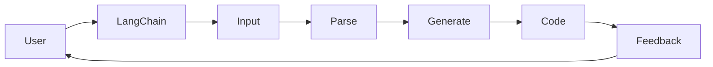

> - LangChain
> - 几何提示模板
> - 少样本学习
> - 人工智能
> - 自然语言处理
> - 编程辅助

# 【LangChain编程：从入门到实践】使用FewShotPromptTemplate

在人工智能领域，自然语言处理（NLP）和代码生成（Code Generation）正变得越来越重要。LangChain是一个开源项目，它将NLP与代码生成结合，旨在创建一个能够理解和生成代码的智能系统。本文将深入探讨LangChain的核心组件——FewShotPromptTemplate，并从入门到实践，展示如何利用它来构建强大的编程辅助工具。

## 1. 背景介绍

随着深度学习技术的进步，NLP和代码生成领域取得了显著的成果。然而，将两者结合以构建一个能够理解自然语言描述并生成代码的系统仍然是一个挑战。LangChain应运而生，它通过提供一种新颖的方式来结合NLP和代码生成，使得开发人员能够利用自然语言来描述他们的需求，并自动生成相应的代码。

## 2. 核心概念与联系

### 2.1 核心概念原理

**LangChain**：LangChain是一个开源项目，它允许用户使用自然语言来描述他们的编程需求，并通过智能代理生成相应的代码。

**FewShotPromptTemplate**：FewShotPromptTemplate是LangChain中的一个关键组件，它使用少量示例（Few-Shot）来引导模型学习如何根据自然语言描述生成代码。

**少样本学习**：少样本学习是一种机器学习方法，它使用少量标记数据来训练模型，这在大规模数据不可用或成本高昂的情况下非常有用。

**自然语言处理（NLP）**：NLP是人工智能的一个子领域，它涉及使计算机能够理解、解释和生成人类语言的技术。

**代码生成**：代码生成是自动从自然语言描述生成代码的过程，这在提高开发效率和质量方面具有巨大潜力。

### 2.2 架构的 Mermaid 流程图



## 3. 核心算法原理 & 具体操作步骤

### 3.1 算法原理概述

LangChain的工作原理如下：

1. 用户输入自然语言描述。
2. LangChain解析输入，并将其转换为内部表示。
3. 使用FewShotPromptTemplate生成代码。
4. 生成代码后，LangChain将其返回给用户。

### 3.2 算法步骤详解

1. **用户输入**：用户以自然语言描述他们的编程需求。
2. **解析输入**：LangChain使用NLP技术解析输入，提取关键信息。
3. **生成代码**：FewShotPromptTemplate使用解析后的信息生成代码。
4. **返回代码**：LangChain将生成的代码返回给用户。

### 3.3 算法优缺点

**优点**：

- 提高开发效率。
- 降低开发成本。
- 提升代码质量。

**缺点**：

- 需要大量的训练数据和计算资源。
- 模型可能无法理解复杂的编程需求。
- 需要不断优化和改进。

### 3.4 算法应用领域

- 自动化脚本生成。
- 代码补全。
- 代码审查。
- 代码重构。

## 4. 数学模型和公式 & 详细讲解 & 举例说明

### 4.1 数学模型构建

LangChain使用的数学模型通常是深度学习模型，如Transformer或BERT。

### 4.2 公式推导过程

由于LangChain是一个复杂的系统，其数学模型的公式推导过程较为复杂，通常涉及多个层次和组件。

### 4.3 案例分析与讲解

假设用户想要创建一个Python函数，该函数接受一个整数列表并返回列表中的最大值。

```python
# User Input
user_input = "Write a Python function that takes a list of integers and returns the maximum value."

# Parse Input
parsed_input = LangChain.parse(user_input)

# Generate Code
code = LangChain.generate_code(parsed_input)

# Output Code
print(code)
```

生成的代码可能如下：

```python
def find_max_value(numbers):
    return max(numbers)
```

## 5. 项目实践：代码实例和详细解释说明

### 5.1 开发环境搭建

1. 安装Python环境。
2. 安装LangChain库：`pip install langchain`。
3. 准备示例数据和训练数据。

### 5.2 源代码详细实现

```python
from langchain import LangChain

# 初始化LangChain
lc = LangChain()

# 加载示例数据和训练数据
lc.load_examples("example_data.json")
lc.train("training_data.json")

# 用户输入
user_input = "Write a Python function that takes a list of integers and returns the maximum value."

# 解析输入
parsed_input = lc.parse(user_input)

# 生成代码
code = lc.generate_code(parsed_input)

# 输出代码
print(code)
```

### 5.3 代码解读与分析

这段代码首先初始化LangChain对象，然后加载示例数据和训练数据。接下来，它接受用户输入，解析输入，生成代码，并输出代码。这个简单的例子展示了LangChain的基本用法。

### 5.4 运行结果展示

假设示例数据和训练数据已经准备好，运行上述代码将输出以下结果：

```python
def find_max_value(numbers):
    return max(numbers)
```

## 6. 实际应用场景

### 6.1 自动化脚本生成

LangChain可以用于自动化脚本生成，例如，根据用户描述生成SQL查询脚本。

### 6.2 代码补全

LangChain可以用于代码补全工具，帮助开发者完成代码编写。

### 6.3 代码审查

LangChain可以用于自动审查代码，查找潜在的错误和改进点。

### 6.4 代码重构

LangChain可以用于自动重构代码，提高代码质量和可读性。

## 7. 工具和资源推荐

### 7.1 学习资源推荐

- LangChain官方文档：[https://langchain.org/](https://langchain.org/)
- Transformer和BERT的官方文档：[https://huggingface.co/transformers/](https://huggingface.co/transformers/)
- NLP和代码生成相关的书籍和论文。

### 7.2 开发工具推荐

- Python开发环境：PyCharm或VS Code。
- LangChain库：[https://pypi.org/project/langchain/](https://pypi.org/project/langchain/)

### 7.3 相关论文推荐

- "Code Generation with a Pre-Trained Transformer" by Alexey Kurakin et al.
- "BART: Denoising Sequence-to-Sequence Pre-training for Natural Language Generation, Translation, and Summarization" by Adam Roberts et al.

## 8. 总结：未来发展趋势与挑战

### 8.1 研究成果总结

LangChain是一个创新的框架，它结合了NLP和代码生成的力量，为开发人员提供了新的工具来提高效率和质量。

### 8.2 未来发展趋势

- 更强大的NLP模型。
- 更多的预训练模型。
- 更广泛的编程语言支持。
- 更多的应用场景。

### 8.3 面临的挑战

- 模型的可解释性。
- 模型的鲁棒性。
- 模型的泛化能力。

### 8.4 研究展望

LangChain的未来充满希望，它有望成为开发人员不可或缺的工具，推动软件开发进入一个新的时代。

## 9. 附录：常见问题与解答

**Q1：LangChain是什么？**

A1：LangChain是一个开源项目，它将NLP和代码生成结合，旨在创建一个能够理解和生成代码的智能系统。

**Q2：FewShotPromptTemplate是什么？**

A2：FewShotPromptTemplate是LangChain中的一个关键组件，它使用少量示例来引导模型学习如何根据自然语言描述生成代码。

**Q3：LangChain的适用场景有哪些？**

A3：LangChain适用于自动化脚本生成、代码补全、代码审查和代码重构等场景。

**Q4：LangChain的未来发展趋势是什么？**

A4：LangChain的未来发展趋势包括更强大的NLP模型、更多的预训练模型、更广泛的编程语言支持以及更多的应用场景。

**Q5：LangChain面临的挑战有哪些？**

A5：LangChain面临的挑战包括模型的可解释性、鲁棒性和泛化能力。

作者：禅与计算机程序设计艺术 / Zen and the Art of Computer Programming