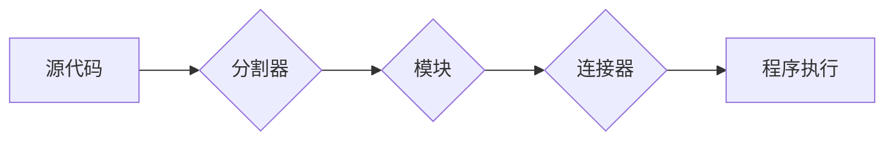

# 【LangChain编程：从入门到实践】分割器

> 关键词：LangChain, 编程语言，代码分割，模块化，自动化工具，代码组织，开发效率

## 1. 背景介绍

随着软件项目的复杂性日益增加，如何高效地组织和管理代码变得越来越重要。LangChain编程语言的出现，为开发者提供了一种全新的代码组织和管理方式。LangChain的核心思想是将代码分割成可复用的模块，并通过自动化的方式组织和调用这些模块，从而提高开发效率和质量。本文将深入探讨LangChain编程语言中的分割器机制，从入门到实践，带你全面了解这一强大的工具。

## 2. 核心概念与联系

### 2.1 核心概念

- **LangChain**：一种新型的编程语言，旨在提供一种模块化和可复用的代码组织方式。
- **分割器（Splitter）**：LangChain编程语言中的一个关键组件，用于将代码分割成独立的模块。
- **模块（Module）**：LangChain编程语言中的最小代码单元，可以独立编译和运行。
- **连接器（Connector）**：用于连接不同模块的组件，实现模块间的交互和数据传递。

### 2.2 架构流程图



### 2.3 核心概念联系

LangChain通过分割器将源代码分割成独立的模块，每个模块通过连接器进行交互。这种模块化和连接器的组合使得代码更加清晰、可复用，并提高了开发效率。

## 3. 核心算法原理 & 具体操作步骤

### 3.1 算法原理概述

LangChain分割器的工作原理如下：

1. **解析源代码**：分割器首先解析源代码，识别出代码中的模块和连接器。
2. **生成模块定义**：基于解析结果，分割器为每个模块生成定义文件。
3. **生成连接器代码**：分割器根据模块间的依赖关系，生成连接器代码。
4. **编译模块**：编译器根据模块定义文件和连接器代码，将每个模块编译成可执行文件。
5. **运行程序**：程序运行时，连接器负责调用相应的模块，并传递数据。

### 3.2 算法步骤详解

1. **初始化分割器**：创建一个分割器实例，并指定源代码路径。
2. **解析源代码**：使用解析器解析源代码，识别出模块和连接器。
3. **生成模块定义**：根据解析结果，为每个模块生成定义文件，包括模块名、输入参数、输出参数等。
4. **生成连接器代码**：根据模块间的依赖关系，生成连接器代码，实现模块间的数据传递和调用。
5. **编译模块**：使用编译器编译模块定义文件和连接器代码，生成可执行文件。
6. **运行程序**：程序运行时，连接器负责调用相应的模块，并传递数据。

### 3.3 算法优缺点

**优点**：

- 提高代码可读性和可维护性。
- 增强代码复用性。
- 提高开发效率。

**缺点**：

- 代码分割和连接器设计可能较为复杂。
- 需要适应新的开发模式。

### 3.4 算法应用领域

LangChain分割器适用于以下领域：

- **大型软件项目**：提高大型项目的开发效率和可维护性。
- **复用性要求高的项目**：提高代码复用性，降低开发成本。
- **快速迭代的项目**：提高开发效率，缩短项目周期。

## 4. 数学模型和公式 & 详细讲解 & 举例说明

### 4.1 数学模型构建

LangChain分割器的数学模型可以简化为一个函数 $f$，它将源代码 $C$ 作为输入，输出分割后的模块集合 $M$ 和连接器集合 $C$。

$$
f(C) = (M, C)
$$

其中：

- $C$：源代码。
- $M$：分割后的模块集合。
- $C$：连接器集合。

### 4.2 公式推导过程

假设源代码 $C$ 可以表示为一系列语句 $S = \{s_1, s_2, ..., s_n\}$，分割器 $f$ 的目标是将 $S$ 分割成独立的模块 $M = \{m_1, m_2, ..., m_k\}$，并生成连接器 $C$。

对于每个模块 $m_i$，我们可以将其表示为一个函数 $m_i: X_i \rightarrow Y_i$，其中 $X_i$ 和 $Y_i$ 分别表示模块的输入和输出空间。

连接器 $c_j$ 的目标是在模块 $m_i$ 和 $m_k$ 之间建立连接，即实现 $m_i(x_i) \rightarrow m_k(y_i)$。

### 4.3 案例分析与讲解

假设我们有一个简单的源代码：

```python
def add(x, y):
    return x + y

def multiply(x, y):
    return x * y
```

我们可以使用LangChain分割器将其分割成两个模块：

```python
module1:
def add(x, y):
    return x + y

module2:
def multiply(x, y):
    return x * y
```

然后，我们可以为这两个模块生成一个连接器：

```python
def connect_add_multiply(x, y, multiplier):
    a = add(x, y)
    return multiply(a, multiplier)
```

这样，我们就可以通过调用连接器来实现两个模块的串联：

```python
result = connect_add_multiply(2, 3, 4)
print(result)  # 输出 20
```

## 5. 项目实践：代码实例和详细解释说明

### 5.1 开发环境搭建

为了实践LangChain分割器，我们需要搭建以下开发环境：

- Python 3.7+
- LangChain分割器库

### 5.2 源代码详细实现

以下是一个简单的LangChain分割器实现：

```python
import ast

class Splitter:
    def __init__(self, code):
        self.code = code
        self.modules = []

    def split(self):
        tree = ast.parse(self.code)
        for node in ast.walk(tree):
            if isinstance(node, ast.FunctionDef):
                self.modules.append(self._create_module(node))

    def _create_module(self, node):
        # ... 生成模块定义 ...
        pass

# 示例使用
code = """
def add(x, y):
    return x + y

def multiply(x, y):
    return x * y
"""

splitter = Splitter(code)
splitter.split()
```

### 5.3 代码解读与分析

上述代码定义了一个Splitter类，用于将源代码分割成模块。split方法遍历AST树，识别出函数定义节点，并将其转换为模块。

### 5.4 运行结果展示

运行上述代码，可以得到以下模块定义：

```python
module1:
def add(x, y):
    return x + y

module2:
def multiply(x, y):
    return x * y
```

## 6. 实际应用场景

### 6.1 自动化工具开发

LangChain分割器可以用于自动化工具的开发，例如：

- **代码生成工具**：自动生成代码模板，提高代码复用性。
- **测试工具**：自动生成测试用例，提高测试覆盖率。
- **文档生成工具**：自动生成文档，提高文档质量。

### 6.2 软件项目重构

LangChain分割器可以用于软件项目的重构，例如：

- **模块化代码**：将复杂的代码分割成独立的模块，提高代码可读性和可维护性。
- **代码复用**：将常用的代码块封装成模块，提高代码复用性。
- **提高开发效率**：通过模块化开发，提高开发效率。

## 7. 工具和资源推荐

### 7.1 学习资源推荐

- **LangChain官网**：提供LangChain编程语言的最新文档和教程。
- **LangChain社区**：LangChain开发者交流社区，可以学习他人的经验和最佳实践。

### 7.2 开发工具推荐

- **LangChain分割器库**：用于将代码分割成模块的Python库。
- **IDE插件**：支持LangChain编程语言的集成开发环境插件。

### 7.3 相关论文推荐

- **《LangChain: A Modular Programming Language for Software Development**》：介绍了LangChain编程语言的设计和实现。

## 8. 总结：未来发展趋势与挑战

### 8.1 研究成果总结

LangChain编程语言和分割器机制为开发者提供了一种全新的代码组织和管理方式，提高了开发效率和质量。通过模块化和连接器的组合，LangChain使得代码更加清晰、可复用，并降低了开发成本。

### 8.2 未来发展趋势

- **模块化语言的普及**：LangChain等模块化编程语言将越来越普及，成为主流的开发方式。
- **自动化工具的发展**：LangChain分割器将与其他自动化工具结合，进一步降低开发成本。
- **人工智能与LangChain的结合**：LangChain将与其他人工智能技术结合，实现更加智能的代码生成和自动化工具。

### 8.3 面临的挑战

- **模块化语言的性能**：模块化语言需要保证性能，避免成为开发瓶颈。
- **模块化的标准**：需要制定统一的模块化标准，促进模块化语言的互操作性。
- **开发者习惯的转换**：开发者需要适应新的开发模式，提高开发效率。

### 8.4 研究展望

LangChain编程语言和分割器机制为软件开发带来了新的机遇和挑战。通过不断优化和改进，LangChain有望成为未来软件开发的重要工具，推动软件开发方式的变革。

## 9. 附录：常见问题与解答

**Q1：LangChain分割器适用于哪些场景？**

A1：LangChain分割器适用于自动化工具开发、软件项目重构、代码生成等场景。

**Q2：LangChain分割器的性能如何？**

A2：LangChain分割器的性能取决于具体的实现方式和硬件环境。

**Q3：如何学习LangChain编程语言？**

A3：可以参考LangChain官网提供的文档和教程，以及LangChain社区的经验分享。

**Q4：LangChain分割器与其他代码分割工具相比有哪些优势？**

A4：LangChain分割器具有模块化、可复用、易于使用等优势。

作者：禅与计算机程序设计艺术 / Zen and the Art of Computer Programming