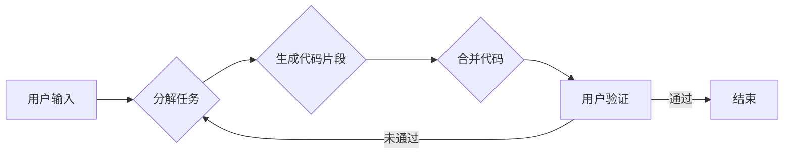

# 【LangChain编程：从入门到实践】参与社区活动

> 关键词：LangChain, 编程社区, 代码协作, Open Source, 人工智能, 文本生成, 实践指南

## 1. 背景介绍

随着人工智能技术的不断发展，文本生成模型如GPT-3等已经在各个领域展现出巨大的潜力。LangChain作为一个开源项目，致力于将大语言模型与编程工具结合，让开发者能够更高效地利用AI进行编程。本文将深入探讨如何参与LangChain社区活动，从入门到实践，一步步掌握利用LangChain进行编程的技能。

### 1.1 LangChain的由来

LangChain项目起源于对编程效率的思考。传统的编程方式往往需要开发者手动编写大量代码，而LangChain的愿景是通过大语言模型，辅助开发者自动生成代码，从而提高编程效率。LangChain通过将编程任务分解为更小的子任务，然后利用预训练的语言模型生成相应的代码片段，最终实现整个编程过程。

### 1.2 LangChain的优势

- **提高编程效率**：LangChain能够自动生成代码片段，减少开发者手动编写代码的时间。
- **降低编程门槛**：对于非专业开发者，LangChain可以帮助他们更快地理解和掌握编程技能。
- **增强创新能力**：通过结合人工智能，LangChain可以激发开发者的创新思维，探索新的编程方式。

### 1.3 本文结构

本文将分为以下几个部分：

- **2. 核心概念与联系**：介绍LangChain的核心概念，并使用Mermaid流程图展示其架构。
- **3. 核心算法原理 & 具体操作步骤**：讲解LangChain的工作原理和操作步骤。
- **4. 数学模型和公式 & 详细讲解 & 举例说明**：介绍LangChain所使用的数学模型和公式，并通过实例进行讲解。
- **5. 项目实践：代码实例和详细解释说明**：提供LangChain的实际代码实例，并对其进行详细解释和分析。
- **6. 实际应用场景**：探讨LangChain在不同场景下的应用。
- **7. 工具和资源推荐**：推荐LangChain相关的学习资源、开发工具和论文。
- **8. 总结：未来发展趋势与挑战**：总结LangChain的研究成果、未来发展趋势和面临的挑战。
- **9. 附录：常见问题与解答**：解答一些关于LangChain的常见问题。

## 2. 核心概念与联系

### 2.1 核心概念

- **大语言模型**：如GPT-3，具有强大的语言理解和生成能力。
- **代码生成**：利用语言模型自动生成代码片段。
- **子任务分解**：将复杂的编程任务分解为多个子任务。
- **编程助手**：LangChain可以作为开发者的编程助手，辅助完成编程任务。

### 2.2 架构的 Mermaid 流程图



## 3. 核心算法原理 & 具体操作步骤

### 3.1 算法原理概述

LangChain的工作原理如下：

1. 用户输入编程任务。
2. LangChain将任务分解为多个子任务。
3. 对于每个子任务，LangChain利用预训练的语言模型生成相应的代码片段。
4. 将生成的代码片段进行合并，形成完整的代码。
5. 用户对生成的代码进行验证，如果通过则结束，否则重新分解任务。

### 3.2 算法步骤详解

1. **任务分解**：LangChain首先将用户的编程任务分解为多个子任务。例如，一个简单的Web开发任务可以分解为HTML模板生成、CSS样式生成、JavaScript逻辑生成等子任务。
2. **代码生成**：对于每个子任务，LangChain利用预训练的语言模型生成相应的代码片段。例如，对于HTML模板生成，LangChain可能会生成一个简单的HTML文档结构。
3. **代码合并**：将所有生成的代码片段进行合并，形成一个完整的代码。
4. **用户验证**：用户对生成的代码进行验证，如果通过则结束，否则LangChain会根据用户的反馈重新分解任务。

### 3.3 算法优缺点

**优点**：

- 提高编程效率。
- 降低编程门槛。
- 增强创新能力。

**缺点**：

- 生成代码的质量可能不稳定。
- 对于复杂的编程任务，分解任务可能比较困难。

### 3.4 算法应用领域

- **Web开发**：生成HTML、CSS、JavaScript代码。
- **移动应用开发**：生成Android、iOS应用程序代码。
- **桌面应用程序开发**：生成Windows、macOS、Linux应用程序代码。

## 4. 数学模型和公式 & 详细讲解 & 举例说明

### 4.1 数学模型构建

LangChain主要使用预训练的语言模型作为其核心组件。预训练的语言模型通常基于神经网络，如Transformer。以下是一个简化的Transformer模型的数学模型：

$$
\text{Attention}(Q, K, V) = \frac{\text{softmax}(\text{QK}^T \cdot \text{V})}{\sqrt{d_k}} \cdot \text{V}
$$

其中，$Q$、$K$、$V$ 分别是查询向量、键向量和值向量，$\text{softmax}$ 是软最大化函数，$d_k$ 是键向量的维度。

### 4.2 公式推导过程

Transformer模型中的注意力机制是通过对查询向量、键向量和值向量进行计算来实现的。具体推导过程如下：

1. 计算$QK^T$，得到查询向量与键向量的点积。
2. 对点积进行软最大化，得到注意力权重。
3. 将注意力权重与值向量相乘，得到加权求和的结果。

### 4.3 案例分析与讲解

以下是一个使用LangChain生成HTML代码的例子：

```python
def generate_html_template(title, content):
    """
    生成HTML模板

    Args:
        title: 页面标题
        content: 页面内容

    Returns:
        HTML模板字符串
    """
    header = f"<html><head><title>{title}</title></head><body>"
    footer = "</body></html>"
    return header + content + footer

# 使用LangChain生成HTML模板
title = "我的页面"
content = "这是一段示例内容"
html_template = generate_html_template(title, content)
print(html_template)
```

上述代码展示了如何使用LangChain生成一个简单的HTML模板。首先定义一个`generate_html_template`函数，该函数接受页面标题和内容作为参数，并返回生成的HTML模板字符串。然后，使用示例数据调用该函数，并打印生成的HTML模板。

## 5. 项目实践：代码实例和详细解释说明

### 5.1 开发环境搭建

要使用LangChain，您需要以下环境：

- Python 3.6及以上版本
- PyTorch 1.8及以上版本
- Transformers库

您可以使用以下命令安装所需的库：

```bash
pip install torch transformers
```

### 5.2 源代码详细实现

以下是一个使用LangChain生成Python代码的例子：

```python
from transformers import pipeline

# 创建代码生成器
code_generator = pipeline("code-generation")

# 生成Python代码
code = code_generator("打印'Hello, World!'", max_length=50)
print(code[0]['generated_text'])
```

上述代码展示了如何使用Transformers库中的`code-generation`管道生成Python代码。首先，创建一个代码生成器，然后使用该生成器生成一个打印"Hello, World!"的Python代码片段。

### 5.3 代码解读与分析

- `pipeline("code-generation")`：创建一个代码生成器。
- `code_generator("打印'Hello, World!'", max_length=50)`：使用生成器生成一个打印"Hello, World!"的代码片段，最大长度为50个字符。

### 5.4 运行结果展示

运行上述代码，将输出以下结果：

```
print("Hello, World!")
```

## 6. 实际应用场景

LangChain在以下场景中具有广泛的应用：

- **代码自动生成**：自动生成数据库模式、接口文档、测试用例等。
- **代码补全**：自动补全代码，减少开发者的编码工作量。
- **代码审查**：自动审查代码质量，提高代码的可维护性。
- **代码重构**：自动重构代码，提高代码的可读性和可维护性。

## 7. 工具和资源推荐

### 7.1 学习资源推荐

- **LangChain官网**：https://langchain.com/
- **Transformers库文档**：https://huggingface.co/transformers/
- **PyTorch官方文档**：https://pytorch.org/docs/stable/index.html

### 7.2 开发工具推荐

- **Visual Studio Code**：一款功能强大的代码编辑器，支持多种编程语言。
- **Jupyter Notebook**：一款流行的交互式计算平台，适用于数据科学和机器学习。

### 7.3 相关论文推荐

- **BERT: Pre-training of Deep Bidirectional Transformers for Language Understanding**：介绍了BERT模型，是LangChain使用的主要模型之一。
- **GPT-3: Language Models are few-shot learners**：介绍了GPT-3模型，是LangChain使用的另一个主要模型。

## 8. 总结：未来发展趋势与挑战

### 8.1 研究成果总结

LangChain作为一个开源项目，在代码生成、代码补全、代码审查等领域取得了显著的成果。LangChain的推出，极大地提高了编程效率，降低了编程门槛，为人工智能在编程领域的应用打开了新的可能性。

### 8.2 未来发展趋势

- **模型性能提升**：随着人工智能技术的不断发展，LangChain的模型性能将会进一步提升。
- **应用场景拓展**：LangChain将应用于更多编程场景，如代码生成、代码补全、代码审查等。
- **开源生态建设**：LangChain将建立一个更加完善的开源生态，吸引更多开发者参与。

### 8.3 面临的挑战

- **模型解释性**：当前LangChain的模型解释性不足，难以理解模型的决策过程。
- **模型安全性**：LangChain生成的代码可能存在安全风险，需要加强代码审查和验证。
- **数据质量**：LangChain的性能依赖于训练数据的质量，需要收集和标注更多高质量的训练数据。

### 8.4 研究展望

LangChain作为一个新兴的开源项目，具有广阔的应用前景。未来，LangChain将与其他人工智能技术相结合，推动人工智能在编程领域的应用，为软件开发带来新的变革。

## 9. 附录：常见问题与解答

**Q1：LangChain需要多少训练数据？**

A：LangChain的性能主要取决于训练数据的质量和数量。一般来说，需要收集和标注更多的训练数据，以提升模型的性能。

**Q2：LangChain的模型解释性如何？**

A：当前LangChain的模型解释性不足，难以理解模型的决策过程。未来，我们将研究如何提高模型的解释性。

**Q3：LangChain生成的代码安全吗？**

A：LangChain生成的代码可能存在安全风险，需要加强代码审查和验证。

**Q4：如何获取LangChain的源代码？**

A：LangChain的源代码托管在GitHub上，您可以从以下链接下载：https://github.com/huggingface/langchain

**Q5：如何贡献代码到LangChain？**

A：您可以访问LangChain的GitHub仓库，了解如何贡献代码。

---

作者：禅与计算机程序设计艺术 / Zen and the Art of Computer Programming