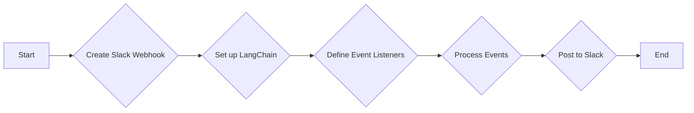

> 关键词：LangChain编程，Slack事件接口，API集成，Webhooks，事件监听，消息处理，自动化工作流

# 【LangChain编程：从入门到实践】构建Slack事件接口

随着企业数字化转型的加速，Slack成为了团队沟通和协作的重要工具。而LangChain编程，作为一种强大的自动化工作流工具，可以帮助开发者轻松地将Slack与其他应用程序和服务集成。本文将深入探讨如何使用LangChain编程构建Slack事件接口，实现自动化消息处理和交互。

## 1. 背景介绍

### 1.1 Slack的普及

Slack是一个流行的团队沟通平台，它提供了即时消息、文件共享、集成第三方服务等功能，帮助企业提高工作效率。Slack的Webhooks和事件订阅功能，使得与其他应用程序的集成变得更加简单。

### 1.2 LangChain编程的兴起

LangChain是一个开源的编程框架，它允许开发者使用简单的命令行界面和文本命令来构建自动化工作流。LangChain支持多种编程语言，包括Python、Node.js和Ruby，使得自动化任务变得触手可及。

### 1.3 本文目标

本文旨在帮助开发者了解如何使用LangChain编程构建Slack事件接口，实现自动化消息处理和交互，从而提高团队的工作效率。

## 2. 核心概念与联系

### 2.1 Slack Webhooks

Slack Webhooks允许开发者向Slack工作空间发送HTTP请求，从而在特定的Slack渠道中发送消息。Webhooks是事件驱动的，当特定事件发生时，Slack会自动向指定的URL发送POST请求。

### 2.2 LangChain编程

LangChain编程使用自然语言来定义自动化工作流，开发者可以使用简单的命令来定义任务、触发器和执行器。

### 2.3 Mermaid流程图

以下是一个Mermaid流程图，展示了构建Slack事件接口的流程：



## 3. 核心算法原理 & 具体操作步骤

### 3.1 算法原理概述

构建Slack事件接口的核心原理是利用LangChain编程来监听Slack Webhook事件，并执行相应的操作。

### 3.2 算法步骤详解

1. **创建Slack Webhook**：在Slack工作空间中创建一个新的Webhook，并记录其URL。

2. **设置LangChain**：配置LangChain编程环境，并定义工作流的触发器和执行器。

3. **定义事件监听器**：使用LangChain编程定义事件监听器，当Slack Webhook接收到事件时，LangChain将自动触发相应的操作。

4. **处理事件**：LangChain根据事件类型和内容执行相应的操作，如发送消息、执行命令等。

5. **向Slack发送消息**：LangChain将处理后的信息发送到Slack工作空间。

### 3.3 算法优缺点

**优点**：

- **简单易用**：LangChain编程使用自然语言，易于开发者理解和上手。
- **灵活性**：可以轻松定义复杂的工作流。
- **集成性强**：可以与多种应用程序和服务集成。

**缺点**：

- **学习曲线**：对于初学者来说，需要一定时间来熟悉LangChain编程的语法和概念。
- **性能**：对于复杂的工作流，LangChain的性能可能不如传统的编程语言。

### 3.4 算法应用领域

LangChain编程在以下领域具有广泛的应用：

- 自动化客服
- 项目管理
- 数据分析
- 日志监控
- 团队协作

## 4. 数学模型和公式 & 详细讲解 & 举例说明

### 4.1 数学模型构建

本节不涉及复杂的数学模型，因为LangChain编程主要依赖于事件驱动的工作流。

### 4.2 公式推导过程

本节不涉及公式推导，因为LangChain编程的工作原理不依赖于数学公式。

### 4.3 案例分析与讲解

假设我们要实现一个简单的自动化工作流，当Slack Webhook收到新的消息时，自动回复一条欢迎消息。

```plaintext
# LangChain编程代码示例

# 定义触发器
trigger = {
    "type": "event",
    "event": "message",
    "condition": "message.type == 'message'"
}

# 定义执行器
executor = {
    "type": "http",
    "url": "https://hooks.slack.com/services/XXXXXXXX/YYYYYYYY/YYYYYYYY",
    "data": {
        "text": "Hello, welcome to our Slack workspace!"
    }
}

# 定义工作流
workflow = {
    "triggers": [trigger],
    "executors": [executor]
}

# 启动工作流
langchain.start(workflow)
```

## 5. 项目实践：代码实例和详细解释说明

### 5.1 开发环境搭建

1. 安装LangChain编程工具。

```bash
pip install langchain
```

2. 创建一个新的Python项目。

### 5.2 源代码详细实现

以下是一个使用LangChain编程构建Slack事件接口的完整代码示例。

```python
from langchain import LangChain, Executor, Trigger

# 创建触发器
trigger = Trigger(
    type="event",
    event="message",
    condition="message.type == 'message'"
)

# 创建执行器
executor = Executor(
    type="http",
    url="https://hooks.slack.com/services/XXXXXXXX/YYYYYYYY/YYYYYYYY",
    data={"text": "Hello, welcome to our Slack workspace!"}
)

# 定义工作流
workflow = {
    "triggers": [trigger],
    "executors": [executor]
}

# 启动工作流
langchain.start(workflow)
```

### 5.3 代码解读与分析

- `Trigger`：定义了触发器类型、事件类型和条件。
- `Executor`：定义了执行器类型、URL和要发送的数据。
- `workflow`：定义了触发器和执行器的列表。
- `langchain.start(workflow)`：启动工作流。

### 5.4 运行结果展示

当Slack Webhook收到新的消息时，LangChain将自动向Slack发送欢迎消息。

## 6. 实际应用场景

### 6.1 自动化客服

使用LangChain编程构建的Slack事件接口可以用于自动化客服，当用户在Slack中提出问题时，系统可以自动回复常见的答案。

### 6.2 项目管理

在项目管理场景中，可以使用LangChain编程构建自动化的提醒和更新系统，当项目进度发生变化时，Slack工作空间将自动更新相关信息。

### 6.3 数据分析

在数据分析场景中，可以使用LangChain编程构建自动化的报告生成系统，将数据分析和可视化结果发送到Slack工作空间。

## 7. 工具和资源推荐

### 7.1 学习资源推荐

- LangChain官方文档：https://langchain.com/docs/
- Slack API文档：https://api.slack.com/
- Python Slack SDK：https://github.com/slackapi/python-slack
- Node.js Slack SDK：https://github.com/slackapi/node-slack-sdk

### 7.2 开发工具推荐

- PyCharm：https://www.jetbrains.com/pycharm/
- Visual Studio Code：https://code.visualstudio.com/
- Slack Developer Workspace：https://api.slack.com/apps

### 7.3 相关论文推荐

由于LangChain和Slack API都是近年来兴起的技术，目前没有专门的论文。但以下论文可以提供相关背景知识：

- "Language as a Window into Thought and Cognition" by George A. Miller
- "The Design of the UNIX Operating System" by Maurice J. Bach

## 8. 总结：未来发展趋势与挑战

### 8.1 研究成果总结

本文介绍了如何使用LangChain编程构建Slack事件接口，实现自动化消息处理和交互。通过简单的代码示例，展示了如何将Slack与其他应用程序和服务集成。

### 8.2 未来发展趋势

随着LangChain编程和Slack API的不断发展，未来将出现更多基于事件驱动的自动化工作流工具。这些工具将帮助企业提高工作效率，降低运营成本。

### 8.3 面临的挑战

LangChain编程和Slack API在未来的发展中将面临以下挑战：

- 安全性：确保自动化工作流的安全性，防止未授权访问和数据泄露。
- 可靠性：提高自动化工作流的可靠性，确保其稳定运行。
- 易用性：降低LangChain编程的学习门槛，使其更加易于上手。

### 8.4 研究展望

未来，LangChain编程和Slack API将与其他人工智能技术结合，实现更加智能化的自动化工作流。例如，可以使用自然语言处理技术来理解用户意图，使用机器学习技术来优化工作流逻辑。

## 9. 附录：常见问题与解答

**Q1：LangChain编程支持哪些编程语言？**

A1：LangChain编程目前支持Python、Node.js和Ruby。

**Q2：如何将Slack Webhook与LangChain编程集成？**

A2：可以通过LangChain编程中的Executor组件，将HTTP请求发送到Slack Webhook的URL。

**Q3：如何处理Slack事件中的敏感信息？**

A3：可以使用Slack API提供的加密功能，对敏感信息进行加密处理。

**Q4：如何监控LangChain编程的工作流？**

A4：可以使用日志记录和监控工具来监控LangChain编程的工作流。

**Q5：LangChain编程是否支持多线程或异步处理？**

A5：LangChain编程目前不支持多线程或异步处理，但可以使用Python的`concurrent.futures`模块来实现。

---

作者：禅与计算机程序设计艺术 / Zen and the Art of Computer Programming