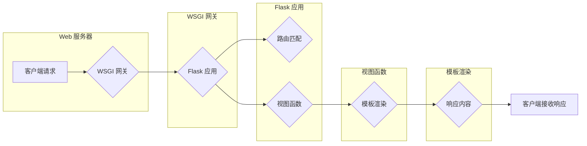

# 基于 Flask 的 Web Server 设计与实现

> 关键词：Flask, Web Server, 轻量级框架, Python, 路由, WSGI, HTTP 协议

## 1. 背景介绍

随着互联网技术的飞速发展，Web Server 作为互联网架构的核心组件，扮演着至关重要的角色。Web Server 负责接收客户端的 HTTP 请求，处理请求并返回响应。在众多的 Web Server 软件中，Flask 是一个轻量级、可扩展的 Web 应用框架，它以 Python 语言为基础，简单易用，深受开发者的喜爱。

本文将深入探讨基于 Flask 的 Web Server 设计与实现，从核心概念、算法原理到实际应用，全面解析 Flask 框架的运作机制，帮助读者深入了解 Flask 的魅力。

## 2. 核心概念与联系

### 2.1 Flask 框架

Flask 是一个开源的 Python Web 应用框架，遵循 MVC（Model-View-Controller）模式。它使用简单，扩展性强，能够快速构建各种类型的 Web 应用。Flask 的核心组件包括：

- **WSGI 协议支持**：Flask 遵循 WSGI（Web Server Gateway Interface）协议，能够与各种 WSGI 兼容的 Web Server（如 Gunicorn、uWSGI）协同工作。

- **模板引擎**：Flask 使用 Jinja2 作为默认的模板引擎，允许开发者使用类似于 HTML 的语法来渲染动态内容。

- **路由系统**：Flask 提供灵活的路由系统，允许开发者通过简单的 URL 规则来定义 Web 服务的入口。

- **扩展支持**：Flask 支持多种扩展，如数据库集成、用户认证、文件上传等，可以满足不同场景下的需求。

### 2.2 Mermaid 流程图

以下是一个简化的 Flask Web Server 架构流程图：



### 2.3 核心概念联系

Flask Web Server 的核心概念包括 WSGI 协议、路由系统、视图函数、模板渲染等。这些概念相互关联，共同构成了 Flask 的核心架构。

- WSGI 协议定义了 Web 服务器与 Web 应用之间的接口规范，Flask 遵循该协议，使得它能够与各种 Web 服务器无缝集成。
- 路由系统负责根据请求的 URL 将请求映射到对应的视图函数。
- 视图函数负责处理请求并生成响应，它可以是简单的返回字符串，也可以是复杂的数据处理逻辑。
- 模板渲染则负责将视图函数生成的数据渲染成 HTML 页面。

## 3. 核心算法原理 & 具体操作步骤

### 3.1 算法原理概述

Flask Web Server 的核心算法原理可以概括为以下几点：

1. 接收客户端请求，解析 HTTP 请求行，获取 URL 和方法。
2. 根据 URL 和方法，通过路由系统找到对应的视图函数。
3. 视图函数处理请求，生成响应内容。
4. 模板渲染将响应内容渲染成 HTML 页面。
5. 将 HTML 页面返回给客户端。

### 3.2 算法步骤详解

以下是 Flask Web Server 的具体操作步骤：

1. **创建 Flask 应用实例**：在应用启动时，创建一个 Flask 应用实例。
2. **注册路由**：使用 `@app.route()` 装饰器注册路由，将 URL 与视图函数关联。
3. **处理请求**：当客户端发起请求时，Flask 应用实例根据 URL 和方法找到对应的视图函数。
4. **执行视图函数**：视图函数接收请求参数，执行业务逻辑，生成响应内容。
5. **模板渲染**：如果响应内容是字符串，则直接返回；如果是字典，则使用 Jinja2 模板引擎进行渲染。
6. **返回响应**：将渲染后的 HTML 页面返回给客户端。

### 3.3 算法优缺点

**优点**：

- 灵活性：Flask 框架轻量级，可扩展性强，可以灵活地添加各种功能。
- 简单易用：Flask 框架易于上手，适合快速开发简单的 Web 应用。
- 开源免费：Flask 是一个开源框架，免费使用。

**缺点**：

- 功能限制：Flask 本身提供的功能相对有限，需要依赖扩展才能完成某些功能。
- 性能瓶颈：Flask 的性能不如一些专业的 Web Server 框架，如 Tornado、Gunicorn。

### 3.4 算法应用领域

Flask 框架适用于以下领域：

- 个人博客
- 小型项目
- API 服务
- 教育项目

## 4. 数学模型和公式 & 详细讲解 & 举例说明

Flask Web Server 本身并不涉及复杂的数学模型和公式，以下是一些与 HTTP 协议相关的常用数学公式：

### 4.1 数学模型构建

- **HTTP 请求行**：`GET /index.html HTTP/1.1`
- **HTTP 状态码**：200, 404, 500 等
- **HTTP 响应头**：Content-Type, Content-Length, Server 等

### 4.2 公式推导过程

HTTP 协议的数学模型主要是基于文本格式，没有复杂的数学推导过程。

### 4.3 案例分析与讲解

以下是一个简单的 Flask Web 应用示例：

```python
from flask import Flask, render_template_string

app = Flask(__name__)

@app.route('/')
def index():
    return render_template_string('<h1>Welcome to Flask Web Server!</h1>')

if __name__ == '__main__':
    app.run()
```

在这个示例中，当用户访问根目录 `/` 时，Flask 会调用 `index` 视图函数，该函数使用 Jinja2 模板引擎渲染一个简单的 HTML 页面。

## 5. 项目实践：代码实例和详细解释说明

### 5.1 开发环境搭建

要搭建 Flask Web Server 的开发环境，需要以下步骤：

1. 安装 Python 环境
2. 安装 Flask 框架
3. 配置 Web Server（如 Gunicorn）

### 5.2 源代码详细实现

以下是一个简单的 Flask Web 应用示例：

```python
from flask import Flask, render_template_string

app = Flask(__name__)

@app.route('/')
def index():
    return render_template_string('<h1>Welcome to Flask Web Server!</h1>')

@app.route('/about')
def about():
    return 'This is an about page.'

if __name__ == '__main__':
    app.run()
```

### 5.3 代码解读与分析

- 第 1 行：导入 Flask 模块。
- 第 2 行：创建 Flask 应用实例。
- 第 3-5 行：定义 `index` 视图函数，当用户访问根目录 `/` 时调用。
- 第 6-8 行：定义 `about` 视图函数，当用户访问 `/about` 路径时调用。
- 第 10 行：启动 Flask 应用。

### 5.4 运行结果展示

在命令行中运行以上代码后，访问 `http://localhost:5000/` 和 `http://localhost:5000/about`，将分别看到欢迎页面和关于页面。

## 6. 实际应用场景

Flask 框架在以下场景中有着广泛的应用：

- **个人博客**：Flask 的轻量级和易用性使其成为个人博客的理想选择。
- **小型项目**：Flask 可以快速构建简单的 Web 应用，如信息查询系统、内部管理系统等。
- **API 服务**：Flask 可以轻松构建 RESTful API 服务，供其他应用程序调用。
- **教育项目**：Flask 适合作为教学案例，帮助学生了解 Web 应用开发的基本原理。

## 7. 工具和资源推荐

### 7.1 学习资源推荐

- **官方文档**：https://flask.palletsprojects.com/
- **在线教程**：https://flask-zh.readthedocs.io/
- **GitHub 项目**：https://github.com/pallets/flask

### 7.2 开发工具推荐

- **集成开发环境**：PyCharm, Visual Studio Code
- **版本控制工具**：Git
- **Web Server**：Gunicorn, uWSGI

### 7.3 相关论文推荐

由于 Flask 框架本身不涉及复杂的算法和公式，因此没有相关的论文推荐。

## 8. 总结：未来发展趋势与挑战

### 8.1 研究成果总结

Flask 框架以其轻量级、易用性和可扩展性，在 Web 应用开发领域取得了巨大的成功。随着 Python 语言的普及和 Web 技术的发展，Flask 框架将继续保持其领先地位。

### 8.2 未来发展趋势

- **更丰富的扩展**：Flask 将继续扩展其功能，提供更多实用的扩展。
- **社区支持**：Flask 社区将继续活跃，为开发者提供丰富的学习资源和交流平台。
- **性能优化**：Flask 将持续进行性能优化，提高框架的运行效率。

### 8.3 面临的挑战

- **安全性**：随着 Web 应用攻击手段的多样化，Flask 需要不断加强安全性防护。
- **性能瓶颈**：Flask 的性能在某些场景下可能存在瓶颈，需要进一步优化。

### 8.4 研究展望

Flask 框架将继续保持其轻量级、易用性的特点，同时不断扩展其功能，满足开发者日益增长的需求。未来，Flask 框架将在 Web 应用开发领域发挥更大的作用。

## 9. 附录：常见问题与解答

### 9.1 如何选择合适的 WSGI Web Server？

A: 常用的 WSGI Web Server 有 Gunicorn、uWSGI、uWSGI、mod_wsgi 等。Gunicorn 和 uWSGI 性能较好，适合生产环境；uWSGI 和 mod_wsgi 性能较差，但易于部署。

### 9.2 如何使用 Flask 框架进行用户认证？

A: Flask 提供了多种用户认证方式，如 Flask-Login、Flask-Security 等。开发者可以根据需求选择合适的库进行用户认证。

### 9.3 如何使用 Flask 框架进行数据库操作？

A: Flask 提供了多种数据库集成方式，如 Flask-SQLAlchemy、Flask-Migrate 等。开发者可以根据需求选择合适的数据库和 ORM 框架进行数据库操作。

### 9.4 如何使用 Flask 框架进行文件上传？

A: Flask 提供了 Flask-Uploads 扩展，用于处理文件上传。开发者可以使用该扩展方便地实现文件上传功能。

作者：禅与计算机程序设计艺术 / Zen and the Art of Computer Programming