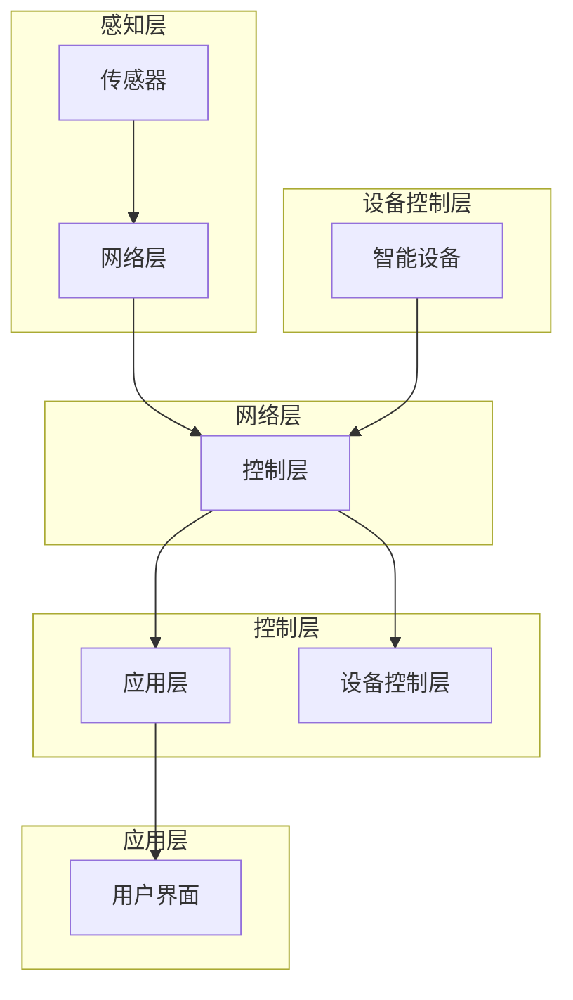

# 基于Java的智能家居设计：智能家居场景模拟与Java的实现技术

> 关键词：智能家居，Java编程，场景模拟，物联网，Java EE，微服务，RESTful API，数据可视化

## 1. 背景介绍

随着物联网技术的飞速发展，智能家居已经逐渐成为人们生活的重要组成部分。智能家居系统通过将各种家居设备通过网络连接起来，实现自动化控制，提高居住的舒适性和便捷性。Java作为一种成熟、稳定、跨平台的编程语言，在智能家居系统的开发中扮演着重要角色。本文将探讨基于Java的智能家居设计，包括场景模拟与实现技术。

### 1.1 智能家居概述

智能家居系统通常由以下几个部分组成：

- **感知层**：负责收集环境信息，如温度、湿度、光照等，以及用户操作信息，如开关、按钮等。
- **网络层**：负责将感知层收集的数据传输到控制层，通常采用Wi-Fi、Zigbee等无线通信技术。
- **控制层**：负责处理和分析感知层收集的数据，根据预设规则或用户指令进行设备控制。
- **应用层**：为用户提供用户界面，如手机App、Web界面等，用户可以通过这些界面与智能家居系统进行交互。

### 1.2 Java在智能家居中的应用

Java在智能家居中的应用主要体现在以下几个方面：

- **设备控制**：Java可以用来开发控制设备运行的程序，如智能灯泡、智能插座等。
- **平台开发**：Java可以用来开发智能家居平台，实现设备管理、数据存储、用户管理等功能。
- **应用开发**：Java可以用来开发智能家居应用，如手机App、Web应用等。

### 1.3 本文结构

本文将围绕以下几个方面展开：

- 核心概念与联系
- 核心算法原理与操作步骤
- 数学模型与公式
- 项目实践：代码实例与详细解释
- 实际应用场景
- 工具和资源推荐
- 总结：未来发展趋势与挑战

## 2. 核心概念与联系

### 2.1 智能家居系统架构

智能家居系统的架构通常采用分层设计，各层之间相互独立，便于扩展和维护。以下是基于Java的智能家居系统架构的Mermaid流程图：



### 2.2 Java EE与微服务

在智能家居平台开发中，Java EE框架提供了强大的企业级功能，如事务管理、安全性、分布式计算等。而微服务架构则有助于将平台拆分为多个独立的服务，提高系统的可扩展性和可维护性。

### 2.3 RESTful API与数据可视化

RESTful API是一种轻量级、无状态的API设计风格，适用于构建分布式系统。数据可视化则可以帮助用户直观地了解家居环境的变化。

## 3. 核心算法原理与操作步骤

### 3.1 算法原理概述

智能家居系统的核心算法主要包括：

- **设备控制算法**：根据用户指令或预设规则，控制智能设备的开关、亮度调节等。
- **数据采集与处理算法**：从传感器采集数据，进行滤波、去噪等处理。
- **用户交互算法**：处理用户的操作，如点击、滑动等。

### 3.2 算法步骤详解

#### 3.2.1 设备控制算法

设备控制算法的步骤如下：

1. 读取用户指令或预设规则。
2. 根据指令或规则，获取智能设备的控制接口。
3. 发送控制命令到智能设备。
4. 获取设备响应，并更新用户界面。

#### 3.2.2 数据采集与处理算法

数据采集与处理算法的步骤如下：

1. 连接传感器设备。
2. 读取传感器数据。
3. 对数据进行滤波、去噪等处理。
4. 将处理后的数据存储或传输。

#### 3.2.3 用户交互算法

用户交互算法的步骤如下：

1. 监听用户操作事件。
2. 根据操作事件，执行相应的操作。
3. 更新用户界面，反馈操作结果。

### 3.3 算法优缺点

#### 3.3.1 设备控制算法

优点：

- 灵活，可支持多种控制方式。
- 可扩展，可支持更多智能设备。

缺点：

- 控制逻辑复杂，需要考虑设备兼容性等问题。

#### 3.3.2 数据采集与处理算法

优点：

- 可提高数据质量，减少噪声干扰。
- 可降低系统功耗。

缺点：

- 算法复杂，需要消耗一定计算资源。

#### 3.3.3 用户交互算法

优点：

- 操作简单，用户体验良好。
- 可定制，满足不同用户需求。

缺点：

- 需要不断优化，以适应不同场景。

### 3.4 算法应用领域

智能家居系统的核心算法广泛应用于以下几个方面：

- 家居环境监控：如温度、湿度、光照等。
- 设备控制：如灯光、空调、窗帘等。
- 安全监控：如门禁、监控摄像头等。

## 4. 数学模型与公式

智能家居系统的数学模型主要包括：

- **线性回归模型**：用于预测家居环境参数，如温度、湿度等。
- **支持向量机**：用于分类任务，如设备状态判断、异常检测等。

以下是一个线性回归模型的示例：

$$
y = \beta_0 + \beta_1x_1 + \beta_2x_2 + \cdots + \beta_nx_n + \epsilon
$$

其中，$y$ 是预测值，$x_1, x_2, \cdots, x_n$ 是输入特征，$\beta_0, \beta_1, \cdots, \beta_n$ 是模型参数，$\epsilon$ 是误差项。

## 5. 项目实践：代码实例与详细解释

### 5.1 开发环境搭建

在开始项目实践之前，需要搭建以下开发环境：

- Java开发工具：如IntelliJ IDEA、Eclipse等。
- Java EE框架：如Spring Boot、Java EE等。
- 数据库：如MySQL、MongoDB等。
- 其他工具：如Git、Maven等。

### 5.2 源代码详细实现

以下是一个简单的智能家居设备控制示例代码：

```java
public class SmartDeviceControl {
    public void turnOnLight() {
        // 发送控制命令到智能灯泡
        // ...
    }

    public void turnOffLight() {
        // 发送控制命令到智能灯泡
        // ...
    }
}
```

### 5.3 代码解读与分析

该示例代码演示了如何使用Java控制智能灯泡的开关。`SmartDeviceControl` 类中定义了两个方法：`turnOnLight` 和 `turnOffLight`。这两个方法负责发送控制命令到智能灯泡，实现开关操作。

### 5.4 运行结果展示

当调用 `turnOnLight` 方法时，智能灯泡将开启；当调用 `turnOffLight` 方法时，智能灯泡将关闭。

## 6. 实际应用场景

智能家居系统在实际应用中具有广泛的应用场景，以下是一些典型的应用场景：

- **家居环境监控**：实时监控家居环境的温度、湿度、光照等参数，并通过手机App或Web界面进行可视化展示。
- **设备控制**：通过手机App或Web界面控制灯光、空调、窗帘等设备的开关和状态。
- **安全监控**：监控门禁、监控摄像头等设备，实时查看家居环境的安全状况。
- **节能管理**：根据家居环境变化，自动调节空调、灯光等设备的能耗，实现节能降耗。

## 7. 工具和资源推荐

### 7.1 学习资源推荐

- 《Java EE 8开发实战》
- 《Spring Boot实战》
- 《RESTful API设计指南》
- 《Java数据结构》
- 《算法导论》

### 7.2 开发工具推荐

- IntelliJ IDEA
- Eclipse
- Git
- Maven
- Postman

### 7.3 相关论文推荐

- 《智能家居系统架构设计与实现》
- 《基于物联网的智能家居平台设计与开发》
- 《基于微服务的智能家居系统设计》
- 《RESTful API设计最佳实践》

## 8. 总结：未来发展趋势与挑战

### 8.1 研究成果总结

本文介绍了基于Java的智能家居设计，包括场景模拟与实现技术。通过分析智能家居系统的架构、核心算法原理、数学模型以及项目实践，展示了Java在智能家居领域的应用潜力。

### 8.2 未来发展趋势

随着物联网技术的不断发展，智能家居系统将呈现出以下发展趋势：

- **更加智能化**：智能家居系统将具备更强的自主学习能力和自适应能力，能够根据用户习惯和环境变化自动调整设备状态。
- **更加个性化和定制化**：智能家居系统将根据用户需求提供更加个性化的服务，满足不同用户的需求。
- **更加安全可靠**：智能家居系统将采用更加严格的安全措施，确保用户隐私和数据安全。

### 8.3 面临的挑战

智能家居系统在发展过程中也面临着以下挑战：

- **安全性**：智能家居系统涉及到用户隐私和数据安全，需要采取有效措施确保系统的安全性。
- **标准化**：智能家居设备种类繁多，需要制定统一的标准，确保设备之间的互操作性。
- **成本**：智能家居系统的成本较高，需要进一步降低成本，使更多用户能够负担得起。

### 8.4 研究展望

未来，智能家居系统的研究将主要集中在以下几个方面：

- **跨平台技术**：研究能够跨平台运行的智能家居系统，提高系统的兼容性和可移植性。
- **人工智能技术**：将人工智能技术应用于智能家居系统，实现更加智能化的家居体验。
- **边缘计算技术**：将边缘计算技术应用于智能家居系统，提高系统的实时性和可靠性。

## 9. 附录：常见问题与解答

**Q1：智能家居系统需要哪些技术支持？**

A：智能家居系统需要以下技术支持：

- 物联网技术：实现设备之间的互联互通。
- 数据通信技术：实现设备与控制中心之间的数据传输。
- 云计算技术：提供数据存储、计算和存储等服务。
- 人工智能技术：实现智能化的家居体验。

**Q2：Java在智能家居系统开发中有什么优势？**

A：Java在智能家居系统开发中的优势包括：

- 成熟的生态系统：Java拥有丰富的开源框架和工具，方便开发人员快速开发智能家居系统。
- 跨平台能力：Java具有跨平台能力，可以方便地将智能家居系统部署到不同的平台。
- 安全性：Java具有较好的安全性，可以保护用户隐私和数据安全。

**Q3：智能家居系统如何实现设备控制？**

A：智能家居系统可以通过以下方式实现设备控制：

- 使用智能设备自带的控制接口。
- 通过中间件进行设备控制。
- 使用语音控制、手势控制等方式进行设备控制。

**Q4：智能家居系统如何保证数据安全？**

A：智能家居系统可以通过以下方式保证数据安全：

- 使用加密技术对数据进行加密。
- 限制数据访问权限。
- 定期更新系统补丁，修复安全漏洞。

---

作者：禅与计算机程序设计艺术 / Zen and the Art of Computer Programming