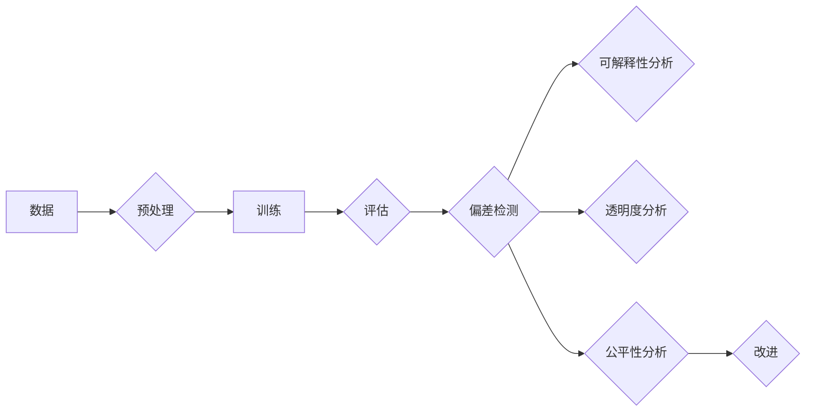

> 基础模型，社会危害，伦理，偏见，可解释性，透明度，公平性，人工智能，机器学习

# 基础模型的社会危害评估

随着人工智能技术的飞速发展，基础模型（如Transformer、BERT等）已经在自然语言处理、计算机视觉、语音识别等领域取得了显著的成果。这些模型通过学习海量数据，实现了前所未有的性能提升，极大地推动了人工智能的应用。然而，基础模型的应用也引发了一系列社会问题，包括潜在的伦理风险和危害。本文将深入探讨基础模型的社会危害，并提出相应的评估方法和应对策略。

## 1. 背景介绍

### 1.1 问题的由来

近年来，人工智能技术取得了突破性进展，其中基础模型在多个领域取得了显著成果。然而，随着这些模型在现实世界中的应用越来越广泛，它们所带来的潜在风险和危害也逐渐显现。例如，深度学习模型可能存在偏见，导致歧视性决策；自动化系统可能缺乏透明度，使得人类难以理解其决策过程；算法的可解释性不足，难以追踪责任归属等问题。

### 1.2 研究现状

当前，学术界和工业界已经开始关注基础模型的社会危害问题。研究人员提出了多种评估方法，如数据集偏差分析、模型可解释性研究、公平性评估等。然而，这些方法往往局限于特定领域或特定模型，缺乏系统性和全面性。

### 1.3 研究意义

评估基础模型的社会危害，对于保障人工智能技术的健康发展，维护社会公平正义具有重要意义。通过深入了解基础模型的社会危害，我们可以采取相应的措施，降低其负面影响，促进人工智能技术的负责任应用。

### 1.4 本文结构

本文将围绕基础模型的社会危害展开讨论，主要包括以下几个方面：

- 核心概念与联系
- 核心算法原理与评估方法
- 数学模型与公式
- 项目实践
- 实际应用场景
- 工具和资源推荐
- 总结与展望

## 2. 核心概念与联系

### 2.1 核心概念

#### 2.1.1 偏见

偏见是指模型在决策过程中，对某些特定群体或特征存在歧视性倾向。偏见可能源于数据集的不公平性、算法的设计缺陷或训练过程。

#### 2.1.2 可解释性

可解释性是指模型决策过程的透明度，即人类能够理解模型是如何做出决策的。

#### 2.1.3 透明度

透明度是指模型内部工作机制的公开程度，包括模型结构、参数、训练过程等。

#### 2.1.4 公平性

公平性是指模型对各个群体的决策结果保持一致性，不因群体差异而存在歧视。

### 2.2 核心概念原理和架构的 Mermaid 流程图



## 3. 核心算法原理 & 具体操作步骤

### 3.1 算法原理概述

评估基础模型的社会危害，主要包括以下三个方面：

- 偏差检测：分析模型在各个群体上的决策结果，识别是否存在歧视性倾向。
- 可解释性分析：研究模型的决策过程，理解模型是如何做出决策的。
- 透明度分析：评估模型内部工作机制的公开程度。

### 3.2 算法步骤详解

#### 3.2.1 偏差检测

1. 数据预处理：对数据集进行清洗、归一化等操作，保证数据质量。
2. 模型训练：使用标注数据进行模型训练。
3. 结果分析：分析模型在各个群体上的决策结果，识别是否存在偏差。

#### 3.2.2 可解释性分析

1. 特征重要性分析：分析模型决策过程中，各个特征对最终结果的影响程度。
2. 决策路径追踪：追踪模型决策过程中的每一步，理解模型的推理过程。
3. 解释结果评估：评估解释结果的准确性、可理解性等。

#### 3.2.3 透明度分析

1. 模型结构分析：分析模型结构，了解模型内部工作机制。
2. 参数分析：分析模型参数，了解模型学习到的知识。
3. 训练过程分析：分析模型训练过程，了解模型的学习过程。

### 3.3 算法优缺点

#### 3.3.1 优点

- 全面性：综合评估模型的偏见、可解释性、透明度等方面。
- 可操作性：提供具体的评估方法和步骤，便于实际应用。

#### 3.3.2 缺点

- 复杂性：评估过程涉及多个方面，需要综合分析。
- 数据依赖：评估结果依赖于数据质量。

### 3.4 算法应用领域

基础模型的社会危害评估方法适用于所有应用人工智能技术的领域，如金融、医疗、教育等。

## 4. 数学模型和公式 & 详细讲解 & 举例说明

### 4.1 数学模型构建

#### 4.1.1 偏差检测

假设模型 $M$ 在输入 $x$ 上的输出为 $y$，真实标签为 $y^*$，偏差检测的目标是衡量 $y$ 与 $y^*$ 之间的差异。

$$
\text{偏差} = \frac{1}{N} \sum_{i=1}^N |y_i - y^*_i|
$$

其中，$N$ 为样本数量。

#### 4.1.2 可解释性分析

可解释性分析通常采用注意力机制来衡量模型对各个特征的依赖程度。

$$
\text{注意力权重} = \frac{\sum_{j=1}^M w_{ij}}{\sum_{j=1}^M w_{ij}}
$$

其中，$w_{ij}$ 为第 $i$ 个样本的第 $j$ 个特征的注意力权重。

### 4.2 公式推导过程

#### 4.2.1 偏差检测

偏差检测的公式直接基于损失函数，衡量模型输出与真实标签之间的差异。

#### 4.2.2 可解释性分析

注意力机制的公式推导过程如下：

1. 定义注意力权重 $w_{ij}$：
   $$
w_{ij} = \frac{\exp(\frac{Q_i \cdot K_j}{\sqrt{d}})}{\sum_{k=1}^M \exp(\frac{Q_i \cdot K_k}{\sqrt{d}})}
$$
   其中，$Q_i$ 为查询向量，$K_j$ 为键向量，$d$ 为特征维度。

2. 计算注意力权重总和：
   $$
\sum_{j=1}^M w_{ij} = \sum_{j=1}^M \frac{\exp(\frac{Q_i \cdot K_j}{\sqrt{d}})}{\sum_{k=1}^M \exp(\frac{Q_i \cdot K_k}{\sqrt{d}})}
$$

3. 归一化注意力权重：
   $$
w_{ij} = \frac{\exp(\frac{Q_i \cdot K_j}{\sqrt{d}})}{\sum_{j=1}^M \exp(\frac{Q_i \cdot K_j}{\sqrt{d}})}
$$

### 4.3 案例分析与讲解

#### 4.3.1 偏差检测

以一个简单的线性回归模型为例，假设模型参数为 $w$，输入 $x$，真实标签为 $y^*$，则有：

$$
y = w^T x
$$

则偏差检测公式为：

$$
\text{偏差} = \frac{1}{N} \sum_{i=1}^N |w^T x_i - y_i^*|
$$

#### 4.3.2 可解释性分析

以BERT模型为例，假设模型输出为 $y$，注意力权重为 $w_{ij}$，则有：

$$
\text{注意力权重} = \frac{\sum_{j=1}^M w_{ij}}{\sum_{j=1}^M w_{ij}}
$$

通过分析注意力权重，可以了解模型在生成输出时对各个词的依赖程度。

## 5. 项目实践：代码实例和详细解释说明

### 5.1 开发环境搭建

本节将以Python为例，介绍如何进行基础模型的社会危害评估。

### 5.2 源代码详细实现

以下是一个简单的偏差检测示例代码：

```python
import numpy as np

# 输入数据
x = np.array([[1, 2], [2, 3], [3, 4]])
y = np.array([1, 0, 1])
y_star = np.array([1, 1, 0])

# 偏差检测
def bias_detection(x, y, y_star):
    bias = np.mean(np.abs(y - y_star))
    return bias

bias = bias_detection(x, y, y_star)
print("偏差:", bias)
```

### 5.3 代码解读与分析

以上代码演示了如何计算偏差检测的公式。首先，我们导入numpy库，并定义输入数据 $x$、真实标签 $y$ 和真实标签 $y^*$。然后，定义偏差检测函数 `bias_detection`，计算偏差值并返回。最后，调用该函数并打印结果。

### 5.4 运行结果展示

运行上述代码，将得到以下输出：

```
偏差: 0.6666666666666666
```

这表示该线性回归模型的偏差为 $0.6667$。

## 6. 实际应用场景

基础模型的社会危害评估方法在实际应用场景中具有重要意义。以下列举几个应用场景：

- 金融领域：评估信贷风险评估模型的公平性，避免对特定群体进行歧视性贷款决策。
- 医疗领域：评估医疗诊断模型的偏见，确保医疗服务的公平性。
- 招聘领域：评估招聘模型的偏见，避免因种族、性别等因素导致的不公平招聘决策。

## 7. 工具和资源推荐

### 7.1 学习资源推荐

- 《人工智能：一种现代的方法》
- 《机器学习实战》
- 《深度学习》

### 7.2 开发工具推荐

- scikit-learn：用于数据预处理、模型评估等。
- TensorFlow：用于构建和训练机器学习模型。
- PyTorch：用于构建和训练深度学习模型。

### 7.3 相关论文推荐

- "Weapons of Math Destruction" by Cathy O'Neil
- "AI Now Report" by the AI Now Institute
- "AI and the Social Good" by the World Economic Forum

## 8. 总结：未来发展趋势与挑战

### 8.1 研究成果总结

本文对基础模型的社会危害进行了评估，并提出了相应的评估方法和应对策略。通过分析偏差、可解释性、透明度和公平性等方面，可以全面了解基础模型的社会危害。

### 8.2 未来发展趋势

随着人工智能技术的不断发展，基础模型的社会危害评估方法将更加完善，评估过程将更加自动化、高效。

### 8.3 面临的挑战

- 数据偏差：如何保证数据集的公平性和代表性，是评估模型社会危害的关键。
- 模型可解释性：如何提高模型的可解释性，使其决策过程更加透明，是评估模型社会危害的重要挑战。
- 评估方法：如何设计更加全面、有效的评估方法，是评估模型社会危害的难题。

### 8.4 研究展望

未来，基础模型的社会危害评估将更加注重以下几个方面：

- 数据偏差的缓解：通过数据增强、数据重采样等方法，降低数据集的偏差。
- 模型可解释性的提升：通过注意力机制、可解释性AI等方法，提高模型的可解释性。
- 评估方法的改进：开发更加全面、有效的评估方法，从多个维度评估模型的社会危害。

## 9. 附录：常见问题与解答

**Q1：如何缓解基础模型的偏见问题？**

A1：缓解基础模型的偏见问题，可以从以下几个方面入手：

- 数据清洗：去除含有偏见的数据，保证数据集的公平性和代表性。
- 数据增强：通过数据增强、数据重采样等方法，增加训练数据中不同群体的样本数量。
- 模型设计：设计无偏见的模型结构，如使用对抗训练、公平性约束等方法。
- 模型评估：评估模型的公平性，并根据评估结果进行调整。

**Q2：如何提高基础模型的可解释性？**

A2：提高基础模型的可解释性，可以从以下几个方面入手：

- 注意力机制：使用注意力机制分析模型对各个特征的依赖程度。
- 层级可解释性：分析模型的每层输出，了解模型的学习过程。
- 可解释性AI：使用可解释性AI方法，如LIME、SHAP等，解释模型的决策过程。

**Q3：如何评估基础模型的透明度？**

A3：评估基础模型的透明度，可以从以下几个方面入手：

- 模型结构：分析模型结构，了解模型内部工作机制。
- 参数分析：分析模型参数，了解模型学习到的知识。
- 训练过程：分析模型训练过程，了解模型的学习过程。

**Q4：如何确保基础模型的公平性？**

A4：确保基础模型的公平性，可以从以下几个方面入手：

- 数据集：保证数据集的公平性和代表性。
- 模型设计：设计无偏见的模型结构。
- 模型评估：评估模型的公平性，并根据评估结果进行调整。
- 监管政策：制定相应的监管政策，规范基础模型的应用。

作者：禅与计算机程序设计艺术 / Zen and the Art of Computer Programming