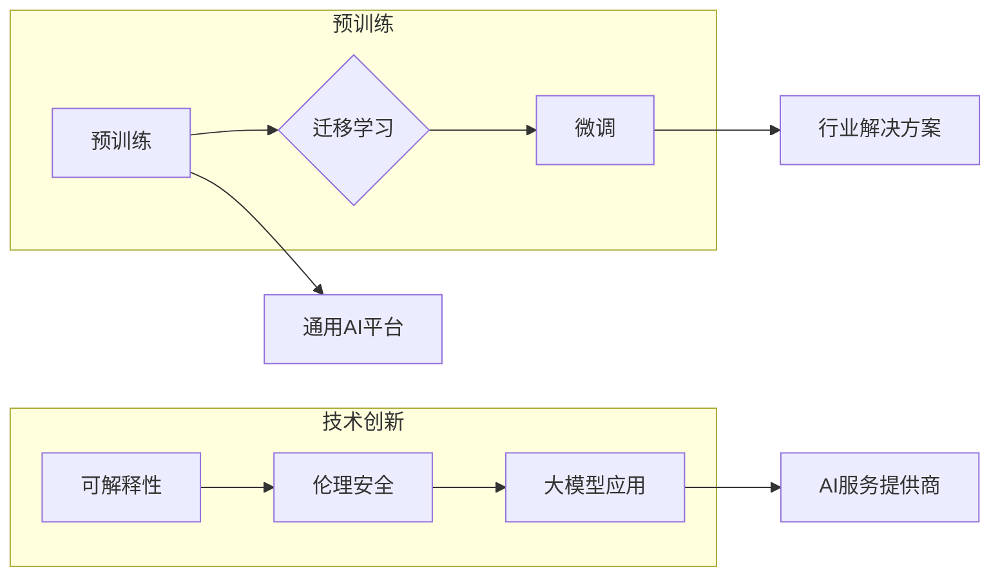

# 大模型的市场定位与技术创新

> 关键词：大模型，市场定位，技术创新，AI生态，商业模式，伦理挑战，可持续发展

## 1. 背景介绍

随着人工智能技术的飞速发展，大模型（Large Models）已经成为推动AI应用创新的重要驱动力。大模型通过在海量数据上训练，能够理解和生成复杂文本、图像、音频等多种类型的数据，为各行各业提供了前所未有的智能化解决方案。然而，大模型的发展也面临着市场定位、技术创新、伦理挑战等多方面的挑战。本文将深入探讨大模型的市场定位与技术创新，分析其面临的机遇与挑战。

### 1.1 大模型的时代背景

近年来，人工智能领域取得了显著的进展，尤其是在深度学习、自然语言处理、计算机视觉等方面。以下是大模型时代背景的几个关键点：

- **计算能力的提升**：随着硬件设备的迭代升级，GPU、TPU等计算设备的能力大幅提升，为训练大模型提供了强大的算力支持。
- **海量数据的积累**：互联网的普及和大数据技术的应用，为AI模型提供了海量的训练数据，使得大模型能够学习到更丰富的知识和技能。
- **深度学习算法的突破**：深度学习算法的不断发展，使得大模型在理解和生成复杂数据方面取得了显著的进步。
- **商业需求的驱动**：各行各业对智能化解决方案的需求日益增长，推动了大模型技术的研发和应用。

### 1.2 大模型的市场定位

大模型的市场定位在于提供高性能、可扩展、可定制的AI解决方案，满足不同行业和场景的需求。以下是几个关键的市场定位方向：

- **通用AI平台**：提供通用的大模型服务，涵盖自然语言处理、计算机视觉、语音识别等多个领域，满足不同场景的应用需求。
- **行业解决方案**：针对特定行业（如金融、医疗、教育等）的需求，开发定制化的大模型解决方案。
- **AI服务提供商**：为企业和开发者提供大模型训练、推理等AI服务，降低AI应用门槛。

## 2. 核心概念与联系

大模型的发展离不开以下几个核心概念：

- **预训练**：在大规模无标签数据上训练模型，使其具备通用的语言理解和知识表示能力。
- **微调**：在特定任务的标签数据上对预训练模型进行微调，使其更好地适应特定场景。
- **迁移学习**：将预训练模型的知识迁移到新的任务中，降低模型训练成本。
- **可解释性**：提高模型决策过程的透明度，增强用户对AI系统的信任。
- **伦理安全**：确保AI系统的决策过程符合伦理规范，避免歧视、偏见等不良后果。

以下是大模型核心概念之间的Mermaid流程图：



## 3. 核心算法原理 & 具体操作步骤

### 3.1 算法原理概述

大模型的核心算法主要包括预训练、微调和迁移学习等步骤。以下是这些算法的简要概述：

- **预训练**：使用无标签数据对模型进行训练，使其学习通用的语言和理解能力。
- **微调**：在特定任务的标签数据上对模型进行训练，使其更好地适应特定场景。
- **迁移学习**：将预训练模型的知识迁移到新的任务中，降低模型训练成本。

### 3.2 算法步骤详解

#### 3.2.1 预训练

预训练步骤主要包括以下步骤：

1. **数据收集**：收集大量无标签文本、图像、音频等数据。
2. **数据预处理**：对数据进行清洗、去重、格式化等操作。
3. **模型设计**：设计合适的模型结构，如BERT、GPT等。
4. **模型训练**：在预训练数据上训练模型，使其学习通用的语言和理解能力。

#### 3.2.2 微调

微调步骤主要包括以下步骤：

1. **数据收集**：收集特定任务的标签数据。
2. **数据预处理**：对数据进行清洗、去重、格式化等操作。
3. **模型调整**：根据特定任务调整模型结构，如添加特定层或修改层参数。
4. **模型训练**：在标签数据上训练模型，使其更好地适应特定场景。

#### 3.2.3 迁移学习

迁移学习步骤主要包括以下步骤：

1. **预训练模型选择**：选择合适的预训练模型作为基础模型。
2. **模型调整**：根据新任务调整模型结构，如添加特定层或修改层参数。
3. **模型训练**：在新任务数据上训练模型，实现知识迁移。

### 3.3 算法优缺点

#### 3.3.1 预训练

**优点**：

- 模型具有通用性，能够理解和生成多种类型的数据。
- 预训练过程可以降低模型训练成本。

**缺点**：

- 预训练需要大量无标签数据。
- 预训练模型的性能依赖于数据质量和数量。

#### 3.3.2 微调

**优点**：

- 模型可以更好地适应特定场景。
- 微调过程可以降低模型训练成本。

**缺点**：

- 微调需要大量标签数据。
- 微调模型的性能依赖于标签数据的质量和数量。

#### 3.3.3 迁移学习

**优点**：

- 模型可以快速适应新任务。
- 迁移学习过程可以降低模型训练成本。

**缺点**：

- 迁移效果取决于预训练模型和新任务的相似度。
- 需要选择合适的预训练模型。

### 3.4 算法应用领域

大模型算法在以下领域具有广泛的应用：

- 自然语言处理（NLP）
- 计算机视觉
- 语音识别
- 医疗诊断
- 金融风控
- 教育领域

## 4. 数学模型和公式 & 详细讲解 & 举例说明

### 4.1 数学模型构建

大模型的核心数学模型主要包括以下几种：

- **神经网络**：神经网络是深度学习的基本单元，通过多层节点进行数据传递和处理。
- **Transformer**：Transformer是一种基于自注意力机制的序列模型，能够处理长距离依赖问题。
- **BERT**：BERT是一种基于Transformer的预训练语言模型，能够学习通用的语言和理解能力。

### 4.2 公式推导过程

以下以BERT模型为例，简要介绍其数学模型的推导过程：

- **输入表示**：将输入文本表示为词向量。
- **Transformer编码器**：对词向量进行编码，使其具备上下文信息。
- **Transformer解码器**：根据编码器的输出，生成文本序列。

### 4.3 案例分析与讲解

以下以BERT模型在文本分类任务中的应用为例，进行案例分析：

1. **数据预处理**：将文本数据进行清洗、去重、格式化等操作。
2. **模型选择**：选择合适的BERT模型，如bert-base-uncased。
3. **模型调整**：根据文本分类任务，添加输出层和损失函数。
4. **模型训练**：在文本分类数据上训练模型。
5. **模型评估**：在测试集上评估模型性能。

## 5. 项目实践：代码实例和详细解释说明

### 5.1 开发环境搭建

1. 安装Python环境。
2. 安装PyTorch和Transformers库。
3. 准备文本分类数据集。

### 5.2 源代码详细实现

以下是一个简单的文本分类任务代码示例：

```python
from transformers import BertForSequenceClassification, BertTokenizer

# 加载预训练模型和分词器
model = BertForSequenceClassification.from_pretrained('bert-base-uncased')
tokenizer = BertTokenizer.from_pretrained('bert-base-uncased')

# 数据预处理
def preprocess_data(texts):
    encodings = tokenizer(texts, padding=True, truncation=True, max_length=512)
    return encodings['input_ids'], encodings['attention_mask']

# 训练模型
def train_model(model, data):
    model.train()
    optimizer = torch.optim.AdamW(model.parameters(), lr=5e-5)
    for epoch in range(3):
        for input_ids, attention_mask in data:
            optimizer.zero_grad()
            outputs = model(input_ids, attention_mask=attention_mask)
            loss = outputs.loss
            loss.backward()
            optimizer.step()
        print(f"Epoch {epoch+1}, loss: {loss.item()}")

# 评估模型
def evaluate_model(model, data):
    model.eval()
    total_loss = 0
    for input_ids, attention_mask in data:
        outputs = model(input_ids, attention_mask=attention_mask)
        loss = outputs.loss
        total_loss += loss.item()
    return total_loss / len(data)

# 加载数据集
texts = ["This is a good product", "This is a bad product"]
labels = [1, 0]

# 预处理数据
input_ids, attention_mask = preprocess_data(texts)

# 训练模型
train_model(model, [(input_ids, attention_mask)])

# 评估模型
print(f"Test loss: {evaluate_model(model, [(input_ids, attention_mask)])}")
```

### 5.3 代码解读与分析

以上代码展示了使用PyTorch和Transformers库进行文本分类任务的简单实现。首先，加载预训练的BERT模型和分词器。然后，对文本数据进行预处理，包括分词、填充和截断。接着，定义训练和评估函数，使用AdamW优化器和交叉熵损失函数进行模型训练。最后，加载数据集，进行模型训练和评估。

### 5.4 运行结果展示

运行上述代码后，会输出训练过程中的loss值和测试过程中的loss值。根据测试loss值，可以评估模型的性能。

## 6. 实际应用场景

大模型在实际应用场景中具有广泛的应用，以下是一些典型应用：

- **智能客服**：使用大模型进行自然语言理解，实现智能客服系统。
- **智能推荐**：使用大模型进行用户画像和推荐算法，实现个性化推荐系统。
- **智能翻译**：使用大模型进行机器翻译，实现跨语言沟通。
- **智能医疗**：使用大模型进行医学影像识别和疾病诊断。
- **智能金融**：使用大模型进行风险控制和欺诈检测。

## 7. 工具和资源推荐

### 7.1 学习资源推荐

- 《深度学习》
- 《Python深度学习》
- 《自然语言处理实践》
- Hugging Face官网（https://huggingface.co/）
- TensorFlow官网（https://www.tensorflow.org/）

### 7.2 开发工具推荐

- PyTorch
- TensorFlow
- Jupyter Notebook
- Colab

### 7.3 相关论文推荐

- Attention is All You Need
- BERT: Pre-training of Deep Bidirectional Transformers for Language Understanding
- GPT-2

## 8. 总结：未来发展趋势与挑战

### 8.1 研究成果总结

大模型作为人工智能领域的重要方向，取得了显著的成果。预训练、微调和迁移学习等技术的不断发展，使得大模型在多个领域取得了突破性进展。然而，大模型的发展也面临着诸多挑战，需要进一步研究和探索。

### 8.2 未来发展趋势

- **模型规模将进一步扩大**：随着计算能力和数据规模的提升，大模型的规模将不断增大，能够处理更复杂的任务。
- **模型可解释性将得到提升**：通过引入可解释性技术，提高模型决策过程的透明度，增强用户对AI系统的信任。
- **多模态大模型将得到广泛应用**：将文本、图像、音频等多模态数据融合，实现更全面的信息理解。
- **大模型将更加注重伦理和安全性**：在模型训练和应用过程中，重视伦理和安全性问题，避免歧视、偏见等不良后果。

### 8.3 面临的挑战

- **计算资源需求巨大**：大模型训练和推理需要大量的计算资源，对硬件设备和能源消耗提出了更高的要求。
- **数据安全和隐私保护**：大模型训练需要海量数据，如何保证数据安全和隐私保护是一个重要问题。
- **模型可解释性不足**：大模型决策过程的透明度不高，难以解释其决策逻辑。
- **伦理和安全性挑战**：大模型的应用可能会引发伦理和安全性问题，如歧视、偏见、恶意攻击等。

### 8.4 研究展望

- **高效的大模型训练方法**：研究更加高效的大模型训练方法，降低计算资源需求，提高训练速度。
- **数据安全和隐私保护技术**：研究数据安全和隐私保护技术，保护用户数据安全。
- **模型可解释性和可信度提升**：研究模型可解释性和可信度提升方法，增强用户对AI系统的信任。
- **伦理和安全性研究**：研究AI伦理和安全性问题，制定相关规范和标准。

## 9. 附录：常见问题与解答

**Q1：大模型与传统模型有什么区别？**

A：大模型与传统模型相比，具有以下特点：

- **规模更大**：大模型的参数规模和训练数据量远大于传统模型。
- **性能更强**：大模型在多个任务上取得了SOTA性能。
- **泛化能力更强**：大模型能够泛化到新的任务和数据集。

**Q2：大模型训练需要多少计算资源？**

A：大模型训练需要大量的计算资源，包括GPU、TPU等高性能设备。

**Q3：如何保证大模型的安全性？**

A：为了保证大模型的安全性，需要从以下几个方面进行考虑：

- **数据安全**：确保训练数据的安全性和隐私保护。
- **模型安全**：研究对抗样本、恶意攻击等安全威胁，提高模型鲁棒性。
- **伦理和公平性**：确保模型决策过程符合伦理和公平性要求。

**Q4：大模型的应用前景如何？**

A：大模型在多个领域具有广泛的应用前景，如自然语言处理、计算机视觉、语音识别、医疗诊断、金融风控等。

作者：禅与计算机程序设计艺术 / Zen and the Art of Computer Programming