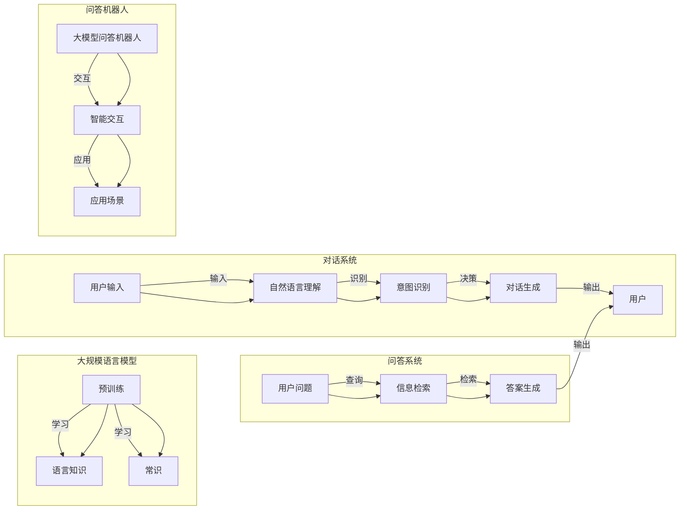

> 关键词：大模型问答，智能化交互，自然语言处理，机器学习，对话系统，BERT，Transformer

# 大模型问答机器人的智能化交互

随着人工智能技术的不断发展，自然语言处理（NLP）领域取得了显著的进步。大模型问答机器人作为NLP技术的重要应用之一，已成为智能客服、智能助手等领域的热门话题。本文将深入探讨大模型问答机器人的智能化交互，从核心概念、算法原理、项目实践到实际应用场景等方面进行全面分析。

## 1. 背景介绍

近年来，自然语言处理技术取得了突飞猛进的发展，尤其是在大规模语言模型（Large Language Models，LLMs）领域。这些大模型通过在海量无标签文本数据上进行预训练，学习到了丰富的语言知识和常识，为问答系统的发展提供了坚实的基础。大模型问答机器人以其强大的语言理解和生成能力，在智能客服、智能助手等场景中得到了广泛应用。

## 2. 核心概念与联系

### 2.1 核心概念

#### 2.1.1 大规模语言模型

大规模语言模型（LLMs）是NLP领域的一种新型模型，通过在海量无标签文本数据上进行预训练，学习到了丰富的语言知识和常识，具备强大的语言理解和生成能力。

#### 2.1.2 对话系统

对话系统是指人与计算机之间通过自然语言进行交互的智能系统，旨在实现人机对话的流畅性和自然性。

#### 2.1.3 问答系统

问答系统是指能够理解和回答用户问题的系统，主要包括事实问答和开放域问答。

#### 2.1.4 问答机器人

问答机器人是问答系统的一种，通过智能问答技术，实现与用户的自然语言交互。

### 2.2 核心概念原理和架构的 Mermaid 流程图



## 3. 核心算法原理 & 具体操作步骤

### 3.1 算法原理概述

大模型问答机器人的智能化交互主要基于以下技术：

1. 预训练语言模型：通过大规模无标签文本数据预训练，学习到丰富的语言知识和常识。
2. 自然语言理解（NLU）：对用户输入进行分词、词性标注、命名实体识别等处理，提取语义信息。
3. 意图识别：根据用户输入的语义信息，识别用户意图。
4. 问答检索：根据用户意图，从知识库或数据库中检索相关信息。
5. 答案生成：根据检索到的信息，生成自然流畅的答案。

### 3.2 算法步骤详解

1. 用户输入：用户通过语音或文本形式输入问题。
2. 分词、词性标注、命名实体识别：对用户输入进行处理，提取语义信息。
3. 意图识别：根据用户输入的语义信息，识别用户意图。
4. 问答检索：根据用户意图，从知识库或数据库中检索相关信息。
5. 答案生成：根据检索到的信息，生成自然流畅的答案。
6. 输出答案：将生成的答案以语音或文本形式输出给用户。

### 3.3 算法优缺点

#### 3.3.1 优点

1. 交互自然：大模型问答机器人能够理解用户的自然语言输入，生成自然流畅的答案。
2. 智能问答：能够识别用户意图，并提供针对性的回答。
3. 知识丰富：基于预训练语言模型，拥有丰富的语言知识和常识。

#### 3.3.2 缺点

1. 训练成本高：大模型训练需要大量的计算资源和时间。
2. 知识库更新慢：知识库的更新需要人工介入，存在滞后性。
3. 答案质量参差不齐：在处理复杂问题时，答案可能不够准确或不够详细。

### 3.4 算法应用领域

大模型问答机器人在以下领域具有广泛的应用：

1. 智能客服：为用户提供24小时在线客服，提高服务质量。
2. 智能助手：为用户提供日程管理、信息查询等服务。
3. 教育领域：辅助教师进行教学，提供个性化学习方案。
4. 医疗领域：为患者提供健康咨询、疾病查询等服务。
5. 金融领域：为用户提供金融咨询、投资建议等服务。

## 4. 数学模型和公式 & 详细讲解 & 举例说明

### 4.1 数学模型构建

大模型问答机器人的核心算法主要基于以下数学模型：

1. 预训练语言模型：如BERT、GPT等。
2. 自然语言理解（NLU）模型：如LSTM、CNN等。
3. 意图识别模型：如CRF、分类器等。
4. 答案生成模型：如序列到序列模型、变换器模型等。

### 4.2 公式推导过程

以下以BERT模型为例，简要介绍其数学模型推导过程。

BERT模型是一种基于Transformer的自注意力模型，其基本原理如下：

1. **输入嵌入**：将输入文本的词转换为词向量。
2. **位置编码**：添加位置信息，使模型能够识别词的顺序。
3. **多头自注意力**：通过多头自注意力机制提取文本的上下文信息。
4. **前馈神经网络**：对多头自注意力后的输出进行非线性变换。
5. **层归一化**：对前馈神经网络的输出进行层归一化。
6. **输出层**：将最终输出转换为所需的格式，如分类结果或序列。

### 4.3 案例分析与讲解

以下以一个简单的问答机器人为例，说明大模型问答机器人的工作流程。

**案例**：用户输入问题：“今天天气怎么样？”

**步骤**：

1. **输入处理**：将用户输入的文本进行分词、词性标注、命名实体识别等处理，提取语义信息。
2. **意图识别**：根据用户输入的语义信息，识别用户意图为“查询天气”。
3. **问答检索**：从天气预报API中检索今天当地的天气信息。
4. **答案生成**：根据检索到的信息，生成答案：“今天天气晴朗，气温18℃。”
5. **输出答案**：将生成的答案输出给用户。

## 5. 项目实践：代码实例和详细解释说明

### 5.1 开发环境搭建

1. 安装Python环境。
2. 安装transformers、torch等依赖库。

### 5.2 源代码详细实现

以下是一个简单的问答机器人示例代码：

```python
from transformers import BertForQuestionAnswering, BertTokenizer
import requests

# 初始化模型和分词器
tokenizer = BertTokenizer.from_pretrained('bert-base-chinese')
model = BertForQuestionAnswering.from_pretrained('bert-base-chinese')

# 定义问答函数
def qa_system(question, context):
    # 将问题和上下文编码
    inputs = tokenizer(question, context, return_tensors="pt")
    outputs = model(**inputs)
    # 获取答案的start和end位置
    start_positions = outputs.start_logits.argmax(-1)
    end_positions = outputs.end_logits.argmax(-1)
    # 解码答案
    answer = tokenizer.decode(context[int(start_positions.item()): int(end_positions.item())+1], skip_special_tokens=True)
    return answer

# 测试问答机器人
question = "今天天气怎么样？"
context = "北京今天的天气是晴朗，气温18℃。"
print(qa_system(question, context))
```

### 5.3 代码解读与分析

1. **初始化模型和分词器**：使用transformers库加载预训练的BERT模型和对应的分词器。
2. **定义问答函数**：将问题和上下文编码为模型所需的格式，并传入模型进行推理，得到答案的start和end位置，最后解码答案。
3. **测试问答机器人**：输入问题和上下文，调用问答函数得到答案。

## 6. 实际应用场景

### 6.1 智能客服

大模型问答机器人在智能客服领域具有广泛的应用，可以自动回答用户常见问题，提高客服效率，降低企业成本。

### 6.2 智能助手

大模型问答机器人可以作为智能助手的组成部分，为用户提供信息查询、日程管理、语音助手等服务。

### 6.3 教育领域

大模型问答机器人可以辅助教师进行教学，为学生提供个性化学习方案，提高学习效率。

### 6.4 医疗领域

大模型问答机器人可以提供医疗咨询、疾病查询等服务，为患者提供便利。

### 6.5 金融领域

大模型问答机器人可以提供金融咨询、投资建议等服务，为用户提供个性化的金融服务。

## 7. 工具和资源推荐

### 7.1 学习资源推荐

1. 《深度学习与自然语言处理》
2. 《自然语言处理入门》
3. 《BERT: Pre-training of Deep Bidirectional Transformers for Language Understanding》
4. 《Natural Language Processing with Transformers》

### 7.2 开发工具推荐

1. transformers库：Hugging Face提供的NLP工具库，包含丰富的预训练模型和示例代码。
2. PyTorch：流行的深度学习框架，支持多种NLP任务。
3. TensorFlow：Google开发的深度学习框架，支持多种NLP任务。

### 7.3 相关论文推荐

1. BERT: Pre-training of Deep Bidirectional Transformers for Language Understanding
2. Natural Language Inference
3. Retrieval-based Question Answering with Pointer-Generated Networks
4. DistilBERT, a Distilled Version of BERT: smaller, faster, cheaper and lighter

## 8. 总结：未来发展趋势与挑战

### 8.1 研究成果总结

大模型问答机器人在智能化交互方面取得了显著成果，为各个领域提供了便捷的服务。然而，仍存在一些挑战需要克服。

### 8.2 未来发展趋势

1. 预训练模型将持续发展，模型规模和性能将不断提升。
2. 问答技术将与其他人工智能技术（如知识图谱、因果推理等）相结合，实现更强大的智能交互。
3. 问答机器人将更加注重用户体验，提供更加人性化的服务。

### 8.3 面临的挑战

1. 标注数据质量：标注数据的准确性和覆盖率影响问答系统的性能。
2. 知识库更新：知识库的实时性和准确性影响问答系统的可信度。
3. 模型鲁棒性：模型在面对对抗样本和噪声数据时，鲁棒性有待提高。

### 8.4 研究展望

1. 探索更高效的预训练模型，降低训练成本。
2. 开发更智能的知识抽取和融合技术，提高知识库的准确性。
3. 研究更鲁棒的问答模型，提高模型在面对对抗样本和噪声数据时的性能。

大模型问答机器人的智能化交互技术在未来将不断发展，为各个领域带来更多便利和惊喜。相信在学界和产业界的共同努力下，大模型问答机器人将为构建人机协同的未来世界做出更大的贡献。

## 9. 附录：常见问题与解答

**Q1：大模型问答机器人的核心技术是什么？**

A：大模型问答机器人的核心技术主要包括预训练语言模型、自然语言理解（NLU）、意图识别、问答检索和答案生成等。

**Q2：如何提高大模型问答机器人的性能？**

A：提高大模型问答机器人的性能可以从以下方面入手：
1. 提高标注数据质量，确保标注的准确性和覆盖率。
2. 开发更智能的知识抽取和融合技术，提高知识库的准确性。
3. 研究更鲁棒的问答模型，提高模型在面对对抗样本和噪声数据时的性能。
4. 优化模型结构和训练策略，提高模型的学习能力。

**Q3：大模型问答机器人在实际应用中存在哪些问题？**

A：大模型问答机器人在实际应用中存在以下问题：
1. 标注数据质量：标注数据的准确性和覆盖率影响问答系统的性能。
2. 知识库更新：知识库的实时性和准确性影响问答系统的可信度。
3. 模型鲁棒性：模型在面对对抗样本和噪声数据时，鲁棒性有待提高。

**Q4：如何解决大模型问答机器人的问题？**

A：解决大模型问答机器人的问题可以从以下方面入手：
1. 提高标注数据质量，确保标注的准确性和覆盖率。
2. 开发更智能的知识抽取和融合技术，提高知识库的准确性。
3. 研究更鲁棒的问答模型，提高模型在面对对抗样本和噪声数据时的性能。
4. 优化模型结构和训练策略，提高模型的学习能力。

作者：禅与计算机程序设计艺术 / Zen and the Art of Computer Programming