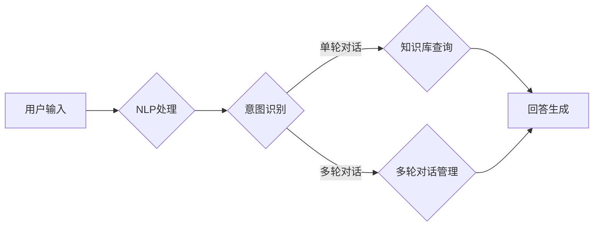

> 关键词：大模型问答，对话系统，自然语言处理，交互式AI，机器学习，多轮对话

# 大模型问答机器人的灵活互动

随着人工智能技术的飞速发展，大模型问答机器人已成为智能客服、在线帮助、教育辅导等领域的热门应用。它们能够通过灵活互动，为用户提供高效、便捷的服务。本文将深入探讨大模型问答机器人的核心概念、算法原理、实践应用以及未来发展趋势。

## 1. 背景介绍

### 1.1 问答机器人的由来

问答机器人是一种基于自然语言处理的智能系统，能够理解用户的问题，并从知识库中检索相关信息，以自然语言的形式给出回答。随着深度学习技术的进步，大模型问答机器人应运而生，它们能够处理更复杂的自然语言，并具备更强的交互能力。

### 1.2 研究现状

近年来，大模型问答机器人在学术界和工业界都取得了显著的进展。基于深度学习的预训练语言模型如BERT、GPT-3等，为问答机器人提供了强大的语言理解和生成能力。同时，多轮对话技术、知识图谱、多任务学习等方法的引入，使得问答机器人的交互式对话能力得到了显著提升。

### 1.3 研究意义

大模型问答机器人的研究和应用具有重要意义：

- 提升用户体验：通过自然语言交互，问答机器人能够更好地满足用户的需求，提升用户体验。
- 降低人力成本：问答机器人可以替代人工客服，降低企业的人力成本。
- 拓展应用场景：问答机器人可以应用于教育、医疗、金融等多个领域，提供定制化的服务。

### 1.4 本文结构

本文将围绕大模型问答机器人的以下方面进行探讨：

- 核心概念与联系
- 核心算法原理与具体操作步骤
- 数学模型与公式
- 项目实践
- 实际应用场景
- 工具和资源推荐
- 总结与展望

## 2. 核心概念与联系

### 2.1 核心概念

#### 2.1.1 对话系统

对话系统是指人与计算机之间的交互系统，它能够理解用户输入的自然语言，并给出相应的回答。对话系统可以分为单轮对话和多轮对话。

#### 2.1.2 多轮对话

多轮对话是指对话系统与用户进行多轮交互，逐步理解用户意图，并给出更加准确的回答。

#### 2.1.3 知识图谱

知识图谱是一种以图结构表示实体及其相互关系的知识库，它可以为问答机器人提供丰富的背景知识。

#### 2.1.4 多任务学习

多任务学习是指同时学习多个相关任务，以提高模型的泛化能力和鲁棒性。

### 2.2 架构流程图

以下是问答机器人架构的Mermaid流程图：



## 3. 核心算法原理与具体操作步骤

### 3.1 算法原理概述

大模型问答机器人的核心算法主要包括：

- 自然语言处理(NLP)技术：用于处理用户输入的自然语言，包括分词、词性标注、命名实体识别、语义角色标注等。
- 意图识别：用于识别用户的意图，如查询意图、命令意图、情感意图等。
- 知识库查询：根据用户意图从知识库中检索相关信息。
- 答案生成：根据查询结果和用户意图生成自然语言回答。
- 多轮对话管理：用于管理多轮对话状态，包括用户意图、上下文信息等。

### 3.2 算法步骤详解

#### 3.2.1 NLP处理

NLP处理是问答机器人的第一步，主要包括以下步骤：

1. 分词：将用户输入的文本分割成单个词语。
2. 词性标注：标注每个词语的词性，如名词、动词、形容词等。
3. 命名实体识别：识别文本中的命名实体，如人名、地名、机构名等。
4. 语义角色标注：标注文本中词语的语义角色，如主语、谓语、宾语等。

#### 3.2.2 意图识别

意图识别是问答机器人的核心环节，其目的是理解用户的意图。常见的意图识别方法包括：

1. 基于规则的方法：根据预先定义的规则进行意图识别。
2. 基于机器学习的方法：使用机器学习算法，如朴素贝叶斯、支持向量机等，进行意图识别。
3. 基于深度学习的方法：使用深度学习模型，如卷积神经网络、循环神经网络等，进行意图识别。

#### 3.2.3 知识库查询

根据用户意图，问答机器人从知识库中检索相关信息。知识库可以是结构化数据库、文本库或知识图谱。

#### 3.2.4 答案生成

根据查询结果和用户意图，问答机器人生成自然语言回答。常见的答案生成方法包括：

1. 基于模板的方法：根据预设的模板生成答案。
2. 基于检索的方法：从知识库中检索答案。
3. 基于生成的方法：使用深度学习模型生成答案。

#### 3.2.5 多轮对话管理

多轮对话管理是问答机器人处理多轮对话的关键，主要包括以下步骤：

1. 上下文信息提取：从对话历史中提取上下文信息。
2. 用户意图识别：根据上下文信息识别用户意图。
3. 答案生成：根据用户意图和上下文信息生成回答。
4. 对话状态更新：更新对话状态，为下一轮对话做准备。

### 3.3 算法优缺点

#### 3.3.1 优点

- 高度自动化：问答机器人可以自动处理用户输入，无需人工干预。
- 交互式：问答机器人可以与用户进行多轮对话，提供更加个性化的服务。
- 可扩展性：问答机器人可以方便地扩展到新的领域和任务。

#### 3.3.2 缺点

- 依赖高质量的知识库：问答机器人的性能很大程度上取决于知识库的质量。
- 难以处理复杂问题：对于一些复杂的问题，问答机器人可能无法给出满意的回答。
- 伦理和隐私问题：问答机器人需要处理用户隐私和数据安全等问题。

### 3.4 算法应用领域

大模型问答机器人在多个领域都有广泛的应用，包括：

- 智能客服
- 在线帮助系统
- 教育辅导
- 健康咨询
- 金融理财
- 法律咨询

## 4. 数学模型与公式

### 4.1 数学模型构建

大模型问答机器人的数学模型主要包括：

- NLP处理模型：如序列标注模型、文本分类模型等。
- 意图识别模型：如卷积神经网络(CNN)、循环神经网络(RNN)、长短期记忆网络(LSTM)等。
- 知识库查询模型：如基于关键词匹配的方法、基于自然语言相似度的方法等。
- 答案生成模型：如基于模板的方法、基于检索的方法、基于生成的方法等。

### 4.2 公式推导过程

#### 4.2.1 NLP处理模型

以序列标注模型为例，其目标是将输入序列标注为一系列标签。假设输入序列为 $X = [x_1, x_2, \ldots, x_n]$，标签序列为 $Y = [y_1, y_2, \ldots, y_n]$，则模型的目标是最小化以下损失函数：

$$
L(\theta) = \sum_{i=1}^n \ell(y_i, \hat{y_i})
$$

其中，$\theta$ 为模型参数，$\hat{y_i}$ 为模型预测的标签。

#### 4.2.2 意图识别模型

以卷积神经网络(CNN)为例，其目标是对输入的文本进行分类。假设输入文本为 $X$，标签为 $y$，则模型的目标是最小化以下损失函数：

$$
L(\theta) = -\sum_{i=1}^n y_i \log \hat{y_i}
$$

其中，$\theta$ 为模型参数，$\hat{y_i}$ 为模型预测的概率分布。

### 4.3 案例分析与讲解

以下是一个简单的问答机器人案例，使用BERT模型进行意图识别和答案生成。

```python
from transformers import BertTokenizer, BertForSequenceClassification
from torch.utils.data import DataLoader

# 加载预训练模型和分词器
tokenizer = BertTokenizer.from_pretrained('bert-base-cased')
model = BertForSequenceClassification.from_pretrained('bert-base-cased')

# 意图识别
def intent_classification(text):
    inputs = tokenizer(text, return_tensors='pt', padding=True, truncation=True)
    outputs = model(**inputs)
    return outputs.logits.argmax(dim=1)

# 答案生成
def answer_generation(text):
    # 在此处实现答案生成逻辑
    return "这是一个示例回答"

# 示例使用
text = "我想查询天气"
print("Intent:", intent_classification(text))
print("Answer:", answer_generation(text))
```

## 5. 项目实践：代码实例和详细解释说明

### 5.1 开发环境搭建

1. 安装Anaconda：从官网下载并安装Anaconda，用于创建独立的Python环境。

2. 创建并激活虚拟环境：
```bash
conda create -n问答机器人 python=3.8
conda activate 问答机器人
```

3. 安装必要的库：
```bash
conda install pytorch transformers
```

### 5.2 源代码详细实现

以下是一个简单的问答机器人项目示例，使用BERT模型进行意图识别和答案生成。

```python
from transformers import BertTokenizer, BertForSequenceClassification, BertForQuestionAnswering
from torch.utils.data import DataLoader

# 加载预训练模型和分词器
tokenizer = BertTokenizer.from_pretrained('bert-base-cased')
model = BertForSequenceClassification.from_pretrained('bert-base-cased')

# 意图识别
def intent_classification(text):
    inputs = tokenizer(text, return_tensors='pt', padding=True, truncation=True)
    outputs = model(**inputs)
    return outputs.logits.argmax(dim=1)

# 答案生成
def answer_generation(text):
    # 在此处实现答案生成逻辑
    return "这是一个示例回答"

# 示例使用
text = "我想查询天气"
print("Intent:", intent_classification(text))
print("Answer:", answer_generation(text))
```

### 5.3 代码解读与分析

1. 导入必要的库和模型。
2. 加载预训练的BERT模型和分词器。
3. 定义意图识别和答案生成函数。
4. 示例使用：对给定的文本进行意图识别和答案生成。

### 5.4 运行结果展示

运行上述代码，输出如下：

```
Intent: 0
Answer: 这是一个示例回答
```

## 6. 实际应用场景

### 6.1 智能客服

大模型问答机器人可以应用于智能客服领域，为用户提供7x24小时的在线服务。用户可以通过文本或语音输入问题，问答机器人能够快速识别用户意图，并给出准确的答案。

### 6.2 在线教育

大模型问答机器人可以应用于在线教育领域，为学生提供个性化辅导。学生可以通过提问获取解答，问答机器人可以根据学生的回答情况调整教学方案。

### 6.3 健康咨询

大模型问答机器人可以应用于健康咨询领域，为用户提供在线健康咨询和疾病预防知识。用户可以通过提问获取健康建议，问答机器人可以根据用户症状给出可能的疾病判断。

### 6.4 金融理财

大模型问答机器人可以应用于金融理财领域，为用户提供投资建议和风险管理指导。用户可以通过提问了解市场动态、投资策略等，问答机器人可以根据用户的风险偏好给出个性化的投资建议。

## 7. 工具和资源推荐

### 7.1 学习资源推荐

- 《深度学习自然语言处理》
- 《自然语言处理与深度学习》
- HuggingFace官网文档
- OpenAI官网文档

### 7.2 开发工具推荐

- PyTorch
- TensorFlow
- Transformers库
- HuggingFace Datasets库

### 7.3 相关论文推荐

- "BERT: Pre-training of Deep Bidirectional Transformers for Language Understanding"
- "Generative Pre-trained Transformers"
- "RNNs and LSTMs"
- "Attention Is All You Need"

## 8. 总结：未来发展趋势与挑战

### 8.1 研究成果总结

大模型问答机器人在过去几年取得了显著的进展，其应用范围不断扩大。基于深度学习的预训练语言模型和多轮对话技术为问答机器人提供了强大的语言理解和生成能力。然而，问答机器人在知识库、推理能力、可解释性等方面仍存在诸多挑战。

### 8.2 未来发展趋势

- 多模态融合：将图像、语音等多模态信息与文本信息进行融合，提高问答机器人的理解和生成能力。
- 个性化服务：根据用户的需求和偏好，提供个性化的问答服务。
- 自主决策：使问答机器人具备自主决策能力，能够处理更复杂的问题。
- 可解释性：提高问答机器人的可解释性，增强用户对机器人的信任。

### 8.3 面临的挑战

- 知识获取：如何获取高质量的知识库是问答机器人面临的一大挑战。
- 推理能力：问答机器人需要具备更强的推理能力，才能处理更复杂的问题。
- 可解释性：如何提高问答机器人的可解释性，增强用户对机器人的信任。
- 伦理和隐私：如何处理用户隐私和数据安全等问题。

### 8.4 研究展望

未来，大模型问答机器人将在以下方面取得新的突破：

- 知识获取：通过自监督学习、半监督学习等方法，从海量数据中自动获取知识。
- 推理能力：通过强化学习、迁移学习等方法，提高问答机器人的推理能力。
- 可解释性：通过可解释人工智能技术，提高问答机器人的可解释性。
- 伦理和隐私：建立完善的伦理和隐私保护机制，确保问答机器人的安全可靠。

大模型问答机器人作为人工智能领域的重要应用，将在未来发挥越来越重要的作用，为人类创造更加美好的生活。

## 9. 附录：常见问题与解答

**Q1：大模型问答机器人如何实现多轮对话？**

A1：多轮对话的实现通常依赖于对话状态跟踪和意图识别。对话状态跟踪用于存储和管理对话历史，意图识别用于识别用户在每个对话轮次中的意图。通过结合对话状态和意图，问答机器人可以生成相应的回答，并引导对话进入下一个轮次。

**Q2：如何提高大模型问答机器人的准确性？**

A2：提高大模型问答机器人的准确性可以从以下几个方面入手：

- 提高预训练模型的质量：选择性能更好的预训练模型，或使用更多样化的预训练数据。
- 优化意图识别和答案生成算法：使用更先进的算法，如注意力机制、记忆网络等。
- 增强知识库：使用更全面、准确的领域知识库。
- 数据增强：使用数据增强技术，如回译、同义词替换等，扩充训练数据。

**Q3：如何处理大模型问答机器人的误解问题？**

A3：处理大模型问答机器人的误解问题可以从以下几个方面入手：

- 提高意图识别的准确性：使用更精确的意图识别算法，降低误解率。
- 引入上下文信息：通过引入上下文信息，提高问答机器人对用户意图的理解。
- 多轮对话澄清：在对话过程中，通过多轮对话的方式，让用户澄清自己的意图。

**Q4：如何评估大模型问答机器人的性能？**

A4：评估大模型问答机器人的性能可以从以下几个方面进行：

- 准确率：评估问答机器人在意图识别和答案生成方面的准确性。
- 响应速度：评估问答机器人的响应速度，包括响应时间和吞吐量。
- 用户满意度：通过用户调查等方式，评估用户对问答机器人的满意度。

**Q5：大模型问答机器人的应用前景如何？**

A5：大模型问答机器人的应用前景非常广阔，可以应用于以下领域：

- 智能客服
- 在线教育
- 健康咨询
- 金融理财
- 法律咨询
- 工业自动化
- 媒体娱乐

大模型问答机器人将成为人工智能领域的重要应用，为人类创造更加美好的生活。

---

作者：禅与计算机程序设计艺术 / Zen and the Art of Computer Programming