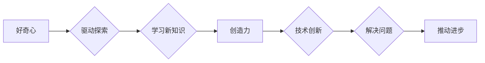

> 好奇心, 创造力, 探索, 知识构建, 技术创新, 跨学科学习, 学习方法论, 未来思维

# 好奇心与创造力：探索的双翼

好奇心和创造力，如同探索宇宙的两翼，推动着人类不断前进。在IT领域，这两个因素尤为重要，它们是技术创新的源泉，是知识构建的基石。本文将探讨好奇心与创造力的本质，分析它们之间的关系，并提出如何在IT领域培养和运用这两种能力。

## 1. 背景介绍

### 1.1 好奇心的起源

好奇心是人类与生俱来的特质，它驱使我们对周围的世界充满好奇，渴望了解未知。在IT领域，好奇心表现为对新技术、新方法、新工具的不断探索和尝试。

### 1.2 创造力的意义

创造力是IT领域发展的核心驱动力。它不仅体现在技术创新上，也体现在对现有技术的改进和创新应用上。拥有创造力的IT专业人士能够提出新颖的想法，解决复杂问题，推动行业进步。

### 1.3 好奇心与创造力的联系

好奇心是创造力的基础，没有好奇心，就没有探索的动力；创造力则是好奇心的结果，是探索的成果。两者相辅相成，共同推动着人类文明的发展。

## 2. 核心概念与联系

### 2.1 好奇心

好奇心是一种内在的驱动力，它促使我们探索未知、学习新知识。在IT领域，好奇心表现为对新技术、新工具、新方法的持续关注和学习。

### 2.2 创造力

创造力是一种将已有知识进行重新组合、创新应用的能力。在IT领域，创造力体现在技术创新、产品设计和解决方案的优化上。

### 2.3 Mermaid 流程图



## 3. 核心算法原理 & 具体操作步骤

### 3.1 算法原理概述

好奇心与创造力的培养和运用，没有固定的算法，但可以总结出一些基本的原则和方法。

### 3.2 算法步骤详解

#### 3.2.1 培养好奇心

1. **广泛阅读**：通过阅读书籍、文章、技术博客等，了解不同领域的知识。
2. **持续学习**：跟上技术发展的步伐，不断学习新技术、新工具。
3. **提问**：对未知保持好奇，积极提问，寻求答案。
4. **实践**：将理论知识应用于实践，通过动手实践培养好奇心。

#### 3.2.2 培养创造力

1. **跨界学习**：学习不同领域的知识，进行跨学科思考。
2. **思维训练**：进行发散性思维训练，如头脑风暴、思维导图等。
3. **批判性思维**：对现有技术、产品、解决方案进行批判性思考，寻找改进空间。
4. **创新应用**：将已有知识进行创新应用，解决实际问题。

### 3.3 算法优缺点

#### 3.3.1 优点

- 培养好奇心和创造力有助于个人成长和职业发展。
- 提升问题解决能力和创新能力。
- 促进团队合作和知识共享。

#### 3.3.2 缺点

- 好奇心可能导致注意力分散，难以专注于某一领域。
- 创造力可能面临风险，需要勇于尝试和失败。

### 3.4 算法应用领域

好奇心与创造力在IT领域的应用极为广泛，包括：

- 技术创新：研发新技术、新工具。
- 产品设计：设计创新产品和服务。
- 解决方案：提出新颖的解决方案。
- 团队管理：激发团队创造力，提升团队绩效。

## 4. 数学模型和公式 & 详细讲解 & 举例说明

### 4.1 数学模型构建

好奇心与创造力的培养和运用，难以用传统的数学模型来描述，但可以借助一些理论模型来解释。

### 4.2 公式推导过程

由于好奇心和创造力的复杂性，很难用具体的公式来推导。以下是一些相关的理论模型：

- **认知模型**：描述人类认知过程，如联想记忆、思维模式等。
- **创造力模型**：解释创造力的产生机制，如发散思维、原型理论等。

### 4.3 案例分析与讲解

#### 4.3.1 案例一：苹果公司的创新之路

苹果公司的成功，离不开乔布斯的好奇心和创造力。他不断探索新技术、新设计，推动了苹果产品的创新。例如，iPod的诞生，就是乔布斯对MP3播放器市场的重新思考和创新。

#### 4.3.2 案例二：特斯拉的自动驾驶技术

特斯拉的自动驾驶技术，是特斯拉团队对现有技术的创新应用。他们利用机器学习、传感器等技术，实现了汽车的自动驾驶功能。

## 5. 项目实践：代码实例和详细解释说明

### 5.1 开发环境搭建

为了更好地理解和实践好奇心与创造力的应用，我们可以通过一个小项目来实践。

#### 5.1.1 项目简介

本项目将使用Python语言和机器学习库scikit-learn，实现一个简单的文本分类器。

#### 5.1.2 开发环境

- Python 3.8
- scikit-learn 0.24.2
- Jupyter Notebook

### 5.2 源代码详细实现

```python
from sklearn.datasets import fetch_20newsgroups
from sklearn.feature_extraction.text import TfidfVectorizer
from sklearn.model_selection import train_test_split
from sklearn.naive_bayes import MultinomialNB
from sklearn.pipeline import Pipeline

# 加载数据集
data = fetch_20newsgroups(subset='all')
X, y = data.data, data.target

# 划分训练集和测试集
X_train, X_test, y_train, y_test = train_test_split(X, y, test_size=0.2, random_state=42)

# 创建模型
model = Pipeline([
    ('tfidf', TfidfVectorizer()),
    ('nb', MultinomialNB())
])

# 训练模型
model.fit(X_train, y_train)

# 测试模型
score = model.score(X_test, y_test)
print(f"测试集准确率：{score:.2f}")
```

### 5.3 代码解读与分析

以上代码演示了如何使用scikit-learn库构建一个简单的文本分类器。通过TF-IDF向量化和朴素贝叶斯分类器，我们可以将文本数据分类到不同的类别中。

### 5.4 运行结果展示

运行以上代码，可以得到测试集的准确率。这个项目虽然简单，但体现了好奇心和创造力在IT领域的应用。

## 6. 实际应用场景

好奇心与创造力在IT领域的应用场景极为广泛，以下是一些典型的例子：

- **软件开发**：开发新颖的软件应用，解决实际问题。
- **数据分析**：利用大数据技术分析海量数据，发现新的规律和趋势。
- **人工智能**：研发新的机器学习模型，解决复杂问题。
- **网络安全**：开发新的安全技术和工具，抵御网络攻击。

### 6.4 未来应用展望

随着技术的不断发展，好奇心与创造力的应用将更加广泛。以下是一些未来的应用展望：

- **个性化推荐**：根据用户兴趣和行为，推荐个性化的内容和服务。
- **智能城市**：利用物联网、大数据等技术，构建智慧城市。
- **医疗健康**：利用人工智能技术，提高医疗诊断和治疗水平。
- **教育**：利用虚拟现实、增强现实等技术，打造沉浸式学习体验。

## 7. 工具和资源推荐

### 7.1 学习资源推荐

- 《黑客与画家》：一本关于创造力和技术哲学的书。
- 《创新者的窘境》：一本关于创新和技术变革的书。
- 《深度学习》：一本关于深度学习技术的经典教材。

### 7.2 开发工具推荐

- Jupyter Notebook：用于数据科学和机器学习的交互式计算平台。
- PyCharm：一款功能强大的Python集成开发环境。
- GitHub：一个开源代码托管平台，可以找到大量的开源项目和代码。

### 7.3 相关论文推荐

- 《A Few Useful Things to Know about Machine Learning》：一篇关于机器学习基础知识的论文。
- 《The Unreasonable Effectiveness of Deep Learning》：一篇关于深度学习应用的文章。
- 《The Hundred-Page Machine Learning Book》：一本关于机器学习入门的书籍。

## 8. 总结：未来发展趋势与挑战

### 8.1 研究成果总结

好奇心和创造力是IT领域发展的核心驱动力，它们相互促进，共同推动着技术进步。

### 8.2 未来发展趋势

- 好奇心与创造力的培养和应用将更加普及。
- 跨学科学习将成为培养好奇心和创造力的重要途径。
- 技术创新将更加注重用户体验和可持续发展。

### 8.3 面临的挑战

- 如何有效培养好奇心和创造力？
- 如何将好奇心和创造力应用于实际工作中？
- 如何应对新技术带来的挑战？

### 8.4 研究展望

未来，我们需要更加深入地研究好奇心和创造力的本质，探索如何将它们更好地应用于IT领域，推动技术进步和社会发展。

## 9. 附录：常见问题与解答

**Q1：如何培养好奇心？**

A：培养好奇心需要不断学习、探索和尝试。可以通过阅读、实践、交流等方式，拓宽视野，激发好奇心。

**Q2：如何将好奇心转化为创造力？**

A：将好奇心转化为创造力需要跨学科学习、思维训练和批判性思考。通过学习不同领域的知识，进行创新性思考，将已有知识进行重新组合，从而产生新的创意。

**Q3：好奇心和创造力在IT领域的应用有哪些？**

A：好奇心和创造力在IT领域的应用极为广泛，包括软件开发、数据分析、人工智能、网络安全等。

**Q4：如何应对新技术带来的挑战？**

A：应对新技术带来的挑战需要持续学习、保持好奇心和创造力。通过不断学习新技术、新工具，提升自己的能力，才能适应技术发展的步伐。

**Q5：如何将好奇心和创造力应用于团队管理？**

A：在团队管理中，鼓励成员保持好奇心和创造力，提供支持和资源，营造创新氛围，激发团队的潜力。

---

作者：禅与计算机程序设计艺术 / Zen and the Art of Computer Programming