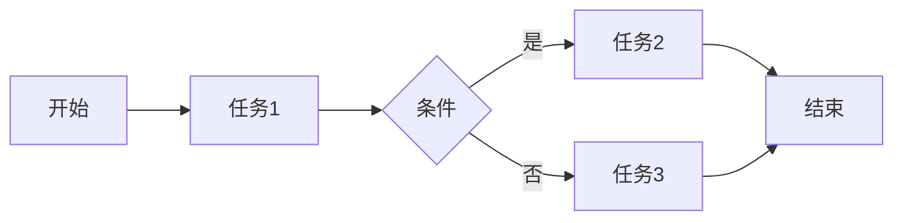

# 工作流DSL语言的标准化趋势

> 关键词：工作流，领域特定语言(DSL)，标准化，流程管理，流程建模，BPMN，OMG，工业4.0

## 1. 背景介绍

随着信息技术的快速发展，企业对流程自动化和优化的需求日益增长。工作流技术作为一种实现业务流程自动化的重要手段，已经成为现代企业信息化建设的重要组成部分。工作流DSL（Domain-Specific Language，领域特定语言）作为工作流建模和设计的重要工具，近年来得到了广泛关注。本文将探讨工作流DSL的标准化趋势，分析其背后的原理、应用场景和未来挑战。

### 1.1 问题的由来

传统的软件开发和业务流程管理往往依赖于复杂的编程语言和工具，这导致了以下问题：

- **开发效率低**：业务人员需要学习复杂的编程语言，导致开发周期长，成本高。
- **可维护性差**：代码难以理解和维护，一旦业务需求发生变化，需要大量修改代码。
- **可扩展性差**：难以适应新的业务流程和业务规则。

为了解决这些问题，领域特定语言（DSL）应运而生。DSL允许用户使用类似自然语言的语法和词汇来描述特定的业务领域，从而提高开发效率、可维护性和可扩展性。

### 1.2 研究现状

目前，工作流DSL已经广泛应用于流程建模、自动化、监控和管理等领域。常见的工怍流DSL包括：

- **BPMN (Business Process Model and Notation)**：由 Object Management Group (OMG) 提出的标准化工作流建模语言，是目前最流行的流程建模语言之一。
- **YAWL (Yet Another Workflow Language)**：基于业务流程管理（BPM）的概念，提供了一种更灵活的工作流描述方式。
- **XPDL (XML Process Definition Language)**：基于XML的流程定义语言，用于描述工作流模型。

### 1.3 研究意义

工作流DSL的标准化对于流程自动化和优化具有重要意义：

- **提高开发效率**：DSL使得业务人员可以快速构建和修改流程模型，缩短开发周期。
- **降低开发成本**：减少了开发人员对复杂编程语言的学习，降低了开发成本。
- **提高可维护性**：DSL的语义清晰，易于理解和维护。
- **促进流程标准化**：统一的DSL可以促进企业流程的标准化和规范化。

## 2. 核心概念与联系

### 2.1 核心概念

- **工作流**：工作流是一系列任务和活动按照一定的顺序执行的过程，用于完成特定的业务目标。
- **领域特定语言(DSL)**：DSL是为特定领域设计的编程语言，用于描述该领域的特定概念和操作。
- **流程建模**：使用特定的语言和工具对业务流程进行建模，以便更好地理解和优化流程。

### 2.2 Mermaid 流程图

```mermaid
graph LR
A[工作流] --> B{领域特定语言(DSL)}
B --> C{流程建模}
C --> D{流程优化}
D --> E{流程自动化}
```

### 2.3 核心概念联系

工作流通过领域特定语言（DSL）进行建模，通过流程建模进行优化，最终实现流程自动化。

## 3. 核心算法原理 & 具体操作步骤

### 3.1 算法原理概述

工作流DSL的算法原理主要包括以下步骤：

1. **定义 DSL**：根据业务需求定义 DSL 的语法和词汇。
2. **解析 DSL**：将 DSL 代码解析为内部表示形式。
3. **执行 DSL**：根据内部表示形式执行 DSL 定义的操作。
4. **优化 DSL**：根据业务需求优化 DSL 的性能和可维护性。

### 3.2 算法步骤详解

1. **定义 DSL**：根据业务需求，设计 DSL 的语法和词汇，使其能够清晰地描述业务流程。
2. **解析 DSL**：使用解析器将 DSL 代码转换为内部表示形式，如抽象语法树（AST）。
3. **执行 DSL**：根据 AST 执行 DSL 定义的操作，如任务执行、条件判断、循环等。
4. **优化 DSL**：对 DSL 进行优化，以提高性能和可维护性，如代码重构、性能调优等。

### 3.3 算法优缺点

**优点**：

- **提高开发效率**：DSL 使得开发人员可以快速构建和修改流程模型。
- **降低开发成本**：减少了开发人员对复杂编程语言的学习。
- **提高可维护性**：DSL 的语义清晰，易于理解和维护。

**缺点**：

- **学习成本**：开发人员需要学习新的 DSL 语法和词汇。
- **兼容性问题**：不同的 DSL 之间可能存在兼容性问题。

### 3.4 算法应用领域

工作流DSL在以下领域有广泛的应用：

- **业务流程管理**：使用 DSL 对业务流程进行建模、优化和自动化。
- **软件开发**：使用 DSL 实现代码生成和自动化测试。
- **数据集成**：使用 DSL 实现数据转换和数据处理。
- **系统监控**：使用 DSL 实现系统监控和告警。

## 4. 数学模型和公式 & 详细讲解 & 举例说明

### 4.1 数学模型构建

工作流DSL的数学模型主要包括以下内容：

- **流程图**：使用图形化方式表示流程，包括任务、分支、条件、循环等。
- **Petri网**：使用网状图表示流程，包括库所、转移、弧等。
- **状态机**：使用状态和转移表示流程，包括状态、事件、动作等。

### 4.2 公式推导过程

工作流DSL的公式推导过程主要包括以下步骤：

1. **定义 DSL 的语法和词汇**：根据业务需求，定义 DSL 的语法和词汇。
2. **解析 DSL**：将 DSL 代码解析为内部表示形式。
3. **推导 DSL 的语义**：根据 DSL 的语法和词汇，推导 DSL 的语义。
4. **优化 DSL 的性能**：根据业务需求，优化 DSL 的性能。

### 4.3 案例分析与讲解

以 BPMN 为例，分析其数学模型和公式。

BPMN 的数学模型主要基于 Petri网。Petri网由以下元素组成：

- **库所**：表示流程中的资源或数据。
- **转移**：表示流程中的事件或动作。
- **弧**：表示库所和转移之间的连接关系。

BPMN 的公式推导过程如下：

1. **定义 BPMN 的语法和词汇**：BPMN 的语法和词汇包括任务、分支、条件、循环等。
2. **解析 BPMN**：将 BPMN 代码解析为 Petri网表示形式。
3. **推导 BPMN 的语义**：根据 Petri网的特性，推导 BPMN 的语义。
4. **优化 BPMN 的性能**：根据业务需求，优化 BPMN 的性能。

## 5. 项目实践：代码实例和详细解释说明

### 5.1 开发环境搭建

以 BPMN 为例，介绍如何搭建 BPMN 的开发环境。

1. **安装 BPMN 工具**：选择合适的 BPMN 工具，如 BPMN Modeler、BPMN Studio 等。
2. **创建 BPMN 模型**：使用 BPMN 工具创建 BPMN 模型，包括任务、分支、条件、循环等元素。
3. **导出 BPMN 模型**：将 BPMN 模型导出为 XML、PDF 等格式。

### 5.2 源代码详细实现

以下是一个简单的 BPMN 模型示例：



### 5.3 代码解读与分析

以上代码定义了一个简单的流程，包括开始、结束、任务、条件和分支等元素。流程从开始节点开始，执行任务1，然后根据条件判断执行任务2或任务3，最后到达结束节点。

### 5.4 运行结果展示

使用 BPMN 工具运行以上代码，可以看到流程的图形化表示。通过拖拽元素和连接弧，可以方便地构建和修改流程模型。

## 6. 实际应用场景

### 6.1 业务流程管理

工作流DSL可以用于描述和自动化业务流程，提高业务流程的管理效率。例如，在人力资源管理系统、供应链管理系统、财务管理系统等应用中，可以使用工作流DSL实现员工招聘、订单处理、报销审批等业务流程的自动化。

### 6.2 软件开发

工作流DSL可以用于实现代码生成和自动化测试。例如，可以使用 DSL 描述软件架构和业务逻辑，然后自动生成代码和测试用例。

### 6.3 数据集成

工作流DSL可以用于描述和自动化数据集成流程。例如，可以使用 DSL 描述数据源、目标数据仓库和数据映射关系，然后自动执行数据集成任务。

### 6.4 系统监控

工作流DSL可以用于实现系统监控和告警。例如，可以使用 DSL 描述系统性能指标、阈值和告警规则，然后自动监控系统性能并触发告警。

## 7. 工具和资源推荐

### 7.1 学习资源推荐

- 《Business Process Management: Concepts, Languages, Architectures》
- 《BPMN: Business Process Model and Notation》
- 《OMG's BPMN 2.0 Specification》

### 7.2 开发工具推荐

- BPMN Modeler
- BPMN Studio
- yWorks yEd Graph Editor

### 7.3 相关论文推荐

- "A Survey of Business Process Modeling Languages"
- "The BPMN 2.0 Specification"
- "BPMN 2.0: The Next Generation of the BPMN Standard"

## 8. 总结：未来发展趋势与挑战

### 8.1 研究成果总结

本文探讨了工作流DSL的标准化趋势，分析了其背后的原理、应用场景和未来挑战。工作流DSL作为一种高效、可维护、可扩展的流程建模工具，在业务流程管理、软件开发、数据集成和系统监控等领域具有广泛的应用前景。

### 8.2 未来发展趋势

- **更强大的 DSL**：未来的 DSL 将更加智能，能够自动生成代码、测试用例和文档。
- **更加灵活的建模工具**：建模工具将提供更丰富的建模元素和更灵活的建模方式。
- **更加开放的标准**：工作流DSL的标准将更加开放，支持更多的建模语言和工具。

### 8.3 面临的挑战

- **标准化的挑战**：如何统一不同的 DSL 标准，实现不同 DSL 之间的互操作性。
- **工具的挑战**：如何开发高效、易用的 DSL 工具。
- **人才挑战**：如何培养更多掌握 DSL 技术的专业人才。

### 8.4 研究展望

随着信息技术的发展，工作流DSL将在流程自动化和优化领域发挥越来越重要的作用。未来的研究需要关注以下方向：

- **标准的统一**：推动不同 DSL 之间的互操作性，实现流程的通用化。
- **工具的智能化**：开发更加智能的 DSL 工具，提高建模效率。
- **知识的融合**：将工作流DSL与其他人工智能技术融合，实现更加智能的流程管理。

## 9. 附录：常见问题与解答

**Q1：什么是工作流DSL？**

A：工作流DSL是为特定领域设计的编程语言，用于描述该领域的特定概念和操作。

**Q2：工作流DSL有什么优势？**

A：工作流DSL具有以下优势：
- 提高开发效率
- 降低开发成本
- 提高可维护性
- 促进流程标准化

**Q3：什么是 BPMN？**

A：BPMN（Business Process Model and Notation）是由 OMG 提出的标准化工作流建模语言，是目前最流行的流程建模语言之一。

**Q4：工作流DSL在哪些领域有应用？**

A：工作流DSL在以下领域有广泛的应用：
- 业务流程管理
- 软件开发
- 数据集成
- 系统监控

**Q5：如何选择合适的工作流DSL？**

A：选择合适的工作流DSL需要考虑以下因素：
- 业务需求
- 建模能力
- 工具支持
- 生态系统

---

作者：禅与计算机程序设计艺术 / Zen and the Art of Computer Programming