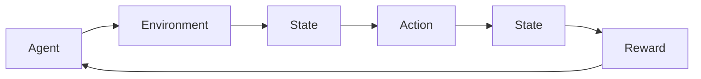

# 强化学习Reinforcement Learning中的策略迭代算法与实现细节

> 关键词：强化学习，策略迭代，Q学习，策略梯度，蒙特卡洛策略，深度Q网络，DQN，策略网络，强化学习框架

## 1. 背景介绍

强化学习（Reinforcement Learning, RL）是机器学习领域的一个重要分支，它通过智能体与环境的交互，使智能体学习到最优策略，从而在给定环境中实现目标最大化。策略迭代算法是强化学习中一种重要的算法框架，通过迭代优化策略来提升智能体的决策质量。本文将深入探讨策略迭代算法的原理、实现细节，并结合实际案例进行讲解。

### 1.1 问题的由来

在现实世界中，许多决策问题都需要考虑长期和短期的利益平衡。例如，自动驾驶车辆在行驶过程中需要根据路况、车速等因素做出决策，以最大化行驶距离或避免事故。这些决策问题往往难以用传统的优化方法来解决，因为它们通常具有以下特点：

- 非凸优化问题
- 离散状态和动作空间
- 动态环境变化

强化学习通过智能体与环境的交互，让智能体在试错中学习到最优策略，从而解决上述问题。

### 1.2 研究现状

近年来，随着深度学习技术的快速发展，强化学习在游戏、机器人、自动驾驶等领域取得了显著成果。其中，策略迭代算法是强化学习的一种重要方法，主要包括以下几种：

- Q学习（Q-Learning）
- 策略梯度（Policy Gradient）
- 蒙特卡洛策略（Monte Carlo Policy）
- 深度Q网络（Deep Q-Network, DQN）
- 策略网络（Policy Network）

### 1.3 研究意义

策略迭代算法为解决复杂决策问题提供了一种有效的方法。通过本文的介绍，读者可以了解到策略迭代算法的基本原理、实现细节，以及在实际应用中的优势和局限性，从而为后续的研究和应用提供参考。

## 2. 核心概念与联系

本节将介绍强化学习中的核心概念，并使用Mermaid流程图展示它们之间的联系。

### 2.1 核心概念

- **智能体（Agent）**：执行动作并从环境中获取奖励的实体。
- **环境（Environment）**：与智能体交互并提供奖励和状态的实体。
- **状态（State）**：智能体在特定时间点所处的环境特征。
- **动作（Action）**：智能体可以执行的操作。
- **策略（Policy）**：智能体根据状态选择动作的规则。
- **价值函数（Value Function）**：评估每个状态或状态-动作对的期望收益。
- **奖励（Reward）**：环境对智能体动作的反馈。

### 2.2 Mermaid流程图



在上述流程图中，智能体与环境交互，根据当前状态选择动作，环境根据动作返回新的状态和奖励，智能体根据新的状态和奖励更新策略。

## 3. 核心算法原理 & 具体操作步骤

### 3.1 算法原理概述

策略迭代算法的核心思想是通过迭代优化策略，使智能体在环境中获得最大化的长期收益。具体来说，策略迭代算法包括以下两个主要步骤：

1. **策略评估**：根据当前策略评估每个状态的价值。
2. **策略改进**：基于策略评估结果，改进策略，使其更接近最优策略。

### 3.2 算法步骤详解

#### 3.2.1 策略评估

策略评估的目标是估计每个状态的价值，即：

$$
v^\pi(s) = \mathbb{E}_{\pi}[\sum_{t=0}^\infty \gamma^t R_t \mid S_0 = s]
$$

其中，$\pi$ 是策略，$R_t$ 是在第 $t$ 个时间步的奖励，$\gamma$ 是折扣因子，$S_0$ 是初始状态。

#### 3.2.2 策略改进

策略改进的目标是找到一个新的策略 $\pi'$，使得：

$$
v^\pi'(s) > v^\pi(s)
$$

常见的策略改进方法包括：

- **策略梯度方法**：通过梯度上升方法更新策略参数。
- **蒙特卡洛策略**：通过模拟随机样本来估计策略的期望收益。

### 3.3 算法优缺点

#### 3.3.1 优点

- **简单易实现**：策略迭代算法的原理简单，易于实现。
- **通用性强**：适用于各种强化学习任务。

#### 3.3.2 缺点

- **收敛速度慢**：策略迭代算法的收敛速度较慢，需要大量样本。
- **对初始策略敏感**：算法的收敛结果对初始策略的选择比较敏感。

### 3.4 算法应用领域

策略迭代算法在许多强化学习任务中都有应用，例如：

- **游戏**：如棋类游戏、电子游戏等。
- **机器人控制**：如机器人导航、路径规划等。
- **自动驾驶**：如车辆控制、交通流量预测等。

## 4. 数学模型和公式 & 详细讲解 & 举例说明

### 4.1 数学模型构建

策略迭代算法的数学模型主要包括以下内容：

- **状态空间**：所有可能的状态集合。
- **动作空间**：所有可能的动作集合。
- **策略**：从状态空间到动作空间的映射函数。
- **价值函数**：评估每个状态的价值。

### 4.2 公式推导过程

#### 4.2.1 策略评估公式

策略评估公式可以通过动态规划方法推导得到：

$$
v^\pi(s) = \sum_{a \in A} \pi(a \mid s) \times \sum_{s' \in S} \gamma R(s,a,s') \times v^\pi(s')
$$

其中，$A$ 是动作空间，$R(s,a,s')$ 是智能体执行动作 $a$ 后从状态 $s$ 转移到状态 $s'$ 的奖励。

#### 4.2.2 策略改进公式

策略改进公式可以通过梯度上升方法推导得到：

$$
\pi'(a \mid s) = \pi(a \mid s) + \alpha \nabla_{\pi(a \mid s)} J(\pi)
$$

其中，$\alpha$ 是学习率，$J(\pi)$ 是策略的目标函数。

### 4.3 案例分析与讲解

以著名的Atari游戏《打砖块》（Breakout）为例，介绍如何使用策略迭代算法进行强化学习。

#### 4.3.1 状态空间

在《打砖块》游戏中，状态空间可以由以下因素组成：

- 球的位置和速度
- 砧板的位置和方向
- 砖块的位置和状态

#### 4.3.2 动作空间

在《打砖块》游戏中，动作空间可以由以下动作组成：

- 移动砧板
- 发球

#### 4.3.3 策略

策略可以表示为从状态空间到动作空间的映射函数，即：

$$
\pi(a \mid s) = P(a \mid s)
$$

其中，$P(a \mid s)$ 表示在状态 $s$ 下执行动作 $a$ 的概率。

#### 4.3.4 价值函数

价值函数可以表示为：

$$
v^\pi(s) = \sum_{t=0}^\infty \gamma^t R_t \mid S_0 = s
$$

其中，$R_t$ 是在第 $t$ 个时间步的奖励。

#### 4.3.5 奖励函数

奖励函数可以表示为：

$$
R(s,a,s') = 
\begin{cases}
10, & \text{如果球成功打碎砖块}\\
-1, & \text{如果球触碰到边界}\\
-10, & \text{如果球触碰到砧板}
\end{cases}
$$

## 5. 项目实践：代码实例和详细解释说明

### 5.1 开发环境搭建

在进行强化学习项目实践之前，我们需要搭建一个开发环境。以下是使用Python进行强化学习开发的常见环境配置步骤：

1. 安装Anaconda：从官网下载并安装Anaconda，用于创建独立的Python环境。
2. 创建并激活虚拟环境：
```bash
conda create -n rl-env python=3.8
conda activate rl-env
```
3. 安装PyTorch：从官网下载PyTorch安装包，并按照指示进行安装。
4. 安装OpenAI Gym：从官网下载OpenAI Gym安装包，并按照指示进行安装。

### 5.2 源代码详细实现

以下是一个使用PyTorch实现的策略迭代算法的简单示例：

```python
import numpy as np
import torch
import torch.nn as nn
import torch.optim as optim
from gym import wrappers
from gym import spaces

class PolicyIterationAgent:
    def __init__(self, state_space, action_space):
        self.state_space = state_space
        self.action_space = action_space
        self.policy = np.zeros((state_space, action_space))
        self.value_function = np.zeros(state_space)

    def evaluate_policy(self):
        for s in range(state_space):
            self.value_function[s] = np.max([self.policy[s, a] + 0.99 * np.dot(self.value_function, self.transition_probabilities(s, a)) for a in range(action_space)])

    def transition_probabilities(self, s, a):
        # 根据动作a计算状态转移概率
        pass

    def improve_policy(self):
        for s in range(state_space):
            current_value = self.value_function[s]
            best_action = np.argmax([self.policy[s, a] + 0.99 * np.dot(self.value_function, self.transition_probabilities(s, a)) for a in range(action_space)])
            self.policy[s] = np.zeros(action_space)
            self.policy[s, best_action] = 1

    def run(self):
        for _ in range(1000):
            self.evaluate_policy()
            self.improve_policy()

if __name__ == '__main__':
    env = wrappers.Monitor(gym.make('CartPole-v1'), './gym/CartPole-v1', force=True)
    agent = PolicyIterationAgent(state_space=4, action_space=2)
    agent.run()
    env.close()
```

### 5.3 代码解读与分析

在上面的代码中，我们实现了一个简单的策略迭代算法。首先，我们定义了一个`PolicyIterationAgent`类，它包含以下属性：

- `state_space`：状态空间的大小。
- `action_space`：动作空间的大小。
- `policy`：策略矩阵，表示每个状态下选择每个动作的概率。
- `value_function`：价值函数数组，表示每个状态的价值。

`evaluate_policy`方法用于评估策略，即计算每个状态的价值。`transition_probabilities`方法用于计算状态转移概率。`improve_policy`方法用于改进策略，即选择最优动作。

`run`方法用于运行策略迭代算法，它包含以下步骤：

1. 初始化策略和价值函数。
2. 迭代执行策略评估和策略改进。
3. 循环执行上述步骤，直到满足预设的迭代次数。

在主函数中，我们创建了一个CartPole环境，并创建了一个`PolicyIterationAgent`实例。然后，我们调用`run`方法来运行策略迭代算法。

### 5.4 运行结果展示

在运行上述代码后，我们可以在Gym环境中观察CartPole游戏的运行情况。通过策略迭代算法，智能体可以学习到稳定控制CartPole的方法，从而在环境中获得较高的得分。

## 6. 实际应用场景

策略迭代算法在许多实际应用场景中都有应用，以下列举几个示例：

- **机器人控制**：如机器人导航、路径规划等。
- **自动驾驶**：如车辆控制、交通流量预测等。
- **资源调度**：如云计算资源调度、电力系统调度等。
- **金融投资**：如股票交易策略、风险控制等。

## 7. 工具和资源推荐

### 7.1 学习资源推荐

- **书籍**：
  - 《Reinforcement Learning: An Introduction》（Richard S. Sutton和Barto）
  - 《Artificial Intelligence: A Modern Approach》（Stuart Russell and Peter Norvig）
- **在线课程**：
  - Coursera上的《Reinforcement Learning》课程
  - fast.ai的《Practical Reinforcement Learning for Coders》课程
- **网站**：
  - OpenAI的Gym库
  - gym.openai.com上的各种仿真环境

### 7.2 开发工具推荐

- **PyTorch**：用于深度学习开发的Python库。
- **TensorFlow**：另一个用于深度学习开发的Python库。
- **OpenAI Gym**：一个开源的强化学习仿真环境库。

### 7.3 相关论文推荐

- **Q学习**：
  - "Learning to Predict by the Methods of Temporal Differences"（Richard S. Sutton和Richard J. S. Bell）
- **策略梯度**：
  - "On Actor-Critic Methods"（Richard S. Sutton和Andrew G. Barto）
- **蒙特卡洛策略**：
  - "Monte Carlo Reinforcement Learning: A Survey"（Christopher J. C. H. Watkins）
- **深度Q网络**：
  - "Deep Reinforcement Learning with Double Q-Learning"（Vanessa Geistinger等）
- **策略网络**：
  - "Policy Gradients"（Richard S. Sutton和Barto）

## 8. 总结：未来发展趋势与挑战

### 8.1 研究成果总结

本文介绍了强化学习中的策略迭代算法，包括其原理、实现细节、优缺点和应用领域。通过实际案例，展示了策略迭代算法在CartPole游戏中的应用。

### 8.2 未来发展趋势

随着深度学习技术的不断发展，强化学习在各个领域的应用将越来越广泛。以下是一些未来发展趋势：

- **多智能体强化学习**：研究多个智能体在同一环境下协同工作的方法。
- **强化学习与其他机器学习技术的融合**：将强化学习与其他机器学习技术（如深度学习、强化学习）相结合，提高智能体的决策能力。
- **强化学习的应用领域拓展**：将强化学习应用于更多领域，如医疗、教育、金融等。

### 8.3 面临的挑战

尽管强化学习取得了显著成果，但仍面临着一些挑战：

- **样本效率**：强化学习通常需要大量样本来学习，如何提高样本效率是一个重要问题。
- **可解释性**：强化学习的决策过程往往难以解释，如何提高可解释性是一个重要挑战。
- **安全性**：如何确保强化学习系统的安全性，避免恶意攻击和不良行为，是一个重要问题。

### 8.4 研究展望

未来，强化学习的研究将重点关注以下几个方面：

- **提高样本效率**：研究新的算法和技术，减少学习所需的样本数量。
- **提高可解释性**：研究新的方法，提高强化学习系统的可解释性。
- **提高安全性**：研究新的方法，确保强化学习系统的安全性。

相信随着研究的不断深入，强化学习将会在未来取得更大的突破，为人类社会带来更多福祉。

## 9. 附录：常见问题与解答

**Q1：强化学习与监督学习和无监督学习有什么区别？**

A：强化学习、监督学习和无监督学习是机器学习中的三种主要学习方法。它们的区别如下：

- **监督学习**：使用带标签的训练数据来训练模型，例如分类和回归任务。
- **无监督学习**：使用不带标签的数据来训练模型，例如聚类和降维任务。
- **强化学习**：通过智能体与环境交互来学习最优策略，例如游戏、机器人控制等任务。

**Q2：如何选择合适的策略改进方法？**

A：选择合适的策略改进方法需要考虑以下因素：

- **样本效率**：不同的策略改进方法对样本效率的需求不同。
- **计算复杂度**：不同的策略改进方法具有不同的计算复杂度。
- **适用范围**：不同的策略改进方法适用于不同的任务类型。

**Q3：如何提高强化学习的样本效率？**

A：提高强化学习的样本效率可以采取以下措施：

- **数据增强**：通过数据增强技术生成更多的训练样本。
- **主动学习**：利用主动学习技术选择最有可能提高模型性能的样本进行训练。
- **强化学习与无监督学习的结合**：将强化学习与无监督学习相结合，利用无监督学习方法提高样本效率。

**Q4：如何提高强化学习系统的可解释性？**

A：提高强化学习系统的可解释性可以采取以下措施：

- **可视化**：使用可视化技术展示强化学习系统的决策过程。
- **解释性模型**：开发新的解释性模型，解释强化学习系统的决策过程。
- **分析工具**：开发新的分析工具，分析强化学习系统的决策过程。

**Q5：如何确保强化学习系统的安全性？**

A：确保强化学习系统的安全性可以采取以下措施：

- **安全性测试**：对强化学习系统进行安全性测试，检测潜在的安全风险。
- **伦理准则**：制定伦理准则，规范强化学习系统的使用。
- **监管机制**：建立监管机制，对强化学习系统的使用进行监管。

---

作者：禅与计算机程序设计艺术 / Zen and the Art of Computer Programming