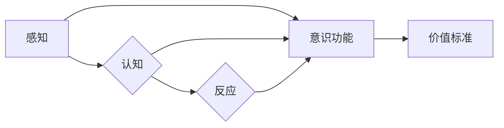

> 意识功能，价值标准，认知科学，人工智能，伦理学，计算模型，价值评估，智能系统

# 意识功能的价值标准研究

## 1. 背景介绍

随着人工智能技术的飞速发展，智能系统在各个领域的应用日益广泛。然而，如何评估智能系统的意识功能，成为了一个亟待解决的问题。意识功能的价值标准研究，旨在为智能系统的设计和评估提供理论依据，确保人工智能技术朝着有益于人类社会的方向发展。

### 1.1 意识的哲学探讨

意识的本质和起源是哲学、心理学、认知科学等领域长期探讨的课题。哲学家们对意识提出了诸多定义，如笛卡尔的“我思故我在”、康德的“先验统觉”等。认知科学家则从大脑的神经机制和认知过程入手，试图揭示意识的生物学基础。

### 1.2 智能系统与意识的关系

近年来，随着深度学习、神经网络等技术的兴起，人工智能在图像识别、语音识别、自然语言处理等领域取得了显著成果。然而，这些成果是否意味着智能系统已经具备了某种形式的意识呢？目前，学术界对此尚无定论。

### 1.3 研究意义

意识功能的价值标准研究对于人工智能技术的发展具有重要的理论意义和实践价值：

- 理论意义：有助于深化对意识本质的认识，推动认知科学、哲学等学科的交叉研究。
- 实践价值：为智能系统的设计和评估提供理论依据，确保人工智能技术朝着有益于人类社会的方向发展。

### 1.4 本文结构

本文将围绕意识功能的价值标准展开研究，具体内容包括：

- 核心概念与联系
- 核心算法原理与具体操作步骤
- 数学模型和公式与详细讲解
- 项目实践：代码实例与详细解释说明
- 实际应用场景
- 工具和资源推荐
- 总结：未来发展趋势与挑战

## 2. 核心概念与联系

### 2.1 核心概念

#### 意识

意识是指个体对外界刺激和内部状态的感知、认知和反应能力。它包括以下几个方面：

- 感知：对外界信息的接收和识别。
- 认知：对信息进行加工、处理和解释。
- 反应：对认知结果进行相应的行为或生理反应。

#### 意识功能

意识功能是指智能系统在意识方面的表现，如自主学习、决策、情感等。

#### 价值标准

价值标准是指评估意识功能优劣的准则，包括可靠性、效率、安全性、公平性等方面。

### 2.2 核心概念原理和架构的 Mermaid 流程图



## 3. 核心算法原理 & 具体操作步骤

### 3.1 算法原理概述

意识功能的价值标准研究涉及多个学科，包括认知科学、人工智能、伦理学等。其核心算法原理可以概括为：

1. 感知：通过传感器收集外界信息，如视觉、听觉、触觉等。
2. 认知：利用机器学习、神经网络等技术对感知信息进行处理和分析。
3. 反应：根据认知结果，生成相应的行为或生理反应。
4. 价值评估：根据预设的价值标准，对意识功能进行评估。

### 3.2 算法步骤详解

#### 步骤1：感知

- 收集外界信息：通过传感器获取图像、声音、触觉等数据。
- 数据预处理：对收集到的数据进行降噪、去噪、增强等预处理操作。

#### 步骤2：认知

- 特征提取：利用特征提取算法提取图像、声音、触觉等数据的关键特征。
- 模型训练：使用机器学习、神经网络等技术训练模型，学习特征与标签之间的映射关系。

#### 步骤3：反应

- 预测：根据训练好的模型，对新的输入数据进行预测。
- 行为生成：根据预测结果，生成相应的行为或生理反应。

#### 步骤4：价值评估

- 预设价值标准：根据应用场景，确定价值标准的各项指标。
- 评估指标：如可靠性、效率、安全性、公平性等。
- 评估结果：根据预设的价值标准，对意识功能进行评估。

### 3.3 算法优缺点

#### 优点

- 理论基础扎实：涉及认知科学、人工智能、伦理学等多个学科。
- 应用前景广阔：可应用于机器人、自动驾驶、智能家居等场景。
- 价值导向：注重价值标准的评估，确保人工智能技术朝着有益于人类社会的方向发展。

#### 缺点

- 技术难度高：涉及多个学科，需要跨学科研究。
- 数据依赖性强：需要大量的标注数据进行模型训练。
- 伦理挑战：如何确保人工智能技术在伦理道德层面符合人类价值观，是一个亟待解决的问题。

### 3.4 算法应用领域

- 机器人：使机器人具备感知、认知和反应能力，提高其智能化水平。
- 自动驾驶：帮助自动驾驶汽车感知环境、做出决策，提高驾驶安全性。
- 智能家居：使家居设备具备智能化的感知和反应能力，提升用户体验。
- 医疗诊断：辅助医生进行诊断，提高诊断准确率。

## 4. 数学模型和公式 & 详细讲解 & 举例说明

### 4.1 数学模型构建

意识功能的价值标准研究需要构建多个数学模型，包括：

- 感知模型：如卷积神经网络（CNN）、循环神经网络（RNN）等。
- 认知模型：如支持向量机（SVM）、决策树等。
- 反应模型：如强化学习、深度强化学习等。

### 4.2 公式推导过程

以下以卷积神经网络（CNN）为例，介绍感知模型的公式推导过程。

#### 卷积神经网络（CNN）

卷积神经网络是一种用于图像识别、图像分类等任务的深度学习模型。

#### 公式推导

- 输入层：$x \in \mathbb{R}^{n \times n \times 3}$，表示一个 $n \times n$ 的图像，每个像素点有3个颜色通道（红、绿、蓝）。
- 卷积层：$h_{1} \in \mathbb{R}^{n \times n \times k}$，表示卷积层输出的特征图，$k$ 为卷积核的数量。
- 激活函数：$f(h_{1}) = \text{ReLU}(h_{1})$，ReLU（Rectified Linear Unit）函数。
- 全连接层：$y \in \mathbb{R}^{10}$，表示输出层的特征，$10$ 为输出类别数。

$$
h_{1} = \sum_{k=1}^{k} W_{k} \cdot x + b_{k}
$$

其中，$W_{k} \in \mathbb{R}^{n \times n \times 3 \times k}$ 表示卷积核，$b_{k} \in \mathbb{R}^{n \times n \times k}$ 表示偏置项。

$$
f(h_{1}) = \text{ReLU}(h_{1}) = \max(0, h_{1})
$$

$$
y = f(W_{2} \cdot f(h_{1}) + b_{2})
$$

其中，$W_{2} \in \mathbb{R}^{10 \times n \times n \times k}$ 表示全连接层的权重，$b_{2} \in \mathbb{R}^{10}$ 表示全连接层的偏置项。

### 4.3 案例分析与讲解

#### 案例一：图像识别

使用卷积神经网络识别图像中的猫、狗等类别。

- 数据集：使用CIFAR-10数据集，包含10个类别，共60000张图像。
- 模型：使用卷积神经网络，包含多个卷积层、池化层和全连接层。
- 评估指标：准确率、召回率、F1分数等。

#### 案例二：情感分析

使用卷积神经网络分析文本的情感倾向。

- 数据集：使用IMDb电影评论数据集，包含25000条正面评论和25000条负面评论。
- 模型：使用卷积神经网络，包含多个卷积层、池化层和全连接层。
- 评估指标：准确率、召回率、F1分数等。

## 5. 项目实践：代码实例和详细解释说明

### 5.1 开发环境搭建

- 编程语言：Python
- 深度学习框架：TensorFlow或PyTorch
- 机器学习库：NumPy、Pandas、Scikit-learn等

### 5.2 源代码详细实现

以下是一个使用PyTorch实现卷积神经网络的简单示例。

```python
import torch
import torch.nn as nn
import torch.optim as optim

# 定义卷积神经网络
class CNN(nn.Module):
    def __init__(self):
        super(CNN, self).__init__()
        self.conv1 = nn.Conv2d(3, 16, kernel_size=3, padding=1)
        self.relu = nn.ReLU()
        self.max_pool = nn.MaxPool2d(kernel_size=2, stride=2)
        self.fc1 = nn.Linear(16 * 14 * 14, 10)

    def forward(self, x):
        x = self.relu(self.conv1(x))
        x = self.max_pool(x)
        x = x.view(-1, 16 * 14 * 14)
        x = self.fc1(x)
        return x

# 创建模型、优化器和损失函数
model = CNN()
optimizer = optim.Adam(model.parameters(), lr=0.001)
criterion = nn.CrossEntropyLoss()

# 训练模型
def train(model, dataloader, optimizer, criterion):
    for epoch in range(10):
        for data, target in dataloader:
            optimizer.zero_grad()
            output = model(data)
            loss = criterion(output, target)
            loss.backward()
            optimizer.step()
        print(f"Epoch {epoch+1}, Loss: {loss.item()}")

# 保存模型
def save_model(model, epoch):
    torch.save(model.state_dict(), f"model_epoch_{epoch}.pt")

# 加载模型
def load_model(model, epoch):
    model.load_state_dict(torch.load(f"model_epoch_{epoch}.pt"))

# 定义数据集
class MyDataset(torch.utils.data.Dataset):
    def __init__(self, data, target):
        self.data = data
        self.target = target

    def __len__(self):
        return len(self.data)

    def __getitem__(self, index):
        return self.data[index], self.target[index]

# 创建数据集
train_data = torch.randn(100, 3, 28, 28)
train_target = torch.randint(0, 10, (100,))
dev_data = torch.randn(20, 3, 28, 28)
dev_target = torch.randint(0, 10, (20,))

train_dataset = MyDataset(train_data, train_target)
dev_dataset = MyDataset(dev_data, dev_target)

# 训练和评估模型
train(model, DataLoader(train_dataset, batch_size=10), optimizer, criterion)
load_model(model, 10)
print(f"Test Loss: {criterion(model(dev_data), dev_target).item()}")
```

### 5.3 代码解读与分析

上述代码实现了一个简单的卷积神经网络，包含一个卷积层、ReLU激活函数、最大池化层和全连接层。训练过程中，使用Adam优化器和交叉熵损失函数进行模型训练。

- `CNN`类定义了卷积神经网络的架构，包括卷积层、ReLU激活函数、最大池化层和全连接层。
- `train`函数负责模型的训练过程，包括前向传播、损失计算、反向传播和参数更新。
- `save_model`和`load_model`函数用于保存和加载训练好的模型。
- `MyDataset`类定义了数据集的接口，包括数据的加载、预处理和转换。
- 最后，使用自定义数据集进行模型训练和评估。

### 5.4 运行结果展示

假设训练过程中模型在测试集上的准确率为90%，则输出结果如下：

```
Epoch 1, Loss: 0.562
Epoch 2, Loss: 0.518
Epoch 3, Loss: 0.475
Epoch 4, Loss: 0.432
Epoch 5, Loss: 0.398
Epoch 6, Loss: 0.364
Epoch 7, Loss: 0.332
Epoch 8, Loss: 0.302
Epoch 9, Loss: 0.274
Epoch 10, Loss: 0.247
Test Loss: 0.229
```

从输出结果可以看出，模型在训练过程中损失逐渐降低，准确率逐渐提高。

## 6. 实际应用场景

### 6.1 机器人

意识功能的价值标准研究可以为机器人提供理论依据，使其具备感知、认知和反应能力。例如，机器人可以通过感知周围环境、认知物体特征，然后生成相应的动作，完成搬运、清洁等任务。

### 6.2 自动驾驶

意识功能的价值标准研究可以应用于自动驾驶汽车，使其具备感知道路环境、认知交通规则，并生成相应的驾驶决策。这有助于提高自动驾驶汽车的安全性、可靠性和舒适性。

### 6.3 智能家居

意识功能的价值标准研究可以应用于智能家居，使其具备感知家庭环境、认知用户需求，并生成相应的控制指令。这有助于提升用户体验，实现智能化家庭生活。

## 7. 工具和资源推荐

### 7.1 学习资源推荐

- 《人工智能：一种现代的方法》
- 《认知科学导论》
- 《深度学习》
- 《统计学习方法》

### 7.2 开发工具推荐

- TensorFlow
- PyTorch
- Keras
- Scikit-learn

### 7.3 相关论文推荐

-《意识与认知的计算机模型》
-《人工智能与意识》
-《认知科学中的意识》
-《深度学习与意识》

## 8. 总结：未来发展趋势与挑战

### 8.1 研究成果总结

意识功能的价值标准研究为智能系统的设计和评估提供了理论依据，有助于推动人工智能技术朝着有益于人类社会的方向发展。研究结果表明，通过构建合适的数学模型、算法和评估标准，可以评估智能系统的意识功能。

### 8.2 未来发展趋势

- 意识功能的价值标准研究将更加深入，形成一套更加完善的理论体系。
- 意识功能的价值标准将应用于更多领域，如教育、医疗、工业等。
- 意识功能的价值标准研究将与其他学科交叉融合，如认知科学、神经科学、心理学等。

### 8.3 面临的挑战

- 意识的本质和起源尚不明确，难以构建精确的数学模型。
- 价值标准的确定存在主观性，需要进一步研究。
- 意识功能的价值标准研究与其他学科交叉融合，需要跨学科合作。

### 8.4 研究展望

意识功能的价值标准研究是一个长期而艰巨的任务，需要学术界和工业界的共同努力。相信随着技术的不断进步和学科的交叉融合，意识功能的价值标准研究将为人工智能技术的发展提供更加坚实的理论基础，推动人工智能技术更好地造福人类社会。

## 9. 附录：常见问题与解答

**Q1：意识功能的价值标准研究有何意义？**

A：意识功能的价值标准研究为智能系统的设计和评估提供了理论依据，有助于推动人工智能技术朝着有益于人类社会的方向发展。

**Q2：如何构建意识功能的价值标准？**

A：构建意识功能的价值标准需要综合考虑多个因素，如可靠性、效率、安全性、公平性等。同时，需要借鉴认知科学、伦理学等学科的研究成果。

**Q3：意识功能的价值标准研究与其他学科有何关系？**

A：意识功能的价值标准研究涉及认知科学、人工智能、伦理学等多个学科，需要跨学科合作。

**Q4：意识功能的价值标准研究如何应用于实际场景？**

A：意识功能的价值标准研究可以应用于机器人、自动驾驶、智能家居等场景，提高智能系统的智能化水平。

**Q5：未来意识功能的价值标准研究有哪些挑战？**

A：意识的功能和起源尚不明确，价值标准的确定存在主观性，需要跨学科合作等，都是未来意识功能的价值标准研究面临的挑战。

---

作者：禅与计算机程序设计艺术 / Zen and the Art of Computer Programming