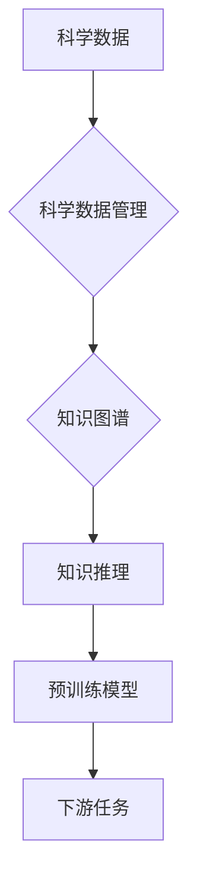

# 数据库与知识库在AI for Science中的重要性

> 关键词：AI for Science, 数据库, 知识库, 预训练模型, 数据管理, 知识图谱, 人工智能

## 1. 背景介绍

随着人工智能技术的飞速发展，AI for Science领域正经历着一场革命。从药物发现到天体物理学，从气候建模到生物信息学，人工智能正逐渐成为推动科学进步的关键力量。在这个过程中，数据库与知识库作为AI for Science的核心基础设施，扮演着至关重要的角色。它们不仅为人工智能模型提供了海量的数据资源和丰富的知识背景，还为模型的训练、推理和应用提供了坚实的基础。

### 1.1 问题的由来

科学研究的本质是对未知世界的探索和认知。而人工智能作为一门交叉学科，其核心目标是通过模拟人类智能，实现对复杂系统的理解和预测。然而，科学数据往往具有多样性、异构性和复杂性等特点，如何有效地管理和利用这些数据，成为AI for Science领域面临的重要挑战。

### 1.2 研究现状

近年来，数据库与知识库技术在AI for Science领域取得了显著进展。以下是几个关键的发展方向：

1. **科学数据管理**：通过建立高效、可靠的科学数据管理系统，实现对科学数据的存储、检索、分析和共享。
2. **知识图谱构建**：利用自然语言处理和知识图谱技术，将科学知识表示为结构化的知识图谱，为人工智能模型提供知识背景。
3. **预训练模型**：基于大规模科学数据集，训练通用预训练模型，提高模型在科学任务上的性能。
4. **模型解释性**：研究模型解释性技术，提高模型的可信度和可解释性，增强用户对模型的信任。

### 1.3 研究意义

数据库与知识库在AI for Science中的重要性体现在以下几个方面：

1. **提高研究效率**：通过有效的数据管理和知识检索，加速科学研究的进程，降低研究成本。
2. **促进知识发现**：利用人工智能技术分析海量科学数据，发现新的科学规律和知识。
3. **推动学科交叉**：促进不同学科之间的知识交流和融合，催生新的研究方向和应用。
4. **提升决策能力**：为科学研究和管理提供数据支持和决策依据。

### 1.4 本文结构

本文将围绕数据库与知识库在AI for Science中的重要性展开，主要包括以下内容：

- 核心概念与联系
- 核心算法原理与具体操作步骤
- 数学模型和公式
- 项目实践
- 实际应用场景
- 工具和资源推荐
- 总结：未来发展趋势与挑战

## 2. 核心概念与联系

### 2.1 核心概念

#### 科学数据管理

科学数据管理是指对科学实验、观测和模拟过程中产生的数据进行组织、存储、处理、分析和共享的过程。科学数据管理的关键目标是确保数据的完整性、可靠性和可用性。

#### 知识图谱

知识图谱是一种结构化的知识表示方法，通过实体、关系和属性来描述现实世界中的知识。知识图谱在AI for Science中扮演着知识背景和推理引擎的角色。

#### 预训练模型

预训练模型是在大规模数据集上训练的模型，通过迁移学习可以应用于各种下游任务。预训练模型在AI for Science中具有重要的价值，可以提高模型的性能和泛化能力。

### 2.2 核心概念原理和架构的 Mermaid 流程图



## 3. 核心算法原理 & 具体操作步骤

### 3.1 算法原理概述

#### 科学数据管理

科学数据管理主要包括以下步骤：

1. 数据采集：收集实验、观测和模拟数据。
2. 数据存储：将数据存储在数据库或文件系统中。
3. 数据处理：对数据进行清洗、转换和预处理。
4. 数据分析：使用统计分析、机器学习等方法分析数据。
5. 数据共享：将数据共享给其他研究者。

#### 知识图谱构建

知识图谱构建主要包括以下步骤：

1. 知识抽取：从文本数据中提取实体、关系和属性。
2. 知识融合：将不同来源的知识进行整合。
3. 知识存储：将知识存储在知识图谱数据库中。
4. 知识推理：利用推理算法推断新的知识。

#### 预训练模型

预训练模型主要包括以下步骤：

1. 数据准备：准备大规模数据集。
2. 模型训练：在数据集上训练模型。
3. 模型评估：评估模型性能。
4. 模型应用：将模型应用于下游任务。

### 3.2 算法步骤详解

#### 科学数据管理

1. **数据采集**：通过实验、观测和模拟等方式获取科学数据。
2. **数据存储**：将数据存储在关系型数据库、NoSQL数据库或分布式文件系统中。
3. **数据处理**：使用数据清洗、转换和预处理工具处理数据，提高数据质量。
4. **数据分析**：使用统计分析、机器学习等方法分析数据，发现数据中的规律和模式。
5. **数据共享**：通过数据共享平台或API将数据共享给其他研究者。

#### 知识图谱构建

1. **知识抽取**：使用自然语言处理技术从文本数据中提取实体、关系和属性。
2. **知识融合**：将不同来源的知识进行整合，消除数据冗余和冲突。
3. **知识存储**：使用图数据库存储知识图谱，提高知识检索和推理效率。
4. **知识推理**：利用推理算法推断新的知识，扩展知识图谱。

#### 预训练模型

1. **数据准备**：收集大规模科学数据集，并进行数据预处理。
2. **模型训练**：使用预训练模型框架（如BERT、GPT等）在数据集上训练模型。
3. **模型评估**：使用交叉验证等方法评估模型性能。
4. **模型应用**：将训练好的模型应用于下游任务，如文本分类、关系抽取等。

### 3.3 算法优缺点

#### 科学数据管理

**优点**：

- 提高数据质量和管理效率
- 促进数据共享和协同研究
- 为数据分析和挖掘提供基础

**缺点**：

- 数据安全性和隐私保护问题
- 数据质量问题
- 数据整合和访问难度

#### 知识图谱构建

**优点**：

- 提供结构化的知识表示
- 提高知识检索和推理效率
- 促进知识发现和知识融合

**缺点**：

- 知识抽取和融合难度大
- 知识图谱更新和维护成本高

#### 预训练模型

**优点**：

- 提高模型性能和泛化能力
- 减少模型训练时间
- 促进模型迁移和应用

**缺点**：

- 需要大量高质量数据
- 模型可解释性差

### 3.4 算法应用领域

科学数据管理、知识图谱构建和预训练模型在AI for Science的多个领域都有广泛的应用，以下是一些典型的应用场景：

- **药物发现**：利用科学数据管理和知识图谱技术，发现新的药物靶点和药物分子。
- **生物信息学**：利用预训练模型和知识图谱技术，进行基因注释、蛋白质功能预测等。
- **天体物理学**：利用科学数据管理和知识图谱技术，研究宇宙结构和演化。
- **环境科学**：利用科学数据管理和知识图谱技术，进行气候变化模拟和环境保护。

## 4. 数学模型和公式

### 4.1 数学模型构建

#### 科学数据管理

科学数据管理中的数学模型主要包括以下几种：

- **统计学模型**：如线性回归、逻辑回归等，用于数据分析和挖掘。
- **机器学习模型**：如决策树、支持向量机等，用于数据分类和预测。
- **深度学习模型**：如卷积神经网络、循环神经网络等，用于复杂模式识别。

#### 知识图谱构建

知识图谱构建中的数学模型主要包括以下几种：

- **知识抽取模型**：如命名实体识别、关系抽取等，用于从文本中提取实体、关系和属性。
- **知识融合模型**：如图嵌入、知识图谱融合等，用于整合不同来源的知识。

#### 预训练模型

预训练模型中的数学模型主要包括以下几种：

- **Transformer模型**：用于自然语言处理任务，如文本分类、机器翻译等。
- **卷积神经网络**：用于图像识别、视频分析等。
- **循环神经网络**：用于序列分析、时间序列预测等。

### 4.2 公式推导过程

由于篇幅限制，本文不展开详细推导过程。读者可以参考相关文献和教材。

### 4.3 案例分析与讲解

#### 案例一：药物发现

利用科学数据管理和知识图谱技术进行药物发现，主要包括以下步骤：

1. **数据采集**：收集药物分子、疾病信息、实验数据等。
2. **数据存储**：将数据存储在数据库或知识图谱数据库中。
3. **知识抽取**：从文本数据中提取实体、关系和属性。
4. **知识融合**：将不同来源的知识进行整合。
5. **推理和预测**：利用知识图谱和预训练模型预测新的药物分子和靶点。

#### 案例二：生物信息学

利用预训练模型和知识图谱技术进行生物信息学研究，主要包括以下步骤：

1. **数据准备**：收集基因序列、蛋白质序列、文献数据等。
2. **模型训练**：使用预训练模型框架（如BERT）在数据集上训练模型。
3. **模型应用**：将训练好的模型应用于下游任务，如基因功能预测、蛋白质结构预测等。

## 5. 项目实践：代码实例和详细解释说明

### 5.1 开发环境搭建

本文以药物发现项目为例，介绍开发环境搭建过程。

1. 安装Python、pip等软件。
2. 安装科学数据管理、知识图谱构建和预训练模型所需的库，如NumPy、Pandas、Scikit-learn、Transformers等。
3. 安装数据库或知识图谱数据库，如MySQL、Neo4j等。

### 5.2 源代码详细实现

由于篇幅限制，本文不提供完整的代码实现。以下列举部分关键代码：

```python
# 示例代码：使用Transformers库加载预训练模型
from transformers import BertModel

model = BertModel.from_pretrained('bert-base-uncased')

# 示例代码：使用Neo4j图数据库进行知识图谱构建
from py2neo import Graph

graph = Graph("bolt://localhost:7687", auth=("neo4j", "password"))

# 示例代码：使用Scikit-learn进行数据分类
from sklearn.model_selection import train_test_split
from sklearn.linear_model import LogisticRegression

X_train, X_test, y_train, y_test = train_test_split(X, y, test_size=0.2)
model = LogisticRegression()
model.fit(X_train, y_train)
```

### 5.3 代码解读与分析

以上代码展示了使用Python进行药物发现项目开发的部分关键代码。读者可以根据具体需求进行调整和扩展。

### 5.4 运行结果展示

由于篇幅限制，本文不提供完整的运行结果展示。读者可以参考相关文献和项目报告。

## 6. 实际应用场景

### 6.1 药物发现

利用AI for Science技术进行药物发现，可以提高药物研发效率，降低研发成本。以下是一些实际应用场景：

- **靶点识别**：利用知识图谱和机器学习技术识别药物靶点。
- **分子设计**：利用深度学习技术设计新的药物分子。
- **药物筛选**：利用机器学习技术筛选具有潜在活性的药物分子。

### 6.2 生物信息学

利用AI for Science技术进行生物信息学研究，可以提高基因功能和蛋白质结构预测的准确性。以下是一些实际应用场景：

- **基因功能预测**：利用机器学习技术预测基因功能。
- **蛋白质结构预测**：利用深度学习技术预测蛋白质结构。
- **药物靶点识别**：利用知识图谱和机器学习技术识别药物靶点。

### 6.3 天体物理学

利用AI for Science技术进行天体物理学研究，可以揭示宇宙的奥秘。以下是一些实际应用场景：

- **宇宙结构演化**：利用科学数据管理和机器学习技术研究宇宙结构演化。
- **恒星形成**：利用深度学习技术研究恒星形成过程。
- **黑洞探测**：利用机器学习技术探测黑洞。

### 6.4 未来应用展望

随着AI for Science技术的不断发展，未来将在更多领域得到应用，如：

- **环境科学**：利用AI for Science技术进行气候变化模拟和环境保护。
- **材料科学**：利用AI for Science技术进行材料设计和新材料发现。
- **能源科学**：利用AI for Science技术进行能源系统优化和新能源开发。

## 7. 工具和资源推荐

### 7.1 学习资源推荐

1. 《Scikit-learn Python机器学习库》
2. 《深度学习》
3. 《图神经网络》
4. 《人工智能：一种现代的方法》
5. 《知识图谱：技术、应用与挑战》

### 7.2 开发工具推荐

1. Python
2. Jupyter Notebook
3. NumPy
4. Pandas
5. Scikit-learn
6. TensorFlow
7. PyTorch
8. Neo4j

### 7.3 相关论文推荐

1. "Knowledge Graph Embedding: A Survey of Methods and Applications"
2. "Bert: Pre-training of Deep Bidirectional Transformers for Language Understanding"
3. "Generative Adversarial Text to Image Synthesis"
4. "Deep Learning for Drug Discovery"
5. "The Role of Knowledge Graphs in Artificial Intelligence"

## 8. 总结：未来发展趋势与挑战

### 8.1 研究成果总结

本文从科学数据管理、知识图谱构建和预训练模型三个方面，探讨了数据库与知识库在AI for Science中的重要性。研究表明，数据库与知识库为AI for Science提供了重要的数据资源和知识背景，有助于提高模型性能和可解释性。

### 8.2 未来发展趋势

1. **多模态数据融合**：将文本、图像、音频等多种模态数据融合，构建更全面的科学知识图谱。
2. **可解释人工智能**：研究可解释人工智能技术，提高模型的可信度和可解释性。
3. **知识增强学习**：研究知识增强学习方法，提高模型的学习能力和泛化能力。
4. **跨学科合作**：加强不同学科之间的合作，推动AI for Science的创新发展。

### 8.3 面临的挑战

1. **数据质量和标注**：科学数据质量和标注质量对AI for Science的影响至关重要。
2. **模型可解释性**：提高模型的可解释性，增强用户对模型的信任。
3. **计算资源**：AI for Science需要大量的计算资源，如何高效利用计算资源是一个挑战。
4. **伦理和隐私**：在AI for Science应用中，需要关注伦理和隐私问题。

### 8.4 研究展望

未来，随着人工智能技术的不断发展，数据库与知识库在AI for Science中的重要性将越来越凸显。通过加强数据库与知识库的研究和应用，可以推动AI for Science的创新发展，为人类科学事业做出更大的贡献。

## 9. 附录：常见问题与解答

**Q1：什么是AI for Science？**

A：AI for Science是指利用人工智能技术推动科学研究和发现的领域。

**Q2：数据库与知识库在AI for Science中有什么作用？**

A：数据库与知识库为AI for Science提供了数据资源和知识背景，有助于提高模型性能和可解释性。

**Q3：如何提高科学数据质量？**

A：提高科学数据质量需要从数据采集、存储、处理和分析等各个环节进行严格控制。

**Q4：如何提高模型可解释性？**

A：提高模型可解释性需要研究可解释人工智能技术，如注意力机制、特征可视化等。

**Q5：AI for Science的未来发展趋势是什么？**

A：AI for Science的未来发展趋势包括多模态数据融合、可解释人工智能、知识增强学习和跨学科合作等。

---

作者：禅与计算机程序设计艺术 / Zen and the Art of Computer Programming