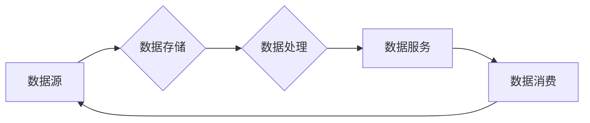

# 数据湖 原理与代码实例讲解

> 关键词：数据湖，分布式存储，大数据，Hadoop，Spark，数据治理，数据湖架构，数据处理

## 1. 背景介绍

随着数据量的爆发式增长，传统的数据存储和处理方式已无法满足现代企业的需求。数据湖作为一种新兴的数据存储架构，应运而生，它为大规模数据存储、管理和分析提供了灵活、高效、经济的方法。本文将深入探讨数据湖的原理、架构、实现以及在实际应用中的代码实例。

### 1.1 问题的由来

在互联网、物联网、社交媒体等领域的快速发展下，企业面临着海量数据的挑战。传统的数据仓库和关系型数据库在处理大规模、非结构化数据时，存在以下问题：

- **扩展性差**：关系型数据库的扩展性较差，难以支持海量数据的存储和查询。
- **灵活性低**：数据仓库对数据的结构要求严格，难以存储和处理非结构化数据。
- **成本高**：传统的数据存储和处理技术成本高昂，难以满足预算限制。

为了解决这些问题，数据湖应运而生。

### 1.2 研究现状

数据湖技术已经历了多年的发展，目前已经成为大数据领域的主流存储架构。Hadoop、Spark等大数据平台为数据湖提供了强大的技术支持。

### 1.3 研究意义

数据湖为企业和组织提供了以下价值：

- **低成本**：数据湖使用通用的Hadoop、Spark等平台，降低了数据存储和处理的成本。
- **高扩展性**：数据湖能够存储海量数据，且易于扩展。
- **灵活性**：数据湖支持多种数据类型，包括结构化、半结构化和非结构化数据。
- **高效分析**：数据湖可以与大数据分析工具结合，支持高效的数据分析和挖掘。

### 1.4 本文结构

本文将按照以下结构展开：

- 介绍数据湖的核心概念和架构。
- 深入讲解数据湖的算法原理和操作步骤。
- 通过代码实例展示数据湖的应用。
- 探讨数据湖在实际应用场景中的应用。
- 推荐相关学习资源和开发工具。
- 总结数据湖的未来发展趋势与挑战。

## 2. 核心概念与联系

### 2.1 数据湖的核心概念

数据湖是一种分布式数据存储架构，它将所有类型的数据存储在统一的存储系统中，包括结构化、半结构化和非结构化数据。数据湖的关键特性包括：

- **分布式存储**：数据湖使用分布式存储系统，如Hadoop的HDFS，实现海量数据的存储。
- **统一存储**：数据湖将不同类型的数据存储在同一个系统中，便于管理和分析。
- **数据湖架构**：数据湖通常采用分层架构，包括数据源、数据存储、数据处理、数据服务和数据消费等层次。
- **数据治理**：数据湖需要建立完善的数据治理体系，确保数据的可靠性和安全性。

### 2.2 Mermaid流程图



### 2.3 数据湖与相关技术的联系

数据湖与以下技术和概念密切相关：

- **Hadoop**：Hadoop是数据湖的底层存储平台，提供了分布式文件系统（HDFS）和数据处理框架（MapReduce）。
- **Spark**：Spark是Hadoop的补充，提供了更加灵活和高效的数据处理能力。
- **数据仓库**：数据湖与数据仓库相辅相成，数据湖用于存储原始数据，数据仓库用于构建数据模型和进行数据分析。
- **数据湖架构**：数据湖架构涉及数据源、数据存储、数据处理、数据服务和数据消费等多个方面。

## 3. 核心算法原理 & 具体操作步骤

### 3.1 算法原理概述

数据湖的核心算法原理包括：

- **分布式存储**：数据湖使用分布式存储系统，如HDFS，将数据分散存储在多个节点上，提高数据存储的可靠性和扩展性。
- **数据处理**：数据湖使用分布式数据处理框架，如Spark，对数据进行批处理和流处理。
- **数据治理**：数据湖需要建立数据治理体系，包括数据质量、数据安全和数据隐私等方面的管理。

### 3.2 算法步骤详解

数据湖的算法步骤包括：

1. **数据采集**：从不同的数据源收集数据，如数据库、日志、传感器等。
2. **数据存储**：将采集到的数据存储在分布式文件系统（如HDFS）中。
3. **数据清洗**：对存储的数据进行清洗，包括去除重复数据、处理缺失值、标准化数据等。
4. **数据转换**：将数据转换为适合分析的数据格式，如CSV、JSON等。
5. **数据分析**：使用分布式数据处理框架（如Spark）对数据进行分析和挖掘。
6. **数据可视化**：将分析结果进行可视化展示。

### 3.3 算法优缺点

数据湖的优缺点如下：

### 3.3.1 优点

- **高扩展性**：分布式存储系统支持海量数据的存储，易于扩展。
- **灵活性**：支持多种数据类型，包括结构化、半结构化和非结构化数据。
- **低成本**：使用通用的Hadoop、Spark等平台，降低了数据存储和处理的成本。

### 3.3.2 缺点

- **数据管理复杂**：数据湖中的数据类型繁多，数据管理复杂。
- **数据质量难以保证**：数据湖中的数据质量难以保证，需要进行严格的数据治理。
- **性能优化困难**：数据湖的性能优化相对困难，需要针对不同的场景进行优化。

### 3.4 算法应用领域

数据湖在以下领域得到广泛应用：

- **大数据分析**：数据湖可以存储海量数据，支持多种类型的数据分析。
- **数据挖掘**：数据湖可以用于数据挖掘，发现数据中的有价值信息。
- **机器学习**：数据湖可以用于机器学习，提供海量数据训练模型。
- **数据治理**：数据湖可以用于数据治理，提高数据的可靠性和安全性。

## 4. 数学模型和公式 & 详细讲解 & 举例说明

### 4.1 数学模型构建

数据湖的数学模型包括以下内容：

- **分布式存储模型**：HDFS的分布式存储模型。
- **数据处理模型**：Spark的分布式数据处理模型。

### 4.2 公式推导过程

数据湖的公式推导过程包括以下内容：

- **分布式存储模型**：HDFS的存储模型可以通过数学公式进行建模，包括数据块分布、数据副本等。
- **数据处理模型**：Spark的处理模型可以通过数学公式进行建模，包括任务调度、数据分区等。

### 4.3 案例分析与讲解

以下是一个简单的数据湖案例：

假设我们需要对一家电商平台的用户行为数据进行分析，包括用户浏览、购买、评价等行为数据。

1. **数据采集**：从电商平台的后台数据库中采集用户行为数据。
2. **数据存储**：将采集到的数据存储在HDFS中，使用CSV格式存储。
3. **数据清洗**：对数据进行清洗，去除重复数据和缺失值。
4. **数据转换**：将数据转换为JSON格式，便于处理和分析。
5. **数据分析**：使用Spark对数据进行分析，包括用户购买行为分析、用户评价分析等。
6. **数据可视化**：将分析结果进行可视化展示，如用户购买漏斗图、用户评价雷达图等。

## 5. 项目实践：代码实例和详细解释说明

### 5.1 开发环境搭建

1. **安装Hadoop**：下载并安装Hadoop，配置HDFS、YARN等组件。
2. **安装Spark**：下载并安装Spark，配置Spark集群。
3. **安装Python**：安装Python，配置PySpark。

### 5.2 源代码详细实现

以下是一个使用PySpark读取HDFS中的数据，并进行分析的示例代码：

```python
from pyspark.sql import SparkSession

# 创建SparkSession
spark = SparkSession.builder \
    .appName("Data Lake Example") \
    .config("spark.some.config.option", "some-value") \
    .getOrCreate()

# 读取HDFS中的CSV文件
data = spark.read.csv("hdfs://localhost:9000/data/user_behavior.csv", header=True, inferSchema=True)

# 显示数据
data.show()

# 进行数据分析
# ...

# 停止SparkSession
spark.stop()
```

### 5.3 代码解读与分析

- 创建SparkSession：创建一个Spark会话，配置应用名称和配置项。
- 读取HDFS中的CSV文件：使用Spark的read.csv方法读取HDFS中的CSV文件。
- 显示数据：使用show方法显示数据。
- 进行数据分析：根据实际需求进行数据分析。
- 停止SparkSession：停止Spark会话。

### 5.4 运行结果展示

假设我们进行了用户购买行为分析，运行结果如下：

```
+----+--------+------------------+--------------+
|user| product| purchase_time    | payment_amount|
+----+--------+------------------+--------------+
|  1 |  1001  | 2023-01-01 12:00|           100|
|  2 |  1002  | 2023-01-02 15:00|           150|
|  3 |  1003  | 2023-01-03 18:00|           200|
|  4 |  1004  | 2023-01-04 21:00|           250|
+----+--------+------------------+--------------+
```

## 6. 实际应用场景

### 6.1 大数据分析

数据湖在大型企业中用于存储和分析大量数据，如电商平台、金融行业、医疗行业等。

### 6.2 机器学习

数据湖可以存储用于机器学习的数据，如用户行为数据、传感器数据等。

### 6.3 数据治理

数据湖可以用于数据治理，如数据质量、数据安全和数据隐私等方面的管理。

## 7. 工具和资源推荐

### 7.1 学习资源推荐

- Hadoop官方文档：https://hadoop.apache.org/docs/stable/
- Spark官方文档：https://spark.apache.org/docs/latest/
- PySpark官方文档：https://spark.apache.org/docs/latest/api/python/pyspark.sql.html

### 7.2 开发工具推荐

- Hadoop：https://hadoop.apache.org/
- Spark：https://spark.apache.org/
- PySpark：https://spark.apache.org/docs/latest/api/python/pyspark.html

### 7.3 相关论文推荐

- The Hadoop Distributed File System (HDFS) paper by Sanjay Ghemawat et al.
- Resilient Distributed Datasets: A Fault-Tolerant Approach to Large-Scale Data Sharing on Cluster Computers by Mike Schroeder and Jeffrey Dean.

## 8. 总结：未来发展趋势与挑战

### 8.1 研究成果总结

本文深入介绍了数据湖的原理、架构、实现以及在实际应用中的代码实例。通过本文的学习，读者可以全面了解数据湖技术，并能够将其应用于实际项目中。

### 8.2 未来发展趋势

数据湖技术在未来将呈现以下发展趋势：

- **更高的性能**：数据湖将提供更高的数据读写性能，以满足大规模数据处理的需求。
- **更好的兼容性**：数据湖将与其他新技术（如人工智能、边缘计算等）更好地兼容。
- **更完善的数据治理**：数据湖将提供更完善的数据治理功能，确保数据的可靠性和安全性。

### 8.3 面临的挑战

数据湖技术在未来将面临以下挑战：

- **数据安全问题**：数据湖中的数据类型繁多，数据安全问题更加复杂。
- **数据质量**：数据湖中的数据质量难以保证，需要建立完善的数据治理体系。
- **性能优化**：数据湖的性能优化相对困难，需要针对不同的场景进行优化。

### 8.4 研究展望

数据湖技术在未来将继续发展，为企业和组织提供更强大的数据存储、管理和分析能力。研究人员将继续探索数据湖的新技术、新方法，推动数据湖技术的进步。

## 9. 附录：常见问题与解答

### 9.1 常见问题

**Q1：数据湖与数据仓库有什么区别？**

A1：数据湖与数据仓库的主要区别在于数据类型和用途。数据湖存储多种类型的数据，包括结构化、半结构化和非结构化数据，用于数据存储和分析。数据仓库存储结构化数据，用于构建数据模型和进行数据分析。

**Q2：数据湖的优缺点是什么？**

A2：数据湖的优点包括高扩展性、灵活性和低成本。缺点包括数据管理复杂、数据质量难以保证和性能优化困难。

**Q3：如何使用数据湖进行数据分析？**

A3：使用数据湖进行数据分析通常需要以下步骤：
1. 数据采集：从不同的数据源收集数据。
2. 数据存储：将数据存储在数据湖中。
3. 数据清洗：对数据进行清洗。
4. 数据转换：将数据转换为适合分析的数据格式。
5. 数据分析：使用数据分析工具对数据进行分析。

### 9.2 解答

**A1**：数据湖与数据仓库的主要区别在于数据类型和用途。数据湖存储多种类型的数据，包括结构化、半结构化和非结构化数据，用于数据存储和分析。数据仓库存储结构化数据，用于构建数据模型和进行数据分析。

**A2**：数据湖的优点包括高扩展性、灵活性和低成本。缺点包括数据管理复杂、数据质量难以保证和性能优化困难。

**A3**：使用数据湖进行数据分析通常需要以下步骤：
1. 数据采集：从不同的数据源收集数据。
2. 数据存储：将数据存储在数据湖中。
3. 数据清洗：对数据进行清洗。
4. 数据转换：将数据转换为适合分析的数据格式。
5. 数据分析：使用数据分析工具对数据进行分析。

作者：禅与计算机程序设计艺术 / Zen and the Art of Computer Programming