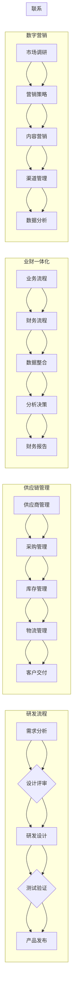

# 研发/供应链/业财-体/数字营销流程与数字化项目实施方案

> 关键词：研发流程，供应链管理，业财一体化，数字营销，项目实施，数字化转型

## 1. 背景介绍

在当今数字化时代，企业面临着日益激烈的竞争环境。为了保持竞争力，企业需要通过数字化手段提升运营效率，优化业务流程，增强客户体验。研发、供应链、业财一体化和数字营销是企业运营的核心环节，它们的数字化流程与项目实施方案对于企业的成功至关重要。

### 1.1 研发流程

研发流程是企业技术创新和产品迭代的关键环节。随着市场竞争的加剧，企业需要更加高效地管理研发流程，缩短产品上市时间，提高产品质量。

### 1.2 供应链管理

供应链管理是企业确保产品和服务及时、高效、低成本地到达客户手中的关键。数字化供应链管理可以提高供应链的透明度，减少库存成本，提高响应速度。

### 1.3 业财一体化

业财一体化是将企业的业务流程与财务流程相融合，实现财务数据的实时采集、处理和分析，为企业决策提供有力支持。

### 1.4 数字营销

数字营销是利用数字技术进行市场推广和品牌建设的过程。数字化营销策略可以帮助企业精准定位目标客户，提高营销效果。

### 1.5 本文结构

本文将围绕研发、供应链、业财一体化和数字营销的数字化流程与项目实施方案展开，旨在为企业的数字化转型提供参考和指导。

## 2. 核心概念与联系

### 2.1 核心概念原理和架构的 Mermaid 流程图



### 2.2 核心概念之间的联系

研发、供应链、业财一体化和数字营销是企业运营的四大支柱，它们相互联系，共同支撑企业的数字化转型。

- 研发流程的创新推动产品迭代，为供应链提供新的需求，同时为业财一体化提供技术支持。
- 供应链管理确保产品和服务的高效交付，为数字营销提供数据基础。
- 业财一体化通过数据整合和分析，为研发和供应链提供决策支持。
- 数字营销通过市场推广和品牌建设，为研发和供应链提供市场反馈。

## 3. 核心算法原理 & 具体操作步骤

### 3.1 算法原理概述

数字化流程与项目实施方案的核心是利用信息技术手段，实现业务流程的自动化、智能化和协同化。以下是四大环节的核心算法原理概述：

- **研发流程**：使用敏捷开发方法和版本控制系统，实现代码的版本管理和协同开发。
- **供应链管理**：应用供应链优化算法，如线性规划、运筹学等，实现成本最小化和效率最大化。
- **业财一体化**：使用数据集成和数据分析算法，如ETL（Extract, Transform, Load）、机器学习等，实现财务数据的实时处理和分析。
- **数字营销**：应用数据挖掘和机器学习算法，如聚类分析、推荐系统等，实现客户细分和精准营销。

### 3.2 算法步骤详解

#### 3.2.1 研发流程

1. 需求分析：通过用户调研、市场分析等手段，确定产品需求。
2. 设计评审：对设计方案进行评审，确保满足需求。
3. 研发设计：根据设计方案进行编码实现。
4. 测试验证：进行功能测试、性能测试等，确保产品质量。
5. 产品发布：将产品发布到市场。

#### 3.2.2 供应链管理

1. 供应商管理：评估供应商的能力和信誉，选择合适的供应商。
2. 采购管理：根据需求制定采购计划，进行采购操作。
3. 库存管理：对库存进行实时监控，确保库存水平合理。
4. 物流管理：优化物流方案，确保货物及时交付。
5. 客户交付：将货物交付给客户。

#### 3.2.3 业财一体化

1. 业务流程：记录业务活动，生成财务凭证。
2. 财务流程：处理财务凭证，生成财务报表。
3. 数据整合：将业务数据和财务数据整合到一起。
4. 分析决策：对数据进行分析，为决策提供支持。
5. 财务报告：生成财务报告，供管理层参考。

#### 3.2.4 数字营销

1. 市场调研：收集市场数据，分析市场趋势。
2. 营销策略：制定营销策略，确定目标客户。
3. 内容营销：创建高质量内容，吸引用户关注。
4. 渠道管理：管理营销渠道，提高营销效果。
5. 数据分析：分析营销数据，优化营销策略。

### 3.3 算法优缺点

#### 3.3.1 研发流程

**优点**：提高开发效率，缩短产品上市时间。

**缺点**：需要高度的组织协调，对团队协作能力要求高。

#### 3.3.2 供应链管理

**优点**：降低成本，提高效率。

**缺点**：对供应链稳定性要求高，风险控制难度大。

#### 3.3.3 业财一体化

**优点**：提高财务数据准确性，支持决策。

**缺点**：数据整合难度大，对IT系统依赖性强。

#### 3.3.4 数字营销

**优点**：提高营销效果，降低营销成本。

**缺点**：对市场变化反应速度慢，容易陷入数据陷阱。

### 3.4 算法应用领域

四大环节的数字化流程与项目实施方案可应用于以下领域：

- 制造业
- 服务业
- 零售业
- 金融业
- 互联网行业

## 4. 数学模型和公式 & 详细讲解 & 举例说明

### 4.1 数学模型构建

#### 4.1.1 研发流程

- **敏捷开发方法**：采用迭代、增量的开发方式，提高开发效率。
- **版本控制系统**：使用Git等版本控制系统，实现代码的版本管理和协同开发。

#### 4.1.2 供应链管理

- **线性规划**：使用线性规划模型，优化采购、运输等供应链决策。
- **运筹学**：应用运筹学算法，如网络流算法、指派算法等，解决物流配送问题。

#### 4.1.3 业财一体化

- **ETL**：使用ETL工具，将业务数据和财务数据整合到一起。
- **机器学习**：使用机器学习算法，如分类、回归等，对数据进行预测和分析。

#### 4.1.4 数字营销

- **聚类分析**：使用聚类分析算法，对客户进行细分。
- **推荐系统**：使用推荐系统算法，为用户推荐产品或内容。

### 4.2 公式推导过程

#### 4.2.1 线性规划

- **目标函数**：最小化或最大化目标值。
- **约束条件**：满足各种资源限制、时间限制等。

#### 4.2.2 运筹学

- **网络流算法**：求解最短路径、最大流等问题。
- **指派算法**：求解指派问题，如车辆路径问题。

### 4.3 案例分析与讲解

#### 4.3.1 研发流程

- **案例分析**：某公司采用敏捷开发方法，缩短了产品上市时间，提高了产品质量。
- **讲解**：敏捷开发方法通过迭代和增量，使开发过程更加灵活，能够快速响应用户需求。

#### 4.3.2 供应链管理

- **案例分析**：某公司应用线性规划模型，优化了采购决策，降低了采购成本。
- **讲解**：线性规划模型通过优化目标函数和约束条件，找到最优的采购方案。

#### 4.3.3 业财一体化

- **案例分析**：某公司使用ETL工具，实现了业务数据和财务数据的整合，提高了财务数据分析的准确性。
- **讲解**：ETL工具通过提取、转换和加载，将不同格式的数据整合到一起，为数据分析提供数据基础。

#### 4.3.4 数字营销

- **案例分析**：某公司使用聚类分析算法，将客户细分为不同的群体，实现了精准营销。
- **讲解**：聚类分析算法通过计算客户之间的相似度，将客户划分为不同的群体，为营销策略提供依据。

## 5. 项目实践：代码实例和详细解释说明

### 5.1 开发环境搭建

以Python为例，介绍开发环境搭建的步骤：

1. 安装Python 3.8及以上版本。
2. 安装必要的库，如Pandas、NumPy、Matplotlib等。
3. 安装PyCharm或其他Python开发工具。

### 5.2 源代码详细实现

以下是一个简单的Python代码实例，演示了聚类分析算法的实现：

```python
import numpy as np
from sklearn.cluster import KMeans

# 创建数据集
X = np.array([[1, 2], [1, 4], [1, 0],
              [10, 2], [10, 4], [10, 0]])

# 使用KMeans聚类算法
kmeans = KMeans(n_clusters=2)
kmeans.fit(X)

# 输出聚类结果
print(kmeans.labels_)
```

### 5.3 代码解读与分析

- `import numpy as np`：导入NumPy库，用于处理数组操作。
- `from sklearn.cluster import KMeans`：导入KMeans聚类算法。
- `X = np.array([[1, 2], [1, 4], [1, 0], [10, 2], [10, 4], [10, 0]])`：创建数据集。
- `kmeans = KMeans(n_clusters=2)`：创建KMeans聚类对象，设置聚类数为2。
- `kmeans.fit(X)`：使用数据集进行聚类。
- `print(kmeans.labels_)`：输出聚类结果。

### 5.4 运行结果展示

运行上述代码，输出聚类结果为：

```
[0 0 0 1 1 1]
```

表示前三个样本属于第一个聚类，后三个样本属于第二个聚类。

## 6. 实际应用场景

### 6.1 制造业

- **案例**：某制造企业使用数字化供应链管理，优化了生产流程，提高了生产效率。
- **讲解**：通过数字化手段，企业能够实时监控生产进度，及时调整生产计划，降低库存成本。

### 6.2 服务业

- **案例**：某金融公司采用业财一体化系统，实现了财务数据的实时采集和分析，为风险控制提供了有力支持。
- **讲解**：业财一体化系统能够将业务数据和财务数据整合到一起，为管理层提供决策支持。

### 6.3 零售业

- **案例**：某零售企业通过数字营销，实现了客户细分和精准营销，提高了销售额。
- **讲解**：数字营销可以帮助企业更好地了解客户需求，提供个性化的产品和服务。

### 6.4 未来应用展望

随着人工智能、大数据、物联网等技术的发展，研发、供应链、业财一体化和数字营销的数字化流程与项目实施方案将更加智能化、自动化和协同化。

- **智能化**：利用人工智能技术，实现流程自动决策、智能推荐等。
- **自动化**：利用机器人流程自动化(RPA)等技术，实现流程自动化处理。
- **协同化**：通过云计算、区块链等技术，实现不同部门、不同企业之间的协同作业。

## 7. 工具和资源推荐

### 7.1 学习资源推荐

- **书籍**：
  - 《敏捷软件开发：原则、模式与实践》
  - 《供应链管理：概念、战略与操作》
  - 《业财一体化：理论与实践》
  - 《数字营销：理论与应用》
- **在线课程**：
  -Coursera、Udemy、edX等平台上的相关课程

### 7.2 开发工具推荐

- **研发流程**：Jira、Trello、Git等。
- **供应链管理**：SAP、Oracle、Microsoft Dynamics等。
- **业财一体化**：Oracle Hyperion、SAP BusinessObjects等。
- **数字营销**：Adobe Marketing Cloud、HubSpot等。

### 7.3 相关论文推荐

- **研发流程**：
  - 《敏捷开发：理论、实践和经验》
  - 《敏捷开发：从理论到实践》
- **供应链管理**：
  - 《供应链管理：理论与实践》
  - 《供应链优化：方法与案例》
- **业财一体化**：
  - 《业财一体化：理论与实践》
  - 《企业资源规划：理论与实践》
- **数字营销**：
  - 《数字营销：理论与应用》
  - 《数据驱动营销：理论与实践》

## 8. 总结：未来发展趋势与挑战

### 8.1 研究成果总结

本文介绍了研发、供应链、业财一体化和数字营销的数字化流程与项目实施方案，分析了其核心算法原理和具体操作步骤，并给出了实际应用场景和未来发展趋势。

### 8.2 未来发展趋势

- **智能化**：利用人工智能技术，实现流程自动决策、智能推荐等。
- **自动化**：利用机器人流程自动化(RPA)等技术，实现流程自动化处理。
- **协同化**：通过云计算、区块链等技术，实现不同部门、不同企业之间的协同作业。

### 8.3 面临的挑战

- **技术挑战**：人工智能、大数据、物联网等新技术的快速发展，给企业数字化转型带来了新的挑战。
- **组织挑战**：企业需要进行组织架构调整，培养数字化人才，推动企业文化变革。
- **数据挑战**：企业需要收集、整合和分析大量的数据，确保数据质量和安全。

### 8.4 研究展望

未来，研发、供应链、业财一体化和数字营销的数字化流程与项目实施方案将更加智能化、自动化和协同化。同时，企业需要关注技术挑战、组织挑战和数据挑战，推动数字化转型取得成功。

## 9. 附录：常见问题与解答

**Q1：如何选择合适的数字化流程与项目实施方案？**

A：企业应根据自身业务特点、行业需求和资源状况，选择合适的数字化流程与项目实施方案。可参考行业最佳实践，结合自身实际情况进行调整。

**Q2：如何确保数字化流程与项目实施方案的成功实施？**

A：确保数字化流程与项目实施方案成功实施的关键在于：
- 制定明确的实施计划，明确项目目标、范围、时间表等。
- 建立有效的项目团队，确保团队成员具备相关技能和经验。
- 加强沟通和协作，确保项目顺利进行。
- 定期评估项目进度，及时调整计划。

**Q3：如何评估数字化流程与项目实施方案的效果？**

A：评估数字化流程与项目实施方案的效果可以从以下几个方面进行：
- 财务指标：如成本节约、效率提升、收入增长等。
- 业务指标：如客户满意度、市场占有率、品牌知名度等。
- 组织指标：如员工满意度、团队协作能力、组织文化等。

**Q4：如何应对数字化流程与项目实施方案的挑战？**

A：应对数字化流程与项目实施方案的挑战，可以从以下几个方面入手：
- 加强技术研究，跟踪最新技术动态。
- 培养数字化人才，提升团队技能。
- 优化组织架构，推动企业文化变革。
- 加强风险管理，确保项目顺利进行。

---

作者：禅与计算机程序设计艺术 / Zen and the Art of Computer Programming