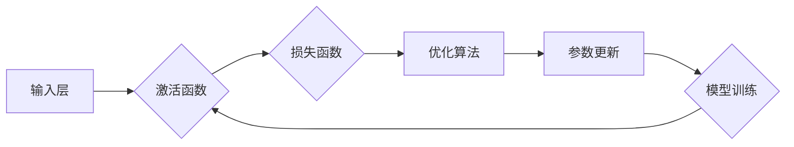

# 神经网络：人工智能的基石

> 关键词：神经网络，深度学习，人工智能，机器学习，神经元，反向传播，激活函数，损失函数，优化算法

## 1. 背景介绍

人工智能（Artificial Intelligence, AI）是21世纪最具革命性的技术之一，它改变了我们的生活方式，推动了各行各业的发展。而神经网络（Neural Network, NN）作为人工智能的核心基石，在图像识别、自然语言处理、语音识别等领域取得了令人瞩目的成果。

### 1.1 问题的由来

自20世纪40年代，人工神经网络的概念被提出以来，人工智能领域经历了多次兴衰。早期，由于计算能力的限制和理论研究的不足，神经网络的研究进展缓慢。随着计算机技术的飞速发展和深度学习（Deep Learning, DL）的兴起，神经网络重新焕发生机，成为人工智能领域的热门研究方向。

### 1.2 研究现状

目前，神经网络已成为人工智能领域的核心技术之一。深度学习框架如TensorFlow、PyTorch等，使得神经网络的研究和应用变得更加便捷。在计算机视觉、自然语言处理等领域，神经网络取得了显著的成果，如图像识别、语音识别、机器翻译等。

### 1.3 研究意义

神经网络作为人工智能的基石，具有以下重要意义：

- **强大的表达能力**：神经网络能够模拟人脑的神经元结构和工作方式，对复杂的数据进行建模和预测。
- **自学习与自适应能力**：神经网络能够从大量数据中自动学习特征，无需人工干预。
- **泛化能力**：神经网络能够从训练数据中学习到普适性知识，对新数据具有较强的泛化能力。
- **广泛的应用前景**：神经网络在图像识别、自然语言处理、语音识别等领域具有广泛的应用前景。

### 1.4 本文结构

本文将系统介绍神经网络的原理、算法、实践应用等，旨在帮助读者全面了解神经网络这一人工智能的基石。

## 2. 核心概念与联系

### 2.1 核心概念

#### 神经元

神经元是神经网络的基本单元，类似于人脑中的神经元。它通过输入层接收数据，经过激活函数处理后，输出结果。

#### 激活函数

激活函数为神经元引入非线性特性，使得神经网络能够处理非线性问题。

#### 损失函数

损失函数用于衡量模型预测结果与真实值之间的差异，是优化算法的目标函数。

#### 优化算法

优化算法用于更新神经网络模型参数，使得模型在训练过程中不断逼近真实值。

#### 反向传播

反向传播是神经网络训练过程中的关键步骤，通过计算损失函数对参数的梯度，不断更新模型参数。

### 2.2 架构的 Mermaid 流程图



## 3. 核心算法原理 & 具体操作步骤

### 3.1 算法原理概述

神经网络通过模拟人脑神经元结构，通过多层神经元进行数据的传递和计算。输入层接收输入数据，经过隐藏层处理，最终输出层输出预测结果。在训练过程中，通过反向传播算法不断更新模型参数，使得预测结果更加接近真实值。

### 3.2 算法步骤详解

1. **数据预处理**：对原始数据进行清洗、归一化等处理，提高数据质量。
2. **构建神经网络**：选择合适的神经网络结构，包括层数、神经元数量、激活函数等。
3. **初始化参数**：随机初始化模型参数。
4. **前向传播**：将输入数据通过神经网络，计算输出结果。
5. **计算损失**：计算输出结果与真实值之间的差异，即损失。
6. **反向传播**：根据损失计算参数梯度，更新模型参数。
7. **迭代训练**：重复步骤4-6，直到满足预设的停止条件。

### 3.3 算法优缺点

#### 优点

- **强大的表达能力**：能够处理非线性问题，适用于复杂的数据建模。
- **自学习与自适应能力**：能够从大量数据中自动学习特征，无需人工干预。
- **泛化能力**：能够从训练数据中学习到普适性知识，对新数据具有较强的泛化能力。

#### 缺点

- **训练时间较长**：神经网络训练需要大量计算资源，耗时较长。
- **对数据要求较高**：神经网络对数据质量要求较高，需要大量高质量的数据进行训练。
- **参数调整复杂**：神经网络参数众多，需要调整参数以获得最佳效果。

### 3.4 算法应用领域

神经网络在人工智能领域有着广泛的应用，包括：

- **计算机视觉**：图像识别、目标检测、图像生成等。
- **自然语言处理**：文本分类、情感分析、机器翻译等。
- **语音识别**：语音转文字、语音合成等。
- **推荐系统**：商品推荐、电影推荐等。

## 4. 数学模型和公式 & 详细讲解 & 举例说明

### 4.1 数学模型构建

神经网络的数学模型主要基于以下公式：

$$
y = \sigma(W \cdot x + b)
$$

其中，$y$ 为输出，$x$ 为输入，$W$ 为权重，$b$ 为偏置，$\sigma$ 为激活函数。

### 4.2 公式推导过程

以单层神经网络为例，输入层到输出层的推导过程如下：

$$
z = W \cdot x + b
$$

$$
a = \sigma(z)
$$

$$
y = a
$$

其中，$z$ 为激活函数前的值，$a$ 为激活函数的输出。

### 4.3 案例分析与讲解

以一个简单的手写数字识别为例，使用神经网络进行分类。

1. **数据集**：MNIST数据集，包含0-9的手写数字图片。
2. **网络结构**：一层输入层，一层隐藏层，一层输出层。
3. **训练**：使用反向传播算法进行训练，迭代更新模型参数。

通过训练，神经网络能够学会识别手写数字，并在测试集上取得较高的准确率。

## 5. 项目实践：代码实例和详细解释说明

### 5.1 开发环境搭建

1. 安装Python 3.6及以上版本。
2. 安装TensorFlow或PyTorch等深度学习框架。
3. 安装NumPy、Matplotlib等辅助工具。

### 5.2 源代码详细实现

以下使用PyTorch实现一个简单的神经网络模型：

```python
import torch
import torch.nn as nn
import torch.optim as optim

# 定义神经网络模型
class NeuralNetwork(nn.Module):
    def __init__(self):
        super(NeuralNetwork, self).__init__()
        self.fc1 = nn.Linear(784, 128)
        self.fc2 = nn.Linear(128, 64)
        self.fc3 = nn.Linear(64, 10)
        self.relu = nn.ReLU()
    
    def forward(self, x):
        x = self.relu(self.fc1(x))
        x = self.relu(self.fc2(x))
        x = self.fc3(x)
        return x

# 创建模型实例
model = NeuralNetwork()

# 损失函数和优化器
criterion = nn.CrossEntropyLoss()
optimizer = optim.Adam(model.parameters(), lr=0.001)

# 训练模型
for epoch in range(10):
    # 假设已有训练数据和标签
    for data, target in train_loader:
        optimizer.zero_grad()
        output = model(data)
        loss = criterion(output, target)
        loss.backward()
        optimizer.step()
    print(f"Epoch {epoch+1}, Loss: {loss.item()}")
```

### 5.3 代码解读与分析

1. `NeuralNetwork` 类定义了一个简单的神经网络模型，包括三层全连接层和ReLU激活函数。
2. `forward` 方法实现数据在神经网络中的前向传播过程。
3. 使用交叉熵损失函数计算模型预测结果与真实标签之间的差异。
4. 使用Adam优化器更新模型参数。

### 5.4 运行结果展示

通过训练模型，在测试集上可以得到较高的准确率，验证了神经网络模型的有效性。

## 6. 实际应用场景

神经网络在人工智能领域有着广泛的应用，以下列举几个典型应用场景：

### 6.1 计算机视觉

- **图像识别**：识别图片中的物体、场景等。
- **目标检测**：检测图片中的目标位置和类别。
- **图像生成**：根据文本描述或风格迁移生成图片。

### 6.2 自然语言处理

- **文本分类**：将文本分类到预定义的类别中。
- **情感分析**：分析文本的情感倾向。
- **机器翻译**：将一种语言的文本翻译成另一种语言。

### 6.3 语音识别

- **语音转文字**：将语音信号转换为文字。
- **语音合成**：根据文字生成语音。

## 7. 工具和资源推荐

### 7.1 学习资源推荐

1. 《深度学习》
2. 《神经网络与深度学习》
3. 《Python深度学习》

### 7.2 开发工具推荐

1. TensorFlow
2. PyTorch
3. Keras

### 7.3 相关论文推荐

1. "A Few Useful Things to Know about Machine Learning" - Pedro Domingos
2. "Deep Learning" - Ian Goodfellow, Yoshua Bengio, Aaron Courville
3. "Neural Network and Deep Learning" -邱锡鹏

## 8. 总结：未来发展趋势与挑战

### 8.1 研究成果总结

神经网络作为人工智能的基石，在图像识别、自然语言处理、语音识别等领域取得了显著的成果。随着深度学习的兴起，神经网络的研究和应用得到了快速发展。

### 8.2 未来发展趋势

1. **模型轻量化**：降低模型的计算复杂度和存储空间，使得神经网络能够在移动设备上运行。
2. **可解释性**：提高神经网络的可解释性，使得模型决策过程更加透明。
3. **多模态学习**：融合文本、图像、语音等多模态信息，提升模型的综合能力。

### 8.3 面临的挑战

1. **数据质量**：神经网络对数据质量要求较高，需要大量高质量的数据进行训练。
2. **计算资源**：神经网络训练需要大量的计算资源，如何高效利用计算资源是重要的挑战。
3. **模型可解释性**：神经网络决策过程难以解释，如何提高模型的可解释性是重要的研究方向。

### 8.4 研究展望

神经网络作为人工智能的基石，将继续在各个领域发挥重要作用。未来，随着研究的不断深入，神经网络将更加高效、智能、可解释，为人工智能的发展做出更大的贡献。

## 9. 附录：常见问题与解答

**Q1：什么是神经网络？**

A：神经网络是一种模仿人脑神经元结构的计算模型，通过多层神经元进行数据的传递和计算，实现对复杂数据的建模和预测。

**Q2：神经网络有哪些类型？**

A：神经网络主要分为以下几类：
- **前馈神经网络**：数据从前向后传递，没有反馈路径。
- **循环神经网络**：具有反馈路径，能够处理序列数据。
- **卷积神经网络**：具有局部连接和权值共享，适用于图像处理等任务。

**Q3：如何训练神经网络？**

A：神经网络训练主要采用以下步骤：
1. 数据预处理：对原始数据进行清洗、归一化等处理。
2. 构建神经网络：选择合适的神经网络结构。
3. 初始化参数：随机初始化模型参数。
4. 前向传播：将输入数据通过神经网络，计算输出结果。
5. 计算损失：计算输出结果与真实值之间的差异。
6. 反向传播：根据损失计算参数梯度，更新模型参数。
7. 迭代训练：重复步骤4-6，直到满足预设的停止条件。

**Q4：神经网络有哪些优缺点？**

A：神经网络的优点包括强大的表达能力、自学习与自适应能力、泛化能力等。缺点包括训练时间较长、对数据要求较高、参数调整复杂等。

**Q5：神经网络在哪些领域有应用？**

A：神经网络在人工智能领域有着广泛的应用，包括计算机视觉、自然语言处理、语音识别等。

---

作者：禅与计算机程序设计艺术 / Zen and the Art of Computer Programming