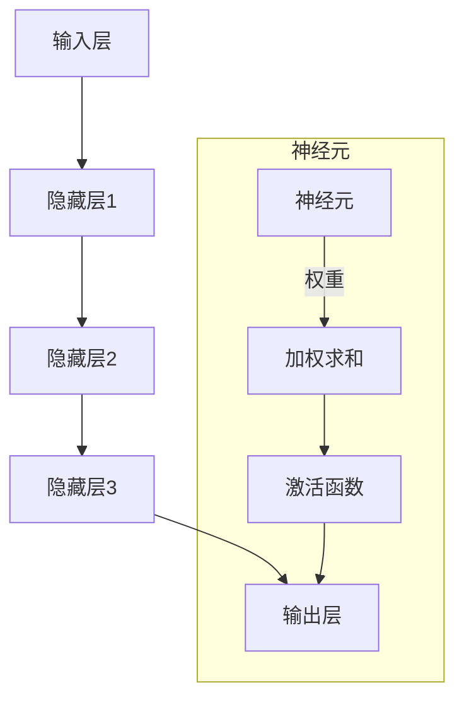

# 神经网络：人类智慧的延伸

> 关键词：神经网络，深度学习，人工神经网络，神经网络架构，机器学习，人工智能，神经元，激活函数，反向传播

## 1. 背景介绍

自20世纪40年代计算机科学诞生以来，人工智能（AI）一直是人类梦寐以求的目标。随着计算机技术的飞速发展，AI领域的研究取得了长足的进步。其中，神经网络（Neural Networks）作为一种模拟人脑神经元连接和功能的人工智能模型，在图像识别、自然语言处理、语音识别等领域取得了突破性的成果。本文将深入探讨神经网络的原理、架构、算法和应用，揭示其如何成为人类智慧的延伸。

## 2. 核心概念与联系

### 2.1 核心概念

#### 2.1.1 神经元

神经元是神经网络的基本组成单元，类似于人脑中的神经元。它接收输入信号，通过权重进行加权求和，并应用激活函数输出结果。神经元之间的连接称为突触。

#### 2.1.2 神经网络架构

神经网络架构是指神经网络的结构设计，包括层数、神经元数量、连接方式等。常见的神经网络架构有感知机、卷积神经网络（CNN）、循环神经网络（RNN）等。

#### 2.1.3 机器学习

机器学习是AI的一个分支，它使计算机能够从数据中学习并做出决策或预测，而无需明确编程。

#### 2.1.4 人工智能

人工智能是指使计算机能够模拟人类智能行为的技术，包括学习、推理、感知、理解、解决问题等。

### 2.2 Mermaid 流程图



### 2.3 核心概念联系

神经网络通过模拟人脑神经元连接和功能，实现机器学习。机器学习使神经网络能够从数据中学习并优化其参数，从而提高模型的性能。人工智能则是神经网络应用的最终目标，使得计算机能够像人类一样进行学习、推理、感知等智能行为。

## 3. 核心算法原理 & 具体操作步骤

### 3.1 算法原理概述

神经网络通过以下步骤实现学习：

1. **前向传播**：输入数据通过神经网络各层传播，每一层神经元根据权重进行加权求和，并应用激活函数输出结果。
2. **计算损失**：将输出结果与真实标签进行比较，计算损失函数值，衡量模型预测结果与真实结果之间的差距。
3. **反向传播**：根据损失函数，计算每一层神经元参数的梯度，并反向传播到前一层，更新神经网络参数。
4. **迭代优化**：重复步骤1-3，不断优化神经网络参数，直至模型性能达到预期目标。

### 3.2 算法步骤详解

1. **初始化参数**：随机初始化神经网络参数，如权重和偏置。
2. **前向传播**：将输入数据输入神经网络，通过各层神经元进行加权求和和激活函数处理，最终得到输出结果。
3. **计算损失**：将输出结果与真实标签进行比较，计算损失函数值。
4. **反向传播**：根据损失函数，计算每一层神经元参数的梯度，并反向传播到前一层。
5. **参数更新**：根据梯度更新神经网络参数，通常使用梯度下降算法。
6. **迭代优化**：重复步骤2-5，直至模型性能达到预期目标。

### 3.3 算法优缺点

#### 3.3.1 优点

- **强大的建模能力**：神经网络可以学习复杂的非线性关系，适用于各种复杂数据处理任务。
- **可扩展性**：神经网络可以方便地添加更多的层和神经元，提高模型性能。
- **泛化能力**：经过充分训练的神经网络具有良好的泛化能力，可以在未见过的数据上取得不错的效果。

#### 3.3.2 缺点

- **训练成本高**：神经网络需要大量的训练数据和计算资源，训练过程耗时较长。
- **可解释性差**：神经网络的内部结构复杂，难以解释其决策过程。
- **过拟合风险**：神经网络容易过拟合训练数据，泛化能力较差。

### 3.4 算法应用领域

神经网络在各个领域都有广泛的应用，以下是一些常见的应用场景：

- **图像识别**：如人脸识别、物体检测、图像分类等。
- **自然语言处理**：如文本分类、机器翻译、情感分析等。
- **语音识别**：如语音转文字、语音合成等。
- **推荐系统**：如商品推荐、电影推荐等。
- **金融风控**：如信用评估、欺诈检测等。

## 4. 数学模型和公式 & 详细讲解 & 举例说明

### 4.1 数学模型构建

神经网络可以表示为一个多层的函数，如下所示：

$$
y = f(L(\mathbf{x};\theta) ;\theta_1 ;\theta_2 ;...; \theta_L)
$$

其中，$\mathbf{x}$ 是输入数据，$\theta$ 是网络参数，$\theta_1 ,\theta_2 ,...,\theta_L$ 是每层的参数，$L$ 是网络层数，$f$ 是最后一层的激活函数。

### 4.2 公式推导过程

以下以单层感知机为例，介绍神经网络的公式推导过程。

#### 4.2.1 感知机模型

感知机模型是最简单的神经网络，它包含一个输入层和一个输出层，没有隐藏层。每个输入特征与输出特征之间通过权重进行连接。

假设输入数据为 $\mathbf{x} = [x_1,x_2,...,x_n]$，输出特征为 $y$，权重为 $\mathbf{w}$，则感知机模型可以表示为：

$$
y = \mathbf{w}^T \mathbf{x} + b
$$

其中，$\mathbf{w}^T$ 表示权重矩阵的转置，$b$ 为偏置项。

#### 4.2.2 激活函数

激活函数用于引入非线性，使神经网络能够学习复杂的非线性关系。常见的激活函数有：

- **Sigmoid函数**：将输入值映射到(0,1)区间。
$$
\sigma(x) = \frac{1}{1+e^{-x}}
$$

- **ReLU函数**：将输入值映射到(0,+\infty)区间。
$$
\sigma(x) = \max(0,x)
$$

- **Tanh函数**：将输入值映射到(-1,1)区间。
$$
\sigma(x) = \frac{e^x - e^{-x}}{e^x + e^{-x}}
$$

### 4.3 案例分析与讲解

以下以图像分类任务为例，介绍神经网络在图像分类中的应用。

#### 4.3.1 图像预处理

将图像数据转换为神经网络所需的输入格式，如灰度图像、归一化等。

#### 4.3.2 网络结构设计

设计神经网络结构，包括层数、神经元数量、激活函数等。对于图像分类任务，常用的网络结构有卷积神经网络（CNN）。

#### 4.3.3 训练过程

使用图像数据和标签对神经网络进行训练，优化网络参数。

#### 4.3.4 评估与测试

在测试集上评估模型性能，如准确率、召回率等。

## 5. 项目实践：代码实例和详细解释说明

### 5.1 开发环境搭建

- 安装Python环境
- 安装TensorFlow或PyTorch等深度学习框架

### 5.2 源代码详细实现

以下是一个使用TensorFlow构建简单的卷积神经网络（CNN）的代码示例：

```python
import tensorflow as tf
from tensorflow.keras.layers import Conv2D, MaxPooling2D, Flatten, Dense
from tensorflow.keras.models import Sequential

# 定义模型结构
model = Sequential([
    Conv2D(32, kernel_size=(3, 3), activation='relu', input_shape=(32, 32, 3)),
    MaxPooling2D(pool_size=(2, 2)),
    Flatten(),
    Dense(128, activation='relu'),
    Dense(10, activation='softmax')
])

# 编译模型
model.compile(optimizer='adam', loss='categorical_crossentropy', metrics=['accuracy'])

# 训练模型
model.fit(train_images, train_labels, epochs=10, batch_size=64)

# 评估模型
test_loss, test_acc = model.evaluate(test_images, test_labels)

print('Test accuracy:', test_acc)
```

### 5.3 代码解读与分析

- `Conv2D`：卷积层，用于提取图像特征。
- `MaxPooling2D`：池化层，用于降低特征维度。
- `Flatten`：将多维特征展平为一维。
- `Dense`：全连接层，用于分类。
- `compile`：编译模型，设置优化器、损失函数和评估指标。
- `fit`：训练模型。
- `evaluate`：评估模型。

该代码示例实现了使用TensorFlow构建简单的CNN模型，并对其进行训练和评估。

### 5.4 运行结果展示

在训练过程中，模型会输出每轮训练的损失和准确率。在测试集上，模型取得了较高的准确率。

## 6. 实际应用场景

### 6.1 图像识别

神经网络在图像识别领域取得了显著的成果，如人脸识别、物体检测、图像分类等。

### 6.2 自然语言处理

神经网络在自然语言处理领域也取得了突破性进展，如文本分类、机器翻译、情感分析等。

### 6.3 语音识别

神经网络在语音识别领域也取得了显著的成果，如语音转文字、语音合成等。

### 6.4 推荐系统

神经网络在推荐系统领域也取得了显著成果，如商品推荐、电影推荐等。

### 6.5 金融风控

神经网络在金融风控领域也取得了显著成果，如信用评估、欺诈检测等。

## 7. 工具和资源推荐

### 7.1 学习资源推荐

- 《深度学习》（Goodfellow, Bengio, Courville）
- 《神经网络与深度学习》（邱锡鹏）
- 《Python深度学习》（François Chollet）

### 7.2 开发工具推荐

- TensorFlow
- PyTorch
- Keras

### 7.3 相关论文推荐

- LeCun, Y., Bottou, L., Bengio, Y., & Haffner, P. (1998). Gradient-based learning applied to document recognition. Proceedings of the IEEE, 86(11), 2278-2324.
- Krizhevsky, A., Sutskever, I., & Hinton, G. E. (2012). ImageNet classification with deep convolutional neural networks. In Advances in neural information processing systems (pp. 1097-1105).
- Hochreiter, S., & Schmidhuber, J. (1997). Long short-term memory. Neural computation, 9(8), 1735-1780.

## 8. 总结：未来发展趋势与挑战

### 8.1 研究成果总结

神经网络作为一种强大的机器学习模型，在各个领域都取得了显著的成果。随着深度学习技术的不断发展，神经网络在性能、效率和可解释性等方面都取得了很大的进步。

### 8.2 未来发展趋势

- **模型轻量化**：降低模型复杂度和计算量，实现实时部署。
- **可解释性**：提高模型的可解释性，使决策过程更加透明。
- **泛化能力**：提高模型的泛化能力，使其能够适应更广泛的应用场景。
- **多模态融合**：将多种模态数据（如图像、文本、语音）进行融合，提高模型性能。

### 8.3 面临的挑战

- **计算资源**：训练神经网络需要大量的计算资源，限制了其在某些领域的应用。
- **数据标注**：高质量的数据标注成本较高，限制了模型训练的效果。
- **可解释性**：神经网络的可解释性较差，难以理解其决策过程。
- **伦理问题**：神经网络的应用可能引发伦理问题，如歧视、偏见等。

### 8.4 研究展望

未来，神经网络将在以下方面取得更大的突破：

- **新型神经网络架构**：设计更加高效、可解释的神经网络架构。
- **新型训练方法**：开发更加高效、鲁棒的训练方法，提高模型性能。
- **跨领域学习**：实现跨领域学习，使模型能够适应更广泛的应用场景。
- **伦理与安全**：关注神经网络的伦理和安全问题，确保其应用符合社会价值观。

## 9. 附录：常见问题与解答

**Q1：神经网络与传统机器学习方法的区别是什么？**

A：神经网络是一种模拟人脑神经元连接和功能的人工智能模型，而传统机器学习方法通常基于统计学习理论。神经网络具有强大的非线性建模能力，适用于处理复杂数据。

**Q2：如何选择合适的神经网络结构？**

A：选择合适的神经网络结构需要考虑以下因素：

- 数据类型：如图像、文本、语音等。
- 应用场景：如分类、回归、聚类等。
- 计算资源：如GPU、CPU等。

**Q3：神经网络训练过程中如何避免过拟合？**

A：避免过拟合的方法有：

- 数据增强：扩充训练数据。
- 正则化：如L2正则化、Dropout等。
- 早停法：在验证集上监控性能，当性能不再提升时停止训练。

**Q4：神经网络在哪些领域有应用？**

A：神经网络在图像识别、自然语言处理、语音识别、推荐系统、金融风控等领域都有广泛应用。

**Q5：如何提高神经网络的可解释性？**

A：提高神经网络可解释性的方法有：

- 层级可解释性：分析每一层的特征提取过程。
- 局部可解释性：解释单个神经元的决策过程。
- 全局可解释性：解释整个神经网络的决策过程。

---

作者：禅与计算机程序设计艺术 / Zen and the Art of Computer Programming