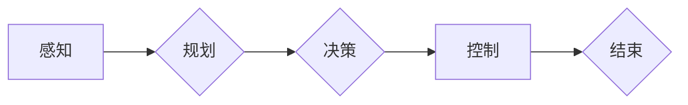

# 端到端自动驾驶的原教旨定义

> 关键词：自动驾驶，端到端，机器学习，深度学习，感知，规划，决策，控制，安全性，伦理

## 1. 背景介绍

随着科技的飞速发展，自动驾驶技术已成为当今世界最前沿的技术之一。从最初的辅助驾驶到如今的端到端自动驾驶，汽车行业正经历着一场深刻的变革。然而，对于什么是端到端自动驾驶，业界和学术界仍存在不同的理解和定义。本文旨在从原教旨的角度，深入探讨端到端自动驾驶的核心概念、技术原理、实现步骤和未来挑战，为读者提供一个全面而深刻的理解。

## 2. 核心概念与联系

### 2.1 核心概念

#### 感知 (Perception)

感知是自动驾驶系统的第一环节，其主要功能是获取车辆周围环境的信息。这包括：

- **图像识别**：通过摄像头、雷达、激光雷达等传感器获取的图像数据，识别道路、车辆、行人、交通标志等元素。
- **语义理解**：对感知到的图像进行语义分析，理解道路场景的上下文信息。
- **定位**：确定车辆在地图上的位置，包括经纬度、高程等信息。

#### 规划 (Planning)

规划是指根据感知到的环境和车辆状态，制定出一条安全的行驶路径。这包括：

- **路径规划**：在考虑交通规则和障碍物的情况下，规划一条通向目的地的路径。
- **行为规划**：根据规划出的路径，规划车辆的行驶行为，如加速、减速、转弯等。

#### 决策 (Decision Making)

决策是指根据规划的结果，选择合适的行动方案。这包括：

- **冲突检测**：检测潜在的驾驶冲突，如与其他车辆或行人的碰撞风险。
- **行动选择**：根据冲突检测结果，选择合适的行动方案，如加速、减速、变道等。

#### 控制 (Control)

控制是指根据决策结果，控制车辆执行相应的动作。这包括：

- **电机控制**：控制车辆的加速、减速、转向等动作。
- **制动控制**：控制车辆的制动系统，确保安全停车。

### 2.2 架构流程图

以下是端到端自动驾驶系统的Mermaid流程图：



## 3. 核心算法原理 & 具体操作步骤

### 3.1 算法原理概述

端到端自动驾驶系统通常采用深度学习算法来实现感知、规划、决策和控制等环节。以下是每个环节常用的算法原理：

#### 感知

- **卷积神经网络 (CNN)**：用于图像识别，提取图像特征。
- **循环神经网络 (RNN)**：用于序列数据处理，如视频数据中的动作识别。

#### 规划

- **图搜索算法**：如A*算法，用于路径规划。
- **动态窗口法**：用于行为规划。

#### 决策

- **强化学习**：通过与环境交互，学习最优的行动方案。
- **决策树/随机森林**：用于基于规则的决策。

#### 控制

- **PID控制器**：用于电机控制和制动控制。

### 3.2 算法步骤详解

1. **数据收集**：收集大量的道路图像、雷达数据、激光雷达数据等，用于训练和测试模型。
2. **模型训练**：使用深度学习算法训练感知、规划、决策和控制模块。
3. **模型测试**：在测试环境中验证模型的性能，包括感知准确性、规划效率、决策合理性和控制稳定性。
4. **系统集成**：将各个模块集成到自动驾驶系统中，进行整体测试和优化。
5. **上路测试**：在真实道路环境下进行测试，验证系统的安全性和可靠性。

### 3.3 算法优缺点

#### 优点

- **集成度高**：端到端自动驾驶系统将感知、规划、决策和控制模块集成在一起，简化了系统架构。
- **高效性**：深度学习算法能够快速处理大量数据，提高系统效率。
- **智能化**：通过机器学习，系统能够不断学习并优化性能。

#### 缺点

- **数据需求量大**：需要收集大量的训练数据，成本较高。
- **计算资源消耗大**：深度学习算法需要大量的计算资源。
- **安全性问题**：在复杂环境下，系统的安全性仍需进一步验证。

### 3.4 算法应用领域

端到端自动驾驶技术可以应用于以下领域：

- **自动驾驶汽车**：实现自动驾驶汽车的商业化运营。
- **自动驾驶公交车**：提高公共交通的效率和安全性。
- **自动驾驶卡车**：提高物流运输的效率和安全性。

## 4. 数学模型和公式 & 详细讲解 & 举例说明

### 4.1 数学模型构建

端到端自动驾驶系统涉及的数学模型主要包括：

- **图像识别模型**：如卷积神经网络 (CNN)。
- **路径规划模型**：如A*算法。
- **决策模型**：如强化学习算法。
- **控制模型**：如PID控制器。

### 4.2 公式推导过程

以下以A*算法为例，简要介绍其公式推导过程：

**目标函数**：

$$
f(n) = g(n) + h(n)
$$

其中：

- $g(n)$：从起点 $s$ 到节点 $n$ 的实际代价。
- $h(n)$：从节点 $n$ 到终点 $t$ 的估计代价。

**启发式函数**：

$$
h(n) = d(n,t)
$$

其中：

- $d(n,t)$：从节点 $n$ 到终点 $t$ 的直线距离。

### 4.3 案例分析与讲解

假设我们要在以下地图上找到从起点 $s$ 到终点 $t$ 的最短路径：

```
s ----> t
|       |
|       |
|       |
|       |
|       |
|       |
|       |
|       |
|       |
|       |
|       |
|       |
|       |
|       |
|       |
|       |
|       |
|       |
|       |
|       |
|       |
|       |
|       |
|       |
|       |
|       |
|       |
|       |
|       |
|       |
|       |
|       |
|       |
|       |
|       |
|       |
|       |
|       |
|       |
|       |
|       |
|       |
|       |
|       |
|       |
|       |
|       |
|       |
|       |
|       |
|       |
|       |
|       |
|       |
|       |
|       |
|       |
|       |
|       |
|       |
|       |
|       |
|       |
|       |
|       |
|       |
|       |
|       |
|       |
|       |
|       |
|       |
|       |
|       |
|       |
|       |
|       |
|       |
|       |
|       |
|       |
|       |
|       |
|       |
|       |
|       |
|       |
|       |
|       |
|       |
|       |
|       |
|       |
|       |
|       |
|       |
|       |
|       |
|       |
|       |
|       |
|       |
|       |
|       |
|       |
|       |
|       |
|       |
|       |
|       |
|       |
|       |
|       |
|       |
|       |
|       |
|       |
|       |
|       |
|       |
|       |
|       |
|       |
|       |
|       |
|       |
|       |
|       |
|       |
|       |
|       |
|       |
|       |
|       |
|       |
|       |
|       |
|       |
|       |
|       |
|       |
|       |
|       |
|       |
|       |
|       |
|       |
|       |
|       |
|       |
|       |
|       |
|       |
|       |
|       |
|       |
|       |
|       |
|       |
|       |
|       |
|       |
|       |
|       |
|       |
|       |
|       |
|       |
|       |
|       |
|       |
|       |
|       |
|       |
|       |
|       |
|       |
|       |
|       |
|       |
|       |
|       |
|       |
|       |
|       |
|       |
|       |
|       |
|       |
|       |
|       |
|       |
|       |
|       |
|       |
|       |
|       |
|       |
|       |
|       |
|       |
|       |
|       |
|       |
|       |
|       |
|       |
|       |
|       |
|       |
|       |
|       |
|       |
|       |
|       |
|       |
|       |
|       |
|       |
|       |
|       |
|       |
|       |
|       |
|       |
|       |
|       |
|       |
|       |
|       |
|       |
|       |
|       |
|       |
|       |
|       |
|       |
|       |
|       |
|       |
|       |
|       |
|       |
|       |
|       |
|       |
|       |
|       |
|       |
|       |
|       |
|       |
|       |
|       |
|       |
|       |
|       |
|       |
|       |
|       |
|       |
|       |
|       |
|       |
|       |
|       |
|       |
|       |
|       |
|       |
|       |
|       |
|       |
|       |
|       |
|       |
|       |
|       |
|       |
|       |
|       |
|       |
|       |
|       |
|       |
|       |
|       |
|       |
|       |
|       |
|       |
|       |
|       |
|       |
|       |
|       |
|       |
|       |
|       |
|       |
|       |
|       |
|       |
|       |
|       |
|       |
|       |
|       |
|       |
|       |
|       |
|       |
|       |
|       |
|       |
|       |
|       |
|       |
|       |
|       |
|       |
|       |
|       |
|       |
|       |
|       |
|       |
|       |
|       |
|       |
|       |
|       |
|       |
|       |
|       |
|       |
|       |
|       |
|       |
|       |
|       |
|       |
|       |
|       |
|       |
|       |
|       |
|       |
|       |
|       |
|       |
|       |
|       |
|       |
|       |
|       |
|       |
|       |
|       |
|       |
|       |
|       |
|       |
|       |
|       |
|       |
|       |
|       |
|       |
|       |
|       |
|       |
|       |
|       |
|       |
|       |
|       |
|       |
|       |
|       |
|       |
|       |
|       |
|       |
|       |
|       |
|       |
|       |
|       |
|       |
|       |
|       |
|       |
|       |
|       |
|       |
|       |
|       |
|       |
|       |
|       |
|       |
|       |
|       |
|       |
|       |
|       |
|       |
|       |
|       |
|       |
|       |
|       |
|       |
|       |
|       |
|       |
|       |
|       |
|       |
|       |
|       |
|       |
|       |
|       |
|       |
|       |
|       |
|       |
|       |
|       |
|       |
|       |
|       |
|       |
|       |
|       |
|       |
|       |
|       |
|       |
|       |
|       |
|       |
|       |
|       |
|       |
|       |
|       |
|       |
|       |
|       |
|       |
|       |
|       |
|       |
|       |
|       |
|       |
|       |
|       |
|       |
|       |
|       |
|       |
|       |
|       |
|       |
|       |
|       |
|       |
|       |
|       |
|       |
|       |
|       |
|       |
|       |
|       |
|       |
|       |
|       |
|       |
|       |
|       |
|       |
|       |
|       |
|       |
|       |
|       |
|       |
|       |
|       |
|       |
|       |
|       |
|       |
|       |
|       |
|       |
|       |
|       |
|       |
|       |
|       |
|       |
|       |
|       |
|       |
|       |
|       |
|       |
|       |
|       |
|       |
|       |
|       |
|       |
|       |
|       |
|       |
|       |
|       |
|       |
|       |
|       |
|       |
|       |
|       |
|       |
|       |
|       |
|       |
|       |
|       |
|       |
|       |
|       |
|       |
|       |
|       |
|       |
|       |
|       |
|       |
|       |
|       |
|       |
|       |
|       |
|       |
|       |
|       |
|       |
|       |
|       |
|       |
|       |
|       |
|       |
|       |
|       |
|       |
|       |
|       |
|       |
|       |
|       |
|       |
|       |
|       |
|       |
|       |
|       |
|       |
|       |
|       |
|       |
|       |
|       |
|       |
|       |
|       |
|       |
|       |
|       |
|       |
|       |
|       |
|       |
|       |
|       |
|       |
|       |
|       |
|       |
|       |
|       |
|       |
|       |
|       |
|       |
|       |
|       |
|       |
|       |
|       |
|       |
|       |
|       |
|       |
|       |
|       |
|       |
|       |
|       |
|       |
|       |
|       |
|       |
|       |
|       |
|       |
|       |
|       |
|       |
|       |
|       |
|       |
|       |
|       |
|       |
|       |
|       |
|       |
|       |
|       |
|       |
|       |
|       |
|       |
|       |
|       |
|       |
|       |
|       |
|       |
|       |
|       |
|       |
|       |
|       |
|       |
|       |
|       |
|       |
|       |
|       |
|       |
|       |
|       |
|       |
|       |
|       |
|       |
|       |
|       |
|       |
|       |
|       |
|       |
|       |
|       |
|       |
|       |
|       |
|       |
|       |
|       |
|       |
|       |
|       |
|       |
|       |
|       |
|       |
|       |
|       |
|       |
|       |
|       |
|       |
|       |
|       |
|       |
|       |
|       |
|       |
|       |
|       |
|       |
|       |
|       |
|       |
|       |
|       |
|       |
|       |
|       |
|       |
|       |
|       |
|       |
|       |
|       |
|       |
|       |
|       |
|       |
|       |
|       |
|       |
|       |
|       |
|       |
|       |
|       |
|       |
|       |
|       |
|       |
|       |
|       |
|       |
|       |
|       |
|       |
|       |
|       |
|       |
|       |
|       |
|       |
|       |
|       |
|       |
|       |
|       |
|       |
|       |
|       |
|       |
|       |
|       |
|       |
|       |
|       |
|       |
|       |
|       |
|       |
|       |
|       |
|       |
|       |
|       |
|       |
|       |
|       |
|       |
|       |
|       |
|       |
|       |
|       |
|       |
|       |
|       |
|       |
|       |
|       |
|       |
|       |
|       |
|       |
|       |
|       |
|       |
|       |
|       |
|       |
|       |
|       |
|       |
|       |
|       |
|       |
|       |
|       |
|       |
|       |
|       |
|       |
|       |
|       |
|       |
|       |
|       |
|       |
|       |
|       |
|       |
|       |
|       |
|       |
|       |
|       |
|       |
|       |
|       |
|       |
|       |
|       |
|       |
|       |
|       |
|       |
|       |
|       |
|       |
|       |
|       |
|       |
|       |
|       |
|       |
|       |
|       |
|       |
|       |
|       |
|       |
|       |
|       |
|       |
|       |
|       |
|       |
|       |
|       |
|       |
|       |
|       |
|       |
|       |
|       |
|       |
|       |
|       |
|       |
|       |
|       |
|       |
|       |
|       |
|       |
|       |
|       |
|       |
|       |
|       |
|       |
|       |
|       |
|       |
|       |
|       |
|       |
|       |
|       |
|       |
|       |
|       |
|       |
|       |
|       |
|       |
|       |
|       |
|       |
|       |
|       |
|       |
|       |
|       |
|       |
|       |
|       |
|       |
|       |
|       |
|       |
|       |
|       |
|       |
|       |
|       |
|       |
|       |
|       |
|       |
|       |
|       |
|       |
|       |
|       |
|       |
|       |
|       |
|       |
|       |
|       |
|       |
|       |
|       |
|       |
|       |
|       |
|       |
|       |
|       |
|       |
|       |
|       |
|       |
|       |
|       |
|       |
|       |
|       |
|       |
|       |
|       |
|       |
|       |
|       |
|       |
|       |
|       |
|       |
|       |
|       |
|       |
|       |
|       |
|       |
|       |
|       |
|       |
|       |
|       |
|       |
|       |
|       |
|       |
|       |
|       |
|       |
|       |
|       |
|       |
|       |
|       |
|       |
|       |
|       |
|       |
|       |
|       |
|       |
|       |
|       |
|       |
|       |
|       |
|       |
|       |
|       |
|       |
|       |
|       |
|       |
|       |
|       |
|       |
|       |
|       |
|       |
|       |
|       |
|       |
|       |
|       |
|       |
|       |
|       |
|       |
|       |
|       |
|       |
|       |
|       |
|       |
|       |
|       |
|       |
|       |
|       |
|       |
|       |
|       |
|       |
|       |
|       |
|       |
|       |
|       |
|       |
|       |
|       |
|       |
|       |
|       |
|       |
|       |
|       |
|       |
|       |
|       |
|       |
|       |
|       |
|       |
|       |
|       |
|       |
|       |
|       |
|       |
|       |
|       |
|       |
|       |
|       |
|       |
|       |
|       |
|       |
|       |
|       |
|       |
|       |
|       |
|       |
|       |
|       |
|       |
|       |
|       |
|       |
|       |
|       |
|       |
|       |
|       |
|       |
|       |
|       |
|       |
|       |
|       |
|       |
|       |
|       |
|       |
|       |
|       |
|       |
|       |
|       |
|       |
|       |
|       |
|       |
|       |
|       |
|       |
|       |
|       |
|       |
|       |
|       |
|       |
|       |
|       |
|       |
|       |
|       |
|       |
|       |
|       |
|       |
|       |
|       |
|       |
|       |
|       |
|       |
|       |
|       |
|       |
|       |
|       |
|       |
|       |
|       |
|       |
|       |
|       |
|       |
|       |
|       |
|       |
|       |
|       |
|       |
|       |
|       |
|       |
|       |
|       |
|       |
|       |
|       |
|       |
|       |
|       |
|       |
|       |
|       |
|       |
|       |
|       |
|       |
|       |
|       |
|       |
|       |
|       |
|       |
|       |
|       |
|       |
|       |
|       |
|       |
|       |
|       |
|       |
|       |
|       |
|       |
|       |
|       |
|       |
|       |
|       |
|       |
|       |
|       |
|       |
|       |
|       |
|       |
|       |
|       |
|       |
|       |
|       |
|       |
|       |
|       |
|       |
|       |
|       |
|       |
|       |
|       |
|       |
|       |
|       |
|       |
|       |
|       |
|       |
|       |
|       |
|       |
|       |
|       |
|       |
|       |
|       |
|       |
|       |
|       |
|       |
|       |
|       |
|       |
|       |
|       |
|       |
|       |
|       |
|       |
|       |
|       |
|       |
|       |
|       |
|       |
|       |
|       |
|       |
|       |
|       |
|       |
|       |
|       |
|       |
|       |
|       |
|       |
|       |
|       |
|       |
|       |
|       |
|       |
|       |
|       |
|       |
|       |
|       |
|       |
|       |
|       |
|       |
|       |
|       |
|       |
|       |
|       |
|       |
|       |
|       |
|       |
|       |
|       |
|       |
|       |
|       |
|       |
|       |
|       |
|       |
|       |
|       |
|       |
|       |
|       |
|       |
|       |
|       |
|       |
|       |
|       |
|       |
|       |
|       |
|       |
|       |
|       |
|       |
|       |
|       |
|       |
|       |
|       |
|       |
|       |
|       |
|       |
|       |
|       |
|       |
|       |
|       |
|       |
|       |
|       |
|       |
|       |
|       |
|       |
|       |
|       |
|       |
|       |
|       |
|       |
|       |
|       |
|       |
|       |
|       |
|       |
|       |
|       |
|       |
|       |
|       |
|       |
|       |
|       |
|       |
|       |
|       |
|       |
|       |
|       |
|       |
|       |
|       |
|       |
|       |
|       |
|       |
|       |
|       |
|       |
|       |
|       |
|       |
|       |
|       |
|       |
|       |
|       |
|       |
|       |
|       |
|       |
|       |
|       |
|       |
|       |
|       |
|       |
|       |
|       |
|       |
|       |
|       |
|       |
|       |
|       |
|       |
|       |
|       |
|       |
|       |
|       |
|       |
|       |
|       |
|       |
|       |
|       |
|       |
|       |
|       |
|       |
|       |
|       |
|       |
|       |
|       |
|       |
|       |
|       |
|       |
|       |
|       |
|       |
|       |
|       |
|       |
|       |
|       |
|       |
|       |
|       |
|       |
|       |
|       |
|       |
|       |
|       |
|       |
|       |
|       |
|       |
|       |
|       |
|       |
|       |
|       |
|       |
|       |
|       |
|       |
|       |
|       |
|       |
|       |
|       |
|       |
|       |
|       |
|       |
|       |
|       |
|       |
|       |
|       |
|       |
|       |
|       |
|       |
|       |
|       |
|       |
|       |
|       |
|       |
|       |
|       |
|       |
|       |
|       |
|       |
|       |
|       |
|       |
|       |
|       |
|       |
|       |
|       |
|       |
|       |
|       |
|       |
|       |
|       |
|       |
|       |
|       |
|       |
|       |
|       |
|       |
|       |
|       |
|       |
|       |
|       |
|       |
|       |
|       |
|       |
|       |
|       |
|       |
|       |
|       |
|       |
|       |
|       |
|       |
|       |
|       |
|       |
|       |
|       |
|       |
|       |
|       |
|       |
|       |
|       |
|       |
|       |
|       |
|       |
|       |
|       |
|       |
|       |
|       |
|       |
|       |
|       |
|       |
|       |
|       |
|       |
|       |
|       |
|       |
|       |
|       |
|       |
|       |
|       |
|       |
|       |
|       |
|       |
|       |
|       |
|       |
|       |
|       |
|       |
|       |
|       |
|       |
|       |
|       |
|       |
|       |
|       |
|       |
|       |
|       |
|       |
|       |
|       |
|       |
|       |
|       |
|       |
|       |
|       |
|       |
|       |
|       |
|       |
|       |
|       |
|       |
|       |
|       |
|       |
|       |
|       |
|       |
|       |
|       |
|       |
|       |
|       |
|       |
|       |
|       |
|       |
|       |
|       |
|       |
|       |
|       |
|       |
|       |
|       |
|       |
|       |
|       |
|       |
|       |
|       |
|       |
|       |
|       |
|       |
|       |
|       |
|       |
|       |
|       |
|       |
|       |
|       |
|       |
|       |
|       |
|       |
|       |
|       |
|       |
|       |
|       |
|       |
|       |
|       |
|       |
|       |
|       |
|       |
|       |
|       |
|       |
|       |
|       |
|       |
|       |
|       |
|       |
|       |
|       |
|       |
|       |
|       |
|       |
|       |
|       |
|       |
|       |
|       |
|       |
|       |
|       |
|       |
|       |
|       |
|       |
|       |
|       |
|       |
|       |
|       |
|       |
|       |
|       |
|       |
|       |
|       |
|       |
|       |
|       |
|       |
|       |
|       |
|       |
|       |
|       |
|       |
|       |
|       |
|       |
|       |
|       |
|       |
|       |
|       |
|       |
|       |
|       |
|       |
|       |
|       |
|       |
|       |
|       |
|       |
|       |
|       |
|       |
|       |
|       |
|       |
|       |
|       |
|       |
|       |
|       |
|       |
|       |
|       |
|       |
|       |
|       |
|       |
|       |
|       |
|       |
|       |
|       |
|       |
|       |
|       |
|       |
|       |
|       |
|       |
|       |
|       |
|       |
|       |
|       |
|       |
|       |
|       |
|       |
|       |
|       |
|       |
|       |
|       |
|       |
|       |
|       |
|       |
|       |
|       |
|       |
|       |
|       |
|       |
|       |
|       |
|       |
|       |
|       |
|       |
|       |
|       |
|       |
|       |
|       |
|       |
|       |
|       |
|       |
|       |
|       |
|       |
|       |
|       |
|       |
|       |
|       |
|       |
|       |
|       |
|       |
|       |
|       |
|       |
|       |
|       |
|       |
|       |
|       |
|       |
|       |
|       |
|       |
|       |
|       |
|       |
|       |
|       |
|       |
|       |
|       |
|       |
|       |
|       |
|       |
|       |
|       |
|       |
|       |
|       |
|       |
|       |
|       |
|       |
|       |
|       |
|       |
|       |
|       |
|       |
|       |
|       |
|       |
|       |
|       |
|       |
|       |
|       |
|       |
|       |
|       |
|       |
|       |
|       |
|       |
|       |
|       |
|       |
|       |
|       |
|       |
|       |
|       |
|       |
|       |
|       |
|       |
|       |
|       |
|       |
|       |
|       |
|       |
|       |
|       |
|       |
|       |
|       |
|       |
|       |
|       |
|       |
|       |
|       |
|       |
|       |
|       |
|       |
|       |
|       |
|       |
|       |
|       |
|       |
|       |
|       |
|       |
|       |
|       |
|       |
|       |
|       |
|       |
|       |
|       |
|       |
|       |
|       |
|       |
|       |
|       |
|       |
|       |
|       |
|       |
|       |
|       |
|       |
|       |
|       |
|       |
|       |
|       |
|       |
|       |
|       |
|       |
|       |
|       |
|       |
|       |
|       |
|       |
|       |
|       |
|       |
|       |
|       |
|       |
|       |
|       |
|       |
|       |
|       |
|       |
|       |
|       |
|       |
|       |
|       |
|       |
|       |
|       |
|       |
|       |
|       |
|       |
|       |
|       |
|       |
|       |
|       |
|       |
|       |
|       |
|       |
|       |
|       |
|       |
|       |
|       |
|       |
|       |
|       |
|       |
|       |
|       |
|       |
|       |
|       |
|       |
|       |
|       |
|       |
|       |
|       |
|       |
|       |
|       |
|       |
|       |
|       |
|       |
|       |
|       |
|       |
|       |
|       |
|       |
|       |
|       |
|       |
|       |
|       |
|       |
|       |
|       |
|       |
|       |
|       |
|       |
|       |
|       |
|       |
|       |
|       |
|       |
|       |
|       |
|       |
|       |
|       |
|       |
|       |
|       |
|       |
|       |
|       |
|       |
|       |
|       |
|       |
|       |
|       |
|       |
|       |
|       |
|       |
|       |
|       |
|       |
|       |
|       |
|       |
|       |
|       |
|       |
|       |
|       |
|       |
|       |
|       |
|       |
|       |
|       |
|       |
|       |
|       |
|       |
|       |
|       |
|       |
|       |
|       |
|       |
|       |
|       |
|       |
|       |
|       |
|       |
|       |
|       |
|       |
|       |
|       |
|       |
|       |
|       |
|       |
|       |
|       |
|       |
|       |
|       |
|       |
|       |
|       |
|       |
|       |
|       |
|       |
|       |
|       |
|       |
|       |
|       |
|       |
|       |
|       |
|       |
|       |
|       |
|       |
|       |
|       |
|       |
|       |
|       |
|       |
|       |
|       |
|       |
|       |
|       |
|       |
|       |
|       |
|       |
|       |
|       |
|       |
|       |
|       |
|       |
|       |
|       |
|       |
|       |
|       |
|       |
|       |
|       |
|       |
|       |
|       |
|       |
|       |
|       |
|       |
|       |
|       |
|       |
|       |
|       |
|       |
|       |
|       |
|       |
|       |
|       |
|       |
|       |
|       |
|       |
|       |
|       |
|       |
|       |
|       |
|       |
|       |
|       |
|       |
|       |
|       |
|       |
|       |
|       |
|       |
|       |
|       |
|       |
|       |
|       |
|       |
|       |
|       |
|       |
|       |
|       |
|       |
|       |
|       |
|       |
|       |
|       |
|       |
|       |
|       |
|       |
|       |
|       |
|       |
|       |
|       |
|       |
|       |
|       |
|       |
|       |
|       |
|       |
|       |
|       |
|       |
|       |
|       |
|       |
|       |
|       |
|       |
|       |
|       |
|       |
|       |
|       |
|       |
|       |
|       |
|       |
|       |
|       |
|       |
|       |
|       |
|       |
|       |
|       |
|       |
|       |
|       |
|       |
|       |
|       |
|       |
|       |
|       |
|       |
|       |
|       |
|       |
|       |
|       |
|       |
|       |
|       |
|       |
|       |
|       |
|       |
|       |
|       |
|       |
|       |
|       |
|       |
|       |
|       |
|       |
|       |
|       |
|       |
|       |
|       |
|       |
|       |
|       |
|       |
|       |
|       |
|       |
|       |
|       |
|       |
|       |
|       |
|       |
|       |
|       |
|       |
|       |
|       |
|       |
|       |
|       |
|       |
|       |
|       |
|       |
|       |
|       |
|       |
|       |
|       |
|       |
|       |
|       |
|       |
|       |
|       |
|       |
|       |
|       |
|       |
|       |
|       |
|       |
|       |
|       |
|       |
|       |
|       |
|       |
|       |
|       |
|       |
|       |
|       |
|       |
|       |
|       |
|       |
|       |
|       |
|       |
|       |
|       |
|       |
|       |
|       |
|       |
|       |
|       |
|       |
|       |
|       |
|       |
|       |
|       |
|       |
|       |
|       |
|       |
|       |
|       |
|       |
|       |
|       |
|       |
|       |
|       |
|       |
|       |
|       |
|       |
|       |
|       |
|       |
|       |
|       |
|       |
|       |
|       |
|       |
|       |
|       |
|       |
|       |
|       |
|       |
|       |
|       |
|       |
|       |
|       |
|       |
|       |
|       |
|       |
|       |
|       |
|       |
|       |
|       |
|       |
|       |
|       |
|       |
|       |
|       |
|       |
|       |
|       |
|       |
|       |
|       |
|       |
|       |
|       |
|       |
|       |
|       |
|       |
|       |
|       |
|       |
|       |
|       |
|       |
|       |
|       |
|       |
|       |
|       |
|       |
|       |
|       |
|       |
|       |
|       |
|       |
|       |
|       |
|       |
|       |
|       |
|       |
|       |
|       |
|       |
|       |
|       |
|       |
|       |
|       |
|       |
|       |
|       |
|       |
|       |
|       |
|       |
|       |
|       |
|       |
|       |
|       |
|       |
|       |
|       |
|       |
|       |
|       |
|       |
|       |
|       |
|       |
|       |
|       |
|       |
|       |
|       |
|       |
|       |
|       |
|       |
|       |
|       |
|       |
|       |
|       |
|       |
|       |
|       |
|       |
|       |
|       |
|       |
|       |
|       |
|       |
|       |
|       |
|       |
|       |
|       |
|       |
|       |
|       |
|       |
|       |
|       |
|       |
|       |
|       |
|       |
|       |
|       |
|       |
|       |
|       |
|       |
|       |
|       |
|       |
|       |
|       |
|       |
|       |
|       |
|       |
|       |
|       |
|       |
|       |
|       |
|       |
|       |
|       |
|       |
|       |
|       |
|       |
|       |
|       |
|       |
|       |
|       |
|       |
|       |
|       |
|       |
|       |
|       |
|       |
|       |
|       |
|       |
|       |
|       |
|       |
|       |
|       |
|       |
|       |
|       |
|       |
|       |
|       |
|       |
|       |
|       |
|       |
|       |
|       |
|       |
|       |
|       |
|       |
|       |
|       |
|       |
|      