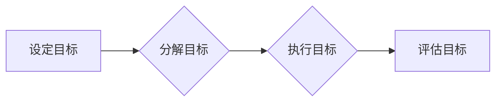

> 管理艺术,彼得·德鲁克,目标管理,知识工作者,自我管理,创新,领导力,组织效能

# 管理的艺术：德鲁克的洞见

管理，作为一门科学，是一门既古老又年轻的学问。从古至今，管理始终是推动社会进步和组织发展的重要动力。而彼得·德鲁克（Peter Drucker），这位被誉为“现代管理之父”的传奇人物，以其深刻的洞察力和前瞻性思维，为我们揭示了管理的艺术。

## 1. 背景介绍

彼得·德鲁克（1909-2005），奥地利的犹太裔美国人，被誉为“现代管理之父”。他的著作影响了几代管理者和企业家，其中包括《管理的实践》（The Practice of Management）、《管理的挑战》（The Challenges of Management）和《卓有成效的管理者》（The Effective Executive）等经典之作。德鲁克的管理思想，强调目标导向、知识工作者、自我管理、创新和领导力等核心概念，为我们理解管理的本质提供了宝贵的视角。

## 2. 核心概念与联系

### 2.1 管理的定义

德鲁克认为，管理是一种实践，是一种艺术。它不仅仅是一种技能，更是一种思考和组织工作的方式。管理的核心目标是“使工作和机构有效”，即通过有效地组织资源，实现组织的目标。

### 2.2 目标管理

目标管理（Management by Objectives, MBO）是德鲁克提出的一种管理方法，强调以目标为导向，通过设定明确的目标来引导和激励员工。目标管理的过程包括设定目标、分解目标、执行目标、评估目标等步骤。

### 2.3 知识工作者

德鲁克提出了“知识工作者”（Knowledge Worker）的概念，认为知识工作者是现代组织中最核心的资源。知识工作者需要具备自我管理的能力，即通过自我激励和自我驱动，实现个人和组织的共同目标。

### 2.4 自我管理

自我管理是德鲁克管理思想的核心之一。他认为，自我管理是知识工作者成功的关键。自我管理包括自我反思、自我设定目标、自我评估等步骤。

### 2.5 创新

德鲁克认为，创新是组织的生命线。创新不仅仅是指技术创新，还包括管理创新、商业模式创新等。创新需要组织建立创新文化和创新机制，鼓励员工提出新的想法和解决方案。

### 2.6 领导力

德鲁克认为，领导力不仅仅是权力和地位的象征，更是一种激励和引导他人共同实现目标的能力。领导力需要领导者具备愿景、洞察力、沟通能力和决策能力。

## 3. 核心算法原理 & 具体操作步骤

### 3.1 算法原理概述

德鲁克的管理思想并非基于数学公式或算法，而是一种基于实践经验的哲学。因此，我们可以将其视为一种“算法原理”，即一套在实践中不断验证和优化的管理方法和原则。

### 3.2 算法步骤详解

#### 3.2.1 设定目标

设定目标是目标管理的第一步。目标应该具体、可衡量、可实现、相关性强，并具有时限性。

#### 3.2.2 分解目标

将组织的目标分解为各个部门的、团队的、个人的具体目标，确保目标的一致性和可操作性。

#### 3.2.3 执行目标

根据目标制定行动计划，并执行计划，确保目标的实现。

#### 3.2.4 评估目标

定期评估目标的实现情况，并根据评估结果进行调整和改进。

### 3.3 算法优缺点

#### 3.3.1 优点

- 目标明确，方向清晰。
- 提高员工积极性，增强团队凝聚力。
- 提升组织效能，实现组织目标。

#### 3.3.2 缺点

- 目标设定可能过于理想化，难以实现。
- 目标管理过程可能过于繁琐，影响工作效率。
- 目标评估可能存在主观性，影响公平性。

### 3.4 算法应用领域

目标管理、自我管理、创新和领导力等德鲁克的管理思想，可以应用于各个组织和个人，包括企业、政府机构、非营利组织等。

## 4. 数学模型和公式 & 详细讲解 & 举例说明

德鲁克的管理思想并非基于数学模型和公式，而是基于实践经验和哲学思考。因此，本节将不涉及数学模型和公式的推导，而是通过具体的案例来讲解德鲁克的管理思想。

### 4.1 数学模型构建

由于德鲁克的管理思想并非基于数学模型，因此本节不涉及数学模型的构建。

### 4.2 公式推导过程

同样，由于德鲁克的管理思想并非基于数学模型，因此本节不涉及公式推导过程。

### 4.3 案例分析与讲解

#### 4.3.1 目标管理的案例

某公司为了提升市场份额，设定了以下目标：
- 提高产品知名度，将品牌曝光度提升20%。
- 增加新客户数量，实现同比增长30%。
- 提升客户满意度，将客户满意度评分提升到4.5分。

公司通过制定详细的行动计划，分解目标，并定期评估目标的实现情况，最终实现了上述目标。

#### 4.3.2 自我管理的案例

某员工为了提升个人能力，设定了以下目标：
- 提升专业技能，参加至少2次专业培训。
- 提高沟通能力，每周至少阅读1篇关于沟通技巧的文章。
- 提升时间管理能力，每天规划工作计划，并按时完成任务。

员工通过自我管理，实现了上述目标，并得到了同事和领导的认可。

## 5. 项目实践：代码实例和详细解释说明

由于德鲁克的管理思想并非基于代码实现，因此本节不涉及代码实例和详细解释说明。

## 6. 实际应用场景

德鲁克的管理思想可以应用于各种组织和个人，以下是一些实际应用场景：

### 6.1 企业

- 通过目标管理，提高企业整体效能。
- 通过自我管理，提升员工个人能力。
- 通过创新，推动企业持续发展。

### 6.2 政府

- 通过目标管理，提高政府机构的工作效率。
- 通过自我管理，提升公务员的专业素养。
- 通过创新，推动政府服务改革。

### 6.3 非营利组织

- 通过目标管理，提高组织的社会影响力。
- 通过自我管理，提升志愿者和员工的积极性。
- 通过创新，推动组织的可持续发展。

## 7. 工具和资源推荐

### 7.1 学习资源推荐

- 《管理的实践》（The Practice of Management）
- 《管理的挑战》（The Challenges of Management）
- 《卓有成效的管理者》（The Effective Executive）

### 7.2 开发工具推荐

- 项目管理工具：Trello、Asana、Jira
- 效率工具：Evernote、Todoist、Focus@Will

### 7.3 相关论文推荐

- Drucker, P. F. (1954). The practice of management.
- Drucker, P. F. (1999). The age of disintermediation.
- Drucker, P. F. (2006). The five most important questions you will ever ask about your organization.

## 8. 总结：未来发展趋势与挑战

### 8.1 研究成果总结

德鲁克的管理思想为我们提供了深刻的洞察力，帮助我们理解管理的本质和艺术。他的思想不仅适用于现代组织，也适用于个人成长。

### 8.2 未来发展趋势

随着人工智能、大数据等技术的发展，管理将更加注重数据驱动和智能化。同时，管理也将更加关注人的因素，强调知识工作者和领导力的培养。

### 8.3 面临的挑战

管理的挑战在于如何平衡效率和创新，如何激发员工的潜力，如何应对不断变化的环境。

### 8.4 研究展望

未来，管理研究需要更加关注以下方面：

- 人机协同的管理模式
- 数据驱动的决策
- 知识工作者的自我管理
- 领导力的培养

## 9. 附录：常见问题与解答

### 9.1 问题1：德鲁克的管理思想是否过时？

答：德鲁克的管理思想虽然源于20世纪，但其核心思想仍然具有普遍性和前瞻性。在当今时代，德鲁克的管理思想依然具有重要的指导意义。

### 9.2 问题2：如何将德鲁克的管理思想应用于个人成长？

答：德鲁克的管理思想可以帮助个人明确目标、提升效率、自我管理，从而实现个人成长。

### 9.3 问题3：德鲁克的管理思想是否适用于非营利组织？

答：德鲁克的管理思想适用于各种类型的组织，包括企业、政府机构和非营利组织。

作者：禅与计算机程序设计艺术 / Zen and the Art of Computer Programming